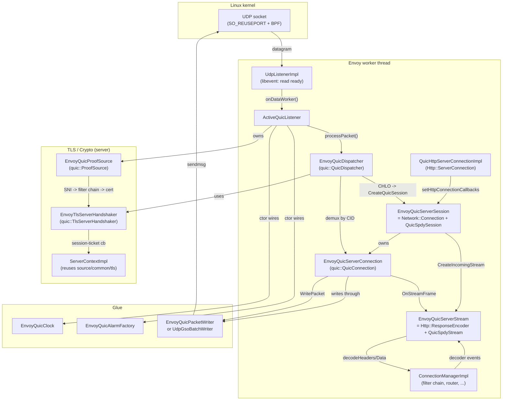

# `source/common/quic` — Envoy's QUIC / HTTP/3 implementation

This folder is the bridge between Google's [QUICHE](https://quiche.googlesource.com/quiche) library and the rest of Envoy. QUICHE provides the wire protocol (packet parsing, congestion control, loss recovery, TLS 1.3 inside QUIC, HTTP/3 framing, QPACK, etc.). This folder provides everything QUICHE needs to run inside an Envoy worker:

- A **UDP listener** that hands raw datagrams to a `quic::QuicDispatcher`.
- A **dispatcher** that demuxes datagrams to per‑connection `quic::QuicConnection` objects, or creates a new session when a valid `CHLO` arrives.
- **Server and client `QuicSession` subclasses** that look like a `Network::Connection` to HCM, an HTTP/3 codec to the rest of Envoy, and a `quic::QuicSpdySession` to QUICHE.
- **Stream subclasses** that look like `Http::RequestEncoder` / `Http::ResponseEncoder` to HCM and `quic::QuicSpdyStream` to QUICHE.
- A **`ProofSource`** that plugs Envoy's filter‑chain / SNI / cert selection machinery into QUICHE's server TLS handshake.
- A **`ProofVerifier`** that plugs Envoy's `CertValidator` and `ClientContextImpl` into QUICHE's client TLS handshake.
- Glue for **time**, **alarms**, **random**, **buffer allocation**, **socket I/O**, and **packet writing** so QUICHE never calls libc/kernel directly — it goes through Envoy's `Event::Dispatcher`.
- **Transport socket factories** for QUIC, which (unlike TCP TLS) produce no real `Network::TransportSocket` — they only carry TLS context configuration into the QUIC stack.
- Connection ID **generation, routing, and per‑worker selection** (BPF or userspace) for stateless reset and multi‑worker scaling.
- **GSO‑based batch packet writing** on Linux for high‑throughput sends.

The folder owns ~10 K lines of C++ across ~90 files. It is the single largest "L4 protocol implementation" in `source/common/`.

### What this folder is *not*

- Not the **public QUIC interface** — those live in `envoy/http/`, `envoy/network/`, `envoy/ssl/`.
- Not the **HCM** — `Http::ConnectionManagerImpl` lives in `source/common/http/conn_manager_impl.cc` and consumes the codec produced here.
- Not the **HTTP/3 codec stats** definitions — those live in `source/common/http/http3/codec_stats.h`.
- Not the **transport‑socket extension registration** — that lives in `source/extensions/transport_sockets/quic/`.
- Not the **QUICHE library itself** — that's a third‑party dep under `bazel/external/quiche.BUILD`; this folder only consumes its public headers under `quiche/quic/`, `quiche/http2/`, and `quiche/common/`.
- Not the **QUICHE platform shim** — that's under `platform/`, a separate sub‑folder with its own purpose (see below).

## Per‑topic deep dives

Read these top‑down. Each builds on the previous.

| # | Topic | File |
|---|---|---|
| 1 | Architecture and layering | [`OVERVIEW_PART1_architecture_and_layering.md`](OVERVIEW_PART1_architecture_and_layering.md) |
| 2 | Listener → dispatcher → session → connection | [`OVERVIEW_PART2_listener_session_connection.md`](OVERVIEW_PART2_listener_session_connection.md) |
| 3 | Crypto, ProofSource, and TLS integration | [`OVERVIEW_PART3_crypto_and_tls.md`](OVERVIEW_PART3_crypto_and_tls.md) |
| 4 | Streams, codecs, and HTTP/3 integration | [`OVERVIEW_PART4_streams_codecs_http3.md`](OVERVIEW_PART4_streams_codecs_http3.md) |
| ★ | UML‑style class hierarchy | [`CLASS_HIERARCHY.md`](CLASS_HIERARCHY.md) |

## Per‑file deep dives

| File(s) | Deep dive |
|---|---|
| `active_quic_listener.{h,cc}`, `envoy_quic_dispatcher.{h,cc}` | [`active_quic_listener.md`](active_quic_listener.md) |
| `envoy_quic_{server,client}_session.{h,cc}`, `quic_filter_manager_connection_impl.{h,cc}` | [`envoy_quic_session.md`](envoy_quic_session.md) |
| `envoy_quic_{server,client}_connection.{h,cc}`, `quic_network_connection.{h,cc}` | [`envoy_quic_connection.md`](envoy_quic_connection.md) |
| `envoy_quic_stream.{h,cc}`, `envoy_quic_{server,client}_stream.{h,cc}`, `{server,client}_codec_impl.{h,cc}` | [`envoy_quic_stream.md`](envoy_quic_stream.md) |
| `envoy_quic_proof_{source,verifier}{,_base}.{h,cc}`, `envoy_tls_server_handshaker.{h,cc}`, `quic_ssl_connection_info.h` | [`crypto_and_proof_source.md`](crypto_and_proof_source.md) |
| `envoy_quic_alarm{,_factory}.{h,cc}`, `envoy_quic_clock.{h,cc}`, `envoy_quic_packet_writer.{h,cc}`, `udp_gso_batch_writer.{h,cc}`, `envoy_quic_connection_helper.h` | [`alarm_and_packet_io.md`](alarm_and_packet_io.md) |

## Quick reading order for a new engineer

1. [`OVERVIEW_PART1_architecture_and_layering.md`](OVERVIEW_PART1_architecture_and_layering.md) — what are the layers and who owns whom?
2. [`OVERVIEW_PART2_listener_session_connection.md`](OVERVIEW_PART2_listener_session_connection.md) — how does a UDP packet become a session?
3. [`OVERVIEW_PART4_streams_codecs_http3.md`](OVERVIEW_PART4_streams_codecs_http3.md) — how does a stream become a request?
4. [`OVERVIEW_PART3_crypto_and_tls.md`](OVERVIEW_PART3_crypto_and_tls.md) — how does TLS plug in, and where does the certificate come from?
5. [`CLASS_HIERARCHY.md`](CLASS_HIERARCHY.md) — pin the class graph in your head before diving into code.
6. The per‑file docs above when you need them.

---

## What lives in this folder (file map)

The files cluster around six concerns. Each is the subject of a per‑file deep dive above.

### 1. Listener and dispatcher (server side, accepts packets)

| File | Purpose |
|---|---|
| `active_quic_listener.{h,cc}` | `Server::ActiveUdpListenerBase` subclass. Owns the UDP socket, the `QuicCryptoServerConfig`, the `EnvoyQuicDispatcher`, and the packet writer. Receives `onDataWorker()` from `UdpListenerImpl`. |
| `envoy_quic_dispatcher.{h,cc}` | `quic::QuicDispatcher` subclass. Demuxes packets by connection ID, creates `EnvoyQuicServerSession` on valid `CHLO`, tracks filter‑chain → connection map, optional idle‑session sweeper. |
| `envoy_deterministic_connection_id_generator.{h,cc}` | Generator that embeds the worker index into the connection ID so kernel BPF can route a follow‑up packet to the same worker. |
| `envoy_quic_connection_id_generator_factory.h` | Factory interface for plugging in alternative CID generators. |
| `envoy_quic_network_observer_registry_factory.h` | Mobile/migration helper: lets a client session register for network change events (Wi‑Fi → cellular). |

### 2. Connections (per‑connection state, both directions)

| File | Purpose |
|---|---|
| `envoy_quic_server_connection.{h,cc}` | `quic::QuicConnection` + `QuicNetworkConnection`. Server side. Owns the `QuicListenerFilterManagerImpl` (QUIC listener filters). Receives packets *from* the dispatcher. |
| `envoy_quic_client_connection.{h,cc}` | `quic::QuicConnection` + `QuicNetworkConnection` + `Network::UdpPacketProcessor`. Owns its own UDP socket file event. Supports port migration, server‑preferred‑address, and a pluggable `EnvoyQuicMigrationHelper`. |
| `quic_network_connection.{h,cc}` | Base of both server and client connections. Holds the list of `ConnectionSocket`s (one per migration), connection stats, and the back‑pointer to the Envoy `Network::Connection`. |

### 3. Sessions (QUIC ⇄ Envoy adapter, the "fat" classes)

| File | Purpose |
|---|---|
| `envoy_quic_server_session.{h,cc}` | `quic::QuicServerSessionBase` + `QuicFilterManagerConnectionImpl` + `Http::IdleSessionInterface`. Owns its `EnvoyQuicServerConnection`. Acts as a `Network::Connection` to HCM and a `quic::QuicSpdySession` to QUICHE. |
| `envoy_quic_client_session.{h,cc}` | `quic::QuicSpdyClientSession` + `QuicFilterManagerConnectionImpl` + `Network::ClientConnection` + `PacketsToReadDelegate`. Drives the client‑side handshake, surfaces 0‑RTT / migration / GoAway events to the upstream HTTP/3 codec. |
| `quic_filter_manager_connection_impl.{h,cc}` | Shared base for both sessions. Implements the `Network::Connection` interface (filter manager, watermarks, stats, SSL info, dispatcher, close‑delay timer) — everything that doesn't care whether we're client or server. |
| `server_connection_factory.h`, `client_connection_factory_impl.{h,cc}` | Per‑process factories that wire a session to its codec; the client side also owns `PersistentQuicInfoImpl` (per‑cluster config). |

### 4. Streams (one per HTTP/3 request, both directions)

| File | Purpose |
|---|---|
| `envoy_quic_stream.{h,cc}` | Common base for both stream subclasses. Implements `Http::StreamEncoder`, `Http::MultiplexedStreamImplBase`, `SendBufferMonitor`. Owns per‑stream send‑buffer watermark simulation, header validation, deferred read‑disable rescheduling, datagram handler (HTTP/3 datagrams). |
| `envoy_quic_server_stream.{h,cc}` | Adds `quic::QuicSpdyServerStreamBase` + `Http::ResponseEncoder`. Receives request headers/body/trailers from QUICHE, hands them to the `Http::RequestDecoder`. Writes response headers/body/trailers from HCM back to QUICHE. |
| `envoy_quic_client_stream.{h,cc}` | Adds `quic::QuicSpdyClientStream` + `Http::RequestEncoder`. Sends request, surfaces response headers/body/trailers to the `Http::ResponseDecoder`. |
| `server_codec_impl.{h,cc}`, `client_codec_impl.{h,cc}`, `codec_impl.h` | Thin `Http::Connection` adapters. Hand each new QUIC stream to HCM as a new request, hand new requests to QUICHE as a new client stream. Implement `goAway()`, watermark forwarding, and `wantsToWrite()`. |
| `quic_stats_gatherer.{h,cc}` | `quic::QuicAckListenerInterface` per stream. Defers access‑log emission until the response FIN has been acked so logged byte counts and latencies reflect what actually reached the peer. |
| `send_buffer_monitor.{h,cc}` | Tiny interface + scoped updater that pushes per‑stream send‑buffer size changes up to the connection so connection‑wide watermarks can be applied. |
| `envoy_quic_simulated_watermark_buffer.h` | Watermark state machine (high / low edges, callbacks). Reused at both stream and connection levels. |
| `http_datagram_handler.{h,cc}` | Optional (compile‑time gated by `ENVOY_ENABLE_HTTP_DATAGRAMS`) glue for HTTP/3 Datagrams (RFC 9297) + Capsule Protocol (RFC 9292). |

### 5. Crypto, TLS, and Proof Source / Verifier

| File | Purpose |
|---|---|
| `envoy_quic_proof_source{,_base}.{h,cc}` | Server‑side `quic::ProofSource`. Looks up the filter chain by SNI, asks `QuicServerTransportSocketFactory` for the cert chain + private key, signs the QUIC TLS handshake transcript. Returns `EnvoyQuicProofSourceDetails` so QUICHE can hand the chosen filter chain back during session creation. |
| `envoy_quic_proof_source_factory_interface.h` | Pluggable interface for alternative proof sources (Salesforce, gRPC mock, etc.). |
| `envoy_quic_proof_verifier{,_base}.{h,cc}` | Client‑side `quic::ProofVerifier`. Wraps Envoy's `ClientContextImpl::customVerifyCertChainForQuic()` so QUIC handshakes go through the same cert‑validator pipeline as TCP TLS handshakes. |
| `envoy_tls_server_handshaker.{h,cc}` | Subclass of `quic::TlsServerHandshaker` that pins the `ServerContextImpl` for the connection and installs the session‑ticket‑key callback on the QUICHE `SSL*`. Lets QUIC reuse the TCP TLS session‑ticket key plumbing. |
| `envoy_quic_server_crypto_stream_factory.h` | Pluggable interface for the QUIC server crypto stream (built‑in QUICHE handshaker vs. an alternative). |
| `envoy_quic_client_crypto_stream_factory.h` | Same, client side. |
| `quic_ssl_connection_info.h` | Implements `Ssl::ConnectionInfo` over QUIC's `SSL*`. Lets HCM, access loggers, and filters read TLS info (SNI, cipher, ALPN) without knowing whether the connection is TCP or QUIC. |
| `quic_transport_socket_factory.{h,cc}` | Base. Holds the `supported_alpns_` list and the SDS update plumbing common to both directions. **Does not produce a `TransportSocket`** — `createDownstreamTransportSocket()` / `createTransportSocket()` panic. |
| `quic_server_transport_socket_factory.{h,cc}` | Server side. Owns the `ServerContextConfig`, the live `ServerContextImpl` (rebuilt on SDS updates), and the early‑data / session‑ticket config. |
| `quic_client_transport_socket_factory.{h,cc}` | Client side. Owns the `ClientContextConfig` and produces an `Envoy::Ssl::ClientContextSharedPtr` for the `EnvoyQuicProofVerifier`. |
| `envoy_quic_server_preferred_address_config_factory.h` | Pluggable: pick the optional QUIC "server preferred address" (v4 / v6) to advertise during the handshake. |

### 6. Glue: time, alarms, packet I/O, random, buffer allocation

| File | Purpose |
|---|---|
| `envoy_quic_clock.{h,cc}` | `quic::QuicClock` backed by `Event::Dispatcher::timeSource()`. |
| `envoy_quic_alarm.{h,cc}` | `quic::QuicAlarm` backed by `Event::Timer`. |
| `envoy_quic_alarm_factory.{h,cc}` | `quic::QuicAlarmFactory` that creates the above. |
| `envoy_quic_connection_helper.h` | `quic::QuicConnectionHelperInterface` bundle: clock + random + buffer allocator. |
| `envoy_quic_packet_writer.{h,cc}` | Adapts an Envoy `Network::UdpPacketWriter` to a `quic::QuicPacketWriter`. |
| `envoy_quic_client_packet_writer_factory.h`, `quic_client_packet_writer_factory_impl.{h,cc}` | Client‑side factory that produces packet writers (one per socket on migration). |
| `udp_gso_batch_writer.{h,cc}` | Linux‑only `quic::QuicGsoBatchWriter`‑based batch writer; sends up to 64 KB of packets in one `sendmsg()` via UDP GSO. |
| `quic_io_handle_wrapper.h` | Wrapper that lets the proof source borrow the listener's `IoHandle` without owning it. |
| `quic_network_connectivity_observer{,_impl}.{h,cc}` | Mobile network change observer interface + default no‑op impl. |
| `scone_state.{h,cc}` | State for the experimental SCONE (bandwidth feedback) extension; used by upstream client sessions. |
| `envoy_quic_utils.{h,cc}` | Address / version / error / cmsg conversions between Envoy and QUICHE types. |
| `quic_stat_names.{h,cc}` | Pre‑interned stat names for QUIC error codes, connection‑close reasons, RST stream reasons, etc. |
| `envoy_quic_connection_debug_visitor_factory_interface.h` | Pluggable QUIC connection debug visitor (used for QUIC‑specific structured logging / tracing extensions). |

### 7. The QUICHE platform shim (`platform/`)

This sub‑folder is **not** application logic. It is the implementation of the platform abstractions QUICHE expects from its host environment:

- `quiche_bug_tracker_impl.{h,cc}` — `QUICHE_BUG()` ↔ Envoy `IS_ENVOY_BUG()`.
- `quiche_flags_impl.{h,cc}`, `quiche_flags_constants.h` — `GetQuicFlag()` ↔ Envoy runtime flags.
- `quiche_logging_impl.{h,cc}` — `QUICHE_LOG()` ↔ `ENVOY_LOG()`.
- `quiche_mem_slice_impl.{h,cc}` — `QuicheMemSlice` ↔ `Buffer::Instance` slices (zero‑copy bridge).
- `quiche_time_utils_impl.{h,cc}` — `QuicheTimeUtils::QuicheUtcDateTimeToUnixSeconds()`.
- `quiche_iovec_impl.h`, `quiche_lower_case_string_impl.h`, `quiche_stack_trace_impl.h`, `quiche_export_impl.h` — header‑only adapters.
- `mobile_impl/` — same headers replaced with mobile‑friendly versions when building the Envoy Mobile target.

The shim is invisible to most callers; it exists so QUICHE doesn't have to know about Envoy and Envoy doesn't have to fork QUICHE.

---

## "Big picture" diagram

This is the bird's‑eye view. Each box is fleshed out in `OVERVIEW_PART1` and `CLASS_HIERARCHY`.

The same picture rotated for the **client side** (`createQuicNetworkConnection` → `EnvoyQuicClientSession` → `EnvoyQuicClientConnection`) is in [`OVERVIEW_PART2`](OVERVIEW_PART2_listener_session_connection.md).

---

## How this folder relates to the rest of Envoy

- **`source/common/tls/`** — `EnvoyTlsServerHandshaker` pins a `ServerContextImpl` per QUIC connection, and `EnvoyQuicProofVerifier` calls `ClientContextImpl::customVerifyCertChainForQuic()`. Both reuse the cert validator, OCSP, private‑key, and session‑ticket plumbing that already exist for TCP TLS. See [`OVERVIEW_PART3`](OVERVIEW_PART3_crypto_and_tls.md).
- **`source/common/http/`** — `EnvoyQuicServerStream` calls into the HCM via the codec; HCM never knows whether it's H/2 or H/3 until it asks `protocol()`. The HTTP/3 codec stats live in `source/common/http/http3/`.
- **`source/server/`** — `ActiveQuicListener` extends `Server::ActiveUdpListenerBase`. Listener lifecycle (`pauseListening`, `shutdownListener`, filter‑chain draining, `updateListenerConfig`) flows through that base.
- **`source/common/network/`** — Uses `UdpPacketWriter`, `ConnectionSocket`, `Address::Instance`. Implements `Network::Connection` for QUIC.
- **`source/common/event/`** — `EnvoyQuicAlarm` is just an `Event::Timer`; `EnvoyQuicClock` is just a `TimeSource`. Every QUICHE side effect goes through `Event::Dispatcher`.
- **`source/extensions/quic/`** — Pluggable factories (CID generator, crypto stream, proof source, debug visitor, server preferred address, connection debug visitor) all implement interfaces defined in this folder.
- **`source/extensions/transport_sockets/quic/`** — The registration shim that surfaces `envoy.transport_sockets.quic` as a configurable transport socket. Calls into `quic_{server,client}_transport_socket_factory` here.
