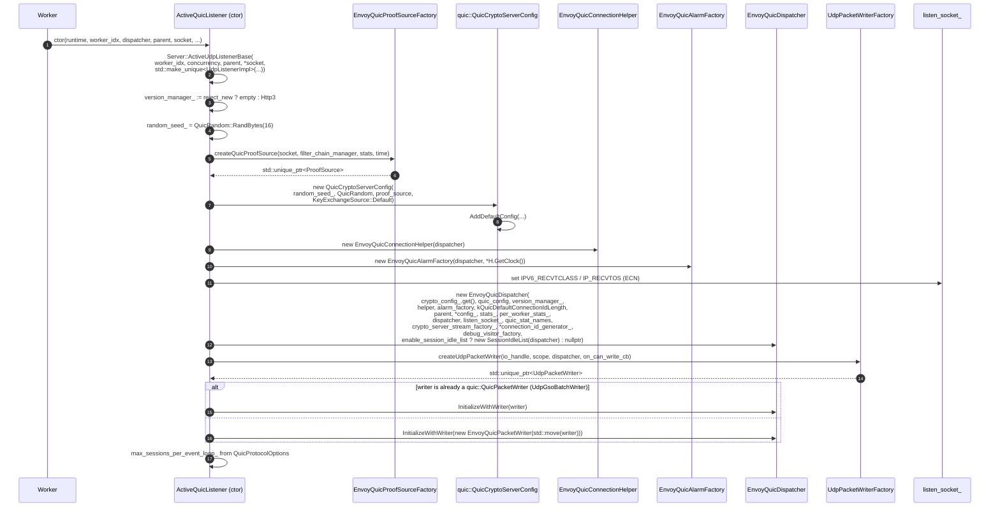
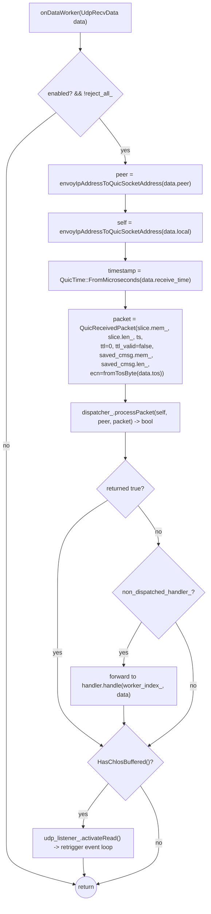
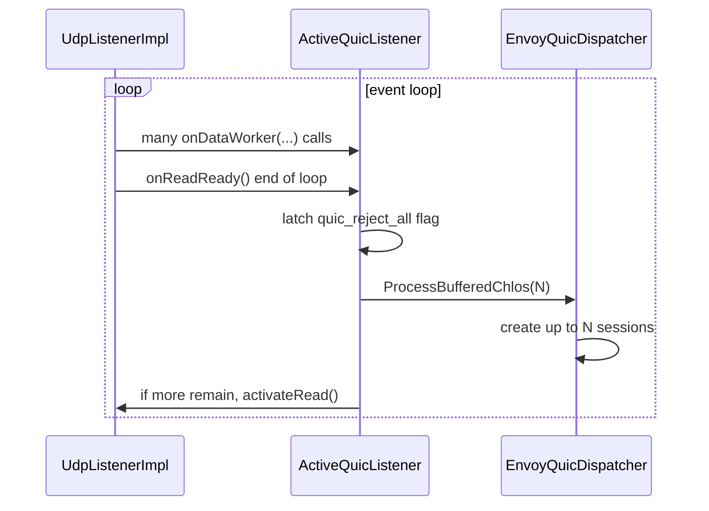
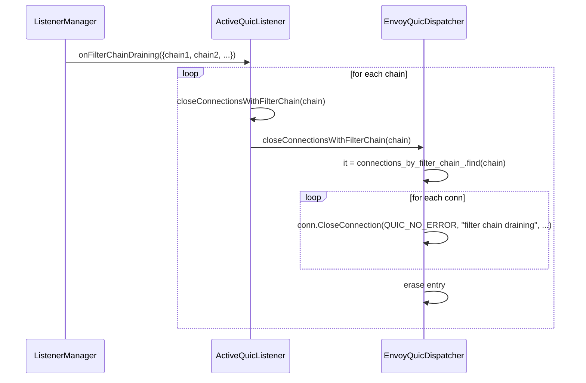
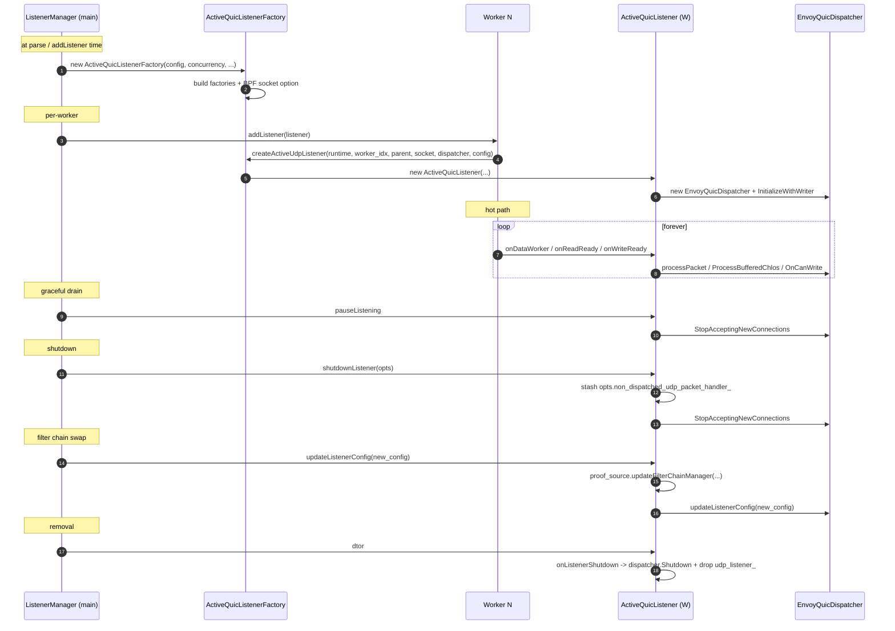

# `active_quic_listener.{h,cc}` & `envoy_quic_dispatcher.{h,cc}`

> *L1 — listener and dispatcher. Where UDP datagrams enter the QUIC stack.*

This is the "front door" of the QUIC server. Together, these two files:

- Bind / share the UDP socket on each worker (via `Server::ActiveUdpListenerBase`).
- Build the `QuicCryptoServerConfig` + `EnvoyQuicProofSource`.
- Build the `EnvoyQuicDispatcher` that demuxes packets to connections / creates new sessions on `CHLO`.
- Connect kernel BPF (or userspace) per‑worker routing based on connection ID.
- Manage the optional idle‑session list and filter‑chain‑draining behaviour.
- Forward listener lifecycle (`pause`, `shutdown`, `updateListenerConfig`, `onCloseIdleHttpConnections`) into QUICHE.

If you only read one file in this folder, read this pair.

## Quick map

```mermaid
flowchart LR
  subgraph Factory["ActiveQuicListenerFactory (main thread)"]
    F1["parses QuicProtocolOptions"]
    F2["builds crypto_stream_factory_"]
    F3["builds proof_source_factory_"]
    F4["builds cid_generator_factory_"]
    F5["installs SO_REUSEPORT BPF (optional)"]
  end
  subgraph Worker["ActiveQuicListener (per worker)"]
    L1["owns socket, listener"]
    L2["owns EnvoyQuicProofSource"]
    L3["owns QuicCryptoServerConfig"]
    L4["owns EnvoyQuicDispatcher"]
    L5["owns packet writer"]
    L6["onDataWorker -> dispatcher"]
  end
  subgraph Disp["EnvoyQuicDispatcher (per listener per worker)"]
    D1["ProcessChlo -> CreateQuicSession"]
    D2["routes packets by CID"]
    D3["tracks filter chain -> connection map"]
    D4["optional Http::SessionIdleList"]
  end

  Factory --> Worker
  Worker --> Disp
```



## `ActiveQuicListener` — public surface

| Method | Called by | Purpose |
|---|---|---|
| `onDataWorker(UdpRecvData)` | `Network::UdpListenerImpl` | Per‑packet entry. Builds `QuicReceivedPacket`, calls `dispatcher.processPacket()`, forwards undispatched packets to `non_dispatched_udp_packet_handler_` if set. |
| `onReadReady()` | `Network::UdpListenerImpl` (end of event loop) | Tells the dispatcher to run `ProcessBufferedChlos(max_sessions_per_event_loop_)`. If more remain, reschedules read for next loop. |
| `onWriteReady(socket)` | `Network::UdpListenerImpl` | Calls `dispatcher.OnCanWrite()` — wakes the pacer / unblocks blocked writers. |
| `udpPacketWriter()` | base class | Returns the writer the listener owns. |
| `destination(data)` | base class | Computes which worker the packet should be processed on (uses `select_connection_id_worker_`). |
| `numPacketsExpectedPerEventLoop()` | UDP listener | `num_sessions * packets_to_read_to_connection_count_ratio_`. |
| `pauseListening()` | listener manager | `dispatcher.StopAcceptingNewConnections()`. |
| `resumeListening()` | listener manager | `dispatcher.StartAcceptingNewConnections()`. |
| `shutdownListener(opts)` | listener manager | Records `non_dispatched_udp_packet_handler_` (hot restart), then stops accepting. |
| `updateListenerConfig(config)` | listener manager | Updates the proof source's filter chain manager + the dispatcher's listener config. |
| `onFilterChainDraining(chains)` | listener manager | Calls `closeConnectionsWithFilterChain()` per chain. |
| `onCloseIdleHttpConnections(is_saturated)` | overload manager | Tells the dispatcher to walk the idle session list. |
| `onListenerShutdown()` | dtor | `dispatcher.Shutdown()` + drop the UDP listener. |

## Construction — what happens at startup



A few things worth highlighting:

- **`version_manager_` is empty if `reject_new_connections` is set.** That's how `envoy.reloadable_features.quic_reject_all` kills new handshakes — QUICHE can't negotiate any version, so CHLOs are rejected immediately.
- The **ECN socket options** (`IPV6_RECVTCLASS`, `IP_RECVTOS`) are set on the listen socket. The default ECN handling in `udp_save_cmsg_config_` then surfaces the ECN bits on incoming packets to QUICHE via `QuicReceivedPacket(ecn=...)`.
- The packet writer can be one of:
  - `UdpGsoBatchWriter` (Linux, when GSO is enabled) — implements `quic::QuicPacketWriter` directly. Used **as is** by the dispatcher.
  - Anything else — wrapped in `EnvoyQuicPacketWriter` so QUICHE sees the expected interface.

## `onDataWorker` — packet receive flow



The "return true / false" from `processPacket()` is Envoy‑specific: QUICHE's stock `ProcessPacket()` returns `void`. The override sets `current_packet_dispatch_success_` in `OnFailedToDispatchPacket()` (called by the base when no CID matches and version is unsupported). False means *we* couldn't handle this packet; the hot‑restart parent process might still want to.

## `onReadReady` — end of event loop hook

`UdpListenerImpl` calls `onReadReady()` once per event loop *after* draining all available packets. This is the place to:

1. Apply `envoy.reloadable_features.quic_reject_all` (latched once per loop).
2. Tell the dispatcher to **finalise** new sessions for buffered CHLOs:
   `quic_dispatcher_->ProcessBufferedChlos(max_sessions_per_event_loop_)`.
3. If more CHLOs remain (back‑pressure under CHLO floods), call `udp_listener_->activateRead()` to schedule another pass next loop.



## `EnvoyQuicDispatcher` — public surface

| Method | Purpose |
|---|---|
| `processPacket(self, peer, packet)` | Envoy‑specific. Wraps QUICHE's `ProcessPacket()`; returns `false` if `OnFailedToDispatchPacket()` was called for this packet. |
| `CreateQuicSession(cid, self, peer, alpn, version, parsed_chlo, gen)` | Override. Builds an `EnvoyQuicServerConnection` + `EnvoyQuicServerSession`, wires it to the proof‑source‑provided filter chain. |
| `OnConnectionClosed(cid, error, details, source)` | Override. Updates close stats, removes the session from `connections_by_filter_chain_`. |
| `CreateQuicTimeWaitListManager()` | Override. Returns an `EnvoyQuicTimeWaitListManager` so stateless‑reset counts can be tracked. |
| `closeConnectionsWithFilterChain(chain)` | Used by filter chain draining. Walks the per‑filter‑chain list and calls `CloseConnection()` on each. |
| `updateListenerConfig(new_config)` | Hot‑update the listener config (filter chain manager, etc.). |
| `closeIdleQuicConnections(is_saturated)` | Walks `session_idle_list_` and closes sessions matching the policy. |
| `OnFailedToDispatchPacket(info)` | Override. Sets `current_packet_dispatch_success_ = false`, then calls base. |

## `CreateQuicSession` in detail

This is the critical method — it is where a session is born.

```cpp
std::unique_ptr<quic::QuicSession> EnvoyQuicDispatcher::CreateQuicSession(
    quic::QuicConnectionId server_connection_id,
    const quic::QuicSocketAddress& self_address,
    const quic::QuicSocketAddress& peer_address,
    absl::string_view alpn,
    const quic::ParsedQuicVersion& version,
    const quic::ParsedClientHello& parsed_chlo,
    quic::ConnectionIdGeneratorInterface& connection_id_generator) override;
```

What it does (paraphrased):

1. Build a `Network::ConnectionSocketPtr` over the **listener** socket via `quic_io_handle_wrapper.h` (a wrapper that doesn't own the IoHandle).
2. Build a `QuicListenerFilterManagerImpl` (will be moved into the `EnvoyQuicServerConnection`).
3. Build `EnvoyQuicServerConnection` with the writer, helper, alarm factory, CID generator, and the listener‑filter‑manager.
4. Build `EnvoyQuicServerSession` with the connection, the dispatcher (as visitor), the helper, the crypto config, the compressed‑certs cache, the dispatcher's event dispatcher, and a fresh `StreamInfoImpl`.
5. Call `session->Initialize()` to set up the crypto stream (via `EnvoyQuicCryptoServerStreamFactory`).
6. Stash the session in `connections_by_filter_chain_[filter_chain]` so later draining can find it.
7. Return the session as a `std::unique_ptr<quic::QuicSession>`; QUICHE owns it from here, but Envoy still uses it via the `Network::Connection` interface.

The matched `filter_chain` comes out of `EnvoyQuicProofSourceDetails`, attached by `EnvoyQuicProofSource::GetCertChain()` during the CHLO TLS dance. The dispatcher doesn't re‑match.

## Filter chain draining

When a listener config update removes a filter chain, Envoy must close every QUIC connection that was using it (its TLS context will be dropped).



The `FilterChainToConnectionMap` is `absl::flat_hash_map<const Network::FilterChain*, std::list<reference_wrapper<Network::Connection>>>`. Each session stores its own `ConnectionMapPosition` so it can erase itself in O(1) on `OnConnectionClosed()`.

## Session idle list (optional)

When `enable_session_idle_list` is set:

- An `Http::SessionIdleList` is created per listener per worker.
- A session joins the list when its last active stream is closed (`OnLastActiveStreamClosed()`).
- A session leaves the list when a new stream is created.
- When the overload manager calls `onCloseIdleHttpConnections(is_saturated)`, the dispatcher walks the list and `TerminateIdleSession()` is called on each.

This is independent of QUICHE's own idle timeout; it lets Envoy be more aggressive about shedding when memory is tight.

## `ActiveQuicListenerFactory`

The factory is constructed **once** per listener at parse time. Its job:

- Parse `envoy.config.listener.v3.QuicProtocolOptions`:
  - `idle_timeout` → `QuicConfig::SetIdleNetworkTimeout` (default 5 min).
  - `crypto_handshake_timeout` → `QuicConfig::set_max_time_before_crypto_handshake` (default 20 s).
  - `quic_protocol_options` → standard `convertQuicConfig()`.
  - `send_disable_active_migration` → `QuicConfig::SetDisableConnectionMigration()`.
- Build the `crypto_server_stream_factory_` via the extension registry (defaults to `envoy.quic.crypto_stream.server.quiche`).
- Build the `proof_source_factory_` (defaults to `envoy.quic.proof_source.filter_chain`).
- Build the `quic_cid_generator_factory_` (defaults to `envoy.quic.deterministic_connection_id_generator`).
- Build the optional `connection_debug_visitor_factory_`.
- Build the optional `server_preferred_address_config_`.
- Install a `SO_REUSEPORT` BPF program for kernel CID‑based routing (skipped if `disable_kernel_bpf_packet_routing_for_test_` is set or `concurrency == 1`).

When `Worker::addListener` runs, the factory's `createActiveUdpListener(runtime, worker_idx, ...)` is called per worker, producing one `ActiveQuicListener` per worker thread.

## Lifecycle in one sequence



## Key data members

| Member | Why it lives here |
|---|---|
| `crypto_config_` | The `QuicCryptoServerConfig` carries the `ProofSource` (so SNI lookup uses the listener's filter chain manager). One per listener per worker. |
| `version_manager_` | QUIC versions to negotiate. Hot‑updatable indirectly via `reject_new_connections` (empty when rejecting). |
| `quic_dispatcher_` | Owns the per‑connection state and the filter‑chain→connection map. |
| `kernel_worker_routing_` | True when BPF is installed. Tells `destination()` whether to trust the kernel or recompute. |
| `enabled_` | Runtime feature flag (`Runtime::FeatureFlag`) for the whole listener. Disabling it makes the listener drop all incoming datagrams. |
| `udp_packet_writer_` | Borrowed pointer to the packet writer (which the dispatcher owns after `InitializeWithWriter`). |
| `packets_to_read_to_connection_count_ratio_` | Used by `numPacketsExpectedPerEventLoop()`. |
| `crypto_server_stream_factory_` | Pluggable; per‑connection crypto stream is built via this. |
| `connection_id_generator_` | Pluggable; controls CID bytes (worker‑index embedding). |
| `select_connection_id_worker_` | Function that maps a CID to a worker index. Used in `destination()`. |
| `reject_all_` | Latched once per event loop from `quic_reject_all`. |
| `non_dispatched_udp_packet_handler_` | Set during hot restart; receives packets that `processPacket()` couldn't route. |
| `max_sessions_per_event_loop_` | Caps `ProcessBufferedChlos()`. Default 16 (`kNumSessionsToCreatePerLoop`). |

## Related files

- [`envoy_quic_session.md`](envoy_quic_session.md) — What `CreateQuicSession()` builds.
- [`envoy_quic_connection.md`](envoy_quic_connection.md) — The connection objects the dispatcher creates.
- [`crypto_and_proof_source.md`](crypto_and_proof_source.md) — `EnvoyQuicProofSource` + the crypto stream factory.
- [`alarm_and_packet_io.md`](alarm_and_packet_io.md) — `EnvoyQuicPacketWriter`, `UdpGsoBatchWriter`, `EnvoyQuicAlarmFactory`.
- [`OVERVIEW_PART2_listener_session_connection.md`](OVERVIEW_PART2_listener_session_connection.md) — How this fits into the L1–L3 picture.
