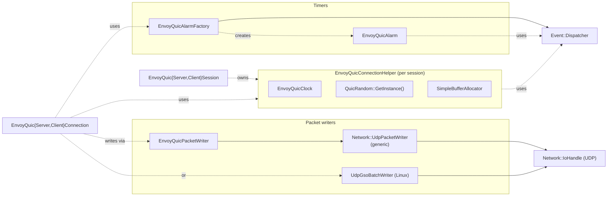
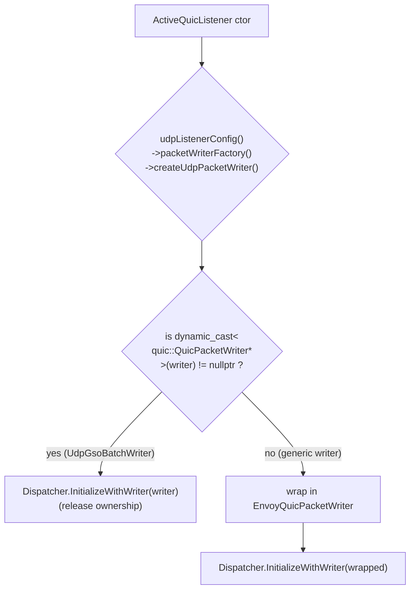
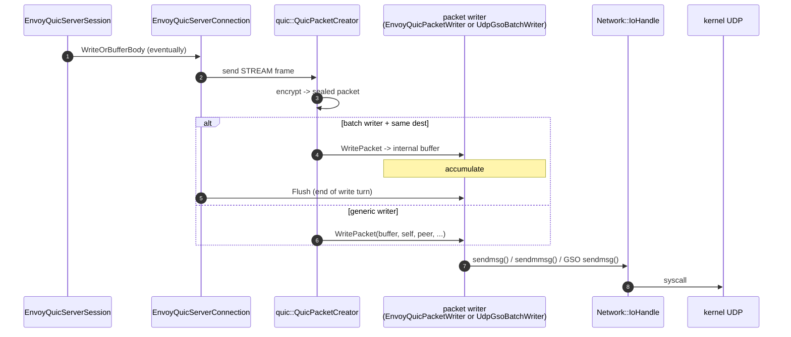
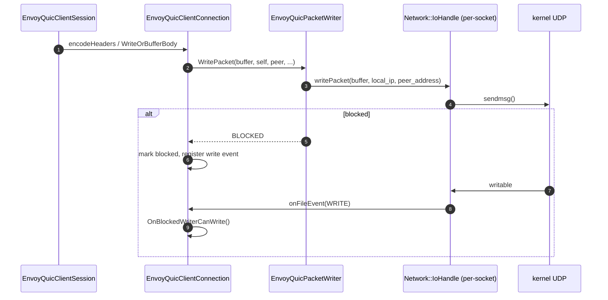
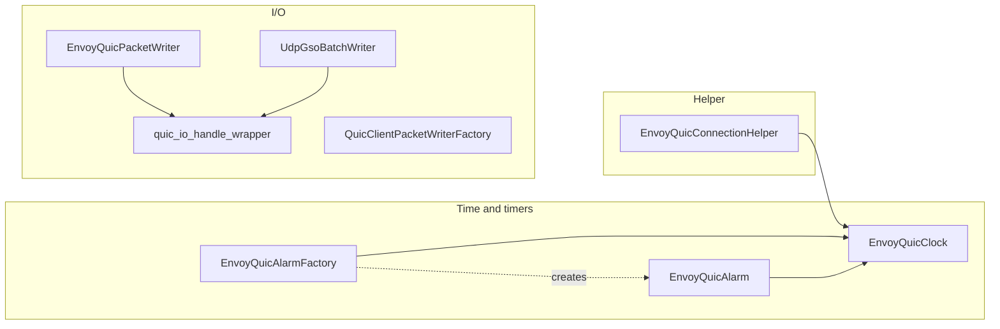

# Glue layer — `envoy_quic_alarm.*`, `envoy_quic_clock.*`, `envoy_quic_packet_writer.*`, `udp_gso_batch_writer.*`, `envoy_quic_connection_helper.h`

> *L0 — the adapters that let QUICHE run entirely under Envoy's `Event::Dispatcher`. No threads, no `gettimeofday()`, no kernel I/O outside the worker loop.*

These are the smallest classes in the folder. They're also the most universally consumed — every session in this codebase reaches one of them on every packet, every timer, every randomness call.

## File map

| File | Wraps | Provides |
|---|---|---|
| `envoy_quic_clock.{h,cc}` | `Event::Dispatcher::timeSource()` | `quic::QuicClock` (Now / ApproximateNow / WallNow) |
| `envoy_quic_alarm.{h,cc}` | `Event::Timer` | `quic::QuicAlarm` |
| `envoy_quic_alarm_factory.{h,cc}` | dispatcher + clock | `quic::QuicAlarmFactory` (creates the above) |
| `envoy_quic_connection_helper.h` | clock + random + buffer allocator | `quic::QuicConnectionHelperInterface` |
| `envoy_quic_packet_writer.{h,cc}` | `Network::UdpPacketWriter` | `quic::QuicPacketWriter` |
| `udp_gso_batch_writer.{h,cc}` | `quic::QuicGsoBatchWriter` + `Network::UdpPacketWriter` | Hybrid that satisfies both interfaces; uses Linux UDP GSO. |
| `quic_io_handle_wrapper.h` | `Network::IoHandle` | A non‑owning wrapper so the proof source can borrow the listener's IoHandle. |
| `envoy_quic_packet_writer_factory.h`, `quic_client_packet_writer_factory_impl.{h,cc}` | factory | Client‑side writer factory (used on migration). |

## Block diagram



## `EnvoyQuicClock`

The simplest possible adapter.

```cpp
class EnvoyQuicClock : public quic::QuicClock {
public:
  EnvoyQuicClock(Event::Dispatcher& dispatcher) : dispatcher_(dispatcher) {}
  quic::QuicTime ApproximateNow() const override;
  quic::QuicTime Now() const override;
  quic::QuicWallTime WallNow() const override;
private:
  template <typename T> int64_t microsecondsSinceEpoch(std::chrono::time_point<T>) const;
  Event::Dispatcher& dispatcher_;
};
```

| QUICHE API | Envoy backend | Notes |
|---|---|---|
| `Now()` | `dispatcher.timeSource().monotonicTime()` | Microsecond resolution. |
| `ApproximateNow()` | Same — Envoy doesn't cache time per loop iteration | Could be optimised in the future. |
| `WallNow()` | `dispatcher.timeSource().systemTime()` | Used for cert‑expiry / log timestamps. |

QUICHE's RTT estimator, idle timer, congestion controller, and loss detector all call `Now()` very frequently. The cost is one `clock_gettime(CLOCK_MONOTONIC)` per call on Linux.

## `EnvoyQuicAlarm` & `EnvoyQuicAlarmFactory`

### Why alarms

QUICHE schedules dozens of timers per connection — retransmission, idle timeout, ping, keep‑alive, handshake timeout, MTU discovery, path validation, etc. Each is a `quic::QuicAlarm` with a delegate that runs on fire.

```mermaid
flowchart TB
  QC["quic::QuicConnection"]
  AF["EnvoyQuicAlarmFactory"]
  A["EnvoyQuicAlarm"]
  T["Event::Timer (libevent)"]
  D["delegate->OnAlarm()"]

  QC --> AF
  AF -.creates.-> A
  A *-- T : owns
  T -. fires .-> A
  A --> D
```

### `EnvoyQuicAlarmFactory`

```cpp
class EnvoyQuicAlarmFactory : public quic::QuicAlarmFactory, NonCopyable {
public:
  EnvoyQuicAlarmFactory(Event::Dispatcher& dispatcher, const quic::QuicClock& clock);
  quic::QuicAlarm* CreateAlarm(quic::QuicAlarm::Delegate* delegate) override;
  quic::QuicArenaScopedPtr<quic::QuicAlarm>
  CreateAlarm(quic::QuicArenaScopedPtr<quic::QuicAlarm::Delegate> delegate,
              quic::QuicConnectionArena* arena) override;
};
```

QUICHE supports two allocation modes:

- **Heap** (`CreateAlarm(Delegate*)`) — caller frees the delegate; we wrap it in an `EnvoyQuicAlarm` on the heap.
- **Arena** (`CreateAlarm(arena_delegate, arena)`) — the delegate is allocated in a `QuicConnectionArena` (one big bump allocator per connection). We create the `EnvoyQuicAlarm` in the same arena to avoid heap churn. Both code paths return the same kind of `quic::QuicAlarm*`, just allocated differently.

### `EnvoyQuicAlarm`

```cpp
class EnvoyQuicAlarm : public quic::QuicAlarm {
public:
  EnvoyQuicAlarm(Event::Dispatcher&, const quic::QuicClock&, ArenaScopedPtr<Delegate>);
  void CancelImpl() override;
  void SetImpl() override;
  void UpdateImpl() override;
};
```

| QUICHE method | Envoy implementation |
|---|---|
| `SetImpl()` | `timer_->enableTimer(getDurationBeforeDeadline())` |
| `CancelImpl()` | `timer_->disableTimer()` |
| `UpdateImpl()` | Just `SetImpl()` — Envoy's `enableTimer()` already replaces an existing schedule. |

`getDurationBeforeDeadline()` reads QUICHE's stored deadline, subtracts the current clock, clamps at 0. The dispatched callback inside `Event::Timer` is `delegate_->OnAlarm()`, exactly as QUICHE expects.

The dtor needs nothing special: `Event::Timer` destruction cancels the in‑flight schedule.

### Sequence — one alarm cycle

```mermaid
sequenceDiagram
  participant QC as quic::QuicConnection
  participant AF as EnvoyQuicAlarmFactory
  participant A as EnvoyQuicAlarm
  participant T as Event::Timer
  participant D as Delegate

  QC->>AF: CreateAlarm(delegate)
  AF->>A: new EnvoyQuicAlarm(dispatcher, clock, delegate)
  A->>T: createTimer([this]{ delegate->OnAlarm(); })

  QC->>A: Set(deadline)
  A->>A: SetImpl()
  A->>T: enableTimer(deadline - now)

  Note over T: ... later ...
  T->>A: callback fires
  A->>D: OnAlarm()
  D->>QC: do retransmission / idle close / etc.

  QC->>A: Cancel()
  A->>T: disableTimer()
```

## `EnvoyQuicConnectionHelper`

Tiny bundle the connection asks for at construction.

```cpp
class EnvoyQuicConnectionHelper : public quic::QuicConnectionHelperInterface {
public:
  EnvoyQuicConnectionHelper(Event::Dispatcher& dispatcher)
      : clock_(dispatcher), random_generator_(quic::QuicRandom::GetInstance()) {}
  const quic::QuicClock* GetClock() const override { return &clock_; }
  quic::QuicRandom* GetRandomGenerator() override { return random_generator_; }
  quiche::QuicheBufferAllocator* GetStreamSendBufferAllocator() override { return &buffer_allocator_; }
private:
  EnvoyQuicClock clock_;
  quic::QuicRandom* random_generator_;
  quiche::SimpleBufferAllocator buffer_allocator_;
};
```

- `clock_` is owned by the helper; one per session.
- `random_generator_` is the QUICHE singleton (the default `BoringSSL`‑backed RNG). Process‑wide.
- `buffer_allocator_` is a per‑session `SimpleBufferAllocator` (just `new/delete` under the hood). Could be replaced with a `Buffer::Memory` account‑aware allocator if memory accounting per stream becomes critical.

## Packet writers

QUIC's outbound path looks like:

```
QuicConnection
   -> QuicPacketCreator (frame + encrypt)
      -> quic::QuicPacketWriter::WritePacket(buffer, self, peer, ...)
```

Envoy has its own `Network::UdpPacketWriter` interface — one that emits packets from `Buffer::Instance`s and integrates with the IO handle. The job of these files is to bridge the two.

### `EnvoyQuicPacketWriter` — the generic adapter

```cpp
class EnvoyQuicPacketWriter : public quic::QuicPacketWriter {
public:
  EnvoyQuicPacketWriter(Network::UdpPacketWriterPtr envoy_udp_packet_writer);

  quic::WriteResult WritePacket(const char* buffer, size_t buf_len,
                                const quic::QuicIpAddress& self_address,
                                const quic::QuicSocketAddress& peer_address,
                                quic::PerPacketOptions*,
                                const quic::QuicPacketWriterParams&) override;

  bool IsWriteBlocked() const override { return envoy_udp_packet_writer_->isWriteBlocked(); }
  void SetWritable() override { envoy_udp_packet_writer_->setWritable(); }
  bool IsBatchMode() const override { return envoy_udp_packet_writer_->isBatchMode(); }
  bool SupportsReleaseTime() const override { return false; }
  bool SupportsEcn() const override { return false; }
  absl::optional<int> MessageTooBigErrorCode() const override;
  quic::QuicByteCount GetMaxPacketSize(const quic::QuicSocketAddress& peer_address) const override;
  quic::QuicPacketBuffer GetNextWriteLocation(...) override;
  quic::WriteResult Flush() override;
};
```

The implementation of `WritePacket()` is:

1. Wrap `buffer` in a `Buffer::OwnedImpl` (no copy — it borrows).
2. Convert `quic::QuicSocketAddress` → `Network::Address::Instance` via `envoy_quic_utils.h`.
3. Call `envoy_udp_packet_writer_->writePacket(buffer, local_ip, peer_address)`.
4. Map the return to `quic::WriteResult{status=OK | BLOCKED | ERROR, bytes_written, error_code}`.

When the writer reports `BLOCKED`, QUICHE stops sending and waits for `OnCanWrite()` (which comes from `ActiveQuicListener::onWriteReady` or `EnvoyQuicClientConnection::onFileEvent(WRITE)`).

### `UdpGsoBatchWriter` — the Linux fast path

When compiled on Linux (`UDP_GSO_BATCH_WRITER_COMPILETIME_SUPPORT == 1`) and the runtime / config opts in, this writer is used **instead of** `EnvoyQuicPacketWriter`. It inherits from **both** sides:

```cpp
class UdpGsoBatchWriter : public quic::QuicGsoBatchWriter,    // <-- already QuicPacketWriter
                          public Network::UdpPacketWriter {   // <-- Envoy side
public:
  UdpGsoBatchWriter(Network::IoHandle&, Stats::Scope&);

  // Envoy side
  Api::IoCallUint64Result writePacket(const Buffer::Instance& buffer,
                                      const Network::Address::Ip* local_ip,
                                      const Network::Address::Instance& peer_address) override;
  bool isWriteBlocked() const override { return IsWriteBlocked(); }
  void setWritable() override { return SetWritable(); }
  bool isBatchMode() const override { return IsBatchMode(); }
  uint64_t getMaxPacketSize(const Address::Instance&) const override;
  Api::IoCallUint64Result flush() override;
  // QUIC side comes from quic::QuicGsoBatchWriter
private:
  void updateUdpGsoBatchWriterStats(quic::WriteResult);
  UdpGsoBatchWriterStats stats_;
  uint64_t gso_size_;
};
```

### Why GSO matters

Without GSO, a chatty QUIC sender does one `sendmsg()` per packet (~1200 bytes). With GSO, the kernel coalesces up to ~64 KB of equally‑sized packets into one syscall via `UDP_SEGMENT`. The driver / NIC can split them on the way out. Throughput jumps roughly 3–5× on high‑bandwidth links.

### Why it's a "batch writer"

QUICHE knows about batching:

- `IsBatchMode()` returns `true` so `QuicConnection` stops sending packets one‑by‑one and instead writes into the writer's internal buffer until `Flush()` is called or the next packet has a different `peer_address`/`self_address`.
- `GetNextWriteLocation()` returns a pointer into the writer's pre‑allocated buffer so QUICHE can encrypt directly there with no copy.

The base class (`quic::QuicGsoBatchWriter`) already knows how to actually call `sendmsg()` with `UDP_SEGMENT`; the Envoy subclass just adds:

- An Envoy `Stats::Scope` for `total_bytes_sent`, `internal_buffer_size`, `pkts_sent_per_batch`.
- Translation between `Network::IoHandle` and the FD `quic::QuicGsoBatchWriter` needs.
- Implementation of the `Network::UdpPacketWriter` half so the listener can hold it via the generic interface.

### Picking the writer at runtime



The check is `dynamic_cast<quic::QuicPacketWriter*>(udp_packet_writer.get())`. `UdpGsoBatchWriter` inherits from `quic::QuicGsoBatchWriter` which inherits from `quic::QuicPacketWriter`, so the cast succeeds and we skip the `EnvoyQuicPacketWriter` adapter.

## Sequence — packet send on the server



## Sequence — packet send on the client (no batch yet)



Migration in flight gets one writer per active socket (the active one is at the back of `connection_sockets_`).

## `QuicClientPacketWriterFactory`

Defined as an interface in `envoy_quic_client_packet_writer_factory.h`:

```cpp
class QuicClientPacketWriterFactory {
public:
  virtual ~QuicClientPacketWriterFactory() = default;
  virtual std::unique_ptr<EnvoyQuicPacketWriter>
  createPacketWriter(Network::IoHandle&, Event::Dispatcher&) PURE;
};
```

The shipped impl (`quic_client_packet_writer_factory_impl.{h,cc}`) just builds a `Network::UdpDefaultWriter` over the io handle and wraps it in an `EnvoyQuicPacketWriter`. The factory is held by `PersistentQuicInfoImpl` (per cluster) and used on each migration step to mint a new writer for the new socket.

## `quic_io_handle_wrapper.h` — a borrow handle

```cpp
class QuicIoHandleWrapper : public Network::IoHandle {
  // forwards everything to inner_, but close() is a no-op
};
```

Used by `EnvoyQuicProofSource::getTransportSocketAndFilterChain()` so it can build a `Network::ConnectionSocketPtr` over the listener's `IoHandle` without risking closing the listener FD when the fake socket is destroyed.

## Per‑file responsibility summary



| File | One‑liner |
|---|---|
| `envoy_quic_clock.{h,cc}` | `Now/Approx/Wall` over `Dispatcher::timeSource()`. |
| `envoy_quic_alarm.{h,cc}` | `SetImpl/CancelImpl/UpdateImpl` over `Event::Timer`. |
| `envoy_quic_alarm_factory.{h,cc}` | Heap + arena `CreateAlarm`. |
| `envoy_quic_connection_helper.h` | Bundles clock + random + buffer allocator. |
| `envoy_quic_packet_writer.{h,cc}` | Generic `quic::QuicPacketWriter` over `Network::UdpPacketWriter`. |
| `udp_gso_batch_writer.{h,cc}` | Linux GSO‑based batch writer that's a `quic::QuicPacketWriter` *and* a `Network::UdpPacketWriter`. |
| `envoy_quic_client_packet_writer_factory.h` + `quic_client_packet_writer_factory_impl.{h,cc}` | Client‑side per‑socket writer factory (used on migration). |
| `quic_io_handle_wrapper.h` | Non‑owning wrapper around `Network::IoHandle`. |

## Where to look next

- [`active_quic_listener.md`](active_quic_listener.md) — Where the helper, alarm factory, and packet writer are wired into the listener / dispatcher.
- [`envoy_quic_connection.md`](envoy_quic_connection.md) — Where the connection consumes them.
- [`OVERVIEW_PART1_architecture_and_layering.md`](OVERVIEW_PART1_architecture_and_layering.md) — "Idea 3: all side‑effects through `Event::Dispatcher`" — the conceptual justification for this whole layer.
- [`CLASS_HIERARCHY.md#8-glue-clock-alarm-packet-writer`](CLASS_HIERARCHY.md#8-glue-clock-alarm-packet-writer) — UML view.
