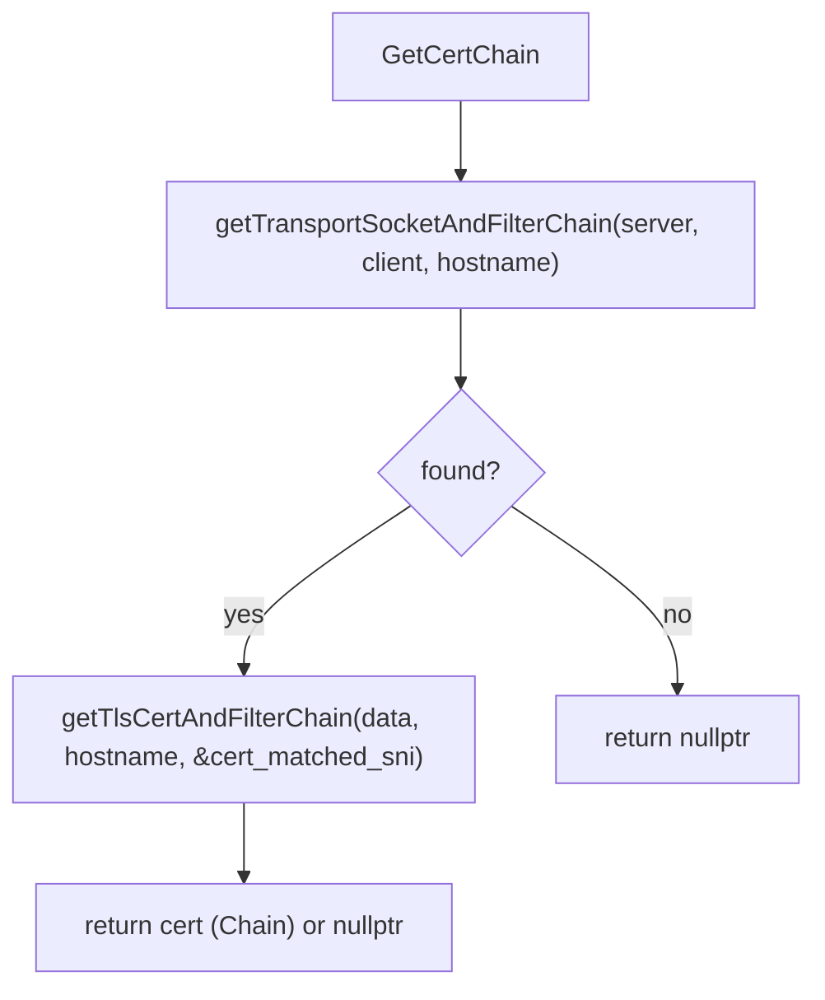
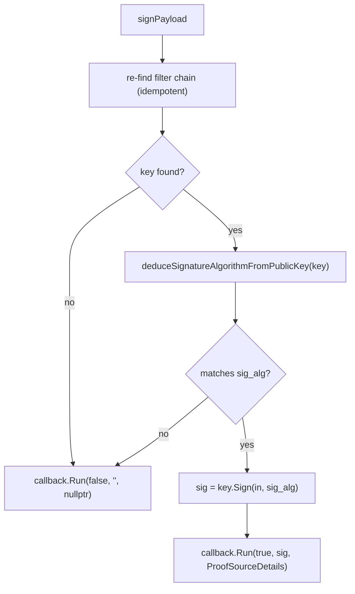
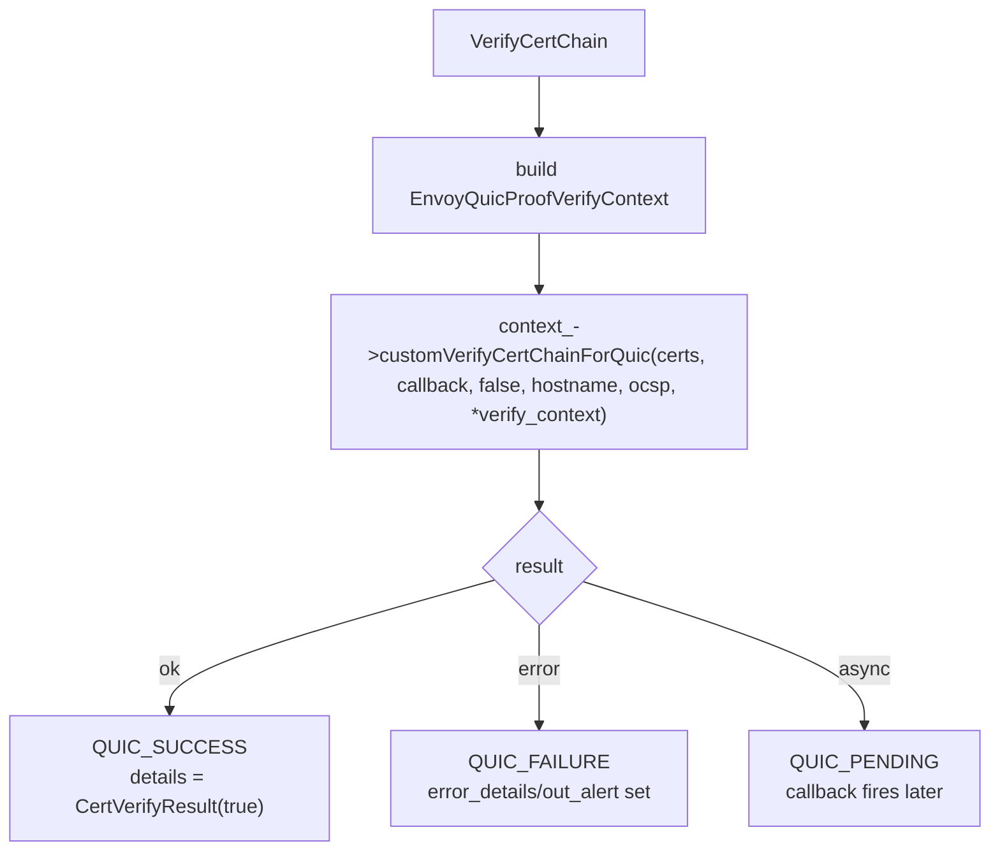
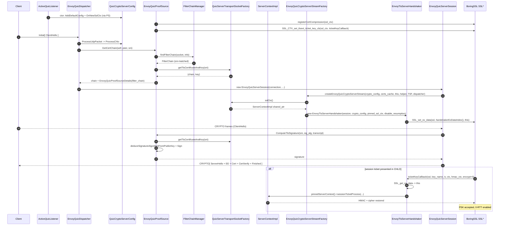

# Crypto, ProofSource, ProofVerifier — `envoy_quic_proof_*`, `envoy_tls_server_handshaker.{h,cc}`, `quic_ssl_connection_info.h`

> *L0–L3 cross‑cut. Where QUIC's TLS plugs into Envoy's existing `source/common/tls` stack.*

This document covers the files that bridge QUIC's TLS 1.3 (RFC 9001) to Envoy's existing TLS infrastructure:

| File | Side | Role |
|---|---|---|
| `envoy_quic_proof_source_base.{h,cc}` | Server | Partial `quic::ProofSource` — common signature dance. |
| `envoy_quic_proof_source.{h,cc}` | Server | Concrete `ProofSource` using filter chains + SNI. |
| `envoy_quic_proof_source_factory_interface.h` | Server | Pluggable factory. |
| `envoy_tls_server_handshaker.{h,cc}` | Server | `quic::TlsServerHandshaker` subclass that pins the `ServerContextImpl` and installs the session‑ticket key callback. |
| `envoy_quic_server_crypto_stream_factory.h` | Server | Pluggable crypto stream factory interface. |
| `envoy_quic_proof_verifier_base.{h,cc}` | Client | Partial `quic::ProofVerifier`. |
| `envoy_quic_proof_verifier.{h,cc}` | Client | Concrete `ProofVerifier` using `ClientContextImpl`. |
| `envoy_quic_client_crypto_stream_factory.h` | Client | Pluggable crypto stream factory interface. |
| `quic_ssl_connection_info.h` | Both | Adapter that exposes the QUIC `SSL*` as `Ssl::ConnectionInfo`. |
| `quic_transport_socket_factory.{h,cc}` | Both | Base for QUIC transport socket factories (no real `TransportSocket`). |
| `quic_server_transport_socket_factory.{h,cc}` | Server | Owns `ServerContextConfig` + live `ServerContextImpl`. |
| `quic_client_transport_socket_factory.{h,cc}` | Client | Owns `ClientContextConfig` + live `ClientContextImpl`. |

Read [`OVERVIEW_PART3_crypto_and_tls.md`](OVERVIEW_PART3_crypto_and_tls.md) first for the conceptual picture; this doc is the per‑file detail.

## Block diagram

```mermaid
flowchart TB
  subgraph Server
    QCSC["quic::QuicCryptoServerConfig"]
    PSF["EnvoyQuicProofSourceFactory<br/>(interface)"]
    PSB["EnvoyQuicProofSourceBase"]
    PS["EnvoyQuicProofSource"]
    PSD["EnvoyQuicProofSourceDetails<br/>(holds FilterChain&)"]
    QSF["EnvoyQuicServerTransportSocketFactory"]
    SCI["ServerContextImpl<br/>(source/common/tls)"]
    CSF["EnvoyQuicCryptoServerStreamFactory<br/>(interface)"]
    HSK["EnvoyTlsServerHandshaker"]
    SSL["BoringSSL SSL_CTX*<br/>SSL*"]
    TKCB["ticketKeyCallback (static)"]
  end

  subgraph Client
    QCCC["quic::QuicCryptoClientConfig"]
    PVB["EnvoyQuicProofVerifierBase"]
    PV["EnvoyQuicProofVerifier"]
    CCI["ClientContextImpl<br/>(source/common/tls)"]
    CCF["EnvoyQuicCryptoClientStreamFactory<br/>(interface)"]
    PVC["EnvoyQuicProofVerifyContext<br/>(interface)"]
    CVR["CertVerifyResult<br/>(ProofVerifyDetails)"]
  end

  subgraph Both
    QSCI["QuicSslConnectionInfo<br/>(ConnectionInfoImplBase)"]
  end

  PSF -->|"createQuicProofSource"| PS
  PSB <|--PS
  PSB -.->|"GetProof"| PS
  PS -->|"GetCertChain"| QSF
  QSF -->|"sslCtx, configs"| SCI
  PS -->|"signPayload"| PSD
  QCSC -->|"owns"| PS
  CSF -->|"createEnvoyQuicCryptoServerStream"| HSK
  HSK -.->|"pins shared_ptr"| SCI
  HSK -->|"SSL_CTX_set_tlsext_ticket_key_cb"| TKCB
  TKCB -->|"SSL_get_ex_data -> handshaker"| HSK
  HSK -->|"pinnedServerContext().sessionTicketProcess"| SCI

  PVB <|--PV
  QCCC -->|"owns"| PV
  PV -->|"customVerifyCertChainForQuic"| CCI
  PV -->|"returns"| CVR
  CCF -->|"createEnvoyQuicCryptoClientStream"| QCCC

  QSCI -.->|"ssl()"| SSL
```

## Server side

### `EnvoyQuicProofSourceBase`

A thin partial implementation of `quic::ProofSource`. It implements three of the four "must implement" methods and delegates the last to the subclass:

```cpp
void GetProof(server_addr, client_addr, hostname, server_config,
              transport_version, chlo_hash, callback);  // QUIC v1+ glue (mostly noop)
void ComputeTlsSignature(server_addr, client_addr, hostname,
                         signature_algorithm, in, callback);  // wraps signPayload
TicketCrypter* GetTicketCrypter() { return nullptr; }
absl::InlinedVector<uint16_t, 8> SupportedTlsSignatureAlgorithms() const;

virtual void signPayload(server_addr, client_addr, hostname,
                         signature_algorithm, in, callback) PURE;
```

The base picks the list of supported signature algorithms based on what BoringSSL was compiled with (RSA‑PSS, ECDSA over P‑256/384/521, Ed25519). The subclass only has to know how to **find a key and sign with it**.

### `EnvoyQuicProofSource`

The shipped concrete implementation. Each method:

#### `GetCertChain(server_addr, client_addr, hostname, *out_matched_sni)`



`getTransportSocketAndFilterChain()` fabricates a `Network::ConnectionSocketPtr` over the listener's `IoHandle` so the existing TCP `FilterChainManager::findFilterChain()` matcher (SNI / source / destination / ALPN) just works. The fake socket is short‑lived (one match) and the IoHandle is wrapped (not owned) via `quic_io_handle_wrapper.h` — the underlying FD belongs to the listener.

`getTlsCertAndFilterChain()` extracts the cert chain + key + (optional) cert‑matched‑SNI flag from the matched chain's `QuicServerTransportSocketFactory`.

#### `signPayload(server_addr, client_addr, hostname, sig_alg, in, callback)`



The signature happens inside QUICHE's TLS handshake thread, but on a single‑threaded Envoy worker that just means "inside the dispatcher callstack". For HSM / async keys, the underlying `CertificatePrivateKey::Sign()` may itself be backed by a `PrivateKeyMethodImpl` that posts to another thread — but the proof source isn't aware of that; it just hands back what `Sign()` returns.

#### `OnNewSslCtx(SSL_CTX*)`

```cpp
void EnvoyQuicProofSource::OnNewSslCtx(SSL_CTX* ssl_ctx) {
  registerCertCompression(ssl_ctx);  // brotli/zstd, from source/common/tls
  if (Runtime::runtimeFeatureEnabled("envoy.reloadable_features.quic_session_ticket_support")) {
    SSL_CTX_set_tlsext_ticket_key_cb(ssl_ctx, EnvoyTlsServerHandshaker::ticketKeyCallback);
  }
}
```

Called once by QUICHE when it builds the `SSL_CTX*` inside `QuicCryptoServerConfig`. After this, every `SSL*` minted from the context inherits both the cert‑compression registrations and the session‑ticket callback.

#### `updateFilterChainManager(new_manager)`

Called by `ActiveQuicListener::updateListenerConfig()`. Swaps the pointer the proof source uses for future SNI lookups. Existing connections are unaffected — they've already matched their chain.

### `EnvoyQuicProofSourceDetails`

```cpp
class EnvoyQuicProofSourceDetails : public quic::ProofSource::Details {
public:
  explicit EnvoyQuicProofSourceDetails(const Network::FilterChain& filter_chain);
  const Network::FilterChain& filterChain() const { return filter_chain_; }
};
```

A trivial wrapper that lets the dispatcher pull the matched filter chain out of QUICHE later when constructing the session, without re‑running the matcher.

### `EnvoyQuicProofSourceFactoryInterface`

```cpp
class EnvoyQuicProofSourceFactoryInterface : public Config::TypedFactory {
public:
  std::string category() const override { return "envoy.quic.proof_source"; }
  virtual std::unique_ptr<quic::ProofSource>
  createQuicProofSource(Network::Socket& listen_socket,
                        Network::FilterChainManager& filter_chain_manager,
                        Server::ListenerStats& listener_stats,
                        TimeSource& time_source) PURE;
};
```

Lets `source/extensions/quic/proof_source/*` plug in alternatives (e.g. SDS‑backed dynamic chains, Salesforce‑internal sources). The shipped default is the one above.

### `EnvoyTlsServerHandshaker`

The core trick for reusing the TCP session‑ticket plumbing. Reads its own header for the rationale:

> The session ticket key callback is installed on the shared QUICHE ssl context, so every connection reaches the same callback regardless of which filter chain served it. To find the right session ticket keys at callback time, each connection pins a shared pointer to its `ServerContextImpl` in ssl ex data at creation time. The pinned pointer keeps the context alive for the connection even after an SDS update rotates the factory's active context, and it matches TCP TLS behavior where each connection is bound to the `ServerContextImpl` that was current at connection creation.

#### `ticketKeyCallback`

```cpp
static int ticketKeyCallback(SSL* ssl, uint8_t* key_name, uint8_t* iv,
                             EVP_CIPHER_CTX* ctx, HMAC_CTX* hmac_ctx, int encrypt);
```

Generic BoringSSL session‑ticket‑key callback signature. The implementation:

1. `SSL_get_ex_data(ssl, handshakerExDataIndex())` → returns the `EnvoyTlsServerHandshaker*` pinned at connection creation.
2. `handshaker->pinnedServerContext()` → returns the `ServerContextImpl*` (downcast from `pinned_ssl_ctx_`).
3. `ctx->sessionTicketProcess(key_name, iv, ctx, hmac_ctx, encrypt)` — the same function used by TCP TLS in `source/common/tls/server_context_impl.cc`.

This means QUIC session resumption uses exactly the same keys, the same rotation behaviour, the same SDS update semantics, and the same operator‑configurable knobs as TCP TLS. No duplication.

#### Why `shared_ptr<ServerContextImpl>` and not raw pointer?

SDS can rotate the active `ServerContextImpl` while connections are still in flight. Without pinning:

- A connection created against version *N* of the config might still receive a ticket‑key callback after the factory has rotated to version *N+1*.
- The callback would then encrypt the ticket with new keys but the connection would have already negotiated assuming the old keys are stable.

By pinning a `shared_ptr`:

- The `ServerContextImpl` stays alive as long as any connection still holds a reference.
- New connections after the SDS rotation use the new context (via the new active factory).
- Existing connections finish out with the old context. No mid‑connection inconsistency.

This is the same lifetime story used by TCP TLS — by construction, not by accident.

### `EnvoyQuicCryptoServerStreamFactoryInterface`

```cpp
class EnvoyQuicCryptoServerStreamFactoryInterface : public Config::TypedFactory {
public:
  std::string category() const override { return "envoy.quic.server.crypto_stream"; }
  virtual std::unique_ptr<quic::QuicCryptoServerStreamBase>
  createEnvoyQuicCryptoServerStream(
      const quic::QuicCryptoServerConfig* crypto_config,
      quic::QuicCompressedCertsCache* compressed_certs_cache,
      quic::QuicSession* session,
      quic::QuicCryptoServerStreamBase::Helper* helper,
      OptRef<const Network::DownstreamTransportSocketFactory> transport_socket_factory,
      Event::Dispatcher& dispatcher) PURE;
};
```

The shipped default (`envoy.quic.crypto_stream.server.quiche`, in `source/extensions/quic/crypto_stream/`) returns an `EnvoyTlsServerHandshaker` configured with the pinned `ServerContextImpl` from `transport_socket_factory.sslCtx()`. Alternative crypto stream implementations (e.g. for Google Quic v1 legacy crypto, no longer shipped) can be plugged here.

## Client side

### `EnvoyQuicProofVerifierBase`

Minimal partial impl. Just routes `VerifyProof()` (used by gQUIC) to a no‑op and leaves `VerifyCertChain()` for the subclass.

### `EnvoyQuicProofVerifier`

```cpp
class EnvoyQuicProofVerifier : public EnvoyQuicProofVerifierBase {
public:
  explicit EnvoyQuicProofVerifier(Envoy::Ssl::ClientContextSharedPtr&& context,
                                  bool accept_untrusted = false);
  quic::QuicAsyncStatus
  VerifyCertChain(const std::string& hostname, uint16_t port,
                  const std::vector<std::string>& certs,
                  const std::string& ocsp_response, const std::string& cert_sct,
                  const quic::ProofVerifyContext* context,
                  std::string* error_details,
                  std::unique_ptr<quic::ProofVerifyDetails>* details,
                  uint8_t* out_alert,
                  std::unique_ptr<quic::ProofVerifierCallback> callback) override;
};
```

The whole method is a wrapper around `ClientContextImpl::customVerifyCertChainForQuic(...)`. Three branches:



`CertVerifyResult` is just a typed boolean wrapper around `is_valid_`. It's returned to QUICHE as `ProofVerifyDetails`, which later surfaces in `EnvoyQuicClientSession::OnProofVerifyDetailsAvailable()`:

```cpp
void EnvoyQuicClientSession::OnProofVerifyDetailsAvailable(const quic::ProofVerifyDetails& d) {
  const auto& r = static_cast<const CertVerifyResult&>(d);
  if (r.isValid()) quic_ssl_info_->onCertValidated();
}
```

`accept_untrusted_` mirrors the TCP TLS `ACCEPT_UNTRUSTED` mode (`envoy.extensions.transport_sockets.tls.v3.CertificateValidationContext::ACCEPT_UNTRUSTED`). When set, SAN matching still happens but trust‑chain failures don't fail the handshake.

### `EnvoyQuicProofVerifyContext`

```cpp
class EnvoyQuicProofVerifyContext : public quic::ProofVerifyContext {
public:
  virtual Event::Dispatcher& dispatcher() const PURE;
  virtual bool isServer() const PURE;
  virtual const Network::TransportSocketOptionsConstSharedPtr& transportSocketOptions() const PURE;
  virtual Extensions::TransportSockets::Tls::CertValidator::ExtraValidationContext
  extraValidationContext() const PURE;
};
```

A typed context passed into `VerifyCertChain()` so the verifier can:

- Post async work back to the right dispatcher.
- Distinguish server‑side vs client‑side validation (different validator policies).
- Apply upstream `TransportSocketOptions` (e.g. `verify_subject_alt_names` overrides set on a per‑request basis).
- Hand the validator any extra context it needs (currently a struct that may carry parsed certs).

`EnvoyQuicClientSession` builds the concrete context when calling into the verifier.

### `EnvoyQuicCryptoClientStreamFactoryInterface`

Mirror of the server‑side interface; the shipped default lives at `source/extensions/quic/crypto_stream/envoy_quic_crypto_client_stream.h` and builds a stock QUICHE `QuicCryptoClientStream` over the `QuicCryptoClientConfig`.

## `QuicSslConnectionInfo` — exposing TLS to the rest of Envoy

```cpp
class QuicSslConnectionInfo : public Extensions::TransportSockets::Tls::ConnectionInfoImplBase {
public:
  QuicSslConnectionInfo(quic::QuicSession& session);
  bool peerCertificateValidated() const override { return cert_validated_; }
  SSL* ssl() const override {
    return session_.GetCryptoStream()->GetSsl();
  }
  // empty stubs for peer cert fields (no mTLS yet, see #23809)
  void onCertValidated() { cert_validated_ = true; }
private:
  quic::QuicSession& session_;
  bool cert_validated_{false};
};
```

By extending `ConnectionInfoImplBase` (from `source/common/tls`), `QuicSslConnectionInfo` automatically gains:

- `tlsVersion()` → e.g. `"TLSv1.3"`.
- `ciphersuiteId()` / `ciphersuiteString()`.
- `sni()`.
- `alpn()` → `"h3"`.
- `sessionId()`.

…all by reading the same BoringSSL `SSL*` that QUICHE exposes via `GetCryptoStream()->GetSsl()`. HCM, access loggers, formatters, network filters, and the `%DOWNSTREAM_TLS_VERSION%` substitution all work *transparently* on QUIC because they only see an `Ssl::ConnectionInfo`.

### Known gaps (per the header)

- **mTLS** — `peerCertificatePresented()`, `sha256PeerCertificateDigest()`, `uriSanPeerCertificate()`, etc. all return empty. QUICHE's QUIC TLS doesn't expose peer cert chain in a form Envoy can consume. Tracked as `#23809`.
- **Local cert reflection** — `subjectLocalCertificate()` / `uriSanLocalCertificate()` / `dnsSansLocalCertificate()` return empty. QUIC `SSL*` doesn't cache local cert info post‑handshake. Cert chain retrieval would need to be cached at proof‑source time.

These gaps don't block the common case (encrypted traffic with cipher / SNI / ALPN visible) but matter for some downstream auth scenarios.

## Transport socket factories — `quic_{server,client}_transport_socket_factory.{h,cc}`

QUIC doesn't have a real `Network::TransportSocket`. There's no per‑connection "wrap raw I/O in encryption" object because QUICHE handles all of that internally. So the factories here exist **only to carry TLS configuration into QUIC's stack**.

### `QuicTransportSocketFactoryBase`

```cpp
class QuicTransportSocketFactoryBase : protected Logger::Loggable<Logger::Id::quic> {
public:
  virtual void initialize() PURE;
  const std::vector<absl::string_view>& supportedAlpnProtocols() const { return supported_alpns_; }
protected:
  virtual absl::Status onSecretUpdated() PURE;
  QuicTransportSocketFactoryStats stats_;
  std::vector<absl::string_view> supported_alpns_;
};
```

Just the shared bits: ALPN list, SDS update plumbing, common stats. Both subclasses inherit it.

### `QuicServerTransportSocketFactory`

```cpp
class QuicServerTransportSocketFactory : public Network::DownstreamTransportSocketFactory,
                                         public QuicTransportSocketFactoryBase {
public:
  static absl::StatusOr<std::unique_ptr<QuicServerTransportSocketFactory>>
  create(bool enable_early_data, Stats::Scope& store, Ssl::ServerContextConfigPtr config,
         Envoy::Ssl::ContextManager& manager);

  Network::TransportSocketPtr createDownstreamTransportSocket() const override {
    PANIC("not implemented");
  }
  bool implementsSecureTransport() const override { return true; }
  void initialize() override;
  std::pair<chain, key> getTlsCertificateAndKey(absl::string_view sni, bool* cert_matched_sni) const;
  bool earlyDataEnabled() const;
  SessionTicketConfig getSessionTicketConfig() const;
  Ssl::ServerContextSharedPtr sslCtx() const;  // mutex-protected
protected:
  absl::Status onSecretUpdated() override;
};
```

- **`createDownstreamTransportSocket()` is a `PANIC`** — confirming there's no real TransportSocket for QUIC.
- **`getTlsCertificateAndKey(sni)`** is the method `EnvoyQuicProofSource` calls.
- **`sslCtx()`** returns the live `ServerContextImpl` (under a reader mutex); used by `EnvoyTlsServerHandshaker` to pin into `SSL` ex_data.
- **`onSecretUpdated()`** is called by SDS when the cert / private key / OCSP / session‑ticket key rotates. It rebuilds the `ServerContextImpl` and atomically swaps it.
- **`SessionTicketConfig`** lets the crypto‑stream factory decide whether to install the ticket key callback (depends on `has_keys`, `disable_stateless_resumption`, `handles_session_resumption`).

### `QuicClientTransportSocketFactory`

Same shape on the client side:

- `createTransportSocket()` PANICs.
- Holds the `ClientContextImpl` so `EnvoyQuicProofVerifier` can wrap it.
- Owns the upstream ALPN list (`h3`, `h2`, `http/1.1` fallback).
- Forwards SDS updates by rebuilding the client context.

The full code lives in the `.cc` files; the public surface is intentionally minimal.

## End‑to‑end view (server handshake)



## Summary table — who owns whom

| Object | Lifetime | Owner |
|---|---|---|
| `QuicCryptoServerConfig` | Per listener per worker | `ActiveQuicListener` (`crypto_config_`) |
| `EnvoyQuicProofSource` | Per listener per worker | Owned **by** `QuicCryptoServerConfig` |
| `EnvoyTlsServerHandshaker` | Per connection | Owned by `EnvoyQuicServerSession` (as crypto stream) |
| Pinned `ServerContextImpl` (shared_ptr) | Per connection lifetime | Held by `EnvoyTlsServerHandshaker::pinned_ssl_ctx_` |
| `QuicServerTransportSocketFactory` | Per filter chain (lifetime of chain in `FilterChainManager`) | Owned by `FilterChain` |
| `EnvoyQuicProofVerifier` | Per cluster (?) | Held by `EnvoyQuicClientSession::transport_socket_factory_` indirectly |
| `QuicClientTransportSocketFactory` | Per cluster | Owned by `Upstream::Cluster` |
| `ClientContextImpl` (shared_ptr) | Lifetime of factory | Held by `QuicClientTransportSocketFactory` |
| `QuicSslConnectionInfo` | Per session | Held by `QuicFilterManagerConnectionImpl::quic_ssl_info_` |

## Where to look next

- [`OVERVIEW_PART3_crypto_and_tls.md`](OVERVIEW_PART3_crypto_and_tls.md) — Conceptual picture; this doc is the per‑file detail.
- `source/common/tls/server_context_impl.cc` — Where `sessionTicketProcess()` actually decrypts a ticket.
- `source/common/tls/cert_validator/default_validator.cc` — Where `customVerifyCertChainForQuic()` ends up.
- `source/common/tls/BORINGSSL_API.md` — All the BoringSSL APIs in play here.
- [`CLASS_HIERARCHY.md#6-crypto-proofsource-proofverifier`](CLASS_HIERARCHY.md#6-crypto-proofsource-proofverifier) and [`#7-transport-socket-factories`](CLASS_HIERARCHY.md#7-transport-socket-factories) — UML views.
