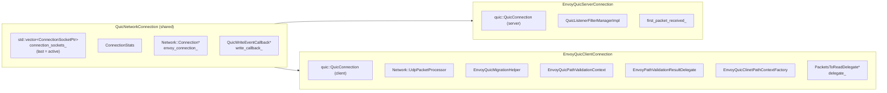
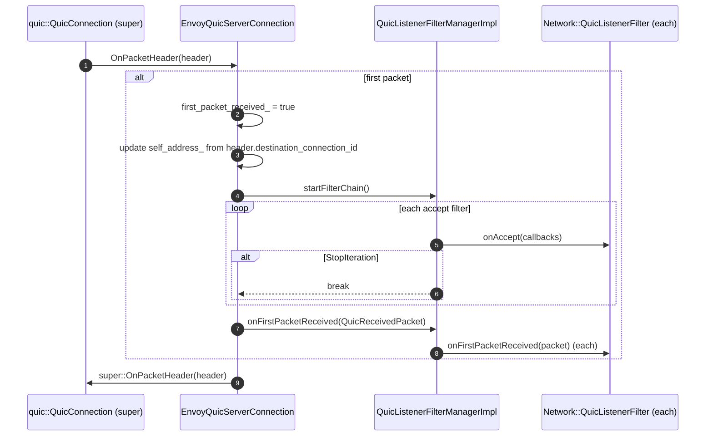
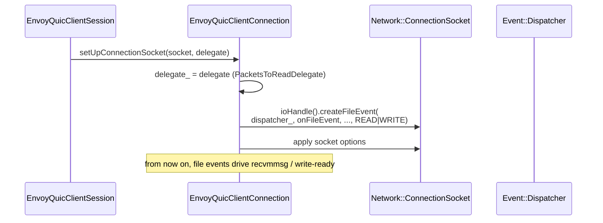
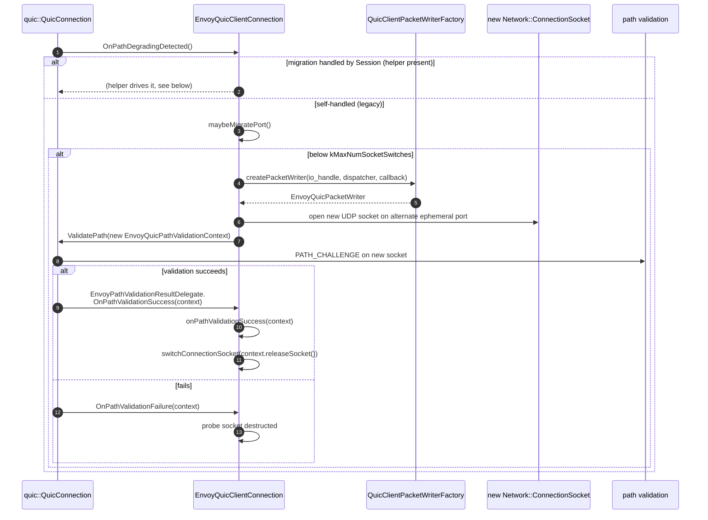
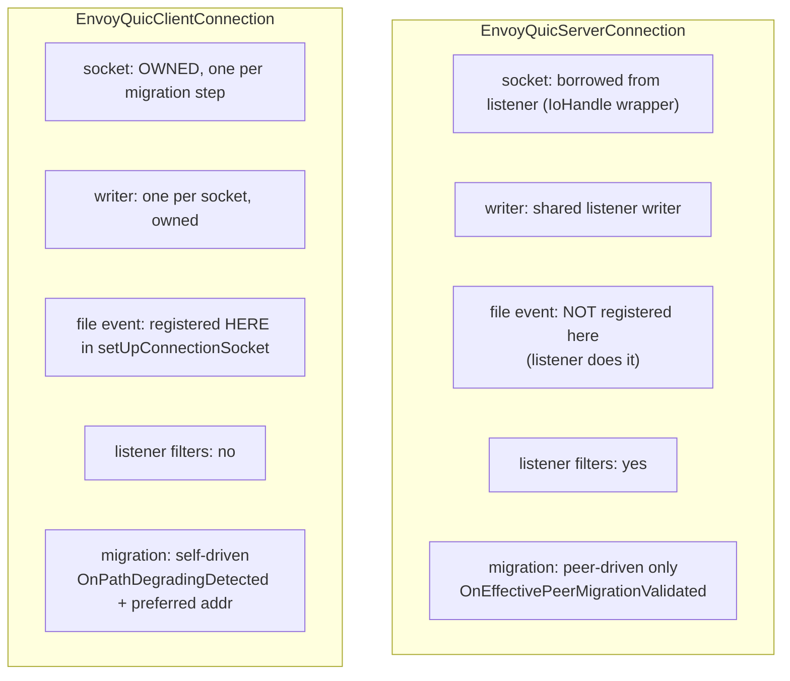

# Connections — `envoy_quic_{server,client}_connection.{h,cc}` & `quic_network_connection.{h,cc}`

> *L2 — connections. The QUICHE `QuicConnection` subclasses that own the socket(s) and packet pacing.*

A `quic::QuicConnection` is QUICHE's per‑connection state machine: packet framer, encrypter, sent‑packet manager, congestion controller, loss recovery, path manager. The Envoy subclasses in this folder add **socket ownership**, **listener filters** (server), **port / network migration** (client), and the back‑pointer to the Envoy `Network::Connection`.

## File map

| File | Purpose |
|---|---|
| `quic_network_connection.{h,cc}` | Shared base. Holds the list of `ConnectionSocket`s (one per migration step), the Envoy connection back‑pointer, and the write callback. |
| `envoy_quic_server_connection.{h,cc}` | Server. Inherits `QuicConnection` + `QuicNetworkConnection`. Owns `QuicListenerFilterManagerImpl`. Hooks `OnPacketHeader` to attach self‑address + apply listener filters. |
| `envoy_quic_client_connection.{h,cc}` | Client. Inherits `QuicConnection` + `QuicNetworkConnection` + `Network::UdpPacketProcessor`. Owns its own UDP socket file event. Implements port migration, path validation, server‑preferred‑address probing, and (optionally) network‑handle migration. |

## Block diagram



## `QuicNetworkConnection` — the shared base

It's deliberately tiny. The goal is to expose the **socket** and the **back‑pointer to the Envoy `Network::Connection`** without dragging in QUICHE.

```cpp
class QuicNetworkConnection : protected Logger::Loggable<Logger::Id::connection> {
public:
  explicit QuicNetworkConnection(Network::ConnectionSocketPtr&& connection_socket);
  void setConnectionStats(const Network::Connection::ConnectionStats& stats);
  void setEnvoyConnection(Network::Connection& connection, QuicWriteEventCallback& write_callback);
  const Network::ConnectionSocketPtr& connectionSocket() const { return connection_sockets_.back(); }
  uint64_t id() const;
protected:
  bool hasConnectionStats() const;
  Network::Connection::ConnectionStats& connectionStats() const;
  void setConnectionSocket(Network::ConnectionSocketPtr&& socket);  // append, used by migration
  void onWriteEventDone();  // -> write_callback_->onWriteEventDone()
  Network::Connection* networkConnection();
private:
  std::unique_ptr<Network::Connection::ConnectionStats> connection_stats_;
  std::vector<Network::ConnectionSocketPtr> connection_sockets_;
  Network::Connection* envoy_connection_{nullptr};
  QuicWriteEventCallback* write_callback_{nullptr};
};
```

Two non‑obvious decisions:

1. **`connection_sockets_` is a vector, not a single socket.** Each entry is a former or current path. The active one is `connection_sockets_.back()`. The history is kept so probing sockets aren't destroyed mid‑validation. The list is appended via `setConnectionSocket()` during migration and never trimmed; the connection lifetime bounds memory.
2. **`setEnvoyConnection()` is called once at session `Initialize()`**, never reassigned. After that, `envoy_connection_` is a stable pointer used for `ENVOY_CONN_LOG()` (via `id()`).

## `EnvoyQuicServerConnection`

### Construction

```cpp
EnvoyQuicServerConnection(
    const quic::QuicConnectionId& server_connection_id,
    quic::QuicSocketAddress initial_self_address,
    quic::QuicSocketAddress initial_peer_address,
    quic::QuicConnectionHelperInterface& helper,
    quic::QuicAlarmFactory& alarm_factory,
    quic::QuicPacketWriter* writer,
    const quic::ParsedQuicVersionVector& supported_versions,
    Network::ConnectionSocketPtr connection_socket,
    quic::ConnectionIdGeneratorInterface& generator,
    std::unique_ptr<QuicListenerFilterManagerImpl> listener_filter_manager);
```

Built only by `EnvoyQuicDispatcher::CreateQuicSession()`. Notes:

- `connection_socket` is a **wrapper** around the listener's `IoHandle` (via `quic_io_handle_wrapper.h`); it doesn't own the FD. Listener owns the FD; closing the connection closes the wrapper but leaves the listener intact.
- `writer` is borrowed from `ActiveQuicListener`; it lives for the lifetime of the listener, which outlives any individual connection.
- `listener_filter_manager` is moved in and owned by the connection. It will be drained by the first packet (see below).

### Listener filters — `OnPacketHeader`



QUIC listener filters are similar to TCP listener filters but operate on a `quic::QuicReceivedPacket` instead of an `Network::ConnectionSocket`. The shipped filter set today is small — TLS inspector‑style filters that need to look at the CHLO. Filters that close the connection prevent `OnPacketHeader` from being passed to QUICHE.

### `ProcessUdpPacket`

The override forwards every received UDP packet up to QUICHE while ensuring listener‑filter lifecycle ran for the first packet. There is no per‑packet listener filter pass — only `onPeerAddressChanged` for migration (called from inside `OnEffectivePeerMigrationValidated`).

### `OnCanWrite`

Overridden to wrap the super call with `SendBufferMonitor::ScopedWatermarkBufferUpdater`s for every active stream — so any bytes that drained as a result of the write are accounted for in the per‑connection watermark.

### `OnEffectivePeerMigrationValidated`

QUICHE calls this once a peer‑initiated migration is validated. The override calls `listener_filter_manager_->onPeerAddressChanged(new_peer, *envoy_connection_)` so listener filters can update their state (e.g. re‑resolve geo / re‑apply policy).

### `OnWritePacketDone`

Hooks per‑packet write completion to update stats. The base class doesn't call this; the override is invoked from `OnCanWrite` after the writer returns.

## `EnvoyQuicClientConnection`

This is the more complex class — three concerns layered:

1. **Owns the UDP socket** (no dispatcher).
2. **Drives port migration** when path degradation is detected.
3. **Drives server‑preferred‑address migration** when QUICHE asks.

### Construction

```cpp
EnvoyQuicClientConnection(
    const quic::QuicConnectionId& server_connection_id,
    quic::QuicConnectionHelperInterface& helper,
    quic::QuicAlarmFactory& alarm_factory,
    quic::QuicPacketWriter* writer,
    bool owns_writer,
    const quic::ParsedQuicVersionVector& supported_versions,
    Event::Dispatcher& dispatcher,
    Network::ConnectionSocketPtr&& connection_socket,
    quic::ConnectionIdGeneratorInterface& generator);
```

Built by `createQuicNetworkConnection()` (`client_connection_factory_impl.cc`). The connection takes ownership of the socket and (optionally) the writer.

### Socket and file event setup



`onFileEvent(uint32_t events, ConnectionSocket& socket)`:

- READ: calls `socket.ioHandle().recvmmsg()` → for each packet, calls `processPacket(local, peer, buffer, ts, tos, cmsg)`.
- WRITE: calls `OnBlockedWriterCanWrite()` so QUICHE retries sends.

### `processPacket` (`Network::UdpPacketProcessor`)

```cpp
void processPacket(Network::Address::InstanceConstSharedPtr local_address,
                   Network::Address::InstanceConstSharedPtr peer_address,
                   Buffer::InstancePtr buffer, MonotonicTime receive_time,
                   uint8_t tos, Buffer::OwnedImpl saved_cmsg) override;
```

Converts Envoy types → QUICHE `QuicReceivedPacket` and calls `quic::QuicConnection::ProcessUdpPacket(self, peer, packet)`. There's no demux because each socket is per‑connection.

### Port migration

Triggered by `OnPathDegradingDetected()` from QUICHE (idle / loss heuristic). The flow:



`switchConnectionSocket(new_socket)` adds the new socket to `connection_sockets_` (back), making it active for future sends. The old socket's file event is left in place until its destruction — so any straggler packets on the old path are still drained.

### Server‑preferred‑address migration

Different trigger, same machinery. When the server's TLS sends a preferred address, QUICHE calls `EnvoyQuicClientSession::OnServerPreferredAddressAvailable(addr)`, which calls back into the connection:

```cpp
void probeAndMigrateToServerPreferredAddress(const quic::QuicSocketAddress& server_preferred_address);
```

This issues `PATH_CHALLENGE` to the preferred address and migrates on success — same `EnvoyPathValidationResultDelegate` callback path.

### Network‑handle migration (mobile)

When `EnvoyQuicMigrationHelper` is present (passed in at session construction), QUICHE itself drives the migration via `FindAlternateNetwork`, `CreateQuicPathContextFactory`, `OnMigrationToPathDone`. The Envoy helper:

- Returns network handles from the `EnvoyQuicNetworkObserverRegistry` (Wi‑Fi vs cellular).
- Creates new `ConnectionSocket`s bound to the chosen network.
- On success, swaps the session's socket via `switchConnectionSocket`.

This is the mode used in Envoy Mobile. In the upstream server build, the helper is absent and the connection drives port‑level migration itself (the legacy path above).

### Nested helper classes

| Inner class | Purpose |
|---|---|
| `EnvoyQuicPathValidationContext` | Bundles a probing writer + socket. Returned to QUICHE so it can drive the validation; `releaseSocket()` is called on success to take over the socket. |
| `EnvoyQuicMigrationHelper` | Implements `quic::QuicMigrationHelper`. Bridges network handles → path validation. |
| `EnvoyPathValidationResultDelegate` | Implements `quic::QuicPathValidator::ResultDelegate`. Receives success / fail callbacks. |
| `EnvoyQuicClinetPathContextFactory` | Implements `quic::QuicPathContextFactory`. Builds path validation contexts on demand. *(Yes, the name has a typo — unfortunately public.)* |

### Read budget

`numPacketsExpectedPerEventLoop()` returns either:

- `delegate_->numPacketsExpectedPerEventLoop()` (the session, which scales by active streams), or
- `DEFAULT_PACKETS_TO_READ_PER_CONNECTION` (32) when the runtime feature `quic_upstream_reads_fixed_number_packets` is enabled.

The fixed value is a safety net for upstream pools that don't want a long‑lived QUIC connection to monopolise an event loop.

## Server vs client — at a glance



## Lifecycle invariants

- A `Connection` always belongs to exactly one `Session`. The session owns the connection (`std::unique_ptr`) and is destroyed strictly after the connection finishes draining.
- The Envoy `Network::Connection*` (set by `setEnvoyConnection`) is the same object as the session (`EnvoyQuicServer/ClientSession`). It is non‑null after `setEnvoyConnection`; before then, the connection only has its socket and stats.
- `connection_sockets_` is never empty after construction. For server, it's always size 1. For client, it grows on migration and is never shrunk.
- The active writer at any moment is owned by the active socket (client) or by the listener (server). When the active socket changes (client migration), the new writer is the one passed in `setUpConnectionSocket()` for the new socket; the old writer continues to live while the old socket continues to live.

## Where to look next

- [`envoy_quic_session.md`](envoy_quic_session.md) — The session that owns this connection.
- [`alarm_and_packet_io.md`](alarm_and_packet_io.md) — Packet writers, alarms, the `QuicConnectionHelper`.
- [`active_quic_listener.md`](active_quic_listener.md) — How the server connection is created.
- [`OVERVIEW_PART2_listener_session_connection.md`](OVERVIEW_PART2_listener_session_connection.md) — How this fits into the L1–L3 picture.
- [`CLASS_HIERARCHY.md#3-connections`](CLASS_HIERARCHY.md#3-connections) — UML view of both connections, including migration helpers.
