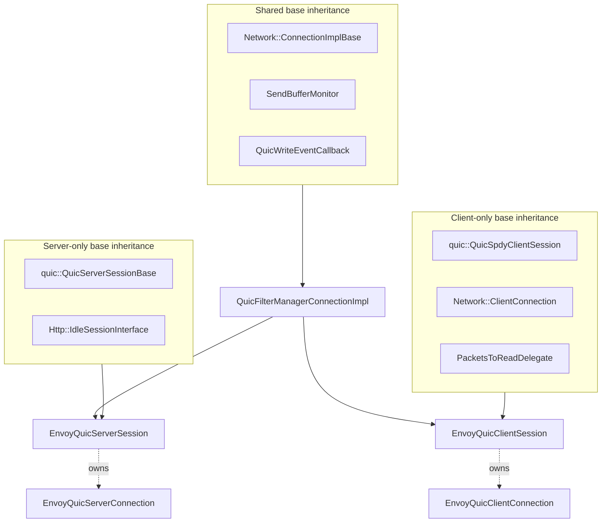
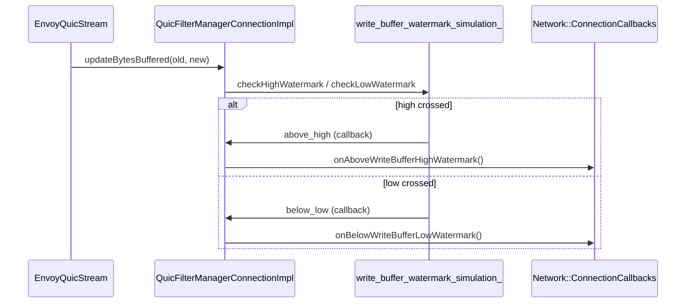
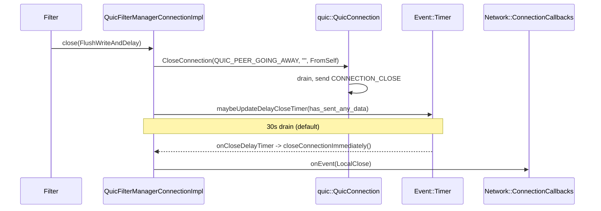
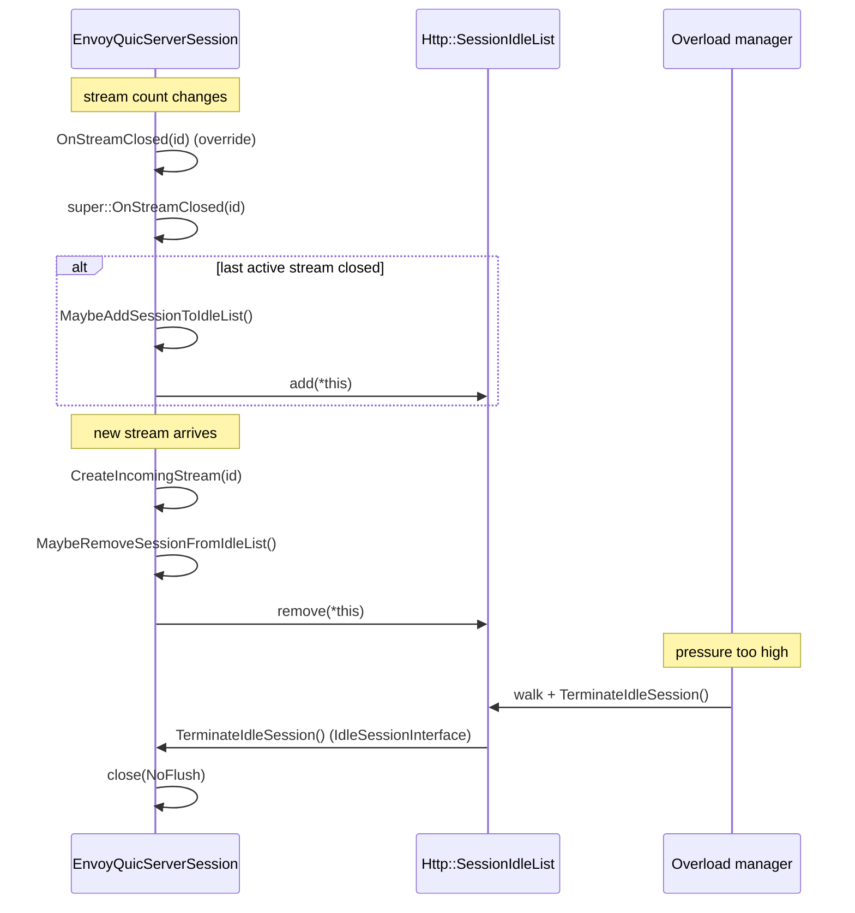
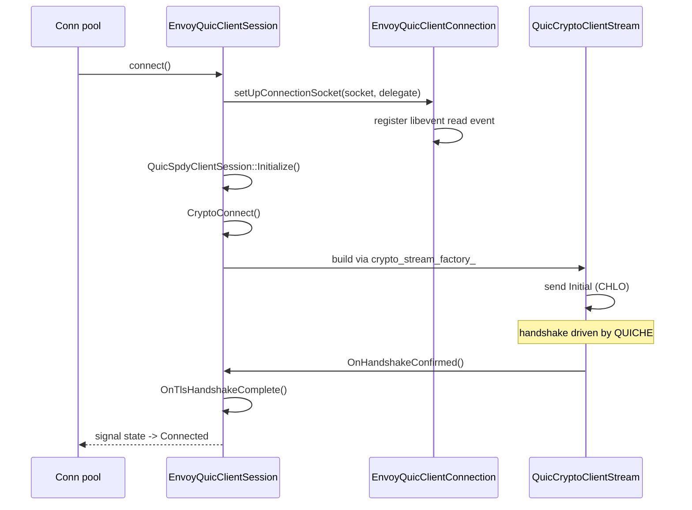
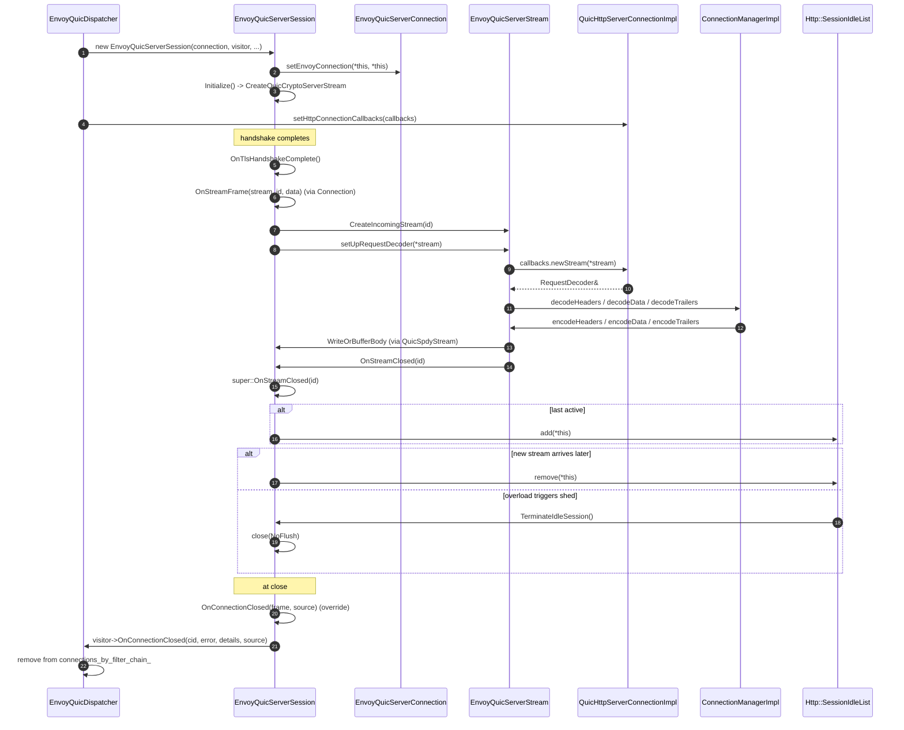

# Sessions — `envoy_quic_{server,client}_session.{h,cc}` & `quic_filter_manager_connection_impl.{h,cc}`

> *L3 — sessions. The "fat" classes that look like `Network::Connection` to Envoy and `QuicSpdySession` to QUICHE.*

A QUIC session is the **per‑connection state machine**: it owns the QUIC `Connection`, all streams, the crypto stream, the flow‑control state, and (for server) the filter chain. In Envoy, a session **is also** a `Network::Connection`, so HCM and filters can drive it without knowing it's QUIC.

This document covers three files:

- `quic_filter_manager_connection_impl.{h,cc}` — shared base. Implements the `Network::Connection` contract (filter manager, watermarks, close, ssl info, stream info, ...).
- `envoy_quic_server_session.{h,cc}` — server. Adds `quic::QuicServerSessionBase`, idle‑session support, H/3 GoAway logic.
- `envoy_quic_client_session.{h,cc}` — client. Adds `quic::QuicSpdyClientSession`, `Network::ClientConnection`, migration / preferred‑address.

## Block diagram



## `QuicFilterManagerConnectionImpl` — the shared base

### Why it exists

QUIC sessions need to *behave* like an Envoy `Network::Connection` (so HCM, network filters, access logs work transparently), but the two sessions don't share a QUICHE base class — server uses `QuicServerSessionBase`, client uses `QuicSpdyClientSession`. So all the **Envoy‑side** behaviour (the parts that don't depend on whether we're server or client) is hoisted into `QuicFilterManagerConnectionImpl`, which both inherit.

It is a giant abstract base, but everything in it falls into a small number of buckets.

### Buckets

| Bucket | Methods | Comment |
|---|---|---|
| **Filter manager** | `addReadFilter` / `addWriteFilter` / `addFilter` / `removeReadFilter` / `initializeReadFilters` / `addAccessLogHandler` | Delegated to `filter_manager_` (`std::unique_ptr<FilterManagerImpl>`). |
| **Connection lifecycle** | `close(type)` / `close(type, details)` / `state()` / `connecting()` / `closeConnection()` panic | `state()` derives from `initialized_` + `quicConnection().connected()`. `close(...)` schedules QUICHE close + Envoy delay‑close timer. |
| **Bytes / watermarks** | `setBufferLimits` / `bufferLimit() panic` / `aboveHighWatermark` / `setBufferHighWatermarkTimeout` / `bytesToSend` | Connection‑wide watermark via `write_buffer_watermark_simulation_`. Bytes are counted via `SendBufferMonitor::updateBytesBuffered`. |
| **TLS info** | `ssl()` / `connectionInfoSetter` / `connectionInfoProvider` / `connectionInfoProviderSharedPtr` | `ssl()` returns the `QuicSslConnectionInfo` (which wraps the crypto stream's `SSL*`). |
| **Stream info** | `streamInfo()` / `transportFailureReason()` | Hands out the per‑connection `StreamInfo`. |
| **Stats** | `setConnectionStats` | Forwards into the network connection's stats and the base. |
| **Async** | `dispatcher()` | The session's event dispatcher (== the worker dispatcher). |
| **No‑ops & panics** | `noDelay` / `addBytesSentCallback` / `readDisable` / `enableHalfClose` / `write` / `unixSocketPeerCredentials` / `startSecureTransport` | These don't apply to QUIC or are handled by QUICHE internally. Most panic in debug mode. |

### Read disable is *not* supported

QUIC has its own flow control. The connection‑wide `readDisable()` call doesn't fit QUIC's model — the filter manager would have to coordinate per‑stream pauses with QUICHE's flow controller, which it can't. So `QuicFilterManagerConnectionImpl::readDisable()` `IS_ENVOY_BUG()`s.

Per‑stream `readDisable()` *is* supported, at `EnvoyQuicStream` level — see [`envoy_quic_stream.md`](envoy_quic_stream.md).

### `rawWrite` — the only sensible write path

```cpp
void QuicFilterManagerConnectionImpl::rawWrite(Buffer::Instance& data, bool end_stream);
```

This is called by upstream HCM / TCP_PROXY‑style filters that want to push bytes "around" HTTP. It's a panic for QUIC connections in practice — QUIC always frames data inside streams — but the method exists to satisfy the `Network::FilterManagerConnection` interface.

### Watermark roll‑up



The simulation never actually buffers bytes — QUICHE already does that per stream. `EnvoyQuicSimulatedWatermarkBuffer` is just a thresholded counter.

### Delayed close

`close(type)` cooperates with QUICHE's drain timer. The high‑level flow:



Three close modes:

| Mode | Behaviour |
|---|---|
| `NoFlush` | Close immediately, do not send CONNECTION_CLOSE. |
| `FlushWrite` | Flush pending writes, send CONNECTION_CLOSE, no drain timer. |
| `FlushWriteAndDelay` | Flush + CONNECTION_CLOSE + delay close to absorb late ACKs. |

### Initialization‑time close handling

If a filter calls `close()` *during* its own `Initialize()` (e.g. a `ReadFilter::onNewConnection()` returning `StopIteration` + immediately closing), QUICHE is mid‑setup and reentry would crash. The implementation stashes the close type in `close_type_during_initialize_` and applies it via `maybeHandleCloseDuringInitialize()` once construction is done.

## `EnvoyQuicServerSession`

### Roles

- **`quic::QuicServerSessionBase`** — QUICHE side: stream creation, ALPN selection, crypto stream factory, SSL config.
- **`QuicFilterManagerConnectionImpl`** — Envoy side: everything in the base.
- **`Http::IdleSessionInterface`** — overload manager side: `TerminateIdleSession()`.

### Construction

```cpp
EnvoyQuicServerSession(
    const quic::QuicConfig& config,
    const quic::ParsedQuicVersionVector& supported_versions,
    std::unique_ptr<EnvoyQuicServerConnection> connection,
    quic::QuicSession::Visitor* visitor,
    quic::QuicCryptoServerStreamBase::Helper* helper,
    const quic::QuicCryptoServerConfig* crypto_config,
    quic::QuicCompressedCertsCache* compressed_certs_cache,
    Event::Dispatcher& dispatcher,
    uint32_t send_buffer_limit,
    QuicStatNames& quic_stat_names,
    Stats::Scope& listener_scope,
    EnvoyQuicCryptoServerStreamFactoryInterface& crypto_server_stream_factory,
    std::unique_ptr<StreamInfo::StreamInfo>&& stream_info,
    QuicConnectionStats& connection_stats,
    EnvoyQuicConnectionDebugVisitorFactoryInterfaceOptRef debug_visitor_factory,
    Http::SessionIdleListInterface* session_idle_list);
```

Built only by `EnvoyQuicDispatcher::CreateQuicSession()`. The dispatcher hands itself in as `visitor` (so QUICHE can call `OnConnectionClosed` back into the dispatcher). The connection comes pre‑built, including the `QuicListenerFilterManagerImpl`.

### `Initialize()`

Calls `quic::QuicServerSessionBase::Initialize()`, which in turn calls `CreateQuicCryptoServerStream(crypto_config, certs_cache)`. The override delegates to the `EnvoyQuicCryptoServerStreamFactoryInterface`, which produces an `EnvoyTlsServerHandshaker` pinned to the `ServerContextImpl` of the matched filter chain.

After that, the connection is ready to receive packets.

### Stream creation

```cpp
quic::QuicSpdyStream* CreateIncomingStream(quic::QuicStreamId id) override;
quic::QuicSpdyStream* CreateOutgoingBidirectionalStream() override;
```

`CreateIncomingStream(id)` is called by QUICHE when the first frame for a new stream id arrives. It:

1. Allocates an `EnvoyQuicServerStream`.
2. Calls `ActivateStream()` so QUICHE owns it.
3. Calls `setUpRequestDecoder(stream)`, which asks the registered `http_connection_callbacks_` (set by the codec) for a `Http::RequestDecoder` and binds it to the stream.

Server‑initiated outgoing streams (`CreateOutgoingBidirectionalStream()`) are not used by HCM — Envoy doesn't initiate H/3 requests from server side — so this would only be invoked if Envoy adds support for PUSH_PROMISE or similar.

### `OnTlsHandshakeComplete()`

Marks the session usable:

- Records the handshake duration in stats.
- Calls the parent class to flush any deferred Initial / Handshake state.
- Triggers any filters waiting on `onConnected()`.

### Idle session list



`is_in_idle_list_` flips between `add`/`remove` so re‑entry into the list is safe.

### H/3 GoAway under load

`setH3GoAwayLoadShedPoints(go_away_and_close, go_away)` registers two `LoadShedPoint`s. When the overload manager fires either at dispatch time:

- `should_send_go_away_and_close_on_dispatch_` — send GOAWAY then close the connection after the current stream finishes.
- `should_send_go_away_on_dispatch_` — send GOAWAY only.

Both are queried per dispatch event (per `ProcessUdpPacket`).

### `requestedServerName()`

Returns the SNI used by the client. Pulled from the crypto stream:

```cpp
absl::string_view EnvoyQuicServerSession::requestedServerName() const {
  return crypto_stream_ ? crypto_stream_->crypto_negotiated_params().sni : "";
}
```

This is what HCM's `request_handler.cpp` reads to populate `:authority`/`Host` fallback.

## `EnvoyQuicClientSession`

### Roles

- **`QuicFilterManagerConnectionImpl`** — Envoy side.
- **`quic::QuicSpdyClientSession`** — QUICHE side.
- **`Network::ClientConnection`** — adds `connect()`.
- **`PacketsToReadDelegate`** — tells `EnvoyQuicClientConnection` how many packets to read per loop.

### Construction

Built by `createQuicNetworkConnection()` in `client_connection_factory_impl.cc`. Inputs include:

- A pre‑built `EnvoyQuicClientConnection` (which already owns its socket).
- The `QuicForceBlockablePacketWriter` (only used by some specific QUICHE migration code paths).
- The `EnvoyQuicMigrationHelper` (optional — present if the session handles its own migration).
- The migration config (idle, probing thresholds).
- `QuicServerId` + `QuicCryptoClientConfig`.
- `EnvoyQuicCryptoClientStreamFactoryInterface` (for pluggable crypto streams).
- `Http::HttpServerPropertiesCache` (rtt / alt‑svc).
- The upstream `TransportSocketOptions` and `UpstreamTransportSocketFactory`.

### `connect()` — start the handshake



### Migration touchpoints

The client session supports several migration scenarios. The class is the central coordinator; the connection is the active participant. See [`envoy_quic_connection.md`](envoy_quic_connection.md) for the gory detail.

- `OnServerPreferredAddressAvailable(addr)` — when the server's TLS sends a preferred address, asks the connection to validate the path then migrate.
- `OnNewEncryptionKeyAvailable(level, encrypter)` — wakes up any 0‑RTT / 1‑RTT pending writes.
- `OnConfigNegotiated()` — applies transport parameters into Envoy stats / RTT cache.
- `OnHttp3GoAway(stream_id)` — calls `http_connection_callbacks_->onGoAway()`; pool stops creating new streams.

### `OnProofVerifyDetailsAvailable(details)`

When the proof verifier finishes (sync or async), QUICHE invokes this with the `ProofVerifyDetails`. `EnvoyQuicClientSession` checks the cast to `CertVerifyResult`, marks `quic_ssl_info_->onCertValidated()` if valid, otherwise lets the handshake fail naturally on `OnConnectionClosed`.

### `numPacketsExpectedPerEventLoop()`

```cpp
size_t numPacketsExpectedPerEventLoop() const override {
  return std::max<size_t>(1, GetNumActiveStreams()) * Network::NUM_DATAGRAMS_PER_RECEIVE;
}
```

Scales per‑loop read budget with active streams. Used by `EnvoyQuicClientConnection` (because the client owns its socket, it sets its own `recvmmsg()` batch size).

### `StartDraining()`

Inherited from `QuicClientSessionWithMigration`. Closes the underlying connection with `QUIC_CONNECTION_MIGRATION_NO_NEW_NETWORK` so QUICHE flushes pending data and stops accepting new streams.

### Connection callbacks

- `setHttpConnectionCallbacks(callbacks)` — set by `QuicHttpClientConnectionImpl` before stream creation.
- `OnCanCreateNewOutgoingStream(unidirectional)` — fires `callbacks->onStreamsAvailable()` so the pool can issue queued requests.

## Cross‑cutting: where the connection lives

Both sessions own their connection as a `std::unique_ptr<EnvoyQuic{Server,Client}Connection>`. The pointer is declared **first** in the class so destruction order is "session → streams → crypto stream → connection". QUICHE's lifetime invariants depend on this; reordering would crash.

There's also the back‑reference from connection to session, set up in `Initialize()`:

```cpp
quic_connection_->setEnvoyConnection(*this, *this);  // network connection + write callback
```

After this, `quic_connection_` knows it has an `envoy_connection_` (the session) and a `write_callback_` (also the session, via `QuicWriteEventCallback`). The session is now reachable from anywhere that has the connection.

## Sequence: full server‑side request lifecycle



## Where to look next

- [`envoy_quic_connection.md`](envoy_quic_connection.md) — The `Connection` half that this session owns.
- [`envoy_quic_stream.md`](envoy_quic_stream.md) — What `CreateIncomingStream` / `CreateClientStream` builds.
- [`crypto_and_proof_source.md`](crypto_and_proof_source.md) — Where the crypto stream comes from on each side.
- [`OVERVIEW_PART2_listener_session_connection.md`](OVERVIEW_PART2_listener_session_connection.md) — Where this layer sits in the stack.
- [`CLASS_HIERARCHY.md#2-sessions`](CLASS_HIERARCHY.md#2-sessions) — UML of the inheritance.
