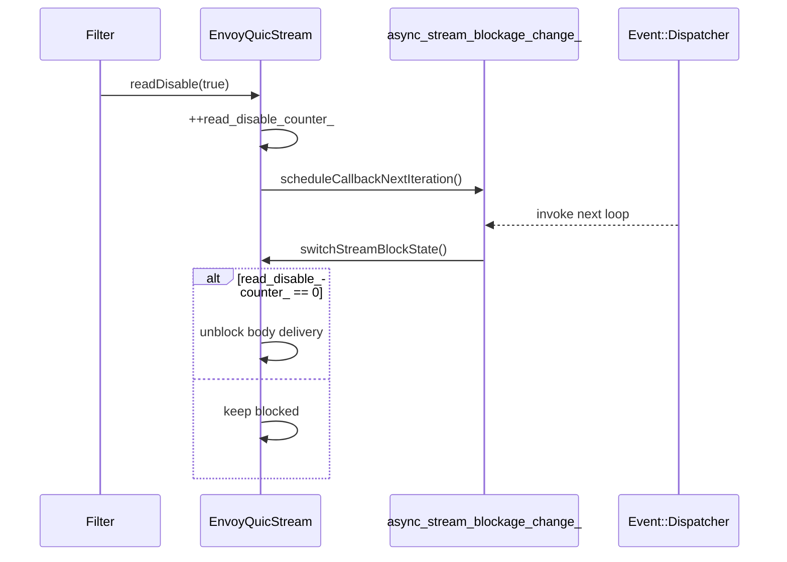
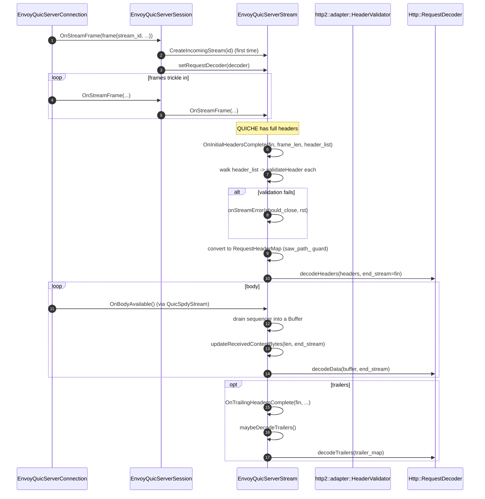
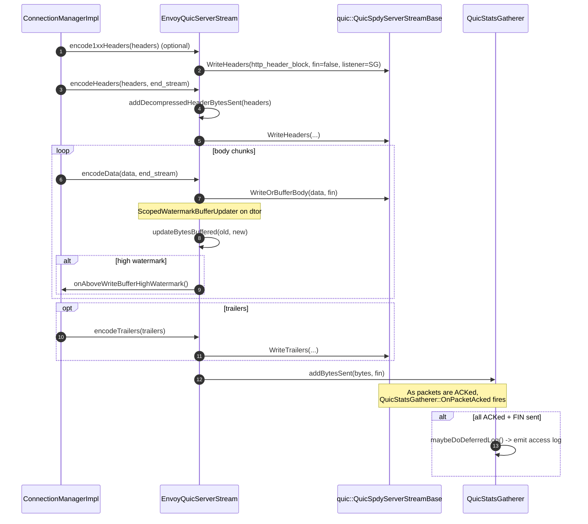
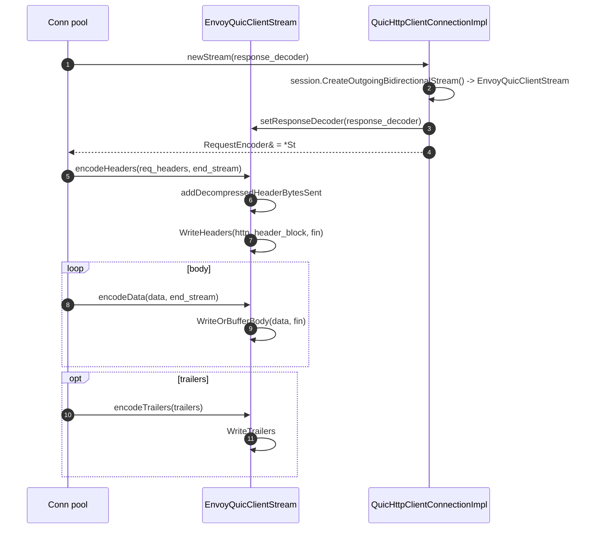
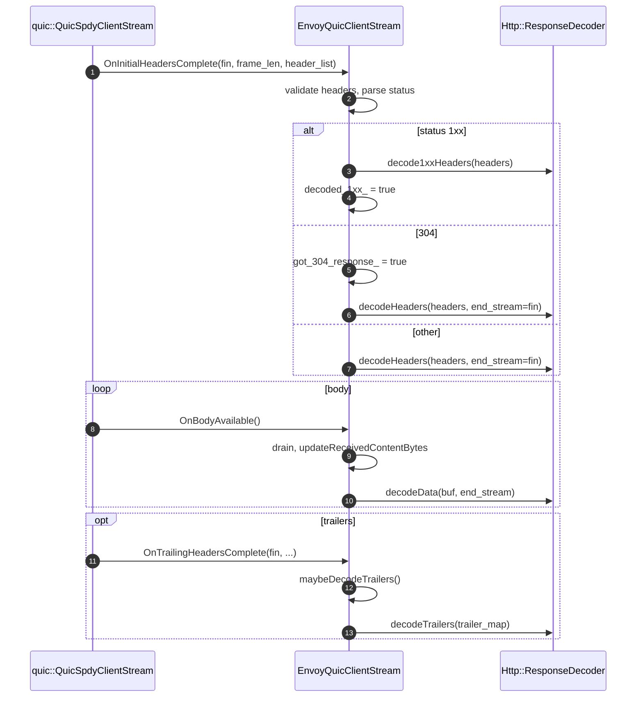

# Streams & HTTP/3 codecs — `envoy_quic_stream.{h,cc}`, `envoy_quic_{server,client}_stream.{h,cc}`, `{server,client}_codec_impl.{h,cc}`

> *L4 (streams) + L5 (codecs). One per HTTP/3 request, both directions.*

A QUIC stream in this folder is **simultaneously**:

- A `quic::QuicSpdyStream` (so QUICHE delivers HEADERS / DATA / QPACK / TRAILERS / METADATA frames into it).
- An Envoy `Http::Stream` + `Http::StreamEncoder` (so HCM can write a response, manage callbacks, react to watermarks).
- A `Http::ResponseEncoder` (server) or `Http::RequestEncoder` (client).
- An `Http::MultiplexedStreamImplBase` (for the flush timer, callback bookkeeping).
- A `SendBufferMonitor` (so per‑stream buffered bytes roll up into the connection watermark).
- A `HeaderValidator` (for `validateHeader`, `startHeaderBlock`, `finishHeaderBlock`).
- Holder of a `QuicStatsGatherer` (the QUIC `AckListener` that defers access logs to FIN‑ack time).
- Optionally, an `HttpDatagramHandler` for RFC 9297 datagrams.

Sitting **above** each stream is a paper‑thin codec class (`QuicHttpServerConnectionImpl` / `QuicHttpClientConnectionImpl`) that implements `Http::Connection`. The codec exists because HCM and the connection pool talk to an `Http::Connection`, not directly to a stream.

## Block diagram

```mermaid
flowchart TB
  subgraph CodecLayer["L5 — codec (per session)"]
    SCdc["QuicHttpServerConnectionImpl"]
    CCdc["QuicHttpClientConnectionImpl"]
  end

  subgraph StreamLayer["L4 — stream (per request)"]
    EQS["EnvoyQuicStream (abstract)"]
    SS["EnvoyQuicServerStream"]
    CS["EnvoyQuicClientStream"]
    Q1["quic::QuicSpdyServerStreamBase"]
    Q2["quic::QuicSpdyClientStream"]
    RE["Http::ResponseEncoder"]
    REq["Http::RequestEncoder"]
    SBM["SendBufferMonitor"]
    HV["HeaderValidator"]
    SBS["EnvoyQuicSimulatedWatermarkBuffer"]
    SG["QuicStatsGatherer<br/>(QuicAckListenerInterface)"]
    HD["HttpDatagramHandler<br/>(optional)"]
    SCB["SchedulableCallback<br/>async_stream_blockage_change_"]
  end

  EQS --> SS
  EQS --> CS
  Q1 --> SS
  Q2 --> CS
  RE --> SS
  REq --> CS
  EQS --> SBM
  EQS --> HV
  EQS -. owns .-> SBS
  EQS -. owns .-> SG
  EQS -. owns .-> SCB
  EQS -. opt .-> HD

  SCdc -. has-a .-> SS
  CCdc -. has-a .-> CS
```



For the full inheritance graph, see [`CLASS_HIERARCHY.md#4-streams`](CLASS_HIERARCHY.md#4-streams) and [`CLASS_HIERARCHY.md#5-http3-codec-adapters`](CLASS_HIERARCHY.md#5-http3-codec-adapters).

## `EnvoyQuicStream` — the abstract base

This is the workhorse. It collects everything that doesn't depend on whether the stream is server‑side or client‑side.

### Construction

```cpp
EnvoyQuicStream(quic::QuicSpdyStream& quic_stream,
                quic::QuicSession& quic_session,
                uint32_t buffer_limit,
                QuicFilterManagerConnectionImpl& filter_manager_connection,
                std::function<void()> below_low_watermark,
                std::function<void()> above_high_watermark,
                Http::Http3::CodecStats& stats,
                const envoy::config::core::v3::Http3ProtocolOptions& http3_options);
```

`quic_stream` is the same object (via virtual inheritance), so the constructor is essentially registering the per‑stream watermark callbacks and capturing the http3 options. The callbacks fire on bytes‑buffered crossings.

### The encoder side

| Method | What it does |
|---|---|
| `encodeData(buf, end_stream)` | Calls `WriteOrBufferBody(data, fin)` on the QUIC stream inside a `ScopedWatermarkBufferUpdater`, so any buffered‑byte delta is reported. |
| `encodeMetadata(metadata_map_vector)` | Emits METADATA frames if peer advertised support; otherwise drops + logs. |
| `addCallbacks(cb)` / `removeCallbacks(cb)` | Forwards to the multiplexed base helper. `addCallbacks` is guarded by `local_end_stream_` so callers don't subscribe to a finished stream. |
| `bufferLimit()` | `send_buffer_simulation_.highWatermark()`. |

### Read disable (the deferred dance)

QUICHE doesn't accept block / unblock from inside its own stack. So `readDisable` only updates a counter and schedules a callback for next iteration:



`switchStreamBlockState()` is `PURE` — implemented in the two subclasses to call the right QUICHE method (`SetUnblocked`, `SetBlocked` style).

### Header validation

`validateHeader(name, value)` is called for every received header. It:

1. Runs `http2::adapter::HeaderValidator::ValidateSingleHeader()`.
2. If the validator says no, sets `close_connection_upon_invalid_header_` (unless the http3 option overrides it to stream‑error) and returns `REJECT`.
3. Special‑cases `content-length` via `Http::HeaderUtility::validateContentLength`, stashing the parsed value so `updateReceivedContentBytes()` can verify the body length later.
4. Enforces "no pseudo‑header after a regular header" — returns `REJECT` if violated.
5. Sets `saw_regular_headers_` once the first non‑pseudo header is seen.

`startHeaderBlock()` / `finishHeaderBlock()` are gated by `envoy.restart_features.validate_http3_pseudo_headers`; when enabled, they wrap the header block in `http2::adapter::HeaderValidator::StartHeaderBlock` / `FinishHeaderBlock(headerType)` so pseudo‑header rules are enforced.

### `updateBytesBuffered`

The most important method in the class — implements `SendBufferMonitor`:

```cpp
void updateBytesBuffered(uint64_t old_buffered_bytes, uint64_t new_buffered_bytes) override {
  if (new == old) return;
  if (new > old) send_buffer_simulation_.checkHighWatermark(new);
  else           send_buffer_simulation_.checkLowWatermark(new);
  reported_buffered_bytes_ += (new - old);
  filter_manager_connection_.updateBytesBuffered(old, new);
}
```

Two state machines: per‑stream (`send_buffer_simulation_`) and per‑connection (via the session). The per‑stream simulation uses `buffer_limit / 2` as low and `buffer_limit` as high, and fires `above_high_watermark` / `below_low_watermark` callbacks supplied at construction.

### Stream / connection error policy

```cpp
virtual void onStreamError(absl::optional<bool> should_close_connection,
                           quic::QuicRstStreamErrorCode rst = quic::QUIC_BAD_APPLICATION_PAYLOAD) PURE;
```

Each subclass overrides this. The intent: depending on http3 options (`override_stream_error_on_invalid_http_message`), an invalid HTTP message either resets the stream or closes the whole connection. Concrete implementations check the option and call either `Reset(rst)` or `CloseConnection(...)`.

### `IncrementalBytesSentTracker`

A small RAII helper used by both subclasses inside `encodeHeaders` / `encodeData`:

```cpp
IncrementalBytesSentTracker tracker(*this /*as QuicStream*/, *bytes_meter_, update_header_bytes);
// ... perform write ...
// dtor adds (current bytes - initial bytes) to the meter
```

This lets stream stats (`Http::BytesMeter`) accurately count bytes that left QUIC's send buffer during the call, separate from bytes that are still buffered.

## `EnvoyQuicServerStream`

### What it adds

- `quic::QuicSpdyServerStreamBase` base.
- `Http::ResponseEncoder` interface.
- A `Http::RequestDecoderHandle` so HCM can call into the stream after the stream's notional "end".
- `MetadataVisitor` for inbound METADATA frames.
- `headers_with_underscores_action_` policy for incoming requests.
- `saw_path_` (sticky), used to enforce ":path appears exactly once" for non‑CONNECT requests.

### Receiving a request



### Sending a response



### Reset & close

- `resetStream(reason)` translates an Envoy reset reason → `quic::QuicRstStreamErrorCode` and calls `Reset()`.
- `ResetWithError(error)` is the QUICHE‑side reset path — overridden to also call back to filters via `onResetStream()`.
- `OnStreamReset(frame)` is QUICHE telling us the peer reset us; we record the reason and propagate via the multiplexed base.
- `OnStopSending(error)` is the peer asking us to stop sending; we surface it the same way.
- `OnClose()` is the final cleanup; we let `QuicStatsGatherer` flush any deferred logs in its dtor if the FIN was acked.

### Deferred access logging — the contract

To make QUIC access logs faithful to what reached the peer:

1. HCM signals end‑of‑response by calling `setDeferredLoggingHeadersAndTrailers(req, resp, trailers, stream_info)`.
2. `EnvoyQuicServerStream` copies the headers/trailers shared pointers and **clones** the stream info into a new `StreamInfoImpl` (so the original can be destroyed without affecting logging).
3. `QuicStatsGatherer` receives ACKs from QUICHE via `OnPacketAcked()`; once `bytes_outstanding_ == 0` and `fin_sent_`, it calls `maybeDoDeferredLog()`.
4. `maybeDoDeferredLog()` walks `access_log_handlers_` and emits each log; sets `logging_done_`.
5. If the stream is destroyed before ACKs finish (e.g. connection close), the dtor calls `maybeDoDeferredLog(record_ack_timing=false)` so logs still flush — minus accurate ACK timing.

## `EnvoyQuicClientStream`

### What it adds

- `quic::QuicSpdyClientStream` base.
- `Http::RequestEncoder` interface.
- A `Http::ResponseDecoderHandle` (handle, because the decoder lives in the request callstack).
- `upgrade_protocol_` for HTTP CONNECT‑style upgrades.
- `decoded_1xx_` to track that an early hint was already surfaced (so subsequent 1xxes aren't dropped on the floor when "final" hand‑off rules apply).

### Sending a request



### Receiving a response



### Response decoder lifetime

The response decoder is held as `Http::ResponseDecoderHandle` (`response_decoder_handle_`) so the stream can re‑acquire the decoder pointer (`response_decoder_`) via `getResponseDecoder()` even if the original caller has gone away. `onResponseDecoderDead()` is invoked if the handle reports the decoder has been destroyed — the stream then ignores subsequent inbound events.

### HTTP CONNECT / WebSocket‑over‑H/3

`upgrade_protocol_` is non‑empty when the request encoded an `:protocol` pseudo‑header (extended CONNECT). This influences how `OnBodyAvailable()` interprets data — the stream may switch to capsule mode if `HttpDatagramHandler` is present and `useCapsuleProtocol()` is called.

## Codec adapters — `QuicHttpServerConnectionImpl` / `QuicHttpClientConnectionImpl`

These two are intentionally thin. They satisfy `Http::Connection`, `Http::ServerConnection`, and `Http::ClientConnection`, but the real per‑stream work is in the stream classes.

### `QuicHttpConnectionImplBase`

```cpp
class QuicHttpConnectionImplBase : public virtual Http::Connection,
                                   protected Logger::Loggable<Logger::Id::quic> {
public:
  Http::Status dispatch(Buffer::Instance&) override { PANIC("not implemented"); }
  Http::Protocol protocol() override { return Http::Protocol::Http3; }
  bool wantsToWrite() override { return quic_session_.bytesToSend() > 0; }
protected:
  QuicFilterManagerConnectionImpl& quic_session_;
  Http::Http3::CodecStats& stats_;
};
```

- `dispatch()` PANICs — QUIC hands raw bytes to streams, never to the codec.
- `protocol()` always returns H/3.
- `wantsToWrite()` asks the session for buffered bytes (`bytesToSend()`).

### `QuicHttpServerConnectionImpl`

```cpp
class QuicHttpServerConnectionImpl : public QuicHttpConnectionImplBase, public Http::ServerConnection {
public:
  QuicHttpServerConnectionImpl(EnvoyQuicServerSession& quic_session,
                               Http::ServerConnectionCallbacks& callbacks,
                               Http::Http3::CodecStats& stats,
                               const Http3ProtocolOptions& http3_options,
                               uint32_t max_request_headers_kb,
                               uint32_t max_request_headers_count,
                               HeadersWithUnderscoresAction headers_with_underscores_action,
                               Server::OverloadManager& overload_manager);
  void goAway() override;
  void shutdownNotice() override;
  void onUnderlyingConnectionAboveWriteBufferHighWatermark() override;
  void onUnderlyingConnectionBelowWriteBufferLowWatermark() override;
};
```

- The ctor calls `quic_session.setHttpConnectionCallbacks(callbacks)` so newly created streams can ask the session for their `RequestDecoder`.
- The ctor calls `quic_session.setH3GoAwayLoadShedPoints(...)` so the overload manager can request early GOAWAYs.
- `goAway()` sends the appropriate H/3 GOAWAY frame.
- `shutdownNotice()` is implemented as a no‑op currently — H/3 has no equivalent to H/2 "shutdown notice" in QUICHE.
- Watermark callbacks forward to the session, which fans out to filters.

`QuicHttpServerConnectionFactoryImpl` is a `Registry::FactoryRegistration<QuicHttpServerConnectionFactory>` so HCM can construct the codec by name.

### `QuicHttpClientConnectionImpl`

```cpp
class QuicHttpClientConnectionImpl : public QuicHttpConnectionImplBase, public Http::ClientConnection {
public:
  QuicHttpClientConnectionImpl(EnvoyQuicClientSession& session,
                               Http::ConnectionCallbacks& callbacks,
                               Http::Http3::CodecStats& stats,
                               const Http3ProtocolOptions& http3_options,
                               uint32_t max_request_headers_kb,
                               uint32_t max_response_headers_count);
  Http::RequestEncoder& newStream(Http::ResponseDecoder&) override;
  void goAway() override;
  void shutdownNotice() override {}
  // watermark forwards
};
```

- `newStream(decoder)` asks the session for a new outgoing bidirectional stream, calls `setResponseDecoder(decoder)` on it, returns it as a `RequestEncoder&`.
- The ctor calls `quic_session.setHttpConnectionCallbacks(callbacks)`.
- `goAway()` sends a GOAWAY (mostly used in graceful pool shutdown).

## HTTP/3 datagrams + capsule protocol

When `ENVOY_ENABLE_HTTP_DATAGRAMS` is set:

- `EnvoyQuicStream` may hold an `HttpDatagramHandler` (`http_datagram_handler_`).
- `useCapsuleProtocol()` (called from CONNECT‑UDP / WebTransport extensions) flips the stream into a mode where:
  - `encodeData()` is interpreted as a stream of *capsules* per RFC 9292.
  - Inbound H/3 datagrams arrive via the QUIC connection's datagram channel, are converted to capsules, and surface to filters as body bytes.

The wire protocol is fully QUICHE‑owned; `HttpDatagramHandler` is just the per‑stream policy + buffer management. The capsule type registry and any tunneling logic live in the relevant extension (CONNECT‑UDP, WebTransport, MASQUE).

## Cross‑cutting tables

### Per‑stream state owned by `EnvoyQuicStream`

| Member | Purpose |
|---|---|
| `send_buffer_simulation_` | Per‑stream watermark state. |
| `header_validator_` | http2 adapter validator (also used for h/3). |
| `stats_gatherer_` | `QuicAckListenerInterface` for deferred logs. |
| `http_datagram_handler_` | Optional; for HTTP/3 datagrams + capsules. |
| `async_stream_blockage_change_` | Schedulable callback for deferred read‑disable application. |
| `bytes_meter_` | `Http::BytesMeter` tracking wire / header / compressed bytes. |
| `buffer_memory_account_` | Optional `BufferMemoryAccount` for memory tracking. |
| `read_disable_counter_` | Composable read‑disable count. |
| `reported_buffered_bytes_` | Bookkeeping for accurate watermark deltas. |
| `content_length_` | Parsed from header validation; used for body‑length consistency check. |
| `received_content_bytes_` | Accumulated body bytes; checked against `content_length_`. |
| `received_metadata_bytes_` | Bound on METADATA accumulation (1 MiB). |
| `got_304_response_`, `sent_head_request_` | Carve‑outs in body‑length check. |
| `saw_regular_headers_` | Enforces "no pseudo‑header after regular". |
| `details_` | Populated on stream errors, surfaced via `responseDetails()`. |
| `close_connection_upon_invalid_header_` | Controls reset vs connection close on bad headers. |

### Subclass‑specific state

| Class | Notable members |
|---|---|
| `EnvoyQuicServerStream` | `request_decoder_` (handle), `saw_path_`, `headers_with_underscores_action_` |
| `EnvoyQuicClientStream` | `response_decoder_handle_`, `response_decoder_`, `decoded_1xx_`, `upgrade_protocol_` |

## Where to look next

- [`envoy_quic_session.md`](envoy_quic_session.md) — How streams are created and where the codec callback comes from.
- [`OVERVIEW_PART4_streams_codecs_http3.md`](OVERVIEW_PART4_streams_codecs_http3.md) — How a request flows end‑to‑end.
- [`CLASS_HIERARCHY.md#4-streams`](CLASS_HIERARCHY.md#4-streams) and [`#5-http3-codec-adapters`](CLASS_HIERARCHY.md#5-http3-codec-adapters) — UML view.
