# RDS — Class hierarchy (UML)

This diagram shows every class declared under `source/common/rds/` plus the closest interfaces from `envoy/rds/`. It is
the visual companion to [`OVERVIEW.md`](OVERVIEW.md).

## All classes on one canvas

```mermaid
classDiagram
    direction LR

    %% ---------------- envoy/rds interfaces (external) ----------------
    class RouteConfigProvider {
      <<interface>>
      +config() ConfigConstSharedPtr
      +configInfo() optional~ConfigInfo~
      +lastUpdated() SystemTime
      +onConfigUpdate() absl::Status
    }
    class RouteConfigUpdateReceiver {
      <<interface>>
      +onRdsUpdate(rc, version) bool
      +configHash() uint64
      +configInfo() optional~ConfigInfo~
      +protobufConfiguration() Message
      +parsedConfiguration() ConfigConstSharedPtr
      +lastUpdated() SystemTime
    }
    class ConfigTraits {
      <<interface>>
      +createNullConfig() ConfigConstSharedPtr
      +createConfig(rc, ctx, validate) ConfigConstSharedPtr
    }
    class ProtoTraits {
      <<interface>>
      +resourceType() string
      +resourceNameFieldNumber() int
      +createEmptyProto() MessagePtr
    }
    class Config {
      <<interface>>
    }

    %% ---------------- envoy/config (external) -----------------------
    class SubscriptionCallbacks {
      <<interface>>
      +onConfigUpdate(...) absl::Status
      +onConfigUpdateFailed(reason, ex)
    }

    %% ---------------- common/rds skeleton ---------------------------
    class RouteConfigProviderManager {
      -dynamic_route_config_providers_ : map~hash, weak_ptr+target~
      -static_route_config_providers_ : set
      -proto_traits_ : ref
      -config_tracker_entry_
      +addStaticProvider(create) RouteConfigProviderPtr
      +addDynamicProvider~RdsCfg~(rds, name, im, create) Shared
      +eraseStaticProvider(p)
      +eraseDynamicProvider(id)
      +dumpRouteConfigs(matcher) RoutesConfigDump
      +protoTraits() ProtoTraits&
    }

    class RdsRouteConfigSubscription {
      <<protected ctor>>
      #route_config_name_
      #scope_ : ScopeSharedPtr
      #subscription_ : SubscriptionPtr
      #parent_init_target_ : SharedTargetImpl
      #local_init_watcher_ : WatcherImpl
      #local_init_target_ : TargetImpl
      #local_init_manager_ : ManagerImpl
      #stats_ : RdsStats
      #route_config_provider_ : RouteConfigProvider*
      #config_update_info_ : RouteConfigUpdatePtr
      #resource_decoder_ : OpaqueResourceDecoderSharedPtr
      +create(...) StatusOr
      +routeConfigProvider() RouteConfigProvider*&
      +routeConfigUpdate() RouteConfigUpdatePtr&
      +initTarget() Init::Target&
      -onConfigUpdate(resources, version) Status
      -onConfigUpdate(added, removed, sys) Status
      -onConfigUpdateFailed(reason, ex)
      #beforeProviderUpdate(im, cleanup) Status
      #afterProviderUpdate() Status
    }

    class RdsRouteConfigProviderImpl {
      -subscription_ : Shared
      -config_update_info_ : ref
      -tls_ : TypedSlot~ThreadLocalConfig~
      +subscription() Subscription&
      +config() ConfigConstSharedPtr  override
      +configInfo() optional~ConfigInfo~ override
      +lastUpdated() SystemTime override
      +onConfigUpdate() Status override
    }

    class StaticRouteConfigProviderImpl {
      -route_config_proto_ : MessagePtr
      -config_ : ConfigConstSharedPtr
      -last_updated_ : SystemTime
      -config_info_ : optional~ConfigInfo~
      -route_config_provider_manager_ : ref
      +config() ConfigConstSharedPtr override
      +configInfo() optional~ConfigInfo~ override
      +lastUpdated() SystemTime override
      +onConfigUpdate() Status override
    }

    class RouteConfigUpdateReceiverImpl {
      -config_traits_ : ref
      -proto_traits_ : ref
      -factory_context_ : ref
      -time_source_ : ref
      -route_config_proto_ : MessagePtr
      -last_config_hash_ : uint64
      -last_updated_ : SystemTime
      -config_info_ : optional~ConfigInfo~
      -config_ : ConfigConstSharedPtr
      +onRdsUpdate(rc, version) bool override
      +configHash() uint64 override
      +configInfo() optional override
      +protobufConfiguration() Message& override
      +parsedConfiguration() ConfigConstSharedPtr override
      +lastUpdated() SystemTime override
      +getHash(rc) uint64
      +checkHash(h) bool
      +updateHash(h)
      +updateConfig(proto)
      +onUpdateCommon(version)
    }

    %% ---------------- common/ template layer -----------------------
    class RouteConfigProviderManager_Common~Rds, RouteConfiguration~ {
      <<interface>>
      +createRdsRouteConfigProvider(rds, ctx, prefix, im) Shared
      +createStaticRouteConfigProvider(route_config, ctx) Ptr
    }

    class RouteConfigProviderManagerImpl~Rds, RouteConfiguration, NameField, ConfigImpl, NullConfigImpl~ {
      -manager_ : Rds::RouteConfigProviderManager
      -config_traits_ : ConfigTraitsImpl
      -proto_traits_ : ProtoTraitsImpl
      +createRdsRouteConfigProvider(rds, ctx, prefix, im) Shared override
      +createStaticRouteConfigProvider(route_config, ctx) Ptr override
      -getRdsName() string
      -getNameFieldName() string
    }

    class ConfigTraitsImpl~RouteConfiguration, ConfigImpl, NullConfigImpl~ {
      +createNullConfig() ConfigConstSharedPtr override
      +createConfig(rc, ctx, validate) ConfigConstSharedPtr override
    }

    class ProtoTraitsImpl~RouteConfiguration, NameField~ {
      +resourceType() string override
      +resourceNameFieldNumber() int override
      +createEmptyProto() MessagePtr override
    }

    %% ---------------- ThreadLocal helper ----------------------------
    class ThreadLocalConfig {
      +config_ : ConfigConstSharedPtr
    }
    class RdsStats {
      +config_reload : Counter
      +update_empty : Counter
      +config_reload_time_ms : Gauge
    }

    %% ---------------- inheritance & composition --------------------
    RouteConfigProvider <|.. RdsRouteConfigProviderImpl
    RouteConfigProvider <|.. StaticRouteConfigProviderImpl
    SubscriptionCallbacks <|.. RdsRouteConfigSubscription
    RouteConfigUpdateReceiver <|.. RouteConfigUpdateReceiverImpl
    ConfigTraits <|.. ConfigTraitsImpl
    ProtoTraits <|.. ProtoTraitsImpl
    RouteConfigProviderManager_Common <|.. RouteConfigProviderManagerImpl

    RdsRouteConfigProviderImpl *-- RdsRouteConfigSubscription : owns shared_ptr
    RdsRouteConfigProviderImpl *-- ThreadLocalConfig : per-worker slot
    RdsRouteConfigSubscription o-- RouteConfigUpdateReceiverImpl : config_update_info_
    RdsRouteConfigSubscription o-- RdsStats : stats_
    RdsRouteConfigSubscription --> RouteConfigProviderManager : back-ref for erase
    RouteConfigProviderManager o-- RdsRouteConfigProviderImpl : weak_ptr dedupe
    RouteConfigProviderManager o-- StaticRouteConfigProviderImpl : raw ptr set
    StaticRouteConfigProviderImpl --> RouteConfigProviderManager : back-ref for erase
    RouteConfigProviderManagerImpl *-- RouteConfigProviderManager : inner skeleton
    RouteConfigProviderManagerImpl *-- ConfigTraitsImpl : composed
    RouteConfigProviderManagerImpl *-- ProtoTraitsImpl : composed
    RouteConfigUpdateReceiverImpl --> ConfigTraits : uses
    RouteConfigUpdateReceiverImpl --> ProtoTraits : uses
    ThreadLocalConfig --> Config : holds Config
```

## How to read the diagram

- **Solid arrow with empty triangle (`<|..`)** — interface implementation. Every `*Impl` here implements a `PURE`
  interface declared under `envoy/rds/` (or `envoy/config/`).
- **Diamond + line (`*--`)** — strong ownership (`unique_ptr` or by-value composition).
- **Open circle (`o--`)** — non-owning reference or `weak_ptr`/back-reference.
- **Plain arrow (`-->`)** — a pointer or reference used at runtime but not owned.

The shape of the picture matches the four-role model from [`OVERVIEW.md`](OVERVIEW.md): a **Provider** holds a
**Subscription** which holds a **Receiver**, all coordinated by the **Manager**, with the **Traits** layer feeding the
right proto and `Config` type into the skeleton.
