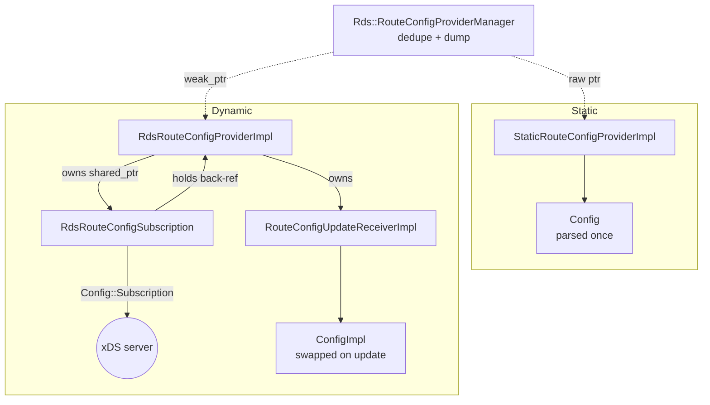
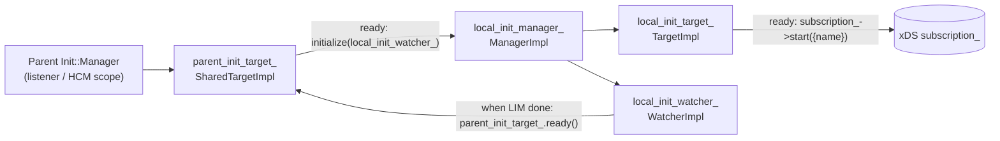
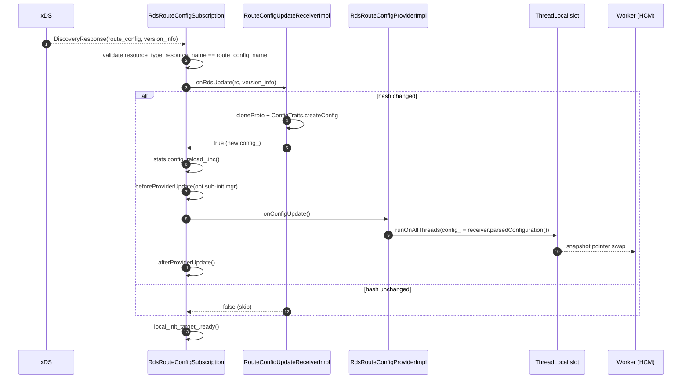

# RDS — Architecture and layering

This document explains *why* the `source/common/rds/` folder looks the way it does. It's a single overview because the
folder is small (~750 lines) but every piece interacts with every other piece, so the diagrams matter more than the
prose.

---

## The four roles

Every dynamic route configuration in Envoy is constructed by **four collaborating objects**, each with a single
responsibility:

| Role                | Class                              | Owns                                                          |
|---------------------|------------------------------------|---------------------------------------------------------------|
| **Provider**        | `RdsRouteConfigProviderImpl`       | a thread-local `ConfigConstSharedPtr`; read by HCM            |
| **Subscription**    | `RdsRouteConfigSubscription`       | the xDS stream + `Init::Target` that gates server startup     |
| **Update receiver** | `RouteConfigUpdateReceiverImpl`    | the last accepted proto + parsed `ConfigImpl` + hash          |
| **Manager**         | `Rds::RouteConfigProviderManager`  | dedupe map + `/config_dump` + static-provider book-keeping    |

A **static** provider uses only `StaticRouteConfigProviderImpl` and the manager — no subscription, no receiver.



Two HCMs that point at the same `(ConfigSource, route_config_name)` share **the same** `RdsRouteConfigProviderImpl` and
`RdsRouteConfigSubscription`. That's why the receiver is owned by the provider (one parsed `Config`) and the manager
only holds a `weak_ptr` (so destruction of the last HCM destroys everything).

---

## The trait layer (`common/`)

The inner skeleton (`Rds::RouteConfigProviderManager`, `RdsRouteConfigSubscription`, …) knows nothing about
`envoy.config.route.v3.RouteConfiguration`. It only knows:

- the protobuf **descriptor** for the resource (to compute resource type URLs);
- which **field number** carries the route configuration's `name` (so it can validate `resourceName(...) == expected`);
- how to **parse** an arbitrary proto into a `Config` (the abstract base for HTTP/Thrift/etc. `RouteConfig` objects).

Those three concerns are the `ProtoTraits`, the receiver's hash check, and the `ConfigTraits` respectively. They are
plugged in by `common/proto_traits_impl.h` and `common/config_traits_impl.h`:

```cpp
template <class RouteConfiguration, int NameFieldNumber>
class ProtoTraitsImpl : public ProtoTraits {
  // resourceType() = descriptor->full_name()
  // resourceNameFieldNumber() = NameFieldNumber
};

template <class RouteConfiguration, class ConfigImpl, class NullConfigImpl>
class ConfigTraitsImpl : public ConfigTraits {
  ConfigConstSharedPtr createNullConfig() const override;          // empty fallback
  ConfigConstSharedPtr createConfig(const Protobuf::Message& rc,
                                    ServerFactoryContext& ctx,
                                    bool validate_clusters_default) const override;
};
```

The HTTP RDS code then wires it all together in one line:

```cpp
using HttpRouteConfigProviderManagerImpl =
    Rds::Common::RouteConfigProviderManagerImpl<
        envoy::extensions::filters::network::http_connection_manager::v3::Rds,
        envoy::config::route::v3::RouteConfiguration,
        /*NameFieldNumber=*/1,
        Router::ConfigImpl,
        Router::NullConfigImpl>;
```

This template binds:

- the **Rds proto** (carries `config_source` + `route_config_name`),
- the **RouteConfiguration proto** (the actual config),
- the **ConfigImpl** (HTTP `Router::ConfigImpl` is the heavy lifter — virtual hosts, routes, retries, etc.),
- and a **NullConfigImpl** that returns "no route" while waiting for the first xDS response.

Thrift and generic-proxy follow the exact same recipe with their own protos.

---

## The two init-manager pattern

`RdsRouteConfigSubscription` participates in **two** init managers:



Why two layers?

1. **Parent target** sits in the listener's / HCM's init manager. As long as it is not "ready", the listener cannot
   accept traffic — RDS must produce a config (or time out) first.
2. **Local manager** lets extensions add **sub-resources** (e.g. VHDS on top of RDS, scoped-RDS sub-subscriptions).
   Those sub-resources call `beforeProviderUpdate(noop_init_manager, resume_rds)` to enrol additional init targets
   under the same local manager.
3. **Local watcher** transitions parent to ready exactly once, after every local target has reported.

The destructor's `local_init_target_.ready()` call (with a comment "if we get destroyed during initialization, make
sure we signal that we initialized") is the escape hatch that prevents a half-built subscription from wedging server
startup.

---

## The TLS swap (data path)

`RdsRouteConfigProviderImpl` holds:

```cpp
ThreadLocal::TypedSlot<ThreadLocalConfig> tls_;
struct ThreadLocalConfig {
  ConfigConstSharedPtr config_;
};
```

When a worker thread serves a request, the HCM calls `provider->config()` and gets `tls_->config_` — a `shared_ptr` to
an immutable `Config` snapshot. **No locks.** On xDS update the main thread calls `tls_.runOnAllThreads([new_config])`,
which atomically swaps each worker's `config_` pointer. In-flight requests keep their old `shared_ptr` alive via copy.

That is the **only** data-path interaction with this folder. Every other line of code in `source/common/rds/` runs on
the main thread.

---

## The dedupe key

`RouteConfigProviderManager::addDynamicProvider()` derives the dedupe key as `MessageUtil::hash(rds)` after **clearing
`initial_fetch_timeout`**:

```cpp
auto* orig_initial_timeout =
    const_cast<RdsConfig&>(rds).mutable_config_source()->release_initial_fetch_timeout();
const uint64_t manager_identifier = MessageUtil::hash(rds);
const_cast<RdsConfig&>(rds).mutable_config_source()->set_allocated_initial_fetch_timeout(
    orig_initial_timeout);
```

Why? Two HCMs may legitimately disagree about *how long they're willing to wait at startup* without disagreeing about
*which* RDS resource they want. Folding `initial_fetch_timeout` into the hash would force each to have its own
subscription, defeating the dedupe.

The const-cast is ugly but local — the proto is returned to its caller untouched.

---

## Update flow on the wire



The receiver gets to decide whether the update is "real" — if the new proto hashes identically to the previous one, it
short-circuits and `onConfigUpdate()` is not called on the provider. This avoids paying for a parse + TLS-swap on a
spurious update.

`beforeProviderUpdate` / `afterProviderUpdate` are `virtual` no-ops in this folder, overridden by HTTP RDS to add VHDS
subscriptions under the same local init manager.

---

## What this folder explicitly does **not** do

- It does **not** parse `RouteConfiguration` itself. That is the job of `Router::ConfigImpl`
  (HTTP), `Thrift::RouteConfigImpl`, etc.
- It does **not** evaluate routes. The data-path `route()` calls live on `Config` implementations outside this folder.
- It does **not** implement VHDS, scoped RDS, or on-demand RDS. Those build on top by subclassing
  `RdsRouteConfigSubscription` and overriding `beforeProviderUpdate` / `afterProviderUpdate`.
- It does **not** handle removal of dynamic RDS resources via delta-xDS. The comment in
  `rds_route_config_subscription.cc` is explicit: "Ignoring. TODO(#2500) when on-demand resource loading is supported,
  an RDS removal may make sense."

Keep that scope narrow as you read the rest of the deep dives.
