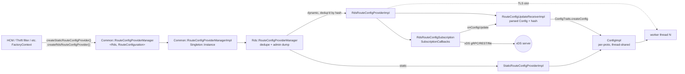
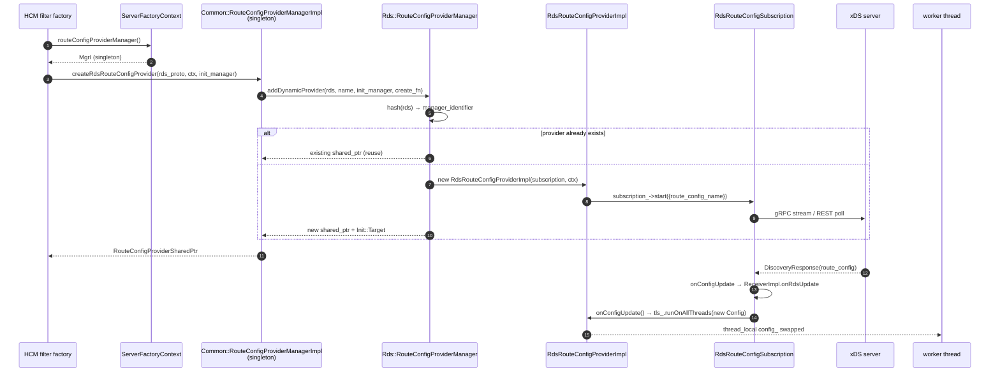

# `source/common/rds/` — protocol-agnostic Route Discovery Service

This folder contains the **generic, protocol-agnostic skeleton** for Envoy's Route Discovery Service (RDS). It is the
machinery that turns a `ConfigSource` (xDS endpoint) plus a route configuration name into a thread-local, hot-reloadable
`Config` object that filters and HCM-style codecs can read on the data path.

The folder is deliberately templated and abstract: the **wire types** (`envoy.config.route.v3.RouteConfiguration` for
HTTP, `envoy.extensions.filters.network.thrift_proxy.v3.RouteConfiguration` for Thrift, the SRDS/VHDS variants, etc.)
all live in their own filter folders. They wire those types into this skeleton via the small `common/` sub-folder
of templates.

> **TL;DR** — this folder owns:
> - the **provider** abstraction (`StaticRouteConfigProviderImpl`, `RdsRouteConfigProviderImpl`),
> - the **subscription** that talks xDS (`RdsRouteConfigSubscription`),
> - the **update receiver** that holds the latest parsed config (`RouteConfigUpdateReceiverImpl`),
> - the **manager** that dedupes providers, owns lifetime, and dumps admin state (`RouteConfigProviderManager`),
> - and a small `common/` template layer that adapts the skeleton to a concrete proto.

---

## Folder map

```
source/common/rds/
├── BUILD
├── rds_route_config_provider_impl.{h,cc}   # dynamic provider — thread-local Config, owned by HCM
├── rds_route_config_subscription.{h,cc}    # xDS SubscriptionCallbacks — RDS over gRPC / REST / file
├── route_config_provider_manager.{h,cc}    # dedupe + ownership + admin /config_dump
├── route_config_update_receiver_impl.{h,cc}# latest accepted RouteConfig + hash + parsed Config
├── static_route_config_provider_impl.{h,cc}# static provider — single Config, no subscription
├── util.{h,cc}                              # cloneProto / resourceName helpers
└── common/
    ├── config_traits_impl.h                # ConfigTraits adapter (proto → ConfigImpl)
    ├── proto_traits_impl.h                 # ProtoTraits adapter (descriptor + resource_name field)
    ├── route_config_provider_manager.h     # public templated interface used by FactoryContext
    └── route_config_provider_manager_impl.h# single Singleton::Instance per concrete proto
```

The **interfaces** (`RouteConfigProvider`, `RouteConfigUpdateReceiver`, `ConfigTraits`, `ProtoTraits`) all live under
`envoy/rds/`; this folder is the **only** implementation of those interfaces.

---

## Per-topic table

| Topic                                | Document                                                        | Source                                                       |
|--------------------------------------|-----------------------------------------------------------------|--------------------------------------------------------------|
| Architecture & layering              | [`OVERVIEW.md`](OVERVIEW.md)                                    | how everything fits together                                 |
| Class hierarchy (UML)                | [`CLASS_HIERARCHY.md`](CLASS_HIERARCHY.md)                      | every class in this folder, one canvas                       |
| Manager & dedupe                     | [`route_config_provider_manager.md`](route_config_provider_manager.md) | `route_config_provider_manager.{h,cc}` + `common/`         |
| Dynamic provider (RDS over xDS)      | [`rds_route_config_subscription.md`](rds_route_config_subscription.md) | `rds_route_config_subscription.{h,cc}` + `rds_route_config_provider_impl.{h,cc}` |
| Static & update receiver             | [`static_and_update_receiver.md`](static_and_update_receiver.md)| `static_route_config_provider_impl.{h,cc}` + `route_config_update_receiver_impl.{h,cc}` |

---

## Big picture



The **`Common::*Impl`** template binds a specific proto (e.g. `envoy::extensions::filters::network::http_connection_manager::v3::Rds`)
to the inner skeleton; the inner `Rds::RouteConfigProviderManager` doesn't know what the route configuration looks like
— it only knows the proto descriptor and how to hash it.

---

## How an HCM gets a `Config`



The **dedupe by hash** at step 5 is the central invariant: two HCMs that point at the same RDS resource on the same
control plane share one subscription and one `Config` snapshot. If they differ even by one field of the `ConfigSource`
(other than `initial_fetch_timeout`, which is explicitly normalized away), they get distinct providers.

---

## Relationships with the rest of Envoy

| Depends on                          | Why                                                                  |
|-------------------------------------|----------------------------------------------------------------------|
| `envoy/rds/*` interfaces            | every class here implements one of those PURE interfaces             |
| `source/common/config/`             | `subscriptionFromConfigSource()`, `OpaqueResourceDecoderImpl`        |
| `source/common/init/`               | `ManagerImpl`, `TargetImpl`, `WatcherImpl` — RDS blocks startup     |
| `source/common/thread_local/`       | `TypedSlot<ThreadLocalConfig>` — read-only snapshot per worker       |
| `source/common/protobuf/`           | `MessageUtil::hash`, `createReflectableMessage`                      |
| `source/common/runtime/`            | `xdstp_based_config_singleton_subscriptions` feature flag           |
| `envoy/server/admin.h`              | `/config_dump` integration for static + dynamic route configs       |

| Used by                                                       | What it pulls                                                   |
|--------------------------------------------------------------|-----------------------------------------------------------------|
| `extensions/filters/network/http_connection_manager/`         | HTTP RDS — wires `envoy.config.route.v3.RouteConfiguration`     |
| `extensions/filters/network/thrift_proxy/`                    | Thrift RDS                                                      |
| `extensions/filters/network/generic_proxy/`                   | Generic-proxy RDS                                               |
| `source/common/router/`                                       | parsed `ConfigImpl` (HTTP) lives outside this folder            |

---

## Quick reading order for a new engineer

1. **[`OVERVIEW.md`](OVERVIEW.md)** — concepts and ownership graph in one place.
2. **[`route_config_provider_manager.md`](route_config_provider_manager.md)** — how dedupe and admin dump work.
3. **[`rds_route_config_subscription.md`](rds_route_config_subscription.md)** — the xDS-facing object; understand the
   double init-manager dance and the TLS swap.
4. **[`static_and_update_receiver.md`](static_and_update_receiver.md)** — the two boring-but-essential objects.
5. **[`CLASS_HIERARCHY.md`](CLASS_HIERARCHY.md)** — visual checkpoint at the end.
