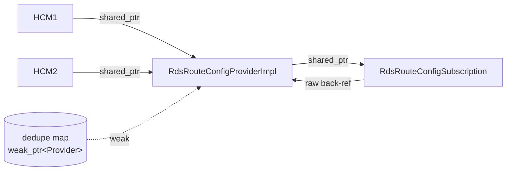
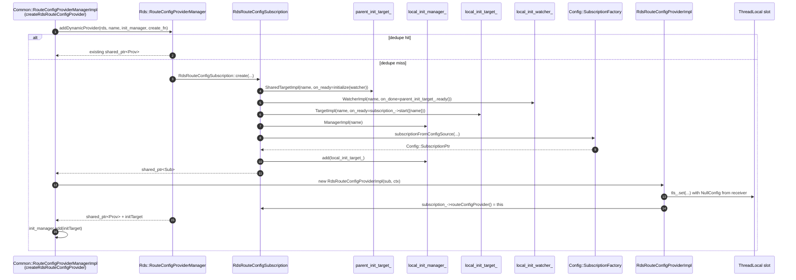
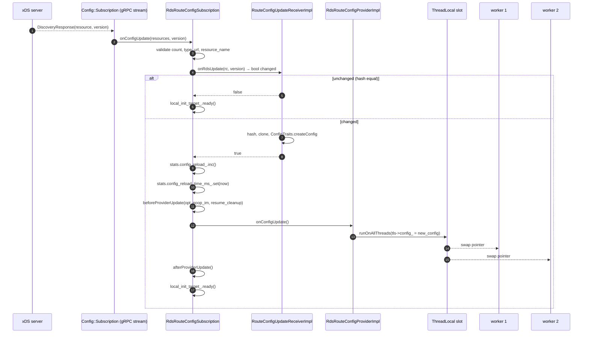

# `rds_route_config_subscription.{h,cc}` + `rds_route_config_provider_impl.{h,cc}`

The two halves of a **dynamic** RDS provider. The split is intentional:

- **`RdsRouteConfigSubscription`** is the xDS-facing half — it implements `Envoy::Config::SubscriptionCallbacks`,
  owns the `Init::Target` that gates server startup, and translates the wire-format payload into a parsed `Config`.
- **`RdsRouteConfigProviderImpl`** is the worker-facing half — it implements `RouteConfigProvider`, holds the
  thread-local `Config` snapshot, and swaps it across all workers when the subscription gets a new accepted update.

Both are dedicately on the **main thread** for every method except `RdsRouteConfigProviderImpl::config()`, which is the
single hot data-path call.

## Why two classes and not one?

The subscription is a heavyweight object (`SubscriptionPtr`, three init pieces, stats scope) and must outlive any HCM
that uses it. The provider is the per-HCM shared handle. Splitting them lets the manager's dedupe map hold a
`shared_ptr<RdsRouteConfigSubscription>` *implicitly* through the provider:



The 1:1 invariant — *every subscription has exactly one provider* — is asserted in both the constructor and
destructor of the provider.

## Public surface

### `RdsRouteConfigSubscription`

```cpp
class RdsRouteConfigSubscription : Envoy::Config::SubscriptionCallbacks,
                                   protected Logger::Loggable<Logger::Id::rds> {
public:
  static absl::StatusOr<std::unique_ptr<RdsRouteConfigSubscription>> create(...);
  ~RdsRouteConfigSubscription() override;

  RouteConfigProvider*&    routeConfigProvider();     // installed by the provider
  RouteConfigUpdatePtr&    routeConfigUpdate();       // for the provider to borrow
  const Init::Target&      initTarget();              // parent's init manager adds this
protected:
  virtual absl::Status beforeProviderUpdate(std::unique_ptr<Init::ManagerImpl>&,
                                            std::unique_ptr<Cleanup>&);
  virtual absl::Status afterProviderUpdate();
private:
  // SubscriptionCallbacks
  absl::Status onConfigUpdate(resources, version_info) override;     // SOTW
  absl::Status onConfigUpdate(added, removed, system_version) override; // delta
  void         onConfigUpdateFailed(reason, exception) override;
};
```

### `RdsRouteConfigProviderImpl`

```cpp
class RdsRouteConfigProviderImpl : public RouteConfigProvider,
                                   Logger::Loggable<Logger::Id::router> {
public:
  RdsRouteConfigProviderImpl(RdsRouteConfigSubscriptionSharedPtr&& subscription,
                             Server::Configuration::ServerFactoryContext& factory_context);
  ~RdsRouteConfigProviderImpl() override;

  RdsRouteConfigSubscription& subscription() { return *subscription_; }

  // RouteConfigProvider
  ConfigConstSharedPtr   config() const override { return tls_->config_; }   // data path
  const absl::optional<ConfigInfo>& configInfo() const override;
  SystemTime             lastUpdated() const override;
  absl::Status           onConfigUpdate() override;                          // TLS swap
};
```

The destructor is the load-bearing detail: it nulls out `subscription_->routeConfigProvider()` and then
`subscription_` (the shared_ptr member) drops. If this is the **last** reference, the subscription destructs and
`eraseDynamicProvider` runs on the manager. The TLS slot is destructed first, but in-flight requests on workers are
safe because each one holds a `shared_ptr<const Config>` copy.

## Construction sequence



The subscription's `subscription_->start({route_config_name_})` is **not** invoked during construction. It only runs
when the listener's init manager fires its targets, which in turn calls the local_init_target_'s callback. This delays
the first xDS request until the server is ready to receive responses.

## Update path



Five things to notice:

1. **Validation before parsing.** The subscription checks the wire-format type matches the bound `resourceType()` and
   the resource's name field equals the subscribed name. A mismatch is an `InvalidArgumentError` returned to xDS — the
   stream stays open and the next push gets another chance.
2. **Hash short-circuit.** If the new payload hashes identically to the previous one, the receiver returns `false` and
   the provider is not touched. Stats `config_reload` is **not** bumped; only "real" reloads count.
3. **`beforeProviderUpdate` / `afterProviderUpdate`** are virtual hooks. The base returns `OkStatus()`. HTTP VHDS
   overrides them to spin up a sub-init-manager and pause the RDS subscription while VHDS catches up.
4. **TLS swap is fire-and-forget.** `runOnAllThreads` posts a closure to each worker dispatcher. Workers may briefly
   see the old config — that's fine, the parsed `Config` is immutable and the in-flight requests already snapshotted
   it via `RouteConfigProvider::config()`.
5. **`local_init_target_.ready()` runs even on empty / unchanged updates.** It's the unconditional "we heard from
   xDS at least once, listener may stop waiting" signal.

## Delta-xDS handling

```cpp
absl::Status onConfigUpdate(added, removed, system_version) override {
  if (!removed_resources.empty()) {
    ENVOY_LOG(trace, "... attempting to remove a resource ... Ignoring.");
  }
  if (!added_resources.empty()) {
    return onConfigUpdate(added_resources, added_resources[0].get().version());
  }
  return absl::OkStatus();
}
```

Removal is **explicitly ignored** today (with a TODO referencing #2500 and #6879). Until on-demand RDS lands, deleting
an RDS resource leaves the existing `Config` in place — there is no "go back to no routes" behaviour.

## Failure path

```cpp
void onConfigUpdateFailed(reason, exception) {
  ASSERT(reason != ConnectionFailure);   // connection failures don't surface here
  local_init_target_.ready();            // unblock startup anyway
}
```

The assertion holds because `ConnectionFailure` is consumed entirely inside the subscription factory's retry loop — by
the time the callback fires here, the error is "real" (e.g. malformed payload, decode failure). The behaviour is to
log + unblock: a bad initial RDS payload must not deadlock server startup.

## Provider-side thread-local snapshot

```cpp
struct ThreadLocalConfig : public ThreadLocal::ThreadLocalObject {
  ThreadLocalConfig(std::shared_ptr<const Config> initial_config) : config_(std::move(initial_config)) {}
  ConfigConstSharedPtr config_;
};
```

The slot is initialized in the provider's constructor with the receiver's **current** `parsedConfiguration()` — that
is either the `NullConfigImpl` (no xDS response yet) or the most recently accepted real config (in the reuse case).

Reads (`config()`) are a plain `tls_->config_` access — no atomic, no lock, no copy. The `shared_ptr` is held by-value
in the slot, so a concurrent `runOnAllThreads` swap doesn't tear it: each worker thread observes either the old or
the new pointer, never a mix.

## Destruction race-safety

```cpp
RdsRouteConfigSubscription::~RdsRouteConfigSubscription() {
  local_init_target_.ready();                                       // (1) unblock startup
  route_config_provider_manager_.eraseDynamicProvider(manager_identifier_);  // (2) erase weak_ptr
}
```

The order matters:

1. If we are destroyed mid-init (e.g. listener teardown during draining), some init manager may still be waiting on
   `parent_init_target_`. The `local_init_target_.ready()` call propagates up through the watcher and unsticks it.
2. The manager's `weak_ptr` is cleaned up *after* the unblock so that no other code path expects to find us in the map
   during the unblock.

Symmetrically, the provider's destructor first detaches from the subscription (`subscription_->routeConfigProvider() =
nullptr`), then lets `subscription_` (the shared_ptr) drop. If we held the last reference, **that** drop triggers the
subscription destructor above.

## Subclass extension points

- **VHDS** subclasses `RdsRouteConfigSubscription`, overrides `beforeProviderUpdate` to enrol a VHDS subscription into
  a fresh `Init::ManagerImpl`, and uses the `Cleanup` parameter to defer resuming xDS until VHDS catches up.
- **Scoped RDS** wraps this class entirely and presents its own `RouteConfigProvider`-like interface to the HCM,
  delegating to a map of these subscriptions keyed by scope.

Neither lives in this folder; both treat this file as a stable base class.
