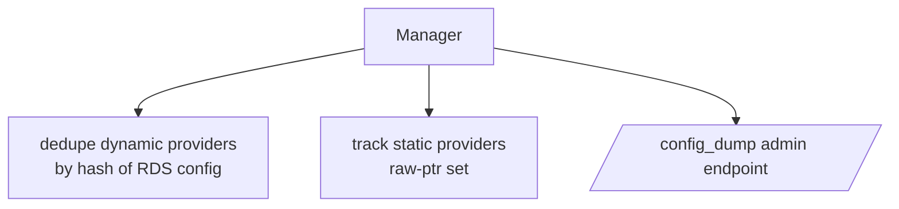
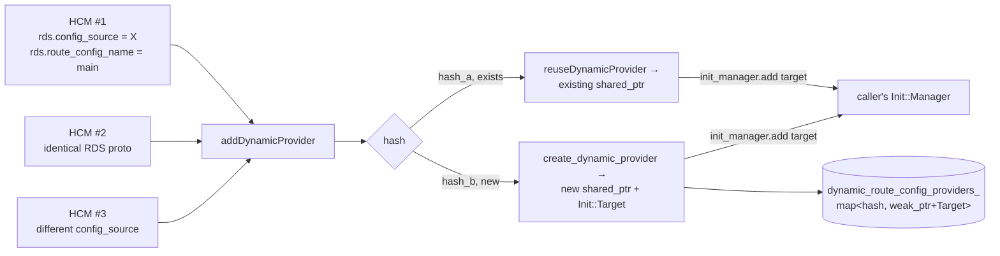
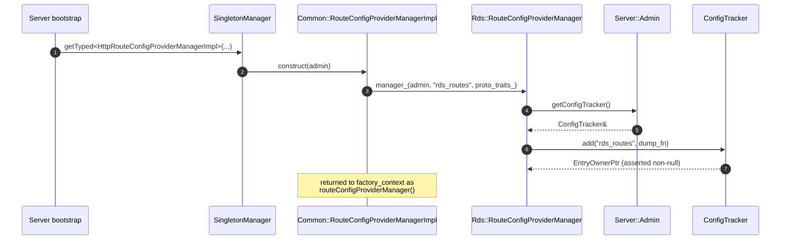
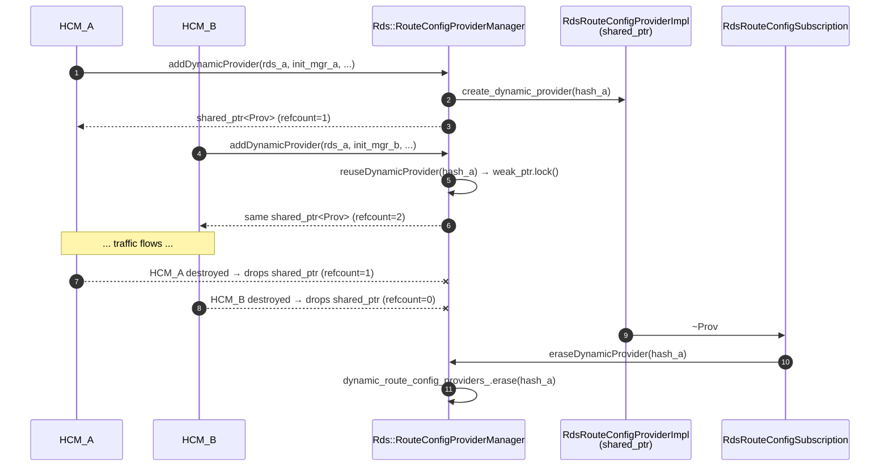

# `route_config_provider_manager.{h,cc}` + `common/route_config_provider_manager*.h`

Two layers of the same concept:

- **`Rds::RouteConfigProviderManager`** — inner skeleton, knows nothing about a specific proto. Owns the dedupe map,
  the static-provider set, and the `/config_dump` entry.
- **`Common::RouteConfigProviderManager<Rds, RouteConfiguration>`** + **`Common::RouteConfigProviderManagerImpl<...>`**
  — the templated layer that binds the skeleton to a concrete protobuf. The HCM, the Thrift filter, the
  generic-proxy filter, etc. each instantiate one as a `Singleton::Instance`.

## Public surface

### Inner skeleton

```cpp
class RouteConfigProviderManager {
public:
  RouteConfigProviderManager(OptRef<Server::Admin> admin,
                             const std::string& config_tracker_key,
                             ProtoTraits& proto_traits);

  void eraseStaticProvider(RouteConfigProvider* provider);
  void eraseDynamicProvider(uint64_t manager_identifier);

  ProtoTraits& protoTraits() { return proto_traits_; }

  std::unique_ptr<envoy::admin::v3::RoutesConfigDump>
  dumpRouteConfigs(const Matchers::StringMatcher& name_matcher) const;

  RouteConfigProviderPtr
  addStaticProvider(std::function<RouteConfigProviderPtr()> create_static_provider);

  template <class RdsConfig>
  RouteConfigProviderSharedPtr addDynamicProvider(
      const RdsConfig& rds, const std::string& route_config_name,
      Init::Manager& init_manager,
      std::function<absl::StatusOr<std::pair<RouteConfigProviderSharedPtr,
                                             const Init::Target*>>(uint64_t)>
          create_dynamic_provider);
};
```

### Templated outer layer

```cpp
template <class Rds, class RouteConfiguration>
class RouteConfigProviderManager {           // common/route_config_provider_manager.h
  virtual RouteConfigProviderSharedPtr createRdsRouteConfigProvider(...) PURE;
  virtual RouteConfigProviderPtr      createStaticRouteConfigProvider(...) PURE;
};

template <class Rds, class RouteConfiguration, int NameFieldNumber,
          class ConfigImpl, class NullConfigImpl>
class RouteConfigProviderManagerImpl : public RouteConfigProviderManager<Rds, RouteConfiguration>,
                                       public Singleton::Instance { ... };
```

The HTTP RDS instantiation is the canonical example:

```cpp
using HttpRouteConfigProviderManagerImpl = Rds::Common::RouteConfigProviderManagerImpl<
    envoy::extensions::filters::network::http_connection_manager::v3::Rds,
    envoy::config::route::v3::RouteConfiguration,
    /*NameFieldNumber=*/1,
    Router::ConfigImpl,
    Router::NullConfigImpl>;
```

## Three jobs



### 1) Dedupe dynamic providers



The dedupe key normalization (clear-then-restore of `initial_fetch_timeout`) is explained in
[`OVERVIEW.md`](OVERVIEW.md#the-dedupe-key).

A few subtle invariants worth pointing out:

- The map holds a **`weak_ptr`** — the manager does **not** keep the provider alive. As soon as the last HCM drops its
  `shared_ptr`, `~RdsRouteConfigSubscription` runs and calls `eraseDynamicProvider(manager_identifier_)`. The map
  entry vanishes.
- `reuseDynamicProvider()` always calls `init_manager.add(*target)`. **Even on reuse**, the new HCM must wait for the
  subscription's parent init target. This is correct: a second HCM still needs the first xDS response before serving
  traffic.
- The comment in the code is load-bearing: *"Because the RouteConfigProviderManager's weak_ptrs only get cleaned up in
  the RdsRouteConfigSubscription destructor, and the single threaded nature of this code, locking the weak_ptr will
  not fail."* — `lock()` is asserted, not handled. Everything in this file runs on the **main thread**.

### 2) Track static providers

Static providers are kept as raw pointers in `absl::node_hash_set<RouteConfigProvider*>`. There is no dedupe — every
call to `createStaticRouteConfigProvider` returns a fresh `unique_ptr`. Cleanup happens in
`~StaticRouteConfigProviderImpl` via `eraseStaticProvider(this)`.

### 3) `/config_dump`

The manager registers a callback with `Server::Admin::getConfigTracker()` under a key derived from the proto descriptor
name:

```cpp
absl::AsciiStrToLower(getRdsName()) + "_routes"
// e.g. "rds_routes", "thriftrouterouting_routes", ...
```

`dumpRouteConfigs(matcher)` walks both the dynamic map and the static set, applying the name filter and packing each
config into an `envoy.admin.v3.RoutesConfigDump`. Each dynamic entry carries its `version_info` (from the xDS update),
each static entry just the proto and its `last_updated` timestamp.

## Construction sequence



The `RELEASE_ASSERT(config_tracker_entry_, "")` enforces *one manager per RDS proto type per process*. If two filters
both try to register `"rds_routes"`, the second `add()` returns null and the server aborts.

## Lifetime



That cleanup chain is the **only** reason it's safe for the manager to hold `weak_ptr` without a periodic sweep.

## Templated outer layer in detail

`Common::RouteConfigProviderManagerImpl` is a single class that:

1. Reflects on the `Rds` proto's descriptor to derive the config-tracker key (`"<rdsName>_routes"`).
2. Asserts at template-instantiation time that the `RouteConfiguration` proto has a field at `NameFieldNumber`.
3. Implements `createRdsRouteConfigProvider` by:
   - constructing a `RouteConfigUpdateReceiverImpl` with the bound traits;
   - constructing an `OpaqueResourceDecoderImpl<RouteConfiguration>` with the resolved name-field name;
   - delegating to the inner manager's `addDynamicProvider(...)`.
4. Implements `createStaticRouteConfigProvider` by delegating to `addStaticProvider(...)` with a closure that builds a
   `StaticRouteConfigProviderImpl` from the bound `ConfigTraitsImpl`.

It is registered as a `Singleton::Instance` so that there is **exactly one** of them per RDS proto type per server,
matching the `RELEASE_ASSERT` above.

## Common pitfalls

| Pitfall                                                       | What actually happens                                                      |
|---------------------------------------------------------------|----------------------------------------------------------------------------|
| Two extensions trying to use the same RDS proto type          | Second `Singleton::getTyped` returns the existing instance → dedupe works. |
| Two extensions defining different RDS protos with same name   | `RELEASE_ASSERT` in inner manager fires — server crashes at startup.       |
| Removing an RDS resource via delta-xDS                        | Ignored with a `trace`-level log; provider keeps last config. (TODO #2500) |
| RDS resource name in payload ≠ subscribed name                | `onConfigUpdate` returns `InvalidArgumentError`; subscription stays open.  |
| HCM destroyed mid-init                                        | `local_init_target_.ready()` in `~RdsRouteConfigSubscription` unsticks it. |
