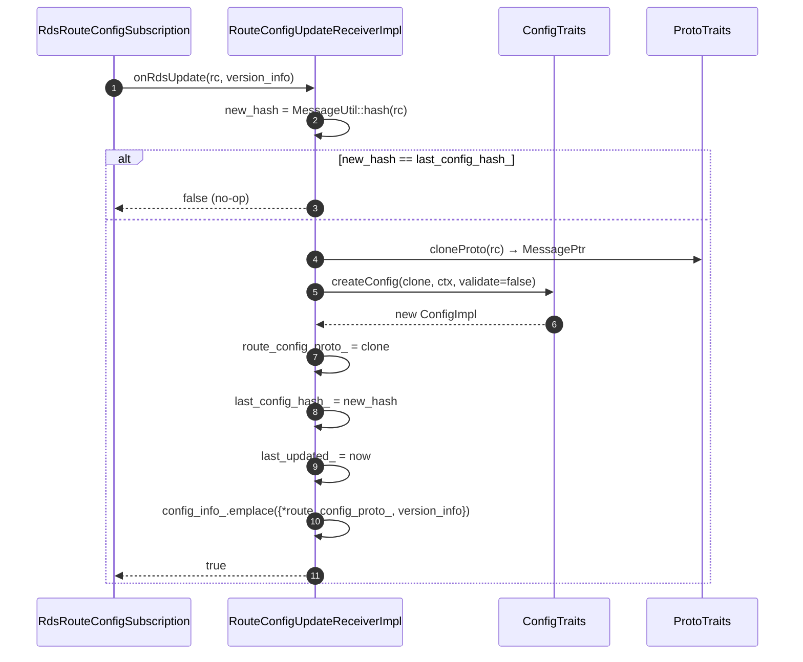
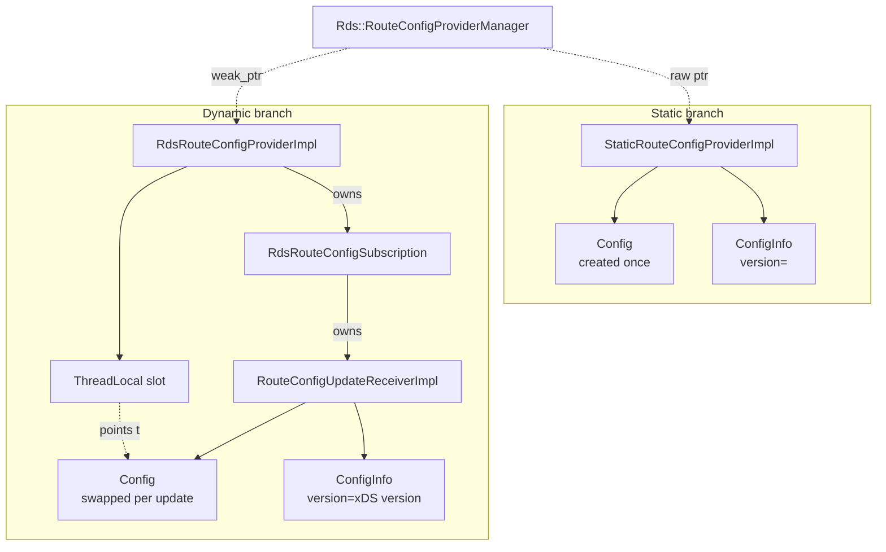

# `static_route_config_provider_impl.{h,cc}` + `route_config_update_receiver_impl.{h,cc}`

These are the two "small" classes in the folder. Together they cover:

- **What an HCM gets when its route configuration is inline** (`StaticRouteConfigProviderImpl`).
- **What the dynamic provider's subscription actually stores between xDS pushes** (`RouteConfigUpdateReceiverImpl`).

Both interact only through the traits layer (`ConfigTraits`, `ProtoTraits`) and a tiny amount of timestamp/hash glue,
which makes them excellent first-reads for understanding how the protocol-agnostic skeleton meets a concrete proto.

---

## `StaticRouteConfigProviderImpl`

```cpp
class StaticRouteConfigProviderImpl : public RouteConfigProvider {
public:
  StaticRouteConfigProviderImpl(const Protobuf::Message& route_config_proto,
                                ConfigTraits& config_traits,
                                Server::Configuration::ServerFactoryContext& factory_context,
                                RouteConfigProviderManager& route_config_provider_manager);
  ~StaticRouteConfigProviderImpl() override;

  ConfigConstSharedPtr config() const override            { return config_; }
  const absl::optional<ConfigInfo>& configInfo() const    { return config_info_; }
  SystemTime lastUpdated() const override                 { return last_updated_; }
  absl::Status onConfigUpdate() override                  { return absl::OkStatus(); }
};
```

### What it does

It is the **simplest possible** `RouteConfigProvider`:

```mermaid
flowchart LR
    HCM[HCM with inline route_config] -->|createStaticRouteConfigProvider| MgrI[Common::Mgr]
    MgrI -->|addStaticProvider| Mgr[Rds::Mgr]
    Mgr -->|create_static_provider closure| New[new StaticRouteConfigProviderImpl]
    New --> Proto[cloneProto via proto_traits]
    New --> Cfg[ConfigTraits.createConfig<br/>validate_unknown_cluster=true]
    New --> Tstamp[last_updated_ = now]
    New --> Info[ConfigInfo{proto, version_=""}]
    Mgr -.raw ptr.-> Set[(static_route_config_providers_)]
    HCM -.unique_ptr.-> New
```

The constructor is the only place anything happens. It:

1. **Clones** the proto via `cloneProto(proto_traits, route_config_proto)`. The original came from the bootstrap or
   listener proto and must not be aliased.
2. **Parses** it via `ConfigTraits::createConfig(...)`. Crucially this passes `validate_clusters_default = true` —
   static routes are eager about catching configuration errors at boot.
3. **Snapshots** the construction time as `last_updated_` and builds a `ConfigInfo` with **empty `version_`** (static
   configs have no xDS version).

There is no subscription, no init target, no thread-local slot. `config()` returns the same `shared_ptr` for the
lifetime of the object — workers always see the same `Config`. Updates are impossible (`onConfigUpdate` is a no-op
returning `OkStatus`).

### Lifetime

The destructor calls `route_config_provider_manager_.eraseStaticProvider(this)`. The manager held only a raw pointer,
so this is the cleanup hook. The unique_ptr is owned by the HCM filter; when the listener (and its HCM) is destroyed,
the static provider goes with it.

### Why `validate_clusters_default = true` for static and `false` for dynamic?

For static routes, all clusters referenced **must** already exist in the bootstrap. There is no "wait, the cluster is
about to arrive via CDS" excuse. For dynamic RDS, the cluster might be pending CDS — failing the config on missing
clusters would create startup-order coupling between CDS and RDS. The receiver therefore passes `false`.

---

## `RouteConfigUpdateReceiverImpl`

```cpp
class RouteConfigUpdateReceiverImpl : public RouteConfigUpdateReceiver {
public:
  RouteConfigUpdateReceiverImpl(ConfigTraits&, ProtoTraits&,
                                Server::Configuration::ServerFactoryContext&);

  uint64_t getHash(const Protobuf::Message& rc) const { return MessageUtil::hash(rc); }
  bool checkHash(uint64_t new_hash) const              { return new_hash != last_config_hash_; }
  void updateHash(uint64_t hash)                       { last_config_hash_ = hash; }
  void updateConfig(std::unique_ptr<Protobuf::Message>&& route_config_proto);
  void onUpdateCommon(const std::string& version_info);

  // RouteConfigUpdateReceiver
  bool onRdsUpdate(const Protobuf::Message& rc, const std::string& version_info) override;

  uint64_t configHash() const override                 { return last_config_hash_; }
  const absl::optional<RouteConfigProvider::ConfigInfo>& configInfo() const override;
  const Protobuf::Message& protobufConfiguration() const override { return *route_config_proto_; }
  ConfigConstSharedPtr parsedConfiguration() const override       { return config_; }
  SystemTime lastUpdated() const override                          { return last_updated_; }
};
```

### What it does

It owns the **last accepted** RDS proto, its parsed `Config`, the rolling hash, and the timestamp. It does **not** own
any thread-local state, init target, or xDS handle — those belong to the subscription that owns the receiver.

Initial state:

- `route_config_proto_` = empty proto from `proto_traits_.createEmptyProto()` (a fresh `RouteConfiguration`).
- `config_` = `config_traits_.createNullConfig()` — the per-extension "no routes" fallback.
- `last_config_hash_ = 0`, `last_updated_ = {}`, `config_info_ = nullopt`.

That initial state is what the provider reads at construction time. Until the first successful xDS update, every
worker therefore serves traffic against the null config — which typically returns 404.

### Update flow



### Exception safety in `updateConfig`

```cpp
void updateConfig(std::unique_ptr<Protobuf::Message>&& route_config_proto) {
  config_ = config_traits_.createConfig(*route_config_proto, factory_context_, false);
  // If the above create config doesn't raise exception, update the
  // other cached config entries.
  route_config_proto_ = std::move(route_config_proto);
}
```

The comment is critical: **`createConfig` runs first**. If it throws (invalid cluster, bad header matcher, …), the
receiver's `route_config_proto_` is **not** updated. The hash is also not updated (that happens after `updateConfig`
returns in `onRdsUpdate`). The next push gets another chance, and `configHash()` still reports the previous successful
version. This is the entire reason `onRdsUpdate` is structured as:

```cpp
if (!checkHash(new_hash)) return false;
updateConfig(cloneProto(proto_traits_, rc));  // may throw
updateHash(new_hash);                          // only on success
onUpdateCommon(version_info);                  // only on success
return true;
```

### `ConfigInfo` semantics

```cpp
struct ConfigInfo {
  const Protobuf::Message& config_;
  std::string version_;
};
```

- `config_` is **a reference into `route_config_proto_`** — owned by the receiver. The admin dump packs this into an
  `Any`, so it's copied by `MessageUtil::packFrom` before being returned.
- `version_` is the xDS `version_info` (an opaque server-chosen string).

This is the only place `configInfo()` returns a non-empty optional: it's what the manager dumps to `/config_dump`.

---

## How they relate



Static = "construct once, store forever". Dynamic = "construct receiver once, swap config on each accepted update".
The traits layer hides the proto type from both branches, and the manager doesn't care which kind it's holding when
producing `/config_dump`.
