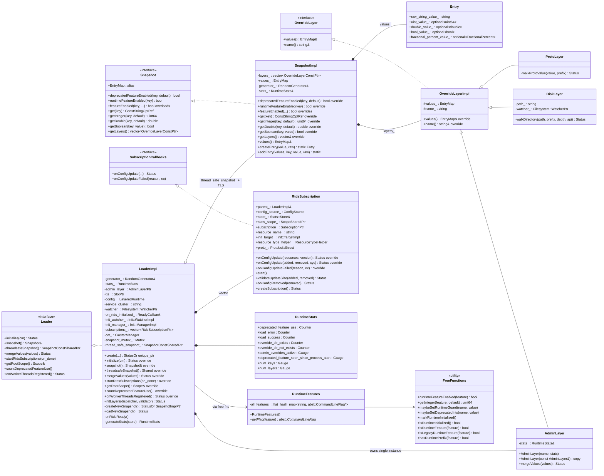

# Runtime — Class hierarchy (UML)

Every class declared in `source/common/runtime/` plus the closest interfaces from `envoy/runtime/runtime.h` and
`envoy/config/`.

## How to read it

- **Solid arrow with empty triangle (`<|..`)** — interface implementation.
- **Solid arrow with filled triangle (`<|--`)** — class inheritance.
- **Diamond (`*--`)** — strong ownership.
- **Open diamond (`o--`)** — non-owning (TLS slot pointer / mutex-guarded shared_ptr).

Three structural observations:

1. **One `Loader`, many snapshots.** `LoaderImpl` lives as long as the server. Each `SnapshotImpl` is created
   per-update and outlives in-flight reads on workers via its `shared_ptr` reference count.
2. **Layers are immutable post-construction.** `ProtoLayer` walks the input once; `DiskLayer` walks the filesystem
   once; `AdminLayer` is the only layer whose values mutate — and snapshots see a **copy** of it.
3. **`RuntimeFeatures` is independent of `LoaderImpl`.** The flag store is a `ConstSingleton` built from `absl::Flag`
   reflection; it works even before a loader exists (e.g. in unit tests that call `runtimeFeatureEnabled` without
   spinning up a `LoaderImpl`).
