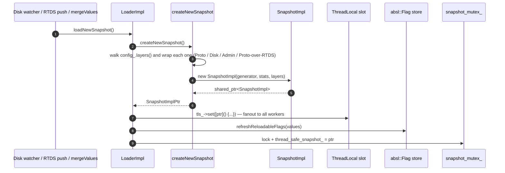
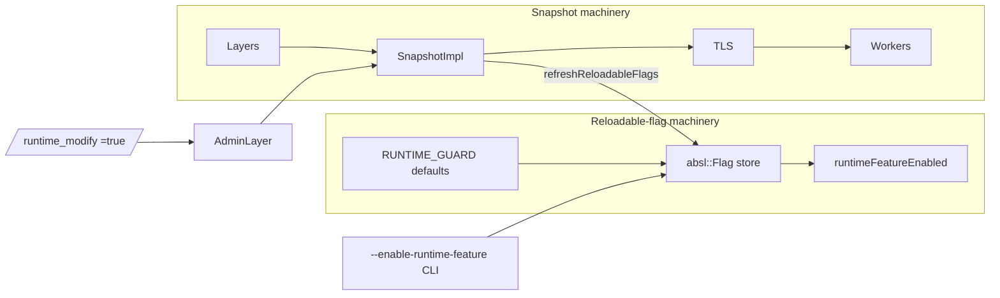
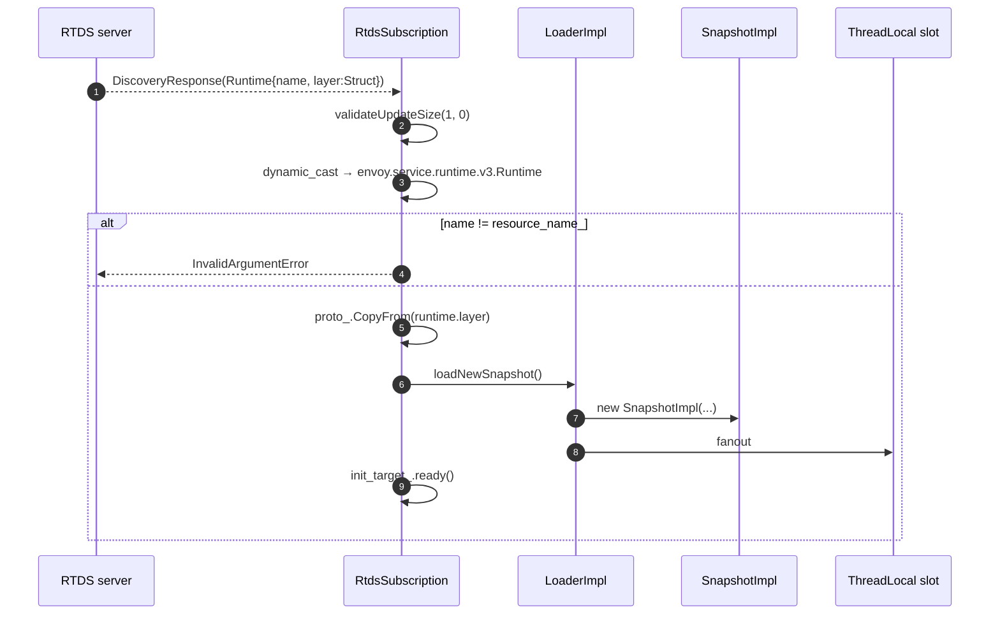

# Runtime — Architecture and layering

This document explains the shape of `source/common/runtime/`: the **layer** abstraction, the **snapshot** lifecycle,
the **two parallel state machines** for snapshots and reloadable flags, and the **bootstrap configuration** that ties
it all together.

---

## The four roles

| Role                    | Class(es)                                | Owns                                                                |
|-------------------------|------------------------------------------|---------------------------------------------------------------------|
| **Loader**              | `LoaderImpl`                             | layer list, snapshot TLS slot, RTDS init manager, admin merge       |
| **Layer**               | `ProtoLayer`, `DiskLayer`, `AdminLayer`  | a single `EntryMap` keyed by dotted path; constant once built       |
| **Subscription**        | `RtdsSubscription`                       | one RTDS xDS stream per `rtds_layer` entry; writes into a `Struct`  |
| **Snapshot**            | `SnapshotImpl`                           | the flattened, immutable read-side view that workers consume        |
| **Flag bridge**         | `RuntimeFeatures` + `runtime_features.cc`| the absl::Flag store; the only path between snapshots and the C++ `RUNTIME_GUARD` macros |

```mermaid
flowchart TB
    subgraph Build
        Cfg[Bootstrap layered_runtime] --> L0[Layer 0]
        Cfg --> L1[Layer 1]
        Cfg --> L2[...]
        Cfg --> Ln[Layer N]
    end
    subgraph Inputs
        L0 -.-> P[ProtoLayer<br/>static]
        L1 -.-> D[DiskLayer<br/>files]
        L2 -.-> A[AdminLayer<br/>/runtime_modify]
        Ln -.-> R[RtdsSubscription → ProtoLayer wrapper]
    end
    P --> Merge[SnapshotImpl ctor merges layers in order]
    D --> Merge
    A --> Merge
    R --> Merge
    Merge --> Snap[Immutable SnapshotImpl]
    Snap --> TLS[ThreadLocal slot]
    TLS --> Workers[Workers read via snapshot()]
    Snap --> Reflect[refreshReloadableFlags]
    Reflect --> Flags[absl::Flag store]
    Flags --> RFE[runtimeFeatureEnabled()]
```

---

## The layer abstraction

Every layer implements `Snapshot::OverrideLayer`:

```cpp
class OverrideLayer {
public:
  virtual const Snapshot::EntryMap& values() const PURE;
  virtual const std::string& name() const PURE;
};
```

`OverrideLayerImpl` is the common base — it owns a `values_` map and a `name_`. The three concrete layers differ
only in **how that map is populated**:

- **`ProtoLayer`** — walks a `Protobuf::Struct` (typed as `bool`, `number`, `string`, or nested `Struct`) and emits
  entries via `walkProtoValue`. Nested Structs are flattened into dotted keys (`{a:{b:1}}` → `"a.b": 1`).
- **`DiskLayer`** — walks a directory recursively (up to depth 16), reads each regular file, strips `#`-prefixed
  comment lines, and stores the contents under the path-derived dotted key.
- **`AdminLayer`** — starts empty; `/runtime_modify` POSTs into `mergeValues(map)` which parses each value as YAML
  (when YAML is compiled in) and inserts/erases.
- **`RtdsSubscription`** — not a layer itself, but writes its accepted resource into a `Protobuf::Struct` that gets
  wrapped in a fresh `ProtoLayer` on every snapshot rebuild.

```mermaid
flowchart LR
    Static[bootstrap.layered_runtime.layers[i].static_layer] --> PL[ProtoLayer]
    Path[bootstrap.layered_runtime.layers[i].disk_layer.symlink_root/...] --> DL[DiskLayer]
    Admin[bootstrap.layered_runtime.layers[i].admin_layer] --> AL[AdminLayer]
    Rtds[bootstrap.layered_runtime.layers[i].rtds_layer] --> Sub[RtdsSubscription]
    Sub -.proto_.-> Wrap[(ProtoLayer wrapping Sub.proto_)]
    PL --> Map1[EntryMap]
    DL --> Map2[EntryMap]
    AL --> Map3[EntryMap]
    Wrap --> Map4[EntryMap]
```

### Entry representation

```cpp
struct Snapshot::Entry {
  std::string raw_string_value_;
  absl::optional<uint64_t> uint_value_;
  absl::optional<double>   double_value_;
  absl::optional<bool>     bool_value_;
  absl::optional<envoy::type::v3::FractionalPercent> fractional_percent_value_;
};
```

`SnapshotImpl::createEntry` populates as many of these typed fields as possible from a single `Protobuf::Value`:

- A `number` value sets `double_value_` always, `bool_value_` if it's an integer, and `uint_value_` if it's
  non-negative within `uint64_t` range.
- A `string` value tries `absl::SimpleAtod` to also populate the numeric fields.
- A nested `struct` value with `numerator`/`denominator` fields is parsed as a `FractionalPercent`.

The data path picks the right typed view per call (`getInteger` reads `uint_value_`, `getDouble` reads `double_value_`,
`featureEnabled(percent)` reads `fractional_percent_value_` first then falls back to a uint-as-percent shim).

---

## The merge semantics

`SnapshotImpl(generator, stats, layers)`:

```cpp
for (const auto& layer : layers_) {
  for (const auto& kv : layer->values()) {
    values_.erase(kv.first);
    values_.emplace(kv.first, kv.second);
  }
}
```

**Last layer wins.** This is the entire ordering policy. The bootstrap orders the layers explicitly:

```yaml
layered_runtime:
  layers:
  - name: static
    static_layer: { ... }
  - name: disk
    disk_layer: { symlink_root: /etc/envoy/rt }
  - name: admin
    admin_layer: {}
  - name: rtds
    rtds_layer: { name: rtds, rtds_config: { ... } }
```

…and the typical ordering puts mutable layers (disk → admin → RTDS) **last** so that operators can override static
defaults at runtime. The admin layer is the most flexible — `/runtime_modify` is the canonical "turn this off in
production right now" lever.

The layer-name uniqueness check in `initLayers` ensures you can't have two layers with the same name (which would
otherwise look fine but make the `/runtime` admin output ambiguous).

---

## The snapshot lifecycle



`loadNewSnapshot` is called from **four** places:

1. **`initLayers()`** — at server boot, once all layers have been declared.
2. **`mergeValues()`** — after admin POSTs new overrides.
3. **`onWorkerThreadsRegistered()`** — once the worker fleet exists, so the very first snapshot reaches them.
4. **disk watcher** & **RTDS `onConfigUpdate`** — whenever a backing source changes.

Each call rebuilds **every** layer (including disk re-walks) and produces a fresh snapshot. That is intentional — it
keeps the merge semantics trivially correct and means there's no incremental-merge code to debug.

---

## The two parallel state machines



`refreshReloadableFlags(values)` is the bridge: every successful snapshot rebuild iterates the values, finds any
that look like runtime-feature names (the `RuntimeFeatures` registry knows the canonical set), and stores them into
the matching `absl::Flag` via `maybeSetRuntimeGuard`. From that moment on, **`runtimeFeatureEnabled(name)`** sees the
new value.

This dual storage is what makes the API surface work:

- **`snapshot().getBoolean(key, default)`** — the worker has a snapshot in hand, so it reads from the snapshot's
  `EntryMap`.
- **`Runtime::runtimeFeatureEnabled(key)`** — many call sites (e.g. inside QUIC code or extensions) don't have a
  snapshot reference handy, so they go via the `absl::Flag` store. This is also the API that QUICHE's flag bridge
  observes (see `quiche_flags_impl.h` mapping in `runtime_impl.cc`).

If you're chasing why a flag's `runtimeFeatureEnabled` returns true but `snapshot().getBoolean` returns false: it's
the `RUNTIME_GUARD` default firing while a fresh snapshot is still building (or RTDS hasn't pushed yet).

---

## RTDS — runtime over xDS

`RtdsSubscription` is a `Config::SubscriptionCallbacks` that maps each `rtds_layer` entry to one xDS subscription.
Differences vs. RDS / SDS:

- **Singleton resource per subscription** (`{resource_name_}` — the layer name).
- **No dedupe** — there is one `RtdsSubscription` per bootstrap entry, no shared map.
- **Receives a `Protobuf::Struct`** in the response (`runtime.layer`) and stores it in `proto_`. The next
  `loadNewSnapshot` wraps that struct in a fresh `ProtoLayer`.
- **Removal is respected** — unlike RDS / SDS where removal is ignored, `onConfigRemoved` clears `proto_` and
  rebuilds the snapshot. The layer reverts to "no values from RTDS".



`LoaderImpl::startRtdsSubscriptions(on_done)` is the entry point — it calls `init_manager_.initialize(init_watcher_)`,
which fires every subscription's `init_target_`. The `RTDS` init manager is *separate* from the server's main init
manager because runtime values must be available **before** listeners come up but **after** the cluster manager has
the xDS clusters (RTDS needs an upstream cluster to talk to).

---

## Bootstrap → layers wiring

```mermaid
flowchart TB
    BS[Bootstrap.layered_runtime]
    BS -->|layers[]| L
    L{layer.layer_specifier_case}
    L -->|static| Static[ProtoLayer in createNewSnapshot]
    L -->|disk| Disk[DiskLayer + register watcher in initLayers]
    L -->|admin| AdminBuild[AdminLayer instance stored on Loader<br/>RELEASE_ASSERT exactly one]
    L -->|rtds| RtdsBuild[RtdsSubscription registered<br/>init_manager_.add target]
    AdminBuild -.copy on snapshot.-> AdminCopy[AdminLayer in createNewSnapshot]
    Disk -.re-read on each snapshot.-> Disk2[DiskLayer in createNewSnapshot]
    RtdsBuild -.proto_ → ProtoLayer.-> RtdsCopy[ProtoLayer over Sub.proto_]
```

Two pre-snapshot validations enforced in `initLayers`:

- **Layer names are unique.**
- **At most one `admin_layer` is allowed.** This is the layer that survives across snapshot rebuilds — its
  `values_` is owned by `LoaderImpl::admin_layer_`. Snapshots get a *copy* via the `AdminLayer(const AdminLayer&)`
  copy-constructor so that admin mutations don't tear the snapshot mid-read.

---

## What this folder does **not** do

- It does **not** define what runtime keys *exist*. Anyone can ask for any key; the snapshot returns the default
  if the key isn't present. The exceptions are the `RUNTIME_GUARD(...)` declarations — `IS_ENVOY_BUG` fires if you
  call `runtimeFeatureEnabled("envoy.reloadable_features.unknown")`.
- It does **not** validate that disk values are well-formed. `DiskLayer` reads everything as YAML and emits whatever
  `SnapshotImpl::createEntry` can make of it; a malformed file becomes a string-only entry.
- It does **not** schedule a "rebuild every N seconds". Snapshots are rebuilt only on inotify events, RTDS pushes,
  or admin POSTs. Add a periodic timer in your extension if you need polling semantics.
- It does **not** expose a "subscribe to key X" callback. Consumers re-read on every use, or wrap a runtime key in
  their own `Common::CallbackManager` if they need eventing.

---

## Common pitfalls

| Symptom                                                          | Cause                                                                |
|------------------------------------------------------------------|----------------------------------------------------------------------|
| `IS_ENVOY_BUG("Unable to find runtime feature ...")` at startup  | typo in the runtime-feature name passed to `runtimeFeatureEnabled`  |
| `IS_ENVOY_BUG("Using a removed guard ...")`                      | bootstrap (or RTDS) references a `RUNTIME_GUARD` that no longer exists |
| `Duplicate layer name`                                           | two layers in `layered_runtime.layers[]` share the same `name`       |
| `Too many admin layers specified`                                | more than one `admin_layer` declared                                 |
| Worker reads stale value after `mergeValues`                     | `tls_->set` post hasn't reached worker yet — wait one event loop tick |
| Disk override "loaded" but value not visible in `/runtime`       | the disk path doesn't exist (`load_error` counter, fall through to no layer) |
| QUICHE flag override not applying                                | not mirrored — only flags with the `quiche::EnvoyQuicheReloadableFlagPrefix` prefix are bridged |
