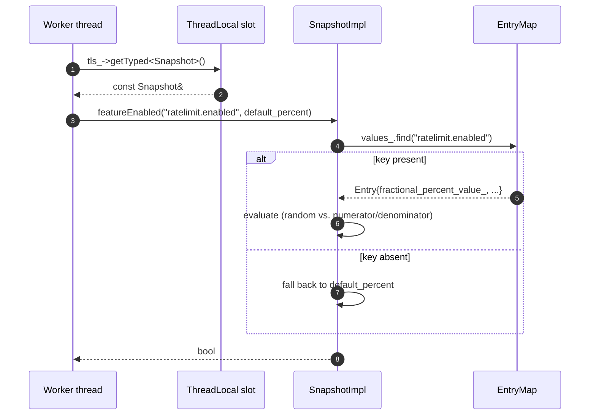

# `source/common/runtime/` — Layered runtime values and feature flags

This folder is Envoy's **runtime configuration plane**. Anywhere in the codebase that you see one of these, it
ultimately funnels into this folder:

```cpp
Runtime::runtimeFeatureEnabled("envoy.reloadable_features.foo")
loader.snapshot().getInteger("circuit_breaker.max_pending_requests", 1024)
loader.snapshot().featureEnabled("ratelimit.enabled", default_percent)
```

The "runtime" is a key→value store that can be sourced from multiple **layers** (static bootstrap, on-disk files,
RTDS over xDS, an admin-mutable layer), merged in order, and surfaced to workers as an **immutable snapshot** they
read in the hot path without locking.

> **TL;DR** — this folder owns:
> - the **`Loader`** singleton (`LoaderImpl`) that merges layers and produces snapshots,
> - the four **layer** classes (`ProtoLayer` for static, `DiskLayer` for files, `AdminLayer` for admin overrides,
>   the `RtdsSubscription` glue for RTDS),
> - the **`Snapshot`** implementation (`SnapshotImpl`) that answers the hot-path lookups,
> - the **runtime-feature registry** (`RuntimeFeatures` / `runtimeFeatureEnabled`) backed by `absl::Flag`,
> - the canonical list of runtime-feature names (`runtime_keys.cc`).

---

## Folder map

```
source/common/runtime/
├── BUILD
├── runtime_impl.{h,cc}      # LoaderImpl, SnapshotImpl, AdminLayer, DiskLayer, ProtoLayer, RtdsSubscription
├── runtime_features.{h,cc}  # RuntimeFeatures registry, RUNTIME_GUARD macros, runtimeFeatureEnabled()
├── runtime_keys.{h,cc}      # Canonical names for the most frequently used runtime keys
└── runtime_protos.h         # PercentRuntime / FeatureFlagRuntime adapters that wrap proto messages
```

The **interfaces** (`Loader`, `Snapshot`, `OverrideLayer`) all live under `envoy/runtime/runtime.h`; this folder is
the only first-party implementation of those interfaces.

---

## Per-topic table

| Topic                                | Document                                                  | Source                                                       |
|--------------------------------------|-----------------------------------------------------------|--------------------------------------------------------------|
| Architecture & layering              | [`OVERVIEW.md`](OVERVIEW.md)                              | how layers compose into a snapshot                           |
| Class hierarchy (UML)                | [`CLASS_HIERARCHY.md`](CLASS_HIERARCHY.md)                | every class in this folder, one canvas                       |
| Loader & snapshot machinery          | [`loader_and_snapshot.md`](loader_and_snapshot.md)        | `LoaderImpl`, `SnapshotImpl`, `loadNewSnapshot`              |
| The four layer types                 | [`layers.md`](layers.md)                                  | `ProtoLayer`, `DiskLayer`, `AdminLayer`, `RtdsSubscription`  |
| Runtime features (ABSL flags)        | [`runtime_features.md`](runtime_features.md)              | `runtime_features.{h,cc}`, `RUNTIME_GUARD` macros            |

---

## Big picture

```mermaid
flowchart LR
    BS[Bootstrap layered_runtime] --> LM[LoaderImpl]

    subgraph layers
        SL[Static layer<br/>ProtoLayer]
        DL[Disk layer<br/>DiskLayer + Filesystem::Watcher]
        AL[Admin layer<br/>AdminLayer + /runtime_modify]
        RL[RTDS layer<br/>RtdsSubscription → ProtoLayer]
    end
    LM --> SL
    LM --> DL
    LM --> AL
    LM --> RL

    LM --> Snap[SnapshotImpl<br/>flattened EntryMap<br/>last layer wins]
    Snap -.shared_ptr.-> TLS[ThreadLocal slot]
    TLS --> W1[Worker 1]
    TLS --> W2[Worker 2]
    TLS --> W3[Worker 3]

    LM -->|refreshReloadableFlags| Flags[absl::Flag store<br/>(RuntimeFeatures singleton)]
    Caller["runtimeFeatureEnabled(name)"] --> Flags
    HotPath["snapshot().getInteger/getBoolean/.../featureEnabled"] --> TLS

    LM --> Admin["/runtime,<br/>/runtime_modify"]
```

Two parallel state machines:

- **The snapshot machinery** — `LoaderImpl` builds `SnapshotImpl` instances and posts them into a thread-local
  slot. Workers read them without locking. New snapshots are produced when *any* layer changes (disk watcher fires,
  RTDS pushes, admin merges values).
- **The reloadable-flag machinery** — every snapshot rebuild also calls `refreshReloadableFlags(snapshot.values())`,
  which writes back into `absl::Flag` storage. That is the only path that lets a runtime override turn a
  `RUNTIME_GUARD(...)`-declared boolean from true to false (and the reason `runtimeFeatureEnabled` can be called
  from anywhere — even outside a `Snapshot::getBoolean` context).

---

## How a worker reads a runtime value



Three properties hold:

- **No locking.** The slot read is a thread-local hash; the snapshot is immutable.
- **No allocation.** `Entry` lookup is a single hash probe; the random draw is a `generator_.random()` call.
- **No I/O.** Disk reads, RTDS parsing, admin merges all happen on the **main thread** *before* the snapshot ever
  reaches a worker.

---

## Relationships with the rest of Envoy

| Depends on                          | Why                                                                |
|-------------------------------------|---------------------------------------------------------------------|
| `envoy/runtime/runtime.h`           | every class here implements one of those PURE interfaces            |
| `source/common/config/`             | `subscriptionFromConfigSource` for RTDS                             |
| `source/common/init/`               | `ManagerImpl`, `TargetImpl`, `WatcherImpl` — RTDS gates startup     |
| `source/common/filesystem/`         | `Directory`, `Watcher` — disk layer + reload                       |
| `source/common/thread_local/`       | `SlotPtr` — snapshot fanout                                         |
| `source/common/singleton/`          | `ThreadSafeSingleton<Loader>` — global `Runtime::LoaderSingleton::get()` |
| `absl/flags`                        | the underlying storage for every `RUNTIME_GUARD(...)`              |
| `quiche` (optional)                 | mirrors a subset of runtime guards into QUICHE feature flags        |

| Used by                                                       | What it pulls                                                  |
|--------------------------------------------------------------|----------------------------------------------------------------|
| every filter / cluster / listener                              | `runtimeFeatureEnabled(...)` for feature gating                |
| `source/common/upstream/` and circuit breakers                | thresholds via `getInteger`                                    |
| `source/common/router/`                                        | fault injection / ratelimit via `featureEnabled(percent)`      |
| `source/server/admin/`                                         | `/runtime` and `/runtime_modify` endpoints                     |

---

## Quick reading order

1. **[`OVERVIEW.md`](OVERVIEW.md)** — concepts: layers, snapshots, the two parallel state machines.
2. **[`layers.md`](layers.md)** — the four layer types, how they are constructed, how they refresh.
3. **[`loader_and_snapshot.md`](loader_and_snapshot.md)** — how `LoaderImpl` glues it all together and the thread-local fanout.
4. **[`runtime_features.md`](runtime_features.md)** — the `RUNTIME_GUARD(...)` system and the `absl::Flag` bridge.
5. **[`CLASS_HIERARCHY.md`](CLASS_HIERARCHY.md)** — visual checkpoint.
