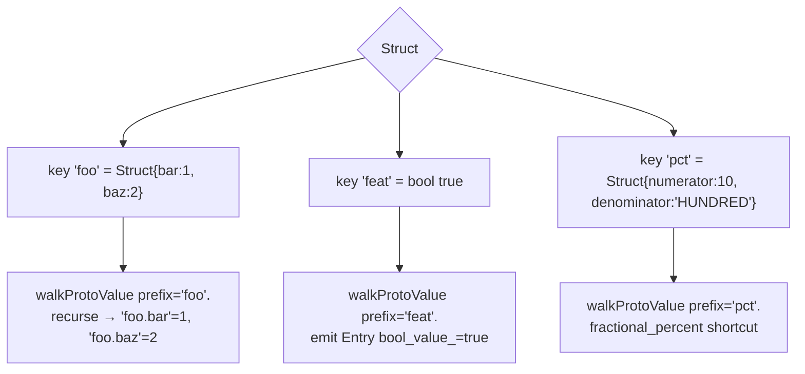
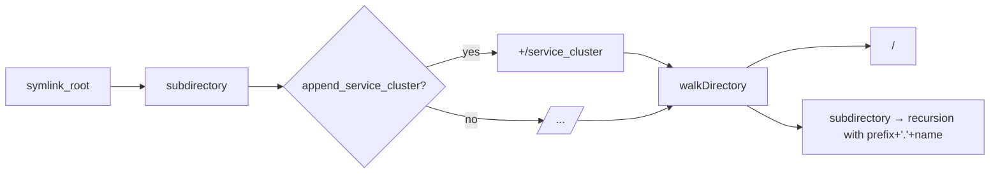
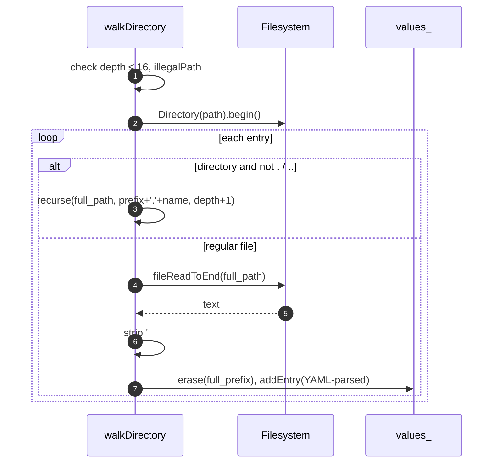
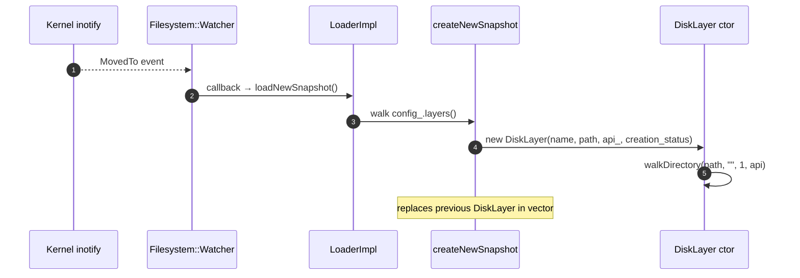
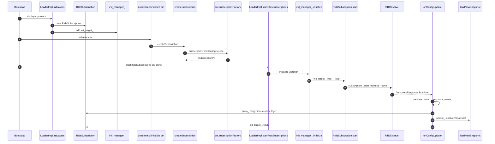
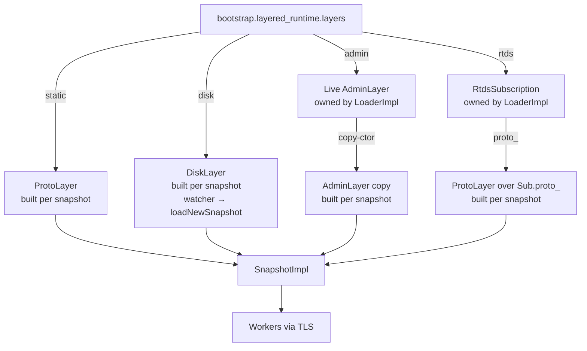

# The four layer types

A "layer" is anything that supplies key→`Entry` values to a snapshot. There are exactly four kinds in this folder,
plus a fifth-helper class (`RtdsSubscription`) that produces a backing `Protobuf::Struct` for a `ProtoLayer`.

| Layer            | Class                          | Mutable after construction?               | Rebuilt per snapshot?       |
|------------------|--------------------------------|-------------------------------------------|-----------------------------|
| Static           | `ProtoLayer`                   | No                                        | Yes (cheap, in-memory walk)|
| Disk             | `DiskLayer`                    | No (but re-walked on watcher event)       | Yes (re-reads files)       |
| Admin            | `AdminLayer` (live + copy)     | Live: yes via `mergeValues`. Copy: no.    | Copy is rebuilt per snapshot|
| RTDS-backed      | `ProtoLayer` over `Sub.proto_` | The backing `proto_` mutates on RTDS push | Yes (wraps current `proto_`)|

The shared base is `OverrideLayerImpl`:

```cpp
class OverrideLayerImpl : public Snapshot::OverrideLayer {
public:
  explicit OverrideLayerImpl(absl::string_view name) : name_{name} {}
  const Snapshot::EntryMap& values() const override { return values_; }
  const std::string& name() const override { return name_; }
protected:
  Snapshot::EntryMap values_;
  const std::string name_;
};
```

Layer subclasses populate `values_` in their constructor (or, for `AdminLayer`, via `mergeValues`).

---

## `ProtoLayer` — bootstrap & RTDS

```cpp
class ProtoLayer : public OverrideLayerImpl, Logger::Loggable<Logger::Id::runtime> {
public:
  ProtoLayer(absl::string_view name, const Protobuf::Struct& proto, absl::Status& creation_status);
private:
  absl::Status walkProtoValue(const Protobuf::Value& v, const std::string& prefix);
};
```

### What it does

`walkProtoValue` flattens a nested `Protobuf::Struct` into dotted keys.



The rules in `walkProtoValue`:

| `kind_case`                                                | What happens                                                                |
|------------------------------------------------------------|-----------------------------------------------------------------------------|
| `KIND_NOT_SET`, `kListValue`, `kNullValue`                | `InvalidArgumentError("Invalid runtime entry value for <prefix>")`         |
| `kStringValue`                                             | emit a single Entry (numeric fields auto-parsed by `createEntry`)          |
| `kNumberValue`, `kBoolValue`                               | emit a single Entry; also `IS_ENVOY_BUG` if the key looks like a removed runtime guard |
| `kStructValue` with `numerator` / `denominator` fields    | emit a single fractional-percent Entry (no further recursion)              |
| `kStructValue` (otherwise)                                 | recurse into each field with `prefix + "." + field_name`                   |

The "removed guard" check (`IS_ENVOY_BUG` if `hasRuntimePrefix && !isRuntimeFeature && !isLegacyRuntimeFeature`)
catches stale config that references `RUNTIME_GUARD(...)` names which have been deleted from
`runtime_features.cc` after the feature was permanently turned on. The bug fires once per server start; the value is
still inserted into the snapshot, so the misuse doesn't crash, but it shows up in tests and logs.

### When it gets built

- Bootstrap `static_layer` — `createNewSnapshot` builds one `ProtoLayer` directly from the proto.
- RTDS — `createNewSnapshot` builds a `ProtoLayer` wrapping `subscriptions_[i]->proto_`, which is the **last
  accepted RTDS payload** (or an empty `Struct` until the first push).

Both are built **per snapshot**. There's no caching; the flattening is cheap.

---

## `DiskLayer` — file-backed values

```cpp
class DiskLayer : public OverrideLayerImpl, Logger::Loggable<Logger::Id::runtime> {
public:
  DiskLayer(absl::string_view name, const std::string& path, Api::Api& api,
            absl::Status& creation_status);
private:
  absl::Status walkDirectory(const std::string& path, const std::string& prefix,
                             uint32_t depth, Api::Api& api);
  const std::string path_;
  const Filesystem::WatcherPtr watcher_;       // unused after construction; reserved
};
```

### Path layout convention

```
<symlink_root>/<subdirectory>/<service_cluster_name?>/<dotted-prefix>/<key>
```



The on-disk shape is a *directory tree* with one file per runtime key. Subdirectory names become dotted prefixes:
the file `foo/bar/baz` becomes the runtime key `foo.bar.baz`.

### `walkDirectory`



Subtle behaviours:

- **Depth limit of 16** prevents pathological cycles via symlinks pointing back up the tree.
- **Comment lines (`#`-prefixed)** are stripped. This is intentional — it lets operators commit empty placeholder
  files into source control with explanatory comments.
- **The last line is `rtrim`-ed**, all earlier lines keep their trailing `\n`. This preserves multi-line YAML.
- **Reads are blocking** (`fileReadToEnd`). For very large runtime trees the rebuild can stall the main thread for
  tens of milliseconds. There's a TODO in the comments acknowledging this.
- **`#ifndef ENVOY_ENABLE_YAML` branch** — without YAML support, the file is dropped with `IS_ENVOY_BUG`. The
  bootstrap will still load; the disk layer simply has no values.

### Refresh

When the `Filesystem::Watcher` fires `MovedTo` on the `symlink_root`:



The watcher fires on the **symlink_root**, not on the subdirectory. This is the same idiom as
[`source/common/secret/sds_api.{h,cc}`](../secret/sds_api.md): k8s and most secret stores rotate by `rename(2)`-swapping
a symlink rather than overwriting in place.

### Failure handling

`DiskLayer` construction can fail (path not found, depth exceeded, illegal path, file read error). The failure surfaces
as a non-OK `absl::Status` written to the constructor's out-parameter. In `createNewSnapshot`, the failure is *caught*
(`TRY_ASSERT_MAIN_THREAD` + `CATCH`) and turned into a `++error_layers`. The previous snapshot's value is *not*
preserved — the layer is simply dropped from the new snapshot. Next time the watcher fires (or any other trigger
causes a rebuild) it'll try again.

---

## `AdminLayer` — `/runtime_modify`

```cpp
class AdminLayer : public OverrideLayerImpl {
public:
  explicit AdminLayer(absl::string_view name, RuntimeStats& stats);
  AdminLayer(const AdminLayer&);                       // copy-ctor for snapshot embedding
  absl::Status mergeValues(const map& values);
private:
  RuntimeStats& stats_;
};
```

### Two instances per server

There are always **two** `AdminLayer` objects of interest:

1. The **live** instance owned by `LoaderImpl::admin_layer_`. This is the mutation target for `mergeValues`.
2. The **snapshot copy** built inside `createNewSnapshot`: `layers.push_back(make_unique<AdminLayer>(*admin_layer_));`

The copy-constructor does:

```cpp
AdminLayer(const AdminLayer& admin_layer) : AdminLayer{admin_layer.name_, admin_layer.stats_} {
  values_ = admin_layer.values();
}
```

…that is, it constructs a fresh `AdminLayer` with the same name and stats ref, then copies the `values_` map. The
snapshot now has an immutable view; further `mergeValues` calls don't affect this snapshot.

### `mergeValues`

```cpp
absl::Status mergeValues(const map& values) {
#ifdef ENVOY_ENABLE_YAML
  for (const auto& kv : values) {
    values_.erase(kv.first);
    if (!kv.second.empty()) {
      SnapshotImpl::addEntry(values_, kv.first, ValueUtil::loadFromYaml(kv.second), kv.second);
    }
  }
  stats_.admin_overrides_active_.set(values_.empty() ? 0 : 1);
  return absl::OkStatus();
#else
  return absl::InvalidArgumentError("Runtime admin reload requires YAML support");
#endif
}
```

- **Empty value = delete.** Operators use `/runtime_modify?key=` (with an empty value) to drop an override.
- **YAML parsing** lets the operator pass typed values: `42` becomes a number, `"42"` stays a string, `0.5` is a
  double, `{numerator: 50, denominator: HUNDRED}` becomes a `FractionalPercent`.
- **`admin_overrides_active_` gauge** flips to 1 as soon as any override exists, 0 when the layer is empty.

`LoaderImpl::mergeValues` chains: `admin_layer_->mergeValues(values)` → `loadNewSnapshot()`. So a successful
`/runtime_modify` always triggers an immediate snapshot rebuild and TLS fanout.

### Why exactly one admin layer?

The single-instance restriction (enforced by `initLayers` returning `InvalidArgumentError("Too many admin layers...")`
on the second admin) makes the `admin_layer_` field unambiguous. If multiple admin layers were allowed, `/runtime_modify`
would have to specify which one to write to, and the snapshot's "last wins" merge would make some overrides invisible.

---

## `RtdsSubscription` — the RTDS glue

Not itself a layer, but produces the backing `Protobuf::Struct` for an RTDS-backed `ProtoLayer`.

```cpp
struct RtdsSubscription : public Config::SubscriptionCallbacks {
  RtdsSubscription(LoaderImpl& parent, const RtdsLayer& config, Stats::Store& store, ValidationVisitor& v);

  // Config::SubscriptionCallbacks
  absl::Status onConfigUpdate(resources, version) override;
  absl::Status onConfigUpdate(added, removed, sys_version) override;
  void onConfigUpdateFailed(reason, ex) override;

  void start();
  absl::Status validateUpdateSize(added, removed);
  absl::Status onConfigRemoved(removed);
  absl::Status createSubscription();

  LoaderImpl& parent_;
  ConfigSource config_source_;
  Stats::Store& store_;
  ScopeSharedPtr stats_scope_;
  SubscriptionPtr subscription_;
  std::string resource_name_;
  Init::TargetImpl init_target_;
  ResourceTypeHelper<envoy::service::runtime::v3::Runtime> resource_type_helper_;
  Protobuf::Struct proto_;          // the backing store for the wrapped ProtoLayer
};
```

### Lifecycle



### What's different from RDS / SDS

| Behavior                              | RDS                                    | SDS                                | **RTDS**                                       |
|---------------------------------------|----------------------------------------|------------------------------------|------------------------------------------------|
| Dedupe via shared subscription        | Yes (manager dedupe map)               | Yes (manager dedupe map)           | **No** — one subscription per `rtds_layer`     |
| Resource removal handling             | Logged + ignored                       | Logged + ignored                   | **Honored** — `onConfigRemoved` clears `proto_`|
| Per-subscription init target          | Yes                                    | Yes                                | Yes                                            |
| Owns own init manager                 | No (uses parent's)                     | No                                 | **Yes** — `LoaderImpl::init_manager_`          |
| Validates resource name matches       | Yes                                    | Yes                                | Yes                                            |
| First push triggers data path swap    | Yes (TLS pointer)                      | Yes (consumer callbacks)           | Yes (TLS pointer via `loadNewSnapshot`)        |

The `init_manager_` is private to RTDS (named `"RTDS"`, separate from any listener's init manager). It coordinates
"all RTDS subscriptions are either ready or failed" before firing `on_rtds_initialized_`, which `Server::Instance`
uses to gate workers from starting.

### Failure path

```cpp
void onConfigUpdateFailed(reason, ex) {
  ASSERT(reason != ConnectionFailure);
  init_target_.ready();              // unblock startup
}
```

Connection-level failures are absorbed by the subscription factory's retry loop. A semantic failure (decode, schema,
size mismatch) marks the target ready so the RTDS init manager completes — the layer simply stays empty and the
snapshot proceeds without it.

`validateUpdateSize` also calls `init_target_.ready()` on its rejection path:

```cpp
absl::Status validateUpdateSize(uint32_t added, uint32_t removed) {
  if (added + removed != 1) {
    init_target_.ready();           // <-- unblock even on rejection
    return InvalidArgumentError(...);
  }
  return OkStatus();
}
```

This is critical: a malformed first push would otherwise wedge startup forever.

---

## Combined picture



Three layers (`ProtoLayer`, `DiskLayer`, `AdminLayer` copy) are constructed **fresh** every snapshot. Only the
live `AdminLayer` and the `RtdsSubscription`'s `proto_` survive between snapshots — they are the mutation surfaces
that operators (admin) and control planes (RTDS) interact with.

---

## Common pitfalls

| Symptom                                                          | Cause                                                                    |
|------------------------------------------------------------------|--------------------------------------------------------------------------|
| `IS_ENVOY_BUG("Using a removed guard ...")`                     | Bootstrap or RTDS references a `RUNTIME_GUARD` that was deleted          |
| Disk file present but value not in `/runtime`                    | Comments-only file (all `#`-prefixed) → empty value → not emitted        |
| Nested directory not visible                                      | `walkDirectory` hit the depth-16 limit                                   |
| Admin override survives a server restart                          | It doesn't — admin layer is in-memory only; persist via disk/static layer |
| RTDS removed but values still visible                             | `onConfigRemoved` rejected with "Unexpected removal of unknown layer" → check the removed name matches `resource_name_` |
| Disk + admin both setting the same key, only disk visible        | Check layer ordering in bootstrap — `admin_layer` must come **after** `disk_layer` to override |
