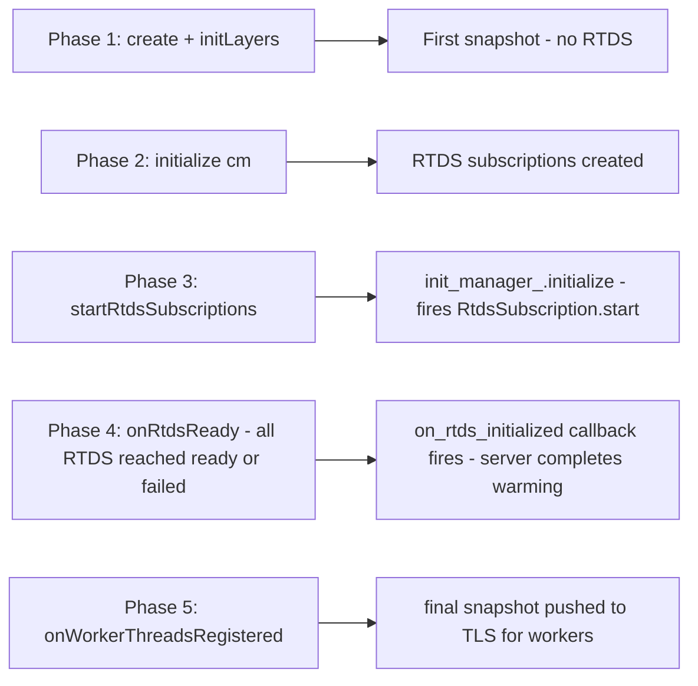
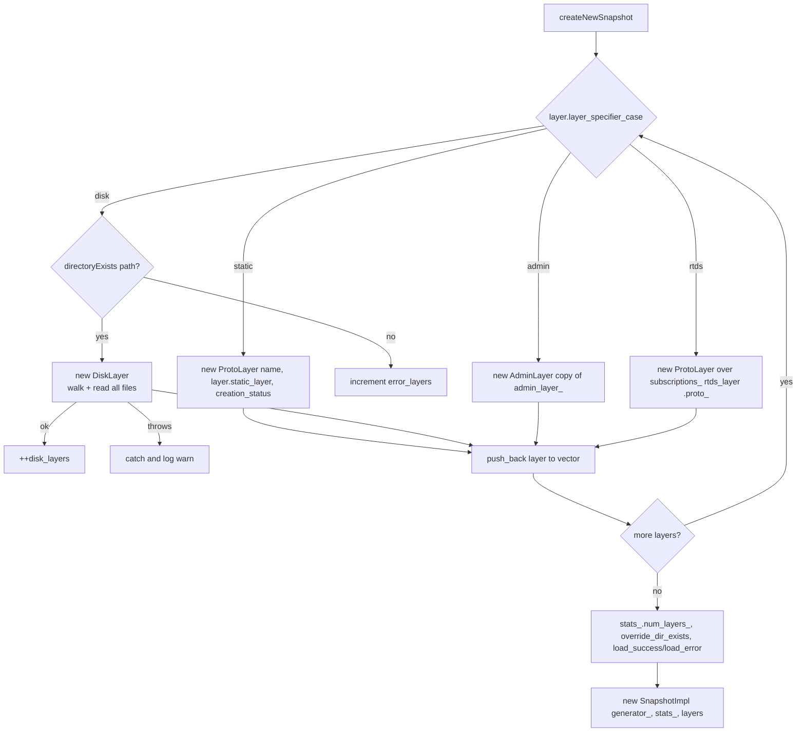
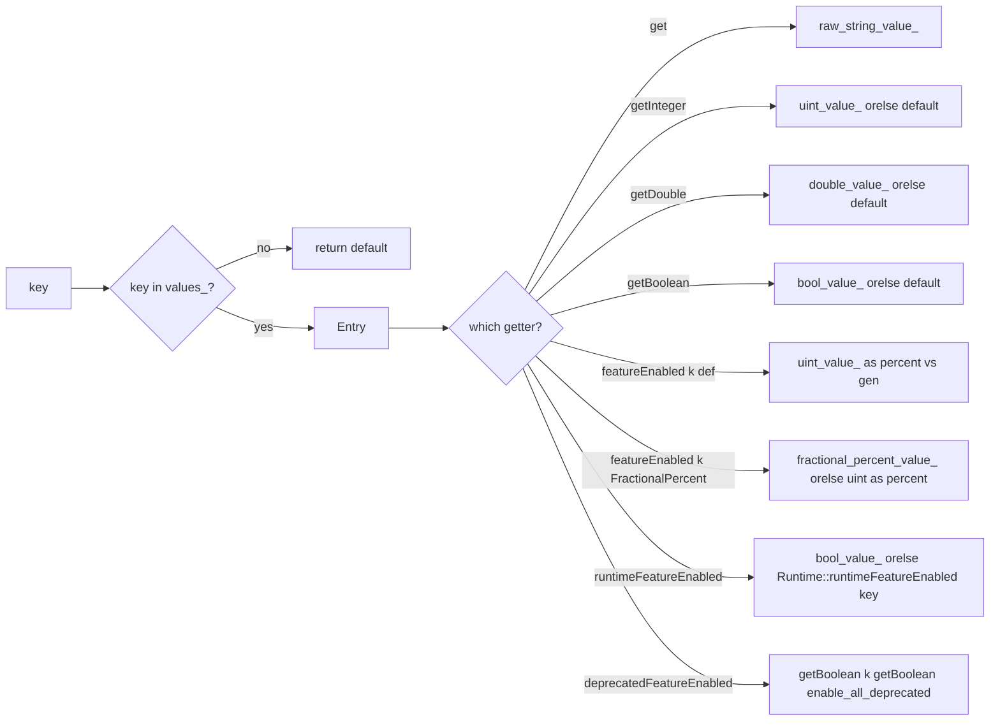
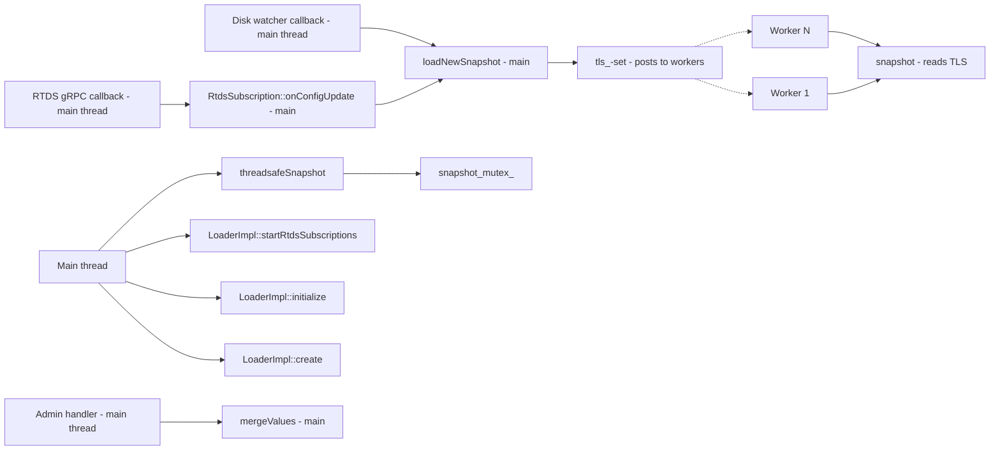

# `LoaderImpl` and `SnapshotImpl`

The heart of the runtime folder. `LoaderImpl` is the long-lived **builder + dispatcher** that owns layers, manages
RTDS, and posts new snapshots to workers. `SnapshotImpl` is the short-lived **immutable read-side view** that workers
hold via a thread-local slot.

This document covers their construction, the snapshot rebuild path, the thread-local fanout, and the value-lookup
algorithms.

---

## `LoaderImpl` — at a glance

```cpp
class LoaderImpl : public Loader {
public:
  static absl::StatusOr<std::unique_ptr<LoaderImpl>> create(
      dispatcher, tls, layered_runtime_config, local_info, store, generator, validator, api);

  // Loader interface
  absl::Status initialize(Upstream::ClusterManager& cm) override;       // create RTDS subscriptions
  const Snapshot& snapshot() const override;                            // worker hot path
  SnapshotConstSharedPtr threadsafeSnapshot() override;                 // main-thread / unregistered-thread path
  absl::Status mergeValues(map) override;                               // admin /runtime_modify
  void startRtdsSubscriptions(ReadyCallback on_done) override;          // fire RTDS init manager
  absl::Status onWorkerThreadsRegistered() override;                    // first snapshot to workers
  Stats::Scope& getRootScope() override;
  void countDeprecatedFeatureUse() const override;
};
```

### Member roles

| Member                      | Lifetime        | Purpose                                                              |
|-----------------------------|-----------------|----------------------------------------------------------------------|
| `generator_`                | server-lifetime | passed into each `SnapshotImpl` for `featureEnabled(percent)` draws  |
| `stats_`                    | server-lifetime | the `runtime.*` counters and gauges                                  |
| `admin_layer_`              | server-lifetime | the **one** mutable layer; copied into every snapshot                |
| `tls_`                      | server-lifetime | `ThreadLocal::SlotPtr` — workers' snapshot handle                    |
| `config_`                   | server-lifetime | the `LayeredRuntime` proto kept for snapshot rebuilds                |
| `watcher_`                  | server-lifetime | one `Filesystem::Watcher` shared across all disk layers              |
| `init_manager_` / `init_watcher_` | server-lifetime | the **RTDS-only** init manager and its done-watcher              |
| `subscriptions_`            | server-lifetime | one `RtdsSubscription` per `rtds_layer` in bootstrap                 |
| `cm_`                       | post-`initialize` | borrowed pointer to the cluster manager for `subscriptionFactory()` |
| `snapshot_mutex_` / `thread_safe_snapshot_` | server-lifetime | guarded copy of the latest snapshot for main-thread access |

### Construction flow

```mermaid
sequenceDiagram
    autonumber
    participant Boot as Server bootstrap
    participant Create as LoaderImpl::create
    participant Loader as LoaderImpl ctor
    participant Init as initLayers
    participant Disk as Filesystem::Watcher
    participant Sub as RtdsSubscription ctor
    participant IM as init_manager_
    participant Load as loadNewSnapshot

    Boot->>Create: create(dispatcher, tls, layered_runtime, local_info, store, gen, validator, api)
    Create->>Loader: new LoaderImpl(tls, config, local_info, store, gen, api)
    Loader-->>Create: instance
    Create->>Init: initLayers(dispatcher, validator)
    loop for each layer
        alt static
            Note over Init: nothing to do until snapshot build
        else admin
            Init->>Loader: admin_layer_ = make_unique<AdminLayer>(...)<br/>RELEASE on duplicates
        else disk
            Init->>Disk: dispatcher.createFilesystemWatcher() if first
            Init->>Disk: addWatch(symlink_root, MovedTo, loadNewSnapshot)
        else rtds
            Init->>Sub: new RtdsSubscription(this, layer.rtds_layer, store, validator)
            Init->>IM: add(sub.init_target_)
        end
    end
    Init->>Load: loadNewSnapshot() — first build
    Load-->>Init: OkStatus
    Init-->>Create: OkStatus
    Create-->>Boot: unique_ptr<LoaderImpl>
```

Three subtleties:

- **The disk watcher is created once** even if multiple disk layers are declared — `addWatch` is called per layer.
- **RTDS subscriptions are constructed but not started** in `initLayers`. The actual `subscriptionFromConfigSource`
  call happens in `RtdsSubscription::createSubscription`, which is invoked from `LoaderImpl::initialize(cm)` once the
  cluster manager is available.
- **The first `loadNewSnapshot`** runs at the end of `initLayers` — it produces a "no RTDS yet" snapshot containing
  just the static + disk + (empty) admin layers. Workers will get this snapshot once they register.

### Two initialization phases



This split exists because the bootstrap-runtime layer must be **available** during cluster manager construction (so
that cluster-related flags work) but RTDS itself **depends on** the cluster manager (it talks to one). The result is
a four-step dance:

1. `LoaderImpl::create` produces a usable loader with no RTDS.
2. `Server::ClusterManagerImpl` is constructed; `loader.initialize(cm)` happens next.
3. `Server::startWorkers` calls `loader.startRtdsSubscriptions(...)`; that initializes the RTDS-only init manager.
4. After workers exist, `onWorkerThreadsRegistered` rebuilds one more time so the workers' TLS slot has the
   post-RTDS snapshot.

---

## The snapshot rebuild: `createNewSnapshot` → `loadNewSnapshot`

`loadNewSnapshot()`:

```cpp
auto snapshot_or_error = createNewSnapshot();
auto ptr = std::move(*snapshot_or_error);
tls_->set([ptr](Dispatcher&) -> ThreadLocalObjectSharedPtr {
  return std::static_pointer_cast<ThreadLocalObject>(ptr);
});

refreshReloadableFlags(ptr->values());

{
  absl::MutexLock lock(snapshot_mutex_);
  thread_safe_snapshot_ = ptr;
}
return absl::OkStatus();
```

`createNewSnapshot()` walks `config_.layers()` once per call and builds a fresh vector of `OverrideLayerConstPtr`:



A few specific behaviours:

- **`DiskLayer` build is wrapped in `TRY_ASSERT_MAIN_THREAD`.** Failed disk reads (missing files, permission errors)
  do not block the snapshot — the broken layer is dropped, the snapshot proceeds with the remaining layers, and the
  `load_error` counter ticks.
- **`AdminLayer` is *copied*** into the snapshot. The copy-constructor copies `name_`, `stats_` ref, and `values_`.
  This is critical: a concurrent `mergeValues()` on the live `admin_layer_` won't tear an in-flight snapshot.
- **RTDS layer name comes from the bootstrap**, not from the RTDS resource name. The `ProtoLayer` wraps
  `subscriptions_[i]->proto_`, which is the **last accepted** RTDS payload (empty `Struct` until the first push).
- **`num_layers_` gauge** reflects the actual vector size, which can be smaller than `config_.layers().size()` when
  a disk layer was skipped because its directory didn't exist.

### Thread-local fanout

```cpp
tls_->set([ptr](Event::Dispatcher&) -> ThreadLocal::ThreadLocalObjectSharedPtr {
  return std::static_pointer_cast<ThreadLocal::ThreadLocalObject>(ptr);
});
```

The `tls_->set` posts the closure to every worker dispatcher. Each worker overwrites its slot with the new shared
pointer. The captured `ptr` keeps the snapshot alive across all workers — even one straggler worker reading the old
snapshot keeps its own copy reachable via its slot.

For the **main thread** (and any thread that hasn't been registered with the TLS allocator, such as the admin handler
that calls `mergeValues`), `threadsafeSnapshot()` returns the mutex-guarded `thread_safe_snapshot_` instead.

---

## `SnapshotImpl` — the read-side view

```cpp
class SnapshotImpl : public Snapshot {
public:
  SnapshotImpl(RandomGenerator& gen, RuntimeStats& stats, vector<OverrideLayerConstPtr>&& layers);

  // Snapshot interface
  bool deprecatedFeatureEnabled(key, default) const override;
  bool runtimeFeatureEnabled(key) const override;
  bool featureEnabled(key, default_value) const override;
  bool featureEnabled(key, default_value, random_value, num_buckets) const override;
  bool featureEnabled(key, default_value, random_value) const override;
  bool featureEnabled(key, const FractionalPercent& default_value) const override;
  bool featureEnabled(key, const FractionalPercent& default_value, random_value) const override;
  ConstStringOptRef get(key) const override;
  uint64_t getInteger(key, default_value) const override;
  double   getDouble(key, default_value) const override;
  bool     getBoolean(key, default_value) const override;
  const vector<OverrideLayerConstPtr>& getLayers() const override;
};
```

The constructor flattens layers in order (last layer wins). The `values_` map is **complete** — every key from every
layer is materialized; the lookups are pure hash probes.

### The eight lookup methods



Three lookups are special:

- **`runtimeFeatureEnabled(key)`** falls back to the **absl::Flag** store, not to a literal default. This is what
  makes `RUNTIME_GUARD`-declared flags work even before runtime values are loaded.
- **`deprecatedFeatureEnabled(key, default)`** has three combinators:
  1. If `getBoolean(key, getBoolean("envoy.features.enable_all_deprecated_features", default))` is false → return
     false (the master switch can globally disable).
  2. Otherwise increment `deprecated_feature_use_` and `deprecated_feature_seen_since_process_start_`.
  3. If compiled with `ENVOY_DISABLE_DEPRECATED_FEATURES`, always return false regardless.
- **`featureEnabled(key, default_value)` (uint overload)** short-circuits the PRNG when the effective cutoff is 0
  or ≥ 100, saving a `generator_.random()` call. The `cutoff = min(getInteger(key, default), 100)` clamp is what
  makes overriding a "0% rollout" via runtime work without needing a fractional-percent representation.

### `featureEnabled` for fractional percent

```cpp
bool featureEnabled(key, const FractionalPercent& default_value, uint64_t random_value) const {
  const auto& entry = values_.find(key);
  FractionalPercent percent;
  if (entry != values_.end() && entry->second.fractional_percent_value_.has_value()) {
    percent = entry->second.fractional_percent_value_.value();
  } else if (entry != values_.end() && entry->second.uint_value_.has_value()) {
    if (entry->second.uint_value_.value() > 100) return true;
    percent.set_numerator(entry->second.uint_value_.value());
    percent.set_denominator(FractionalPercent::HUNDRED);
  } else {
    percent = default_value;
  }
  // ...evaluate...
}
```

The three branches cover the three ways an admin can express "50%":

- As a structured fractional percent: `{numerator: 5, denominator: TEN_THOUSAND}` (0.05%, sub-1% granularity).
- As an integer literal in YAML: `50` → treated as `{numerator: 50, denominator: HUNDRED}`.
- As the default proto if neither is overridden.

The integer-shim is a legacy compatibility path (lots of bootstrap configs use plain integers).

### `get(key)`

`get` returns the **raw string** value with an `ASSERT(!isRuntimeFeature(key))` — runtime-feature keys must always be
read via `getBoolean` or `runtimeFeatureEnabled`. This prevents a class of bugs where someone reads
`get("envoy.reloadable_features.foo")` and gets an empty optional because the value lives in the absl::Flag store
rather than the snapshot.

---

## `mergeValues`

```cpp
absl::Status mergeValues(const map& values) {
  if (admin_layer_ == nullptr) return absl::InvalidArgumentError("No admin layer specified");
  RETURN_IF_NOT_OK(admin_layer_->mergeValues(values));
  return loadNewSnapshot();
}
```

The admin layer is the single mutable layer. `mergeValues` does two things:

1. **Mutates `admin_layer_->values_`** — empty value means delete the key; otherwise YAML-parse the value and emplace.
2. **Triggers `loadNewSnapshot`** — every successful merge rebuilds the full snapshot so workers see the change.

If no admin layer was declared in the bootstrap, the call is rejected. This is intentional: the admin endpoint
becomes available even without an admin layer, but it can only **read** runtime state, not modify it.

---

## Threading model



All writes go through the main thread. Workers only read. The single `snapshot_mutex_` exists for the rare
main-thread reader (e.g. `/runtime` admin endpoint dumping the live snapshot) — the contention is negligible because
worker reads don't take it.

---

## Common pitfalls

| Symptom                                                          | Cause                                                                |
|------------------------------------------------------------------|----------------------------------------------------------------------|
| Worker crash: "snapshot can only be called from a worker..."     | Calling `snapshot()` from a non-registered thread — use `threadsafeSnapshot()` |
| `mergeValues` returns "No admin layer specified"                 | Bootstrap doesn't include an `admin_layer` entry                     |
| Disk override never takes effect                                  | Watcher fires but `directoryExists` returns false → silently skipped, `load_error` ticks |
| `runtime_initialized` flag never flips true                       | `markRuntimeInitialized()` is called *only* by `refreshReloadableFlags` — confirm snapshots are being built |
| RTDS layer present but values not visible                         | `RtdsSubscription::createSubscription` not called — check `initialize(cm)` was invoked |
| Snapshot rebuild blocks for seconds                              | A disk layer with many files — `DiskLayer::walkDirectory` does synchronous reads |
| Two callers see different values within the same request          | They captured different `Snapshot` shared_ptrs at different times — pass a snapshot reference through the call stack if consistency matters |
