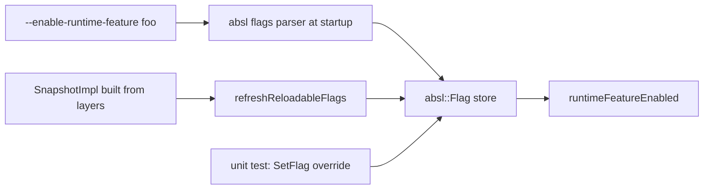
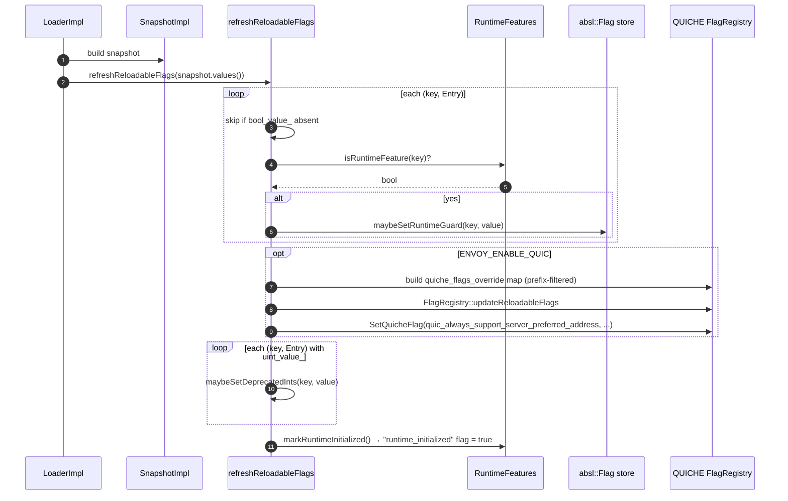

# `runtime_features.{h,cc}` — `RUNTIME_GUARD` and the absl::Flag bridge

This file is **the** mechanism Envoy uses to add killswitches for risky behavior changes. A `RUNTIME_GUARD(...)`
declaration creates a boolean `absl::Flag` that can be flipped at runtime via a layered-runtime override.

It is *not* tied to `LoaderImpl` — it works even before a loader exists (e.g. in unit tests). The bridge between the
two systems is `refreshReloadableFlags(snapshot.values())`, invoked by `LoaderImpl::loadNewSnapshot` on every snapshot
rebuild.

---

## Public surface

```cpp
namespace Envoy::Runtime {

// Predicates over a name string.
bool hasRuntimePrefix(absl::string_view feature);          // starts with envoy.{reloadable,restart}_features.
bool isRuntimeFeature(absl::string_view feature);          // present in the RuntimeFeatures registry
bool isLegacyRuntimeFeature(absl::string_view feature);    // a small hard-coded list (HTTP header limits)

// The hot APIs — used everywhere in the codebase.
bool runtimeFeatureEnabled(absl::string_view feature);
uint64_t getInteger(absl::string_view feature, uint64_t default_value);   // deprecated

// Mutation helpers (used by LoaderImpl and by tests).
void maybeSetRuntimeGuard(absl::string_view name, bool value);
void maybeSetDeprecatedInts(absl::string_view name, uint32_t value);
void markRuntimeInitialized();
bool isRuntimeInitialized();

// The registry.
class RuntimeFeatures {
public:
  RuntimeFeatures();
  absl::CommandLineFlag* getFlag(absl::string_view feature) const;
private:
  absl::flat_hash_map<std::string, absl::CommandLineFlag*> all_features_;
};
using RuntimeFeaturesDefaults = ConstSingleton<RuntimeFeatures>;

} // namespace Envoy::Runtime
```

---

## The macros

```cpp
#define RUNTIME_GUARD(name)        ABSL_FLAG(bool, name, true,  "");
#define FALSE_RUNTIME_GUARD(name)  ABSL_FLAG(bool, name, false, "");
```

These are thin wrappers around `ABSL_FLAG`. The name conventions are critical:

| C++ macro argument                              | Envoy-style runtime key                       |
|-------------------------------------------------|-----------------------------------------------|
| `envoy_reloadable_features_my_feature_name`    | `envoy.reloadable_features.my_feature_name`  |
| `envoy_restart_features_some_init_thing`       | `envoy.restart_features.some_init_thing`     |

The transformation between the two is done by `swapPrefix`, which `absl::StrReplaceAll`s `"envoy_"` → `"envoy."` and
`"features_"` → `"features."` exactly once each. That's why the macro name must use **underscores** where the runtime
key uses **dots**.

### `RUNTIME_GUARD` vs. `FALSE_RUNTIME_GUARD`

- **`RUNTIME_GUARD(name)`** → default `true`. Used to introduce a new code path "on by default" with an emergency
  killswitch. The convention is: ship the change with `RUNTIME_GUARD` flipped true, leave it for one or two release
  cycles, then delete the macro (and any old code path it guarded).
- **`FALSE_RUNTIME_GUARD(name)`** → default `false`. Used for high-risk features that need explicit opt-in. Usually
  paired with a `// TODO(owner): Flip to true after prod testing.` comment.

The CONTRIBUTING.md guidance in the file header is explicit:

> Per documentation in CONTRIBUTING.md is expected that new high risk code paths be guarded by runtime feature
> guards. Runtime features are true by default, so the new code path is exercised. To make a runtime feature false
> by default, use FALSE_RUNTIME_GUARD, and add a TODO to change it to true.

There are roughly 100 `RUNTIME_GUARD` and 30 `FALSE_RUNTIME_GUARD` declarations at any given time — the list churns
every release as features stabilize and old guards get deleted.

---

## The registry

`RuntimeFeatures` is a `ConstSingleton` whose constructor calls `absl::GetAllFlags()` and indexes every flag that:

1. Starts with `envoy_reloadable_features_` or `envoy_restart_features_`, **and**
2. Is a `bool` (via `TryGet<bool>().has_value()`).

```mermaid
flowchart LR
    Init[Singleton init] --> Get[absl::GetAllFlags]
    Get --> Loop{for each flag}
    Loop --> Check{name has Envoy prefix AND type is bool?}
    Check -- no --> Skip
    Check -- yes --> Swap[swapPrefix → Envoy-style name]
    Swap --> Map[all_features_[envoy_name] = flag*]
    Map --> Loop
```

The map's value is `absl::CommandLineFlag*`, which is the type-erased handle. Lookups via `getFlag(name)` return null
for unknown names; callers then `IS_ENVOY_BUG` or fall back.

### Why `bool`-only?

There used to be integer runtime features (`re2.max_program_size.error_level` is one of the last survivors). They
are deprecated; new code must use bools. The two surviving integer flags are still declared with `ABSL_FLAG(uint64_t, ...)`
but are **not** registered in `all_features_` (because the filter rejects non-bools). They are accessed via
`getInteger`, which special-cases the `"re2."` prefix.

---

## `runtimeFeatureEnabled`

```cpp
bool runtimeFeatureEnabled(absl::string_view feature) {
  absl::CommandLineFlag* flag = RuntimeFeaturesDefaults::get().getFlag(feature);
  if (flag == nullptr) {
    IS_ENVOY_BUG(absl::StrCat("Unable to find runtime feature ", feature));
    return false;
  }
  return flag->TryGet<bool>().value();
}
```

Three behaviours worth pointing out:

- **Unknown features bug, not crash.** `IS_ENVOY_BUG` reports the misuse without aborting. The function returns
  false — which is usually the safest fallback (a feature you can't find is presumed off).
- **No lock.** `absl::Flag` reads are wait-free; the underlying storage is atomic.
- **The `LoaderImpl` is not consulted.** This is intentional. Many call sites — including QUICHE's flag bridge, deep
  inside extensions, in static initializers — can't easily reach a loader instance. The flag store is the lowest
  common denominator.

### How values get into the flag store



Four paths can mutate the store:

1. **Command-line at startup** (`--enable-runtime-feature=...`) — handled by `absl`'s own flag parsing.
2. **Snapshot rebuild** via `refreshReloadableFlags(values)` inside `LoaderImpl::loadNewSnapshot`.
3. **Tests** that call `absl::SetFlag(&FLAGS_envoy_..., true)` or use `TestScopedRuntime`.
4. **`maybeSetRuntimeGuard(name, value)`** — called by `LoaderImpl` and indirectly by `markRuntimeInitialized()`.

### `markRuntimeInitialized`

```cpp
void markRuntimeInitialized() {
  maybeSetRuntimeGuard("envoy.reloadable_features.runtime_initialized", true);
}
bool isRuntimeInitialized() {
  return runtimeFeatureEnabled("envoy.reloadable_features.runtime_initialized");
}
```

A sentinel flag flipped at the end of `refreshReloadableFlags`. Code that needs to check "has the runtime layer been
loaded at least once?" (e.g. extension code that defers a decision until after bootstrap) can read
`isRuntimeInitialized()`.

---

## `refreshReloadableFlags` — the bridge from layers to flags

Defined in `runtime_impl.cc`, called from `LoaderImpl::loadNewSnapshot`:

```cpp
void refreshReloadableFlags(const Snapshot::EntryMap& flag_map) {
  for (const auto& it : flag_map) {
    if (it.second.bool_value_.has_value() && isRuntimeFeature(it.first)) {
      maybeSetRuntimeGuard(it.first, it.second.bool_value_.value());
    }
  }
#ifdef ENVOY_ENABLE_QUIC
  // ...mirror to QUICHE FlagRegistry...
#endif
  for (const auto& it : flag_map) {
    if (it.second.uint_value_.has_value()) {
      maybeSetDeprecatedInts(it.first, it.second.uint_value_.value());
    }
  }
  markRuntimeInitialized();
}
```



### QUICHE bridge

When compiled with `ENVOY_ENABLE_QUIC`, `refreshReloadableFlags` mirrors any runtime key matching
`quiche::EnvoyQuicheReloadableFlagPrefix` (e.g. `envoy.reloadable_features.FLAGS_envoy_quic_*`) into QUICHE's own
`FlagRegistry`. This is the only way to flip QUICHE's internal feature flags at runtime.

There's also one specific QUICHE *protocol flag* (`quic_always_support_server_preferred_address`) that's not
reloadable through the standard mechanism, so the bridge sets it directly based on the Envoy-side
`quic_send_server_preferred_address_to_all_clients` flag.

---

## `maybeSetRuntimeGuard`

```cpp
void maybeSetRuntimeGuard(absl::string_view name, bool value) {
  absl::CommandLineFlag* flag = RuntimeFeaturesDefaults::get().getFlag(name);
  if (flag == nullptr) {
    IS_ENVOY_BUG(absl::StrCat("Unable to find runtime feature ", name));
    return;
  }
  std::string err;
  flag->ParseFrom(value ? "true" : "false", &err);
}
```

`ParseFrom` rather than `SetValue<bool>` because `absl::CommandLineFlag` is type-erased — `ParseFrom` is the
type-erased setter. The "true"/"false" string round-trip is wasteful but happens at most a few hundred times per
snapshot rebuild, so the cost is invisible.

The function is silent on `flag->ParseFrom` failure. In practice the only way it can fail is if the registry returned
a non-bool flag, which the registry's constructor explicitly rules out.

---

## The legacy deprecated-int helper

```cpp
void maybeSetDeprecatedInts(absl::string_view name, uint32_t value) {
  if (!absl::StartsWith(name, "envoy.") && !absl::StartsWith(name, "re2.")) return;
  // DO NOT ADD MORE FLAGS HERE. This function deprecated.
  else if (name == "re2.max_program_size.error_level")  absl::SetFlag(&FLAGS_re2_max_program_size_error_level, value);
  else if (name == "re2.max_program_size.warn_level")   absl::SetFlag(&FLAGS_re2_max_program_size_warn_level, value);
}
```

Two surviving integer flags. New runtime values that need to influence integer behaviour must do so via
`snapshot().getInteger(...)` directly, not via this helper.

`isLegacyRuntimeFeature` covers four HTTP header-limit keys that share the same legacy contract:

```cpp
bool isLegacyRuntimeFeature(absl::string_view feature) {
  return feature == Http::MaxRequestHeadersCountOverrideKey ||
         feature == Http::MaxResponseHeadersCountOverrideKey ||
         feature == Http::MaxRequestHeadersSizeOverrideKey ||
         feature == Http::MaxResponseHeadersSizeOverrideKey;
}
```

These are runtime-prefix-style keys (`envoy.reloadable_features.*`) that don't correspond to a `RUNTIME_GUARD`
declaration — they're consumed directly from the snapshot rather than via the flag store. The `walkProtoValue` check
in `ProtoLayer` explicitly whitelists them so they don't trip the "removed guard" assertion.

---

## How to add a new runtime guard

1. Pick a name. Convention: `envoy_reloadable_features_<verb>_<thing>` for behaviour changes,
   `envoy_restart_features_<thing>` for behaviour that takes effect only at process restart.
2. Add a line to `runtime_features.cc`:

   ```cpp
   RUNTIME_GUARD(envoy_reloadable_features_my_new_behavior);
   ```

3. In the code path, gate on the new feature:

   ```cpp
   if (Runtime::runtimeFeatureEnabled("envoy.reloadable_features.my_new_behavior")) {
     // new code path
   } else {
     // old code path
   }
   ```

4. After a release or two of soak time, remove the macro **and** the `if/else` — the new behaviour becomes
   unconditional.

There's no separate registration step. The singleton scans `absl::GetAllFlags()` once at startup, so any `RUNTIME_GUARD`
that's linked into the binary is automatically registered.

---

## Common pitfalls

| Symptom                                                              | Cause                                                                  |
|----------------------------------------------------------------------|------------------------------------------------------------------------|
| `IS_ENVOY_BUG("Unable to find runtime feature ...")` at runtime     | Typo in the name passed to `runtimeFeatureEnabled`                     |
| Override via `/runtime_modify` doesn't take effect                  | Value isn't a `bool` (e.g. `"yes"` instead of `true`)                  |
| QUICHE feature override applied but no behaviour change             | The QUICHE flag isn't in the `EnvoyQuicheReloadableFlagPrefix` set     |
| Static initializer reads `runtimeFeatureEnabled` and gets default   | The snapshot hasn't been built yet — only `RUNTIME_GUARD` default is in store |
| A new `FALSE_RUNTIME_GUARD` reverts on every snapshot rebuild       | Bootstrap or RTDS doesn't include the override; default `false` re-wins |
| `--enable-runtime-feature=foo` doesn't override the snapshot         | The snapshot's later layers (admin/RTDS) override the CLI value. CLI flags only set the initial absl::Flag value |
