# SDS — Class hierarchy (UML)

This diagram covers every class declared in `source/common/secret/` plus the closest interfaces from `envoy/secret/`,
`envoy/config/`, and `envoy/thread_local/`.

```mermaid
classDiagram
    direction LR

    %% ----------- envoy/secret interfaces -----------
    class SecretManager {
      <<interface>>
      +addStaticSecret(secret) Status
      +findStaticTlsCertificateProvider(name) Shared
      +findStaticCertificateValidationContextProvider(name) Shared
      +findStaticTlsSessionTicketKeysContextProvider(name) Shared
      +findStaticGenericSecretProvider(name) Shared
      +createInline*Provider(...) Shared
      +findOrCreate*Provider(sds_cfg, name, ctx, im, warm) Shared
    }

    class SecretProvider~T~ {
      <<interface>>
      +secret() const T*
      +addValidationCallback(cb) Handle
      +addUpdateCallback(cb) Handle
      +addRemoveCallback(cb) Handle
      +initTarget() Init::Target*
      +start()
    }

    %% ----------- envoy/config interfaces -----------
    class SubscriptionCallbacks {
      <<interface>>
      +onConfigUpdate(resources, version) Status
      +onConfigUpdate(added, removed, sys) Status
      +onConfigUpdateFailed(reason, ex)
    }

    %% ----------- envoy/thread_local --------------
    class ThreadLocalObject {
      <<interface>>
    }

    %% ----------- secret_manager_impl --------------
    class SecretManagerImpl {
      -static_tls_certificate_providers_ : map~name, Shared~
      -static_certificate_validation_context_providers_ : map
      -static_session_ticket_keys_providers_ : map
      -static_generic_secret_providers_ : map
      -certificate_providers_ : DynamicSecretProviders~TlsCertificateSdsApi~
      -validation_context_providers_ : DynamicSecretProviders~CertificateValidationContextSdsApi~
      -session_ticket_keys_providers_ : DynamicSecretProviders~TlsSessionTicketKeysSdsApi~
      -generic_secret_providers_ : DynamicSecretProviders~GenericSecretSdsApi~
      -config_tracker_entry_ : EntryOwnerPtr
      +addStaticSecret(secret) Status override
      +findStatic*Provider(name) Shared override
      +createInline*Provider(...) Shared override
      +findOrCreate*Provider(sds_cfg, name, ctx, im, warm) Shared override
      -dumpSecretConfigs(matcher) MessagePtr
    }

    class DynamicSecretProviders~SecretType~ {
      -dynamic_secret_providers_ : map~map_key, weak_ptr~
      +findOrCreate(sds_cfg, name, ctx, im, warm) Shared~SecretType~
      +allSecretProviders() vector~Shared~
      -removeDynamicSecretProvider(map_key)
    }

    %% ----------- sds_api --------------
    class SdsApi {
      <<abstract>>
      #init_target_ : SharedTargetImpl
      #dispatcher_ : Dispatcher&
      #api_ : Api&
      #update_callback_manager_ : CallbackManager
      #remove_callback_manager_ : CallbackManager
      -scope_ : ScopeSharedPtr
      -sds_api_stats_ : SdsApiStats
      -sds_config_ : ConfigSource
      -subscription_ : SubscriptionPtr
      -sds_config_name_ : string
      -secret_hash_ : uint64
      -files_hash_ : uint64
      -clean_up_ : Cleanup
      -secret_data_ : SecretData
      -watcher_ : Watcher
      +secretData() SecretData&
      #setSecret(secret) PURE
      #resolveSecret(files) virtual
      #validateConfig(secret) PURE
      #onConfigUpdate(resources, version) Status override
      #onConfigUpdate(added, removed, sys) Status override
      #onConfigUpdateFailed(reason, ex) override
      #getDataSourceFilenames() vector~string~ PURE
      #getWatchedDirectory() WatchedDirectory* PURE
      #onWatchUpdate()
      #initialize(warm)
      #resolveDataSource(files, ds)
      -loadFiles() FileContentMap
      -getHashForFiles(files) uint64
      -validateUpdateSize(added, removed) Status
    }

    class SdsApi_SecretData {
      +resource_name_ : string
      +version_info_ : string
      +last_updated_ : SystemTime
    }

    class SdsApiStats {
      +key_rotation_failed : Counter
    }

    class DynamicSecretProvider~SecretType~ {
      #validation_callback_manager_ : CallbackManager
      +secret() T* PURE
      +addValidationCallback(cb) Handle
      +addUpdateCallback(cb) Handle
      +addRemoveCallback(cb) Handle
      +initTarget() Init::Target*
      +start()
    }

    class TlsCertificateSdsApi {
      -watched_directory_ : WatchedDirectoryPtr
      -sds_tls_certificate_secrets_ : TlsCertificatePtr
      -resolved_tls_certificate_secrets_ : TlsCertificatePtr
      +secret() TlsCertificate* override
      #setSecret(secret) override
      #resolveSecret(files) override
      #validateConfig(secret) override (no-op)
      #getDataSourceFilenames() override
      #getWatchedDirectory() override
      +create(ctx, sds_cfg, name, cb, warm) Shared
    }

    class CertificateValidationContextSdsApi {
      -watched_directory_ : WatchedDirectoryPtr
      -sds_certificate_validation_context_secrets_ : CVCPtr
      -resolved_certificate_validation_context_secrets_ : CVCPtr
      +secret() CVC* override
      #setSecret(secret) override
      #resolveSecret(files) override
      #validateConfig(secret) override
      #getDataSourceFilenames() override
      #getWatchedDirectory() override
      +create(ctx, sds_cfg, name, cb, warm) Shared
    }

    class TlsSessionTicketKeysSdsApi {
      -tls_session_ticket_keys_ : TlsSessionTicketKeysPtr
      +secret() TlsSessionTicketKeys* override
      #setSecret(secret) override
      #validateConfig(secret) override
      #getDataSourceFilenames() override (empty)
      #getWatchedDirectory() override (nullptr)
      +create(ctx, sds_cfg, name, cb, warm) Shared
    }

    class GenericSecretSdsApi {
      -generic_secret_ : GenericSecretPtr
      +secret() GenericSecret* override
      +addUpdateCallback(cb) Handle override
      #setSecret(secret) override
      #validateConfig(secret) override
      #getDataSourceFilenames() override
      #getWatchedDirectory() override (nullptr)
      +create(ctx, sds_cfg, name, cb, warm) Shared
    }

    %% ----------- secret_provider_impl --------------
    class StaticProvider~T~ {
      -secret_ : unique_ptr~T~
      +secret() T* override
      +addValidationCallback(cb) Handle override (null)
      +addUpdateCallback(cb) Handle override (null)
      +addRemoveCallback(cb) Handle override (null)
      +start() override (no-op)
    }

    class ThreadLocalGenericSecretProvider {
      -provider_ : GenericSecretConfigProviderSharedPtr
      -api_ : Api&
      -tls_ : TypedSlotPtr~ThreadLocalSecret~
      -cb_ : CallbackHandlePtr
      +create(provider, tls, api) unique_ptr
      +secret() string&
      -update() Status
    }

    class ThreadLocalSecret {
      +value_ : string
    }

    %% ----------- inheritance & composition --------------
    SubscriptionCallbacks <|.. SdsApi
    SdsApi <|-- DynamicSecretProvider
    SecretProvider <|.. DynamicSecretProvider
    SecretProvider <|.. StaticProvider

    DynamicSecretProvider <|-- TlsCertificateSdsApi
    DynamicSecretProvider <|-- CertificateValidationContextSdsApi
    DynamicSecretProvider <|-- TlsSessionTicketKeysSdsApi
    DynamicSecretProvider <|-- GenericSecretSdsApi

    SecretManager <|.. SecretManagerImpl
    ThreadLocalObject <|.. ThreadLocalSecret

    SecretManagerImpl *-- DynamicSecretProviders : 4 typed maps
    DynamicSecretProviders o-- SdsApi : weak_ptr dedupe
    SdsApi *-- SdsApi_SecretData
    SdsApi *-- SdsApiStats
    SecretManagerImpl *-- StaticProvider : 4 typed maps own them

    ThreadLocalGenericSecretProvider o-- SecretProvider : wraps generic
    ThreadLocalGenericSecretProvider *-- ThreadLocalSecret : per-worker slot
```

## How to read it

- **Solid arrow with empty triangle (`<|..`)** — interface implementation.
- **Solid arrow with filled triangle (`<|--`)** — concrete inheritance.
- **Diamond (`*--`)** — strong ownership (by-value or `unique_ptr`).
- **Open diamond (`o--`)** — non-owning or `weak_ptr` link.

Three layered observations:

1. **Multi-inheritance happens once**, in `DynamicSecretProvider<T>`: it is both an `SdsApi` (for the xDS callbacks
   and rotation loop) and a `SecretProvider<T>` (for the listener-/cluster-facing API). The four typed `*SdsApi`
   subclasses inherit the multi-inheritance but never add more.
2. **`SecretManagerImpl` is exactly eight maps + an admin entry.** The complexity is in `DynamicSecretProviders<T>`'s
   `findOrCreate`, not in the manager itself.
3. **`StaticProvider<T>` is intentionally inert.** Its callbacks all return null, its `start()` is a no-op. It exists
   so that callers can hold a uniform `SecretProvider<T>` shared pointer regardless of source.
