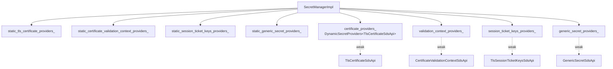
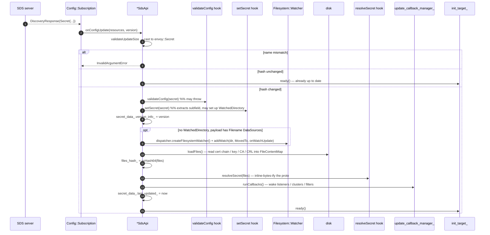

# SDS — Architecture and layering

This document explains the **shape** of the `source/common/secret/` folder: the three concepts it owns (manager, SDS
provider, static provider), the warm/cold init contract it implements with listeners and clusters, and the rotation
loop that keeps disk-backed secrets fresh.

---

## The three roles

| Role                  | Class                              | Owns                                                          |
|-----------------------|------------------------------------|---------------------------------------------------------------|
| **Manager**           | `SecretManagerImpl`                | static & dynamic registries; `/config_dump` (`secrets`)       |
| **Dynamic provider**  | `*SdsApi` (extends `SdsApi`)       | one SDS subscription + filesystem watcher + the latest secret |
| **Static provider**   | `StaticProvider<T>`                | a single owned secret, no callbacks                           |
| **TLS adapter (gen)** | `ThreadLocalGenericSecretProvider` | per-worker `string` view of a generic secret                  |



The manager holds **eight** maps — four static (owned `shared_ptr`) and four dynamic (`weak_ptr` for dedupe). The
asymmetry is deliberate: static secrets are part of the bootstrap and live as long as the manager; dynamic SDS
subscriptions are owned by the listener/cluster that asked for them, and the dedupe map merely lets a second caller
*reuse* the same subscription if it's still alive.

---

## The four secret types

| Wire type (proto `oneof` in `envoy::Secret`)              | Concrete payload type                                | Used for                                            |
|-----------------------------------------------------------|------------------------------------------------------|-----------------------------------------------------|
| `tls_certificate`                                         | `TlsCertificate`                                     | server / client identity (cert + key + OCSP staple) |
| `validation_context`                                      | `CertificateValidationContext`                       | trusted CAs, CRLs, SAN / SPKI matchers              |
| `session_ticket_keys`                                     | `TlsSessionTicketKeys`                               | TLS 1.2 session-ticket encryption keys              |
| `generic_secret`                                          | `GenericSecret`                                      | symmetric secrets for filters (HMAC, JWKS, etc.)    |

Each one is a separate `DynamicSecretProvider<T>` and a separate `*SdsApi` class. Their differences are exactly two
things: **which subfield of `envoy::Secret` they extract**, and **which inline-bytes resolutions `resolveSecret` does
on update** (because cert / key / CRL / trusted-CA can be specified as filenames, but session keys and the
ticket-keys proto cannot).

---

## The dedupe key

```cpp
const std::string map_key =
    absl::StrCat(MessageUtil::hash(sds_config_source), ".", config_name);
```

Two listeners pointing at the same `(sds_config, name)` share a single subscription. The cleanup is symmetric:
`SdsApi`'s `clean_up_` field is constructed with a `destructor_cb = [map_key, this]{ removeDynamicSecretProvider(map_key); }`
which fires when the last shared_ptr drops.

Unlike RDS, the SDS dedupe does **not** strip `initial_fetch_timeout` from the config source. Two listeners with the
same SDS source but different fetch timeouts will get **distinct** providers. (In practice, listeners don't set this
field explicitly, so collisions are rare.)

---

## Warm vs. cold initialization

`SdsApi` takes a `bool warm` constructor flag. The contract is:

- **`warm = true`** (the common case for listeners and clusters): the API does **not** mark its init target ready
  until the first `onConfigUpdate` arrives. This blocks listener / cluster warming until the secret is available.
- **`warm = false`** (used when SDS is set up after the server is already initialized, e.g. an oauth2 filter receiving
  config via LDS after startup): `initialize()` calls `init_target_.ready()` immediately after starting the
  subscription. The listener/cluster comes up without the secret; consumers get `secret() == nullptr` until the first
  update lands.

```cpp
void SdsApi::initialize(bool warm) {
  subscription_->start({sds_config_name_});
  if (!warm) {
    init_target_.ready();
  }
}
```

The cold-init mode is the reason `findOrCreate*Provider` takes an `OptRef<Init::Manager>` and falls back to calling
`secret_provider->start()` directly when no init manager is supplied — see the explicit comment in `SecretManagerImpl`:

> Note that we are not using server_context's init manager because in some cases, for example oauth2 filter with sds
> config, it could be server's init manager. In oauth2 filter example, if the filter config is dynamic, it could be
> received from xds server when the server's init manager is already in the initialized state. In that situation,
> adding init target to the initialized init manager will lead to assertion failure.

---

## The update path



A few subtleties:

- **Per-file watchers are set up *before* the first `loadFiles()`.** If the file doesn't exist yet (k8s race), the
  watcher fires when it appears and `onWatchUpdate` recovers — no manual retry needed.
- **`WatchedDirectory`** (the other rotation mechanism) is configured by `setSecret()` *when the proto opts in via
  `watched_directory`*. In that case the per-file watcher branch is skipped and the directory watcher does the work.
- **`onWatchUpdate` is bounded-retry**: it re-reads files up to 5 times to obtain a stable hash, then warns if it
  still can't. This guards against non-atomic rotation tools that produce partial reads.
- **Failure-tolerant init**: `onConfigUpdateFailed` calls `init_target_.ready()` so a bad initial payload doesn't
  hang server startup — the listener proceeds with no secret and starts serving 503 / closing connections.

---

## The path-resolution dance

For TLS certs and validation contexts, the SDS payload can carry **either**:

- `inline_bytes` / `inline_string` (the secret is in the proto), or
- `filename` (the secret is on disk at the given path), or
- `watched_directory` (the proto says "look in this directory").

`resolveSecret` always produces a **second** copy of the secret with all `filename` references replaced by
`inline_bytes`. That second copy (`resolved_tls_certificate_secrets_`) is what `secret()` returns to consumers. The
original (`sds_tls_certificate_secrets_`) is kept around so that `getDataSourceFilenames()` can rediscover which
files to watch on the next rotation.

```mermaid
flowchart LR
    Wire[Secret from xDS] --> Set[setSecret]
    Set --> Sds[sds_tls_certificate_secrets_<br/>original proto with filenames]
    Watch[Filesystem watch fires] --> Up[onWatchUpdate]
    Up --> Load[loadFiles → FileContentMap]
    Load --> Res[resolveSecret]
    Sds --> Res
    Res --> Resolved[resolved_tls_certificate_secrets_<br/>same proto, inline_bytes]
    Resolved -.->|secret()| TLS[Consumer rebuild]
```

For `TlsSessionTicketKeysSdsApi` and `GenericSecretSdsApi` the resolution is simpler — `TlsSessionTicketKeys` has no
file specifier so it's a straight copy; `GenericSecret` can carry filenames but those are read by the consumer via
`Config::DataSource::read` (see `ThreadLocalGenericSecretProvider::update`).

---

## The thread-local generic provider

Generic secrets are unusual in two ways:

1. Their value is an opaque **string** (a key, a password, etc.) — not a structured proto that consumers can read
   directly.
2. Consumers (filters) generally want to read the secret in the **hot path** without locking.

`ThreadLocalGenericSecretProvider` solves both:

```cpp
class ThreadLocalGenericSecretProvider {
  GenericSecretConfigProviderSharedPtr provider_;
  ThreadLocal::TypedSlotPtr<ThreadLocalSecret> tls_;
  Common::CallbackHandlePtr cb_;                 // registered on provider_
};
```

It wraps a `GenericSecretConfigProviderSharedPtr` (which may be static or dynamic) and:

- reads the secret value via `Config::DataSource::read` (which handles inline + filename + env-var sources),
- installs it into a per-worker `ThreadLocal::TypedSlot<ThreadLocalSecret>`,
- registers an update callback that, on SDS rotation, runs `update()` on the main thread → reads → fans out via
  `tls_->set(...)`.

Filters call `secret()` on the worker thread — it returns a reference into the per-worker slot, no lock, no copy.

---

## What this folder does **not** do

- It does **not** parse certificates or keys. That's the job of `source/common/tls/` (BoringSSL-side parsing) and
  `source/common/ssl/` (proto-level `*Config` classes).
- It does **not** decide whether a TLS handshake should fail. The consumer rebuilds its `SSL_CTX` on
  `onSecretUpdate`, and in-flight handshakes use whichever cert was current when they started.
- It does **not** snapshot per-worker copies of TLS-related secrets. Those flow into `Tls::ContextImpl` via the
  TLS extension layer which has its own thread-local context cache.
- It does **not** implement secret removal. Delta-SDS removes are ACKed but ignored (see `sds_api.cc`); the previous
  secret stays in place until the owning listener/cluster is torn down.

---

## When secrets actually rotate

There are exactly **three** triggers for `update_callback_manager_.runCallbacks()`:

1. xDS push with a different `hash(secret)` (and successful `validateConfig`).
2. Filesystem watcher fires with a different `files_hash_`.
3. Static provider — never. A `StaticProvider<T>` has no callbacks; consumers must rebuild only when the listener
   itself changes.

That set is exhaustive. If you're chasing a bug where "the cert is updated on disk but Envoy isn't using it", the
answer is one of: the filename doesn't match `getDataSourceFilenames()`; the watcher is on the wrong directory; or
the file rotation is non-atomic and `onWatchUpdate` is bailing out (look for the "Unable to atomically refresh
secrets" warning).
