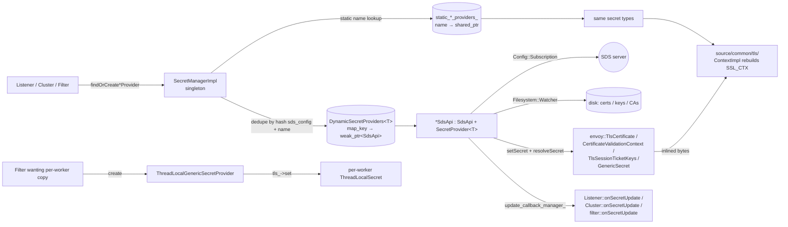

# `source/common/secret/` — Secret Discovery Service (SDS) implementation

This folder is Envoy's **secret plane**. It holds, refreshes, and hands out four kinds of secrets — TLS certificates,
certificate validation contexts, TLS session-ticket keys, and generic secrets — to listeners, clusters, and filters
that need them.

The folder lives one level below the public secret interfaces (`envoy/secret/*.h`) and one level above the SDS xDS
subscription machinery (`source/common/config/`). Everything inside this folder is **main-thread only**, except for
the `ThreadLocalGenericSecretProvider` helper which fans the latest secret value out to worker threads.

> **TL;DR** — this folder owns:
> - the **`SecretManager`** singleton (one per server),
> - the four **static** secret-provider implementations (`StaticProvider<T>`),
> - the four **dynamic** SDS providers (`*SdsApi` subclasses of `SdsApi` + `DynamicSecretProvider<T>`),
> - the `SdsApi` base class that talks xDS, hashes payloads, and watches the filesystem for rotation,
> - a `ThreadLocalGenericSecretProvider` that exposes generic secrets to workers.

---

## Folder map

```
source/common/secret/
├── BUILD
├── secret_manager_impl.{h,cc}      # SecretManager singleton — dedupe + admin /certs / config dump
├── sds_api.{h,cc}                  # SdsApi base + 4 typed *SdsApi subclasses (dynamic providers)
└── secret_provider_impl.{h,cc}     # StaticProvider<T> + ThreadLocalGenericSecretProvider
```

The **interfaces** (`SecretManager`, `SecretProvider<T>`, `SecretCallbacks`, …) all live under `envoy/secret/`; this
folder is the only first-party implementation of those interfaces.

---

## Per-topic table

| Topic                                 | Document                                                      | Source                                                |
|---------------------------------------|---------------------------------------------------------------|-------------------------------------------------------|
| Architecture & layering               | [`OVERVIEW.md`](OVERVIEW.md)                                  | how it all fits together                              |
| Class hierarchy (UML)                 | [`CLASS_HIERARCHY.md`](CLASS_HIERARCHY.md)                    | every class in this folder, one canvas                |
| Manager (registry, dedupe, dump)      | [`secret_manager_impl.md`](secret_manager_impl.md)            | `secret_manager_impl.{h,cc}`                         |
| SDS API base + 4 typed providers      | [`sds_api.md`](sds_api.md)                                    | `sds_api.{h,cc}`                                     |
| Static & thread-local providers       | [`secret_provider_impl.md`](secret_provider_impl.md)          | `secret_provider_impl.{h,cc}`                        |

---

## Big picture



There are **two** call paths into this folder:

1. **Static** — `addStaticSecret(envoy::Secret)` is called at bootstrap time. The manager stores a
   `StaticProvider<T>` keyed by name. Anything that wants this secret later calls
   `findStatic*Provider(name)`.
2. **Dynamic** — `findOrCreate*Provider(sds_config, name, ctx, init_manager, warm)` returns a shared `SdsApi`
   subclass instance, deduplicated by `hash(sds_config) + name`. The first call kicks off an xDS subscription; later
   callers share the same one.

---

## How a listener gets a TLS cert

```mermaid
sequenceDiagram
    autonumber
    participant L as Listener config
    participant TSF as Transport socket factory
    participant SM as SecretManagerImpl
    participant Dyn as DynamicSecretProviders<br/>&lt;TlsCertificateSdsApi&gt;
    participant API as TlsCertificateSdsApi
    participant Sub as Config::Subscription
    participant xDS as SDS server
    participant Watch as Filesystem::Watcher
    participant CTX as Tls::ContextImpl

    L->>TSF: build with sds_secret_config
    TSF->>SM: findOrCreateTlsCertificateProvider(sds_cfg, name, ctx, init_mgr, warm=true)
    SM->>Dyn: findOrCreate(sds_cfg, name, ctx, init_mgr, warm=true)
    alt entry exists in map
        Dyn-->>SM: existing shared_ptr<API>
    else
        Dyn->>API: TlsCertificateSdsApi::create(...)
        API->>Sub: subscriptionFromConfigSource(sds_cfg, ...)
        Dyn->>Dyn: dynamic_secret_providers_[map_key] = weak_ptr
    end
    Dyn->>API: init_manager->add(*initTarget())
    SM-->>TSF: shared_ptr<TlsCertificateSdsApi>
    TSF->>API: addUpdateCallback([this]{ rebuildSslCtx(); })
    Note over API: ...listener still warming...
    L->>API: initTarget()->ready callback fires<br/>(init_manager initialized)
    API->>Sub: start({sds_config_name_})
    Sub->>xDS: gRPC stream
    xDS-->>Sub: DiscoveryResponse(Secret{tls_certificate{filename: ...}})
    Sub->>API: onConfigUpdate(resources, version)
    API->>API: hash check, validateConfig, setSecret
    API->>Watch: dispatcher.createFilesystemWatcher() + addWatch
    API->>API: loadFiles() + resolveSecret(files) [inline bytes]
    API->>TSF: update_callback_manager_.runCallbacks()
    TSF->>CTX: rebuild SSL_CTX with new cert
    Note over Watch: ...kubelet rotates symlinks...
    Watch-->>API: events::MovedTo
    API->>API: onWatchUpdate → loadFiles + resolveSecret + callbacks
    API->>TSF: runCallbacks()
    TSF->>CTX: rebuild SSL_CTX
```

The key invariant is that **the secret object handed to consumers is always self-contained**. SDS payloads that
reference files on disk are *resolved* into inline bytes inside `resolveSecret`, so callers don't have to re-read the
filesystem on every request.

---

## Relationships with the rest of Envoy

| Depends on                          | Why                                                                |
|-------------------------------------|---------------------------------------------------------------------|
| `envoy/secret/*`                    | every class here implements one of those PURE interfaces            |
| `source/common/config/`             | `subscriptionFromConfigSource`, `WatchedDirectory`, datasource read |
| `source/common/init/`               | `SharedTargetImpl` — SDS blocks listener/cluster warming            |
| `source/common/protobuf/`           | `MessageUtil::hash` for dedupe + change detection                   |
| `source/common/filesystem/`         | watcher for file rotation                                           |
| `envoy/server/admin.h`              | `/config_dump` (`secrets` key) and `/certs` admin endpoints         |

| Used by                                                       | What it pulls                                        |
|---------------------------------------------------------------|------------------------------------------------------|
| `source/common/tls/` (`ContextImpl`)                          | TLS cert + validation context + STKs                |
| `extensions/filters/http/oauth2/`                             | generic secret (HMAC key) via `ThreadLocalGenericSecretProvider` |
| `extensions/filters/http/jwt_authn/` and JWT verifiers        | generic secret (JWKS / signing keys)                |
| `extensions/transport_sockets/tls/`                           | wiring layer between listener/cluster proto and this folder |
| `source/server/listener_manager_impl`                         | declares static secrets, drives warm/cold init      |

---

## Quick reading order

1. **[`OVERVIEW.md`](OVERVIEW.md)** — concepts (warm vs. cold init, watched-directory rotation, dedupe key).
2. **[`secret_manager_impl.md`](secret_manager_impl.md)** — the registry and how dedupe works.
3. **[`sds_api.md`](sds_api.md)** — the SDS base class, the four typed subclasses, and the file-watch rotation loop.
4. **[`secret_provider_impl.md`](secret_provider_impl.md)** — `StaticProvider<T>` and `ThreadLocalGenericSecretProvider`.
5. **[`CLASS_HIERARCHY.md`](CLASS_HIERARCHY.md)** — visual checkpoint.
