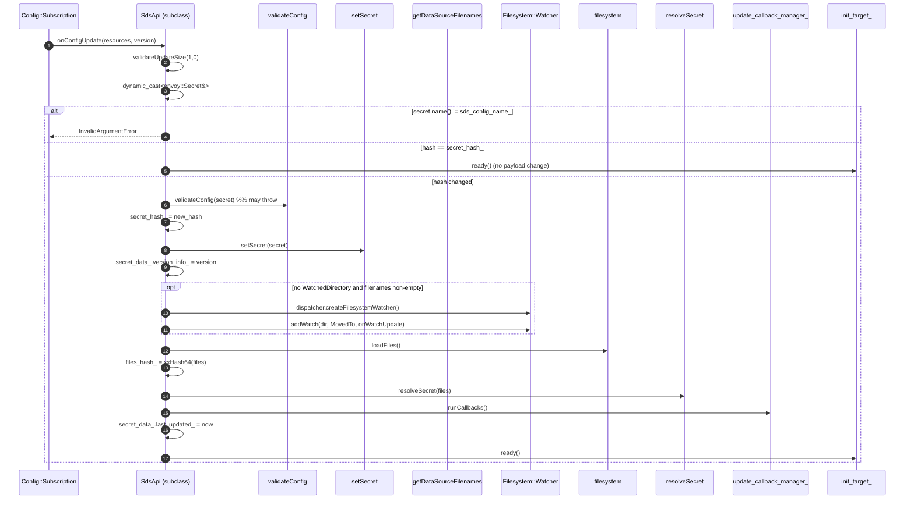
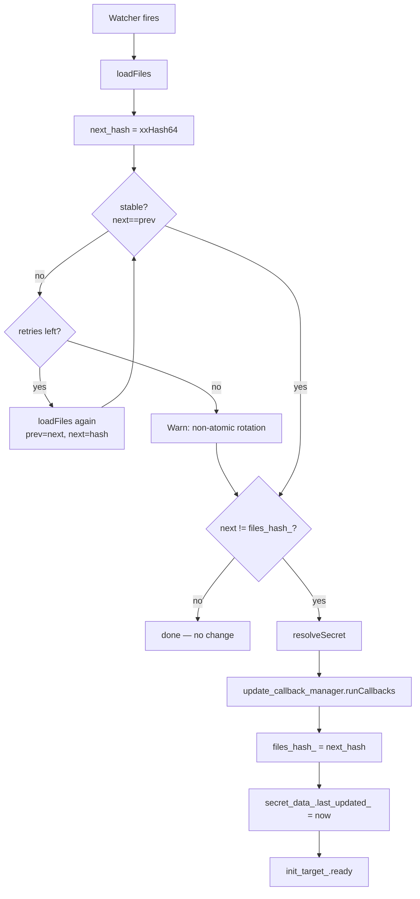
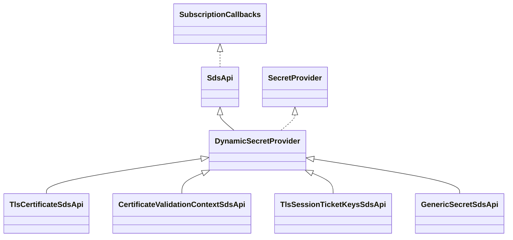

# `sds_api.{h,cc}`

This file contains the entire dynamic-SDS surface:

- **`SdsApi`** — abstract base implementing `Envoy::Config::SubscriptionCallbacks`. Owns the gRPC subscription, the
  init target, the filesystem watcher, the hash bookkeeping, and the rotation loop.
- **`DynamicSecretProvider<T>`** — template glue that combines `SdsApi` (xDS callbacks) with `SecretProvider<T>`
  (consumer-facing API). The four typed subclasses below extend it.
- **`TlsCertificateSdsApi`** — manages a `TlsCertificate`. Supports filename + watched-directory rotation.
- **`CertificateValidationContextSdsApi`** — manages a `CertificateValidationContext` (trusted CAs, CRLs).
  Supports filename + watched-directory rotation; runs `validation_callback_manager_` on update so consumers can
  veto e.g. removed CA bundles before they take effect.
- **`TlsSessionTicketKeysSdsApi`** — manages STKs. No filesystem indirection (proto carries inline bytes only).
- **`GenericSecretSdsApi`** — manages a `GenericSecret`. Filenames supported via the consumer-side
  `Config::DataSource::read` path; no in-folder file watching for legacy reasons.

## The abstract base

```cpp
class SdsApi : public Config::SubscriptionCallbacks {
public:
  struct SecretData {
    const std::string resource_name_;
    std::string version_info_;
    SystemTime last_updated_;
  };
  SdsApi(sds_config, name, subscription_factory, time_source, validation_visitor,
         stats, destructor_cb, dispatcher, api, warm);

  const SecretData& secretData() const;

protected:
  // implementation hooks (pure or default)
  virtual void setSecret(const envoy::Secret&) PURE;
  virtual void resolveSecret(const FileContentMap&) {};
  virtual void validateConfig(const envoy::Secret&) PURE;
  virtual std::vector<std::string> getDataSourceFilenames() PURE;
  virtual Config::WatchedDirectory* getWatchedDirectory() PURE;

  Common::CallbackManager<absl::Status> update_callback_manager_;
  Common::CallbackManager<absl::Status> remove_callback_manager_;

  // SubscriptionCallbacks
  absl::Status onConfigUpdate(resources, version) override;
  absl::Status onConfigUpdate(added, removed, sys_version) override;
  void         onConfigUpdateFailed(reason, ex) override;

  void onWatchUpdate();          // fired by Filesystem::Watcher / WatchedDirectory
  void initialize(bool warm);    // first run after init_target_ fires
  void resolveDataSource(files, data_source);
};
```

The constructor is split deliberately:

- **`SdsApi(...)` body** sets up everything that can throw — including the `subscription_` from
  `subscription_factory_.subscriptionFromConfigSource(...)`. The comment in `initialize()` warns explicitly: *"Don't
  put any code here that can throw exceptions, this has been the cause of multiple hard-to-diagnose regressions."*
- **`initialize(warm)`** is bound into the `Init::SharedTargetImpl` callback and runs only when the init manager
  fires its targets. It calls `subscription_->start({sds_config_name_})` and, in the `warm = false` mode, immediately
  marks itself ready.

### `onConfigUpdate` — SOTW path



The double-hash design is what makes rotation work:

- `secret_hash_` covers the **proto from xDS**. If xDS resends an identical proto (without filename or content
  changes), the path short-circuits without touching the filesystem.
- `files_hash_` covers the **bytes on disk**. It changes when key material rotates on the filesystem even though the
  xDS proto is unchanged.

`onConfigUpdate` always recomputes `files_hash_` even on a "real" xDS change so that subsequent `onWatchUpdate` calls
have a baseline to compare against.

### `onConfigUpdate` — delta path

```cpp
absl::Status onConfigUpdate(added, removed, system_version) {
  validateUpdateSize(added.size(), removed.size());
  if (removed.size() == 1) {
    ENVOY_LOG_MISC(trace, "Server sent a delta SDS update removing a resource...");
    remove_callback_manager_.runCallbacks();
    init_target_.ready();
    return OkStatus();
  }
  return onConfigUpdate(added_resources, added_resources[0].get().version());
}
```

SDS is treated as a **singleton subscription**: at most one resource at any moment. Removal is ACKed (so the xDS
server doesn't retransmit) but the existing secret stays in place until the owning listener/cluster goes away. The
`remove_callback_manager_` exists for the rare consumer that wants to know about the removal — currently nothing in
the tree subscribes.

`validateUpdateSize` enforces `added + removed in {1, 2}`. Two simultaneous updates (1 added, 1 removed) are
nonsensical but permitted because NACKing them is more disruptive than ignoring; the code falls through to the SOTW
path with `added_resources[0]`.

### `onConfigUpdateFailed`

```cpp
ASSERT(reason != ConnectionFailure);
init_target_.ready();
```

Connection failures never reach this callback — the subscription factory retries them transparently. By the time we
get here, the failure is "real" (decode error, validation failure). We unblock startup unconditionally so a bad
initial payload doesn't deadlock the listener.

## The rotation loop

```cpp
void SdsApi::onWatchUpdate() {
  TRY_ASSERT_MAIN_THREAD {
    uint64_t prev_hash = 0;
    FileContentMap files = loadFiles();
    uint64_t next_hash = getHashForFiles(files);
    for (uint64_t bounded_retries = 5; next_hash != prev_hash && bounded_retries > 0; --bounded_retries) {
      files = loadFiles();
      prev_hash = next_hash;
      next_hash = getHashForFiles(files);
    }
    if (next_hash != prev_hash) {
      ENVOY_LOG_MISC(warn, "Unable to atomically refresh secrets due to > 5 non-atomic rotations observed");
    }
    if (next_hash != files_hash_) {
      resolveSecret(files);
      update_callback_manager_.runCallbacks();
      files_hash_ = next_hash;
      secret_data_.last_updated_ = time_source_.systemTime();
      init_target_.ready();
    }
  }
  CATCH(const EnvoyException& e, {
    ENVOY_LOG_MISC(warn, "Failed to reload certificates: {}", e.what());
    sds_api_stats_.key_rotation_failed_.inc();
  });
}
```



Notes:

- **`TRY_ASSERT_MAIN_THREAD`** — this is invoked from a `Filesystem::Watcher` callback on the main thread; the
  catch handler exists because `loadFiles`, `resolveSecret`, and the user callbacks can all throw, and we don't want
  a single bad rotation to crash the server.
- **`init_target_.ready()` in the callback** is idempotent and tolerated. The early `init_target_.ready()` paths above
  cover the first push; this call covers the case where the very first attempt failed to load files (so init_target_
  was never marked ready) and a subsequent rotation succeeds.

## Per-file vs. watched-directory watching

Two mutually exclusive mechanisms:

| Mode                   | Trigger                                         | When used                                                                   |
|------------------------|-------------------------------------------------|-----------------------------------------------------------------------------|
| **Per-file watcher**   | `Filesystem::Watcher` on parent directory(ies)  | Default: payload has at least one filename specifier and no `watched_directory` |
| **Watched directory**  | `Config::WatchedDirectory` with explicit path   | Payload explicitly opts in via `watched_directory` field                    |

Why watch the **parent directory** rather than the file itself? Kubernetes (and most secret stores) rotate by
symlink swap: a new versioned subdirectory is created, then the active-version symlink is atomically `rename(2)`d to
point at it. That looks like a `MovedTo` event on the parent directory, not a content modification on the file. The
filter `Filesystem::Watcher::Events::MovedTo` captures exactly this.

`getDataSourceFilenames()` is the per-subclass extension point that lists which files matter; `getWatchedDirectory()`
returns non-null only when the subclass actively opts into directory mode in `setSecret()`.

## The four typed subclasses

| Subclass                              | `setSecret` extracts        | `resolveSecret` inlines                          | `validateConfig`            | `getDataSourceFilenames`                   | `getWatchedDirectory` |
|---------------------------------------|-----------------------------|--------------------------------------------------|-----------------------------|--------------------------------------------|-----------------------|
| `TlsCertificateSdsApi`                | `secret.tls_certificate()`  | `certificate_chain`, `private_key`               | no-op                       | filename of cert chain + key               | yes (if proto says)   |
| `CertificateValidationContextSdsApi`  | `secret.validation_context()` | `trusted_ca`, `crl`                           | runs validation callbacks   | filename of trusted_ca + crl               | yes (if proto says)   |
| `TlsSessionTicketKeysSdsApi`          | `secret.session_ticket_keys()` | (override absent → no-op)                     | runs validation callbacks   | empty                                       | always null           |
| `GenericSecretSdsApi`                 | `secret.generic_secret()`   | (override absent → no-op)                        | runs validation callbacks   | filename of `secret` or of each map entry  | always null           |

The validation-callback distinction matters in practice:

- For TLS certs, the consumer (cluster / listener TLS context) is fundamentally accepting whatever cert SDS hands it
  — there's nothing to validate at the SDS level.
- For validation contexts, a downstream listener may want to refuse e.g. an empty CA bundle that would silently
  trust everyone. Hence `validation_callback_manager_` with a `Status` return.
- For session keys, same logic — a zero-length key bundle would disable session resumption silently.
- For generic secrets, filters that depend on a specific length or format (HMAC keys, JWKS) use the validator.

`GenericSecretSdsApi::addUpdateCallback` is special-cased: unlike the other subclasses, it does **not** call the
callback immediately at registration time, because filters may not be ready to handle a secret value during their
own construction. Other subclasses (via the `DynamicSecretProvider<T>` default) do invoke the callback synchronously
if `secret() != nullptr` already.

## Inheritance recap



Two interfaces meet inside `DynamicSecretProvider<T>`: the xDS-facing `SubscriptionCallbacks` (via `SdsApi`) and the
consumer-facing `SecretProvider<T>`. The four leaves only specialize the protobuf wiring.

## Behaviour pitfalls

| Symptom                                                          | Cause                                                                                    |
|------------------------------------------------------------------|------------------------------------------------------------------------------------------|
| `sds.<name>.key_rotation_failed` counter incrementing           | `loadFiles` or `resolveSecret` throwing repeatedly — usually missing file or perms       |
| Listener stuck "warming" indefinitely                            | xDS subscription failing silently — `update_callback_manager_` never runs; check `version_info_ == "uninitialized"` in `/config_dump` |
| Cert appears to rotate but Envoy keeps using the old one        | Watch dir mismatch — `getDataSourceFilenames()` returns paths whose parent isn't the actual rotation target |
| "Unable to atomically refresh secrets" warning                   | k8s csi-driver or `cp -f` style rotation — switch to `watched_directory` mode if possible|
| `InvalidArgumentError` on first push                             | Secret resource `name` field doesn't match the `sds_config_name` we subscribed to        |
