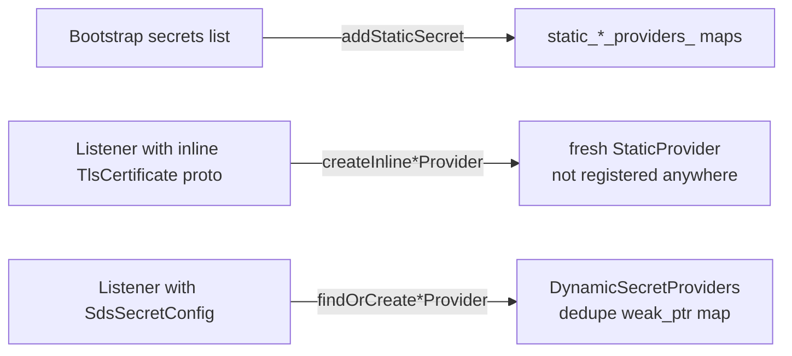
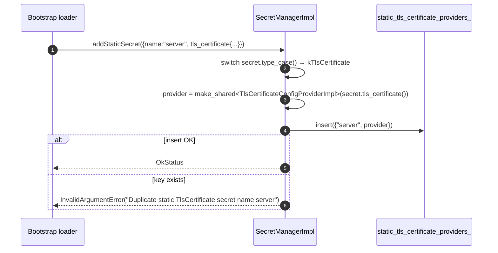
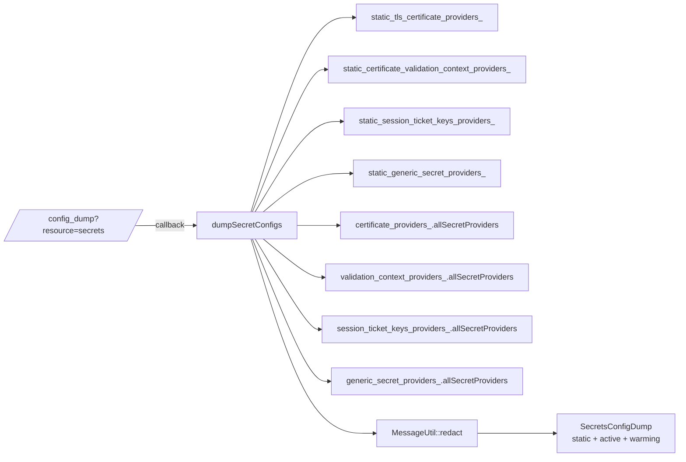

# `secret_manager_impl.{h,cc}`

`SecretManagerImpl` is the **server-wide singleton** that owns Envoy's secret registries. It is the only `SecretManager`
implementation in the tree, constructed once at boot and lent to the `Server::FactoryContext` so that any extension
that asks `factory_context.serverFactoryContext().secretManager()` gets the same instance.

It does three things:

1. Owns the **static** secret-provider maps (one per secret type).
2. Delegates **dynamic** dedupe to four `DynamicSecretProviders<T>` sub-objects (one per secret type).
3. Owns the **`secrets`** `/config_dump` admin entry.

## Public surface

```cpp
class SecretManagerImpl : public SecretManager {
public:
  SecretManagerImpl(OptRef<Server::ConfigTracker> config_tracker);

  // STATIC ---------------------------------------------------------
  absl::Status addStaticSecret(const envoy::Secret& secret) override;
  TlsCertificateConfigProviderSharedPtr            findStaticTlsCertificateProvider(name);
  CertificateValidationContextConfigProviderShared findStaticCertificateValidationContextProvider(name);
  TlsSessionTicketKeysConfigProviderSharedPtr      findStaticTlsSessionTicketKeysContextProvider(name);
  GenericSecretConfigProviderSharedPtr             findStaticGenericSecretProvider(name);

  // INLINE (per-listener, not registered) --------------------------
  TlsCertificateConfigProviderSharedPtr            createInlineTlsCertificateProvider(payload);
  CertificateValidationContextConfigProviderShared createInlineCertificateValidationContextProvider(payload);
  TlsSessionTicketKeysConfigProviderSharedPtr      createInlineTlsSessionTicketKeysProvider(payload);
  GenericSecretConfigProviderSharedPtr             createInlineGenericSecretProvider(payload);

  // DYNAMIC --------------------------------------------------------
  TlsCertificateConfigProviderSharedPtr findOrCreateTlsCertificateProvider(
      sds_cfg, name, ctx, OptRef<Init::Manager>, bool warm);
  CertificateValidationContextConfigProviderShared findOrCreateCertificateValidationContextProvider(
      sds_cfg, name, ctx, Init::Manager&);   // always warm
  TlsSessionTicketKeysConfigProviderShared findOrCreateTlsSessionTicketKeysContextProvider(
      sds_cfg, name, ctx, Init::Manager&);   // always warm
  GenericSecretConfigProviderSharedPtr findOrCreateGenericSecretProvider(
      sds_cfg, name, ctx, OptRef<Init::Manager>);   // always warm
};
```

The three groups (static, inline, dynamic) correspond to three different ways an Envoy config can reference a secret:



Inline and static both produce `StaticProvider<T>`; the difference is whether the manager keeps a record. Inline
providers are owned solely by their caller; static providers are owned by the manager (and shared with whoever calls
`findStatic*Provider`).

## Static registration

`addStaticSecret(secret)` switches on `secret.type_case()` and inserts a `StaticProvider<T>` keyed by `secret.name()`.
Duplicate names within a single proto-oneof slot return `InvalidArgumentError`. **The four static maps are independent
namespaces** — a static TLS certificate named `"foo"` does not collide with a static generic secret named `"foo"`.



## Dynamic dedupe (the inner class)

```cpp
template <class SecretType>
class DynamicSecretProviders {
  std::shared_ptr<SecretType> findOrCreate(
      sds_config, config_name, server_context, OptRef<Init::Manager>, bool warm) {
    const std::string map_key = absl::StrCat(MessageUtil::hash(sds_config), ".", config_name);

    std::shared_ptr<SecretType> secret_provider = dynamic_secret_providers_[map_key].lock();
    if (!secret_provider) {
      std::function<void()> unregister = [map_key, this]() { removeDynamicSecretProvider(map_key); };
      secret_provider = SecretType::create(server_context, sds_config, config_name, unregister, warm);
      dynamic_secret_providers_[map_key] = secret_provider;
    }

    if (init_manager) {
      init_manager->add(*secret_provider->initTarget());
    } else {
      secret_provider->start();
    }
    return secret_provider;
  }
};
```

The key shapes:

- **The map holds a `weak_ptr`.** The `shared_ptr` lives on the caller (listener, cluster, filter). When the last
  caller drops it, `~SdsApi` runs and calls `unregister`, which removes the map entry. There is no separate cleanup
  loop.
- **`init_manager.add(*initTarget())` runs on *both* fresh and reused providers.** Reusing the subscription doesn't
  let you skip warming — the new owning listener still has to wait for the (potentially already-cached) secret.
- **The `OptRef<Init::Manager>` branch** handles the late-binding case: an oauth2 filter whose config arrives via xDS
  after the server has already finished its bootstrap init manager. Adding to an already-initialized manager would
  assert; instead the caller skips it and calls `start()` directly. That path implies `warm = true` would deadlock —
  the caller is expected to pass `warm = false` (or accept that `secret()` will return null until the first push
  lands).

```mermaid
sequenceDiagram
    autonumber
    participant Caller as Listener / Filter
    participant SM as SecretManagerImpl
    participant DSP as DynamicSecretProviders<TlsCertificateSdsApi>
    participant Map as dynamic_secret_providers_
    participant API as TlsCertificateSdsApi
    participant IM as Init::Manager

    Caller->>SM: findOrCreateTlsCertificateProvider(cfg, name, ctx, im, warm=true)
    SM->>DSP: findOrCreate(cfg, name, ctx, im, true)
    DSP->>DSP: map_key = "<hash(cfg)>.<name>"
    DSP->>Map: weak.lock()
    alt expired or absent
        DSP->>API: TlsCertificateSdsApi::create(ctx, cfg, name, unregister_cb, warm)
        DSP->>Map: insert weak_ptr
    end
    alt im present
        DSP->>IM: add(*API.initTarget())
    else cold-init branch
        DSP->>API: start() → subscription_->start({name}); init_target_.ready()
    end
    DSP-->>SM: shared_ptr<API>
    SM-->>Caller: shared_ptr<API>
```

## `/config_dump` for secrets

`dumpSecretConfigs(matcher)` walks **all eight** registries and produces an `envoy.admin.v3.SecretsConfigDump`. The
structure:

- `static_secrets[]` — one entry per static provider, with the secret packed into an `Any`.
- `dynamic_active_secrets[]` — dynamic providers that have received at least one xDS push (`secret() != nullptr`).
- `dynamic_warming_secrets[]` — dynamic providers still waiting on their first push.

Every dumped `envoy::Secret` is run through `MessageUtil::redact(...)` before packing, which scrubs proto fields
annotated with `[(udpa.annotations.sensitive) = true]` (cert private keys, generic-secret values, session-ticket key
material, etc.). The admin endpoint therefore exposes **names, version_info, last_updated, and structure** but not
the actual key bytes.



## Construction & singleton lifetime

```cpp
SecretManagerImpl::SecretManagerImpl(OptRef<Server::ConfigTracker> config_tracker) {
  if (config_tracker.has_value()) {
    config_tracker_entry_ = config_tracker->add("secrets", [this](const Matchers::StringMatcher& m){
      return dumpSecretConfigs(m);
    });
  }
}
```

No `RELEASE_ASSERT` here — `add()` can return null if `"secrets"` is already registered, but the constructor simply
drops the entry on the floor. In practice the server only constructs one `SecretManagerImpl`, so the entry is
unconditionally registered.

The manager outlives every listener, cluster, and filter that ever held a secret. Static providers go away with the
manager; dynamic providers are cleaned up before — at the moment their last shared_ptr drops, via the `Cleanup`
trampoline in `SdsApi`.

## Behaviour pitfalls

| Symptom                                                          | Cause / where to look                                                     |
|------------------------------------------------------------------|---------------------------------------------------------------------------|
| "Duplicate static * secret name" at bootstrap                    | two `static_secrets` entries with same name & same `oneof` slot          |
| `findStatic*Provider("foo")` returns null                        | the static secret is in a different `oneof` slot than the lookup type    |
| Two listeners share a subscription unexpectedly                  | their `(sds_config, name)` pairs hash to the same key                    |
| `add to already-initialized init manager` assertion              | dynamic SDS requested with `init_manager != nullopt` after server init   |
| Sensitive bytes in `/config_dump`                                | a custom proto field is missing the `(udpa.annotations.sensitive) = true` annotation |
| `dynamic_warming_secrets[]` entry stuck                          | first xDS push hasn't landed; subscription stream may be failing — check `sds.<name>.key_rotation_failed` and the gRPC stream metrics |
