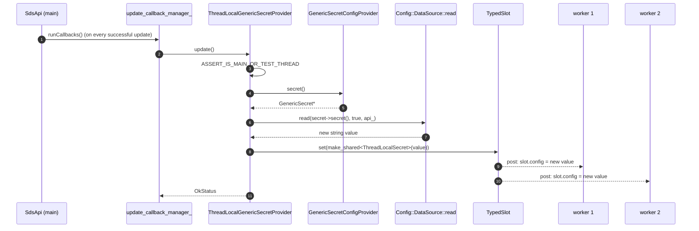

# `secret_provider_impl.{h,cc}`

Two unrelated classes live in this file:

1. **`StaticProvider<T>`** — the trivial `SecretProvider<T>` for static and inline secrets.
2. **`ThreadLocalGenericSecretProvider`** — an adapter for filters that want a thread-safe, hot-path-friendly view
   of a generic secret value.

They share a header because they're both "secret-provider utilities", but their internals have nothing in common.

---

## `StaticProvider<T>`

```cpp
template <typename SecretType> class StaticProvider : public SecretProvider<SecretType> {
public:
  explicit StaticProvider(const SecretType& secret)
      : secret_(std::make_unique<SecretType>(secret)) {}

  const SecretType* secret() const override { return secret_.get(); }

  // The callbacks are all no-ops — nothing ever changes.
  Common::CallbackHandlePtr addValidationCallback(std::function<absl::Status(const SecretType&)>) override { return nullptr; }
  Common::CallbackHandlePtr addUpdateCallback(std::function<absl::Status()>) override    { return nullptr; }
  Common::CallbackHandlePtr addRemoveCallback(std::function<absl::Status()>) override    { return nullptr; }

  void start() override {}                          // SecretProvider interface, no-op

private:
  const std::unique_ptr<SecretType> secret_;
};

using TlsCertificateConfigProviderImpl                = StaticProvider<TlsCertificate>;
using CertificateValidationContextConfigProviderImpl  = StaticProvider<CertificateValidationContext>;
using TlsSessionTicketKeysConfigProviderImpl          = StaticProvider<TlsSessionTicketKeys>;
using GenericSecretConfigProviderImpl                 = StaticProvider<GenericSecret>;
```

### What it does

It is intentionally inert. The constructor copies the secret into a heap-allocated `unique_ptr`. `secret()` returns
that pointer. All three callback registrations return `nullptr`, which by the `SecretProvider<T>` contract means "we
will never call you, please don't hold a handle".

### Why this is enough

Static and inline secrets, by definition, do not change at runtime. The consumer (TLS context, filter, …) reads
`secret()` exactly once during construction and again only if it explicitly rebuilds (which the static provider
never asks it to). There's no need for an init target either — the secret is available immediately.

`start()` exists because `SecretProvider<T>` is the same interface used by `SdsApi` subclasses, which need a "fire
the subscription now" entry point. For static providers there's nothing to fire.

### When it gets used

```mermaid
flowchart LR
    BS[Bootstrap static_secrets] --> SM[SecretManager.addStaticSecret]
    SM --> Static1[StaticProvider<TlsCertificate>]
    Static1 --> Map[(static_tls_certificate_providers_)]
    Map -.findStaticTlsCertificateProvider("name").-> TLS[Cluster / Listener TLS ctx]

    Inline[Listener with inline TlsCertificate proto] --> SM2[SecretManager.createInlineTlsCertificateProvider]
    SM2 --> Static2[StaticProvider<TlsCertificate>]
    Static2 -.no registration.-> TLS2[Same listener's TLS ctx]
```

Same class, two callers:

- **Static** path goes through `addStaticSecret(secret)` → manager-owned entry in a map → shared by name lookups.
- **Inline** path goes through `createInline*Provider(payload)` → caller-owned, manager doesn't keep a record.

Both produce structurally identical providers. The TLS extension code doesn't need to distinguish them.

---

## `ThreadLocalGenericSecretProvider`

```cpp
class ThreadLocalGenericSecretProvider {
public:
  static absl::StatusOr<std::unique_ptr<ThreadLocalGenericSecretProvider>>
  create(GenericSecretConfigProviderSharedPtr&& provider, ThreadLocal::SlotAllocator& tls, Api::Api& api);

  const std::string& secret() const;          // returns reference into per-worker slot

protected:
  ThreadLocalGenericSecretProvider(provider, tls, api, &creation_status);

private:
  struct ThreadLocalSecret : public ThreadLocal::ThreadLocalObject {
    explicit ThreadLocalSecret(const std::string& value) : value_(value) {}
    std::string value_;
  };

  absl::Status update();                       // main-thread re-read + tls_->set
  GenericSecretConfigProviderSharedPtr provider_;
  Api::Api& api_;
  ThreadLocal::TypedSlotPtr<ThreadLocalSecret> tls_;
  Common::CallbackHandlePtr cb_;               // registered on provider_; MUST be last
};
```

### Why it exists

Generic secrets are opaque strings — a JWKS payload, an HMAC key, a basic-auth credential, etc. Filters in the
hot path want to:

- read the value **without a lock** and **without a copy** (just a `const std::string&`);
- be notified when the value rotates so they can re-sign / re-verify with the new key.

`SdsApi` runs entirely on the main thread, so `GenericSecretConfigProviderSharedPtr::secret()` is also a main-thread
call. Workers can't safely touch it. `ThreadLocalGenericSecretProvider` is the bridge.

### Constructor sequence

```mermaid
sequenceDiagram
    autonumber
    participant F as Filter (main thread)
    participant TLP as ThreadLocalGenericSecretProvider
    participant TLS as ThreadLocal::SlotAllocator
    participant DS as Config::DataSource::read
    participant Prov as Generic SecretProvider (static or SDS)

    F->>TLP: create(provider_shared, tls_alloc, api)
    TLP->>TLS: TypedSlot<ThreadLocalSecret>(tls_alloc)
    TLP->>Prov: addUpdateCallback([this]{return update();})
    Prov-->>TLP: CallbackHandlePtr (cb_)
    TLP->>Prov: secret()
    alt provider has secret already
        Prov-->>TLP: GenericSecret*
        TLP->>DS: read(secret->secret(), allow_empty=true, api)
        DS-->>TLP: string value
    else null (cold-init)
        TLP-->>TLP: value = ""
    end
    TLP->>TLS: set(make_shared<ThreadLocalSecret>(value))
    TLP-->>F: unique_ptr<TLP>
```

The `cb_` field is declared **last** in the struct so it destructs first — when the provider is torn down, the
callback handle is removed from the provider's `update_callback_manager_` before the slot is freed. Otherwise an
in-flight `update()` could land on a destroyed slot.

### `update()` — what fires on rotation



Workers read `secret()` (which returns `(*tls_)->value_`) at their leisure. The `shared_ptr<ThreadLocalSecret>` held
by each worker's slot prevents the old string from going away while it's being read; the `runOnAllThreads` post in
`TypedSlot::set` swaps each worker's pointer atomically.

### `DataSource::read` and what it accepts

The constructor and `update` both delegate to `Config::DataSource::read(secret->secret(), /*allow_empty=*/true, api_)`.
That helper handles:

- `inline_string` — return as-is.
- `inline_bytes` — return as-is.
- `filename` — read the file (via the `Api::Api` filesystem abstraction).
- `environment_variable` — read the env var.

`allow_empty = true` means the helper returns an empty string instead of an error for an unset / empty source. That
matches the contract: "the secret is allowed to be empty; the filter will decide what to do".

The choice of "read on each rotation" rather than "read once and watch" is the reason there's no in-process file
watcher for generic secrets — see [`sds_api.md`](sds_api.md) for why `GenericSecretSdsApi::getWatchedDirectory()` is
hardcoded to `nullptr`. Filters that depend on file-based generic secrets and need rotation to be picked up on disk
change must run a periodic timer (or use SDS with inline bytes).

### When to wrap vs. when not to

| Caller                                                  | Use `ThreadLocalGenericSecretProvider`?              |
|---------------------------------------------------------|------------------------------------------------------|
| Filter that reads the secret in the hot path           | **Yes** — locking on every request is unacceptable.  |
| Filter that reads only at config load                  | No — call `provider->secret()` once on the main thread. |
| TLS context / cluster                                   | No — TLS / cluster code reads on rebuild only, on the main thread. |
| oauth2 / jwt_authn / ext_authz with shared secret      | **Yes** — they verify per-request signatures.        |

### Failure modes

| Symptom                                              | Cause                                                                   |
|------------------------------------------------------|-------------------------------------------------------------------------|
| `create()` returns error                             | `Config::DataSource::read` failed (file missing, perm denied, etc.)     |
| `update()` returns error                             | same — the SDS provider will re-run the callback on the next update    |
| Worker reads empty string after rotation             | `update()` failed on main thread; the swap never happened              |
| Filter destructed but callback still fires           | `cb_` not declared last in the struct — bug; the order matters         |
