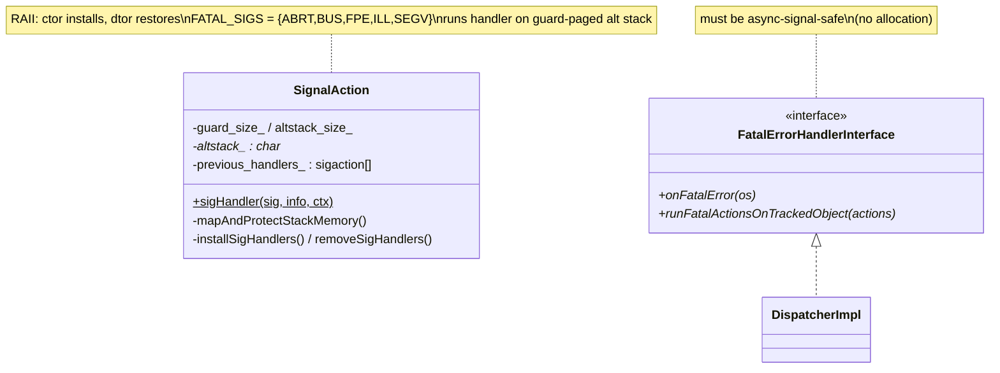
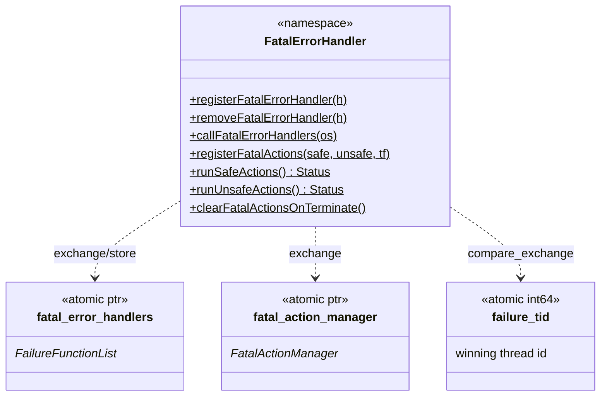
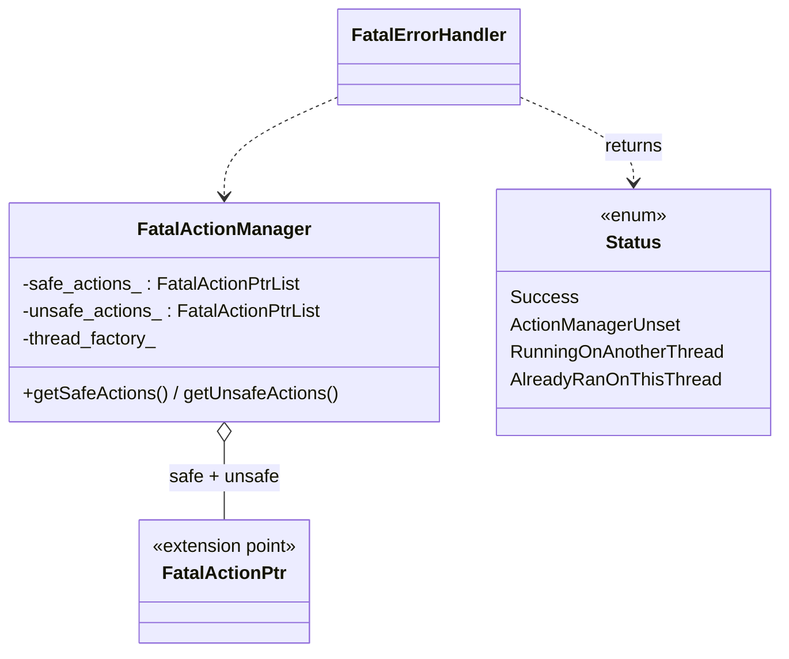

# Signal handling — class hierarchy (UML)

UML-style Mermaid for the signal/fatal-error types. See [`OVERVIEW.md`](OVERVIEW.md) for behavior.

---

## Core types

---

## The registry (free functions + atomics)

---

## Fatal actions

---

## Relationship summary

| Relationship | Type | Meaning |
|---|---|---|
| `SignalAction` (RAII) | lifecycle | Installs/removes handlers + alt stack. |
| `DispatcherImpl` → `FatalErrorHandlerInterface` | implements | Dumps tracked objects on crash. |
| `FatalErrorHandler` → `fatal_error_handlers` (atomic) | lock-free access | Read handler list during a crash. |
| `FatalErrorHandler` → `failure_tid` (atomic) | election | Only one thread runs fatal actions. |
| `FatalActionManager` → `FatalActionPtr` | composition | Safe + unsafe action buckets from extensions. |
| `runSafeActions/runUnsafeActions` → `Status` | result | Tells caller how to proceed. |
