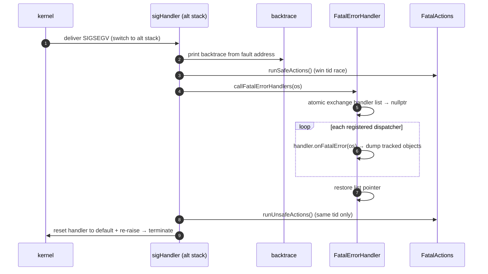
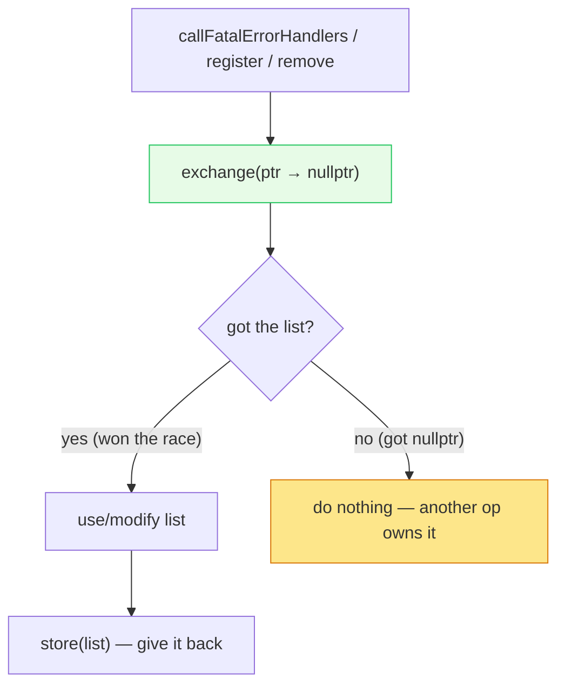

# Signal handling — architecture & design

The handler install, the crash sequence, the async-signal-safe registry, and fatal actions. Read
[`README.md`](README.md) first.

---

## Part 1 — `SignalAction`: install on a guarded alt stack

`SignalAction` is RAII: construct it (ideally in `main()`) and it installs handlers; destroy it and they're
removed. The signals it handles:

```cpp
static constexpr int FATAL_SIGS[] = {SIGABRT, SIGBUS, SIGFPE, SIGILL, SIGSEGV};
```

### The alternate stack (and why)

If the crash is a **stack overflow**, the normal stack is unusable — so the handler must run elsewhere. The
constructor `mmap`s an anonymous region and brackets the usable area with two **guard pages** marked `PROT_NONE`:

```
+-----------+-------------------------------+-----------+
| guard pg  |   alt signal stack (usable)   | guard pg  |   ← PROT_NONE on both ends
+-----------+-------------------------------+-----------+
```

```cpp
guard_size_    = sysconf(_SC_PAGE_SIZE);
altstack_size_ = max(guard_size_*4, round_up(MINSIGSTKSZ, page));
mapSizeWithGuards() = altstack_size_ + guard_size_*2;
```

The guard pages mean that if the handler *itself* overflows, it hits `PROT_NONE` and faults deterministically
instead of silently corrupting memory. `sigaltstack()` + `SA_ONSTACK` tell the kernel to switch to this stack when
delivering the fatal signals.

### Save and restore

The constructor saves the previous `sigaction` and altstack; the destructor restores them. This lets `SignalAction`
nest at multiple scopes (e.g. a test installs its own). **But** the handler does *not* restore on the way out — by
design:

> "we do NOT restore the previously saved sigaction and alt stack in the signal handler itself. This is fraught
> with complexity and has little benefit. The innermost SignalAction will terminate the process by re-raising the
> fatal signal with default handler."

---

## Part 2 — the crash sequence



The split between **safe** and **unsafe** actions matters: safe actions run first (and are the only ones that run
if something is uncertain); unsafe actions (which might do riskier things) run only after, and only on the same
thread that won the race.

---

## Part 3 — the async-signal-safe registry

The crux: how do you maintain a *list* of crash handlers that can be safely read inside a signal handler, when you
can't take a lock? Answer: an **atomic pointer**, swapped to `nullptr` while in use.

```cpp
ABSL_CONST_INIT std::atomic<FailureFunctionList*> fatal_error_handlers{nullptr};
```

### Reading the list during a crash (`callFatalErrorHandlers`)

```cpp
void callFatalErrorHandlers(std::ostream& os) {
  FailureFunctionList* list = fatal_error_handlers.exchange(nullptr);  // take ownership atomically
  if (list != nullptr) {
    for (const auto* handler : *list) { handler->onFatalError(os); }
    fatal_error_handlers.store(list);                                   // put it back
  }
}
```



This is **lock-free by construction**: if the crash handler and a concurrent `registerFatalErrorHandler` race, one
gets the list and the other gets `nullptr` and bails. The cost: if the crash handler loses the race, it skips the
custom dumps (acceptable — we're crashing anyway and must not deadlock).

> Note: registration/removal are only active when compiled with `ENVOY_OBJECT_TRACE_ON_DUMP` (the tracked-object
> dumping feature). The atomic-exchange discipline is used on all paths regardless.

### One thread runs the actions (`runFatalActions`)

Multiple threads could crash simultaneously. Only one should run the fatal actions, and a thread that already ran
them shouldn't run them twice:

```cpp
int64_t expected_tid = -1;
if (failure_tid.compare_exchange_strong(expected_tid, my_tid)) {
  runFatalActionsInternal(safe_actions); return Success;     // I won → run
} else if (expected_tid == my_tid) {
  return AlreadyRanOnThisThread;                             // I already ran
}
return RunningOnAnotherThread;                               // someone else is running
```

The returned `FatalAction::Status` tells the caller how to proceed (e.g. another thread is handling it — just
wait/terminate).

---

## Part 4 — fatal actions (the extension point)

`FatalActionManager` holds two lists provided via config/extensions:

| Bucket | When it runs | Constraint |
|---|---|---|
| **safe actions** | first, by whichever thread wins the tid race | must be async-signal-safe |
| **unsafe actions** | after safe, same thread only | may do riskier work; best-effort |

`registerFatalActions(safe, unsafe, thread_factory)` creates the manager (stored as another atomic, consumed on
crash). `clearFatalActionsOnTerminate()` frees it during graceful shutdown. The manager is **not** behind a smart
pointer on the hot crash path on purpose — it's a raw atomic so it can be consumed without allocation.

---

## Part 5 — how the dispatcher plugs in

`DispatcherImpl` is the primary `FatalErrorHandlerInterface`:

- on construction it calls `registerFatalErrorHandler(*this)`,
- `onFatalError(os)` dumps its **tracked-object stack** (only if the crash is on this dispatcher's thread) — the
  chain of `ScopeTrackedObject`s (request → connection → …) that were executing,
- `runFatalActionsOnTrackedObject(actions)` runs the actions against that stack.

So a crash report can say *"thread worker_3 was processing this HTTP request on this downstream connection."* See
[`../event/OVERVIEW.md`](../event/OVERVIEW.md) Part 7.

---

## Design themes

| Theme | How `signal/` expresses it |
|---|---|
| **Async-signal-safety** | alt stack, atomic-exchange registry, no locks/alloc in handlers. |
| **Crash diagnosability** | backtrace + tracked-object dumps + extensible fatal actions. |
| **Robustness under chaos** | guard pages, single-thread election, lose-the-race-and-bail. |
| **Extensibility** | safe/unsafe fatal-action buckets via config. |

---

## Cross-references

- [`CLASS_HIERARCHY.md`](CLASS_HIERARCHY.md) — UML.
- [`../event/OVERVIEW.md`](../event/OVERVIEW.md) — the dispatcher as the main crash handler + tracked objects.
