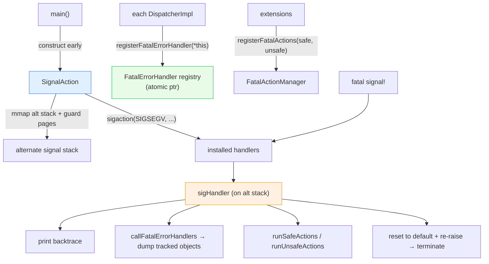

# `source/common/signal/` — fatal signal handling & crash reporting

When Envoy hits a fatal signal — `SIGSEGV`, `SIGABRT`, `SIGBUS`, `SIGFPE`, `SIGILL` — this folder is what turns a
silent core dump into a **useful crash report**: a backtrace, the chain of objects that were being processed
("what request, on what connection"), and any registered **fatal actions** (e.g. flush state, notify) — all done
**async-signal-safely**, which is a surprisingly hard constraint.

> **TL;DR** — this folder owns:
> - `SignalAction` — installs the signal handlers on a guarded alternate stack,
> - `FatalErrorHandler` — the registry of crash callbacks (dispatchers register themselves) + the
>   async-signal-safe machinery to invoke them on exactly one thread,
> - `FatalAction` — user/extension-provided actions split into "safe" and "unsafe" buckets,
> - `BacktraceObject` (via `server/backtrace.h`) — the stack unwind.

---

## Why this is hard: async-signal-safety

A signal handler can interrupt the program **at any instruction** — including in the middle of `malloc`, holding a
lock. So inside a handler you may call only [async-signal-safe](https://man7.org/linux/man-pages/man7/signal-safety.7.html)
functions: **no allocation, no locks, no `printf`.** This single constraint shapes everything here:

- handlers run on a **separate, pre-allocated, guard-paged stack** (so a stack-overflow crash can still unwind),
- the handler registry is accessed via an **atomic pointer exchange**, not a mutex,
- only **one thread** is allowed to run the fatal path (a `compare_exchange` on a thread-id wins the race),
- the registered callbacks are documented as "must not allocate."

---

## The one-paragraph mental model

`main()` instantiates a `SignalAction` very early, which `mmap`s an alternate signal stack (bracketed by
`PROT_NONE` guard pages) and installs handlers for the five fatal signals. Meanwhile, every `DispatcherImpl`
registers itself with `FatalErrorHandler` as a `FatalErrorHandlerInterface`. When a fatal signal fires,
`sigHandler` runs on the alt stack: it prints a backtrace, calls `callFatalErrorHandlers()` which (via atomic
pointer swap) walks the registered dispatchers and dumps each one's tracked-object stack, runs the registered
fatal actions (safe first, then unsafe — guarded so only the crashing thread runs them), resets the handler to
default, and re-raises the signal to actually terminate.

---

## Folder map

```
source/common/signal/
├── BUILD
├── signal_action.{h,cc}          # SignalAction — install handlers + alt stack (the entry point)
├── fatal_error_handler.{h,cc}    # FatalErrorHandler registry + FatalErrorHandlerInterface
├── fatal_action.h                # FatalAction::Manager + Status enum
└── signal_action_stubs / ...     # no-op build for platforms without signals
```

Related: `source/server/backtrace.h` (the unwinder), `source/common/event/dispatcher_impl.cc` (the biggest
`FatalErrorHandlerInterface` implementer), `envoy/server/fatal_action_config.h` (the extension point).

---

## Big picture



---

## Per-topic table

| Topic | Document | Source |
|---|---|---|
| Handler install, the crash sequence, async-signal-safety tricks, fatal actions | [`OVERVIEW.md`](OVERVIEW.md) | all files |
| Class hierarchy (UML) | [`CLASS_HIERARCHY.md`](CLASS_HIERARCHY.md) | interfaces + impls |

---

## Reading order

1. This `README.md` — the async-signal-safety constraint and the actors.
2. [`OVERVIEW.md`](OVERVIEW.md) — the install + crash sequence in detail.
3. [`CLASS_HIERARCHY.md`](CLASS_HIERARCHY.md) — UML map.
