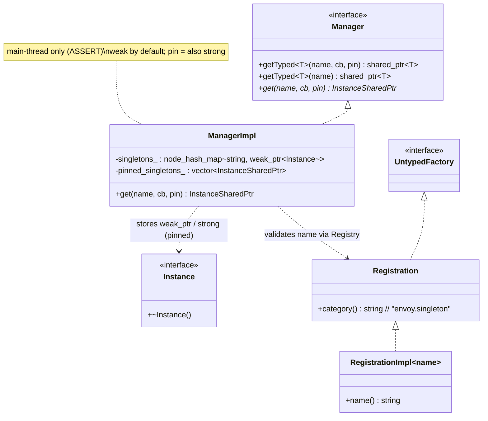
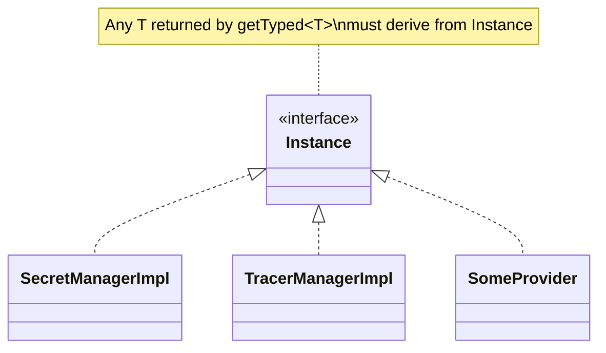
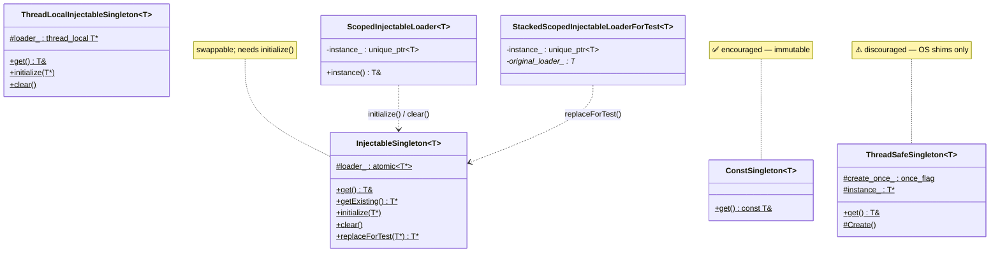

# Singleton — class hierarchy (UML)

UML-style Mermaid diagrams for the managed manager and the helper templates. See
[`OVERVIEW.md`](OVERVIEW.md) for behavior.

---

## Managed manager + registration

### Concrete singletons derive from `Instance`

---

## Header-only singleton templates

---

## Type & macro reference

| Symbol | Kind | Meaning |
|---|---|---|
| `Singleton::InstanceSharedPtr` | `shared_ptr<Instance>` | What the manager hands out. |
| `Singleton::ManagerPtr` | `unique_ptr<Manager>` | Server owns one. |
| `Singleton::SingletonFactoryCb` | `function<InstanceSharedPtr()>` | Lazy creation callback. |
| `SINGLETON_MANAGER_REGISTRATION(NAME)` | macro | Static-registers `"NAME_singleton"`. |
| `SINGLETON_MANAGER_REGISTERED_NAME(NAME)` | macro | Expands to the registered name symbol. |

---

## Relationship summary

| Relationship | Type | Meaning |
|---|---|---|
| `ManagerImpl` → `Instance` | weak (default) / strong (pinned) | Storage of managed singletons. |
| `ManagerImpl` → `Registration` | validation | Name must be in the registry. |
| `ScopedInjectableLoader` → `InjectableSingleton` | RAII | Install in ctor, clear in dtor. |
| `RegistrationImpl<name>` → `Registration` → `UntypedFactory` | inheritance | Static factory registration. |
