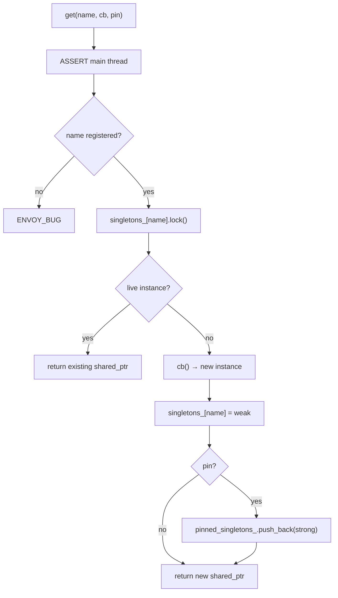
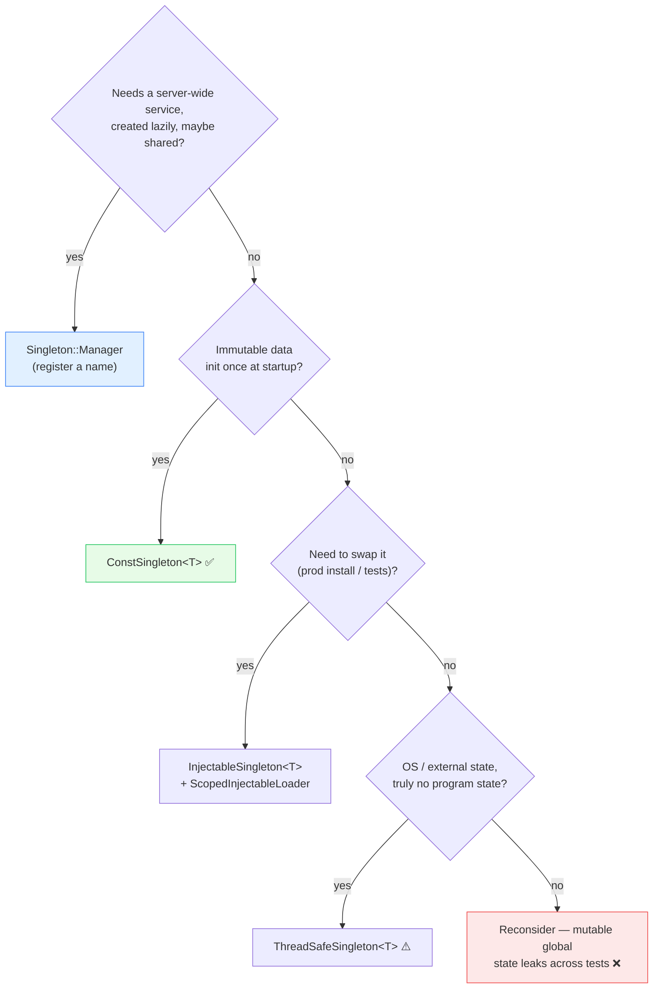

# Singleton — architecture & design

The managed `Singleton::Manager` and the header-only singleton templates: how each works, and — critically —
**which one to reach for** (and which to avoid).

Read [`README.md`](README.md) first.

---

## Part 1 — the managed Singleton Manager

### Roles

| Type | Interface | Impl | One-liner |
|---|---|---|---|
| **Manager** | `Singleton::Manager` | `ManagerImpl` | Name→instance registry, created once by the server. |
| **Instance** | `Singleton::Instance` | (your type) | Base class every managed singleton derives from. |
| **Registration** | `Singleton::Registration` | `RegistrationImpl<name>` | Static registration so names are known/validated. |

### Registration: names must be declared up front

A singleton name must be statically registered before use, via the macro:

```cpp
SINGLETON_MANAGER_REGISTRATION(secret_manager);   // creates "secret_manager_singleton"
// ... later, to reference the name:
SINGLETON_MANAGER_REGISTERED_NAME(secret_manager)
```

This expands to a `Registry::RegisterInternalFactory` of a `RegistrationImpl<name>`. The manager checks this
registry on every `get()` and `ENVOY_BUG`s if the name was never registered — catching typos and unregistered
singletons early.

### The `get` algorithm — weak by default, optional pin

```cpp
InstanceSharedPtr ManagerImpl::get(const std::string& name, SingletonFactoryCb cb, bool pin) {
  ASSERT_IS_MAIN_OR_TEST_THREAD();                                    // (1) main-thread only
  ENVOY_BUG(Registry::FactoryRegistry<Registration>::getFactory(name) != nullptr, ...);  // (2) name known?

  auto existing_singleton = singletons_[name].lock();                 // (3) try to promote weak_ptr
  if (existing_singleton == nullptr) {
    InstanceSharedPtr singleton = cb();                               // (4) miss → create
    singletons_[name] = singleton;                                    //     store WEAK
    if (pin && singleton != nullptr) {
      pinned_singletons_.push_back(singleton);                        // (5) optionally store STRONG
    }
    return singleton;
  } else {
    return existing_singleton;                                        // (6) hit → share it
  }
}
```



### Weak storage: the lifetime contract

The manager stores a **`weak_ptr`** by default. This has a crucial implication:

> **The caller must hold the returned `shared_ptr` for as long as the singleton is needed.** If every caller
> drops its reference, the singleton is destroyed — and the next `get()` will construct a fresh one.

This is intentional: it lets singletons that are only needed transiently be cleaned up. When a singleton should
live for the whole server lifetime regardless of who references it, pass `pin = true` so the manager also keeps a
strong reference in `pinned_singletons_`.

### Non-constructing get

```cpp
template <class T> std::shared_ptr<T> getTyped(const std::string& name);   // cb returns nullptr
```

Used when the caller can tolerate "not created yet" — returns `nullptr` rather than constructing.

### Why main-thread-only

`ManagerImpl` is deliberately **not** thread-safe (`absl::node_hash_map` + `vector`, no locks). Singletons are
created during server/config setup on the main thread; the `ASSERT_IS_MAIN_OR_TEST_THREAD()` enforces it. Worker
threads that need per-thread access use the TLS slot system ([`../thread_local/`](../thread_local/README.md))
instead, often fed by a singleton created here.

### `getTyped<T>` and RTTI

`getTyped` wraps `get` with `std::dynamic_pointer_cast<T>` — so if two callers disagree on the type behind a
name, the mismatch surfaces as a `nullptr` rather than UB.

---

## Part 2 — the header-only singleton templates

For cases that don't need the named registry, `threadsafe_singleton.h` and `const_singleton.h` provide simpler
global-access patterns. **Most are explicitly discouraged** — the file comments warn that mutable global state
"leaks" across tests and makes clean unit testing hard.

### `ConstSingleton<T>` — the encouraged one

```cpp
template <class T> class ConstSingleton {
public:
  static const T& get() {
    static T* instance = new T();   // lazy, thread-safe via static-init, never freed
    return *instance;
  }
};
```

For **immutable** data initialized once at startup: well-known name tables, canonical header strings, tag
constants. Safe because it's const — no cross-test state leakage. This is by far the most common helper; you'll
see `ConstSingleton` all over the codebase (e.g. `Http::Headers::get()`).

### `ThreadSafeSingleton<T>` — mutable global (discouraged)

```cpp
static T& get() {
  absl::call_once(create_once_, &Create);   // constructed exactly once
  return *instance_;
}
```

Globally accessible, non-const, **all methods must be thread-safe**. The header bluntly warns against it; the
sanctioned use is `OsSysCallsImpl` (where "state" is the OS, not the object). Anything that holds real mutable
program state here would leak across tests.

### `InjectableSingleton<T>` — must initialize, can swap

```cpp
static void initialize(T* value);   // once; RELEASE_ASSERTs if double-init or null
static T& get();                    // RELEASE_ASSERTs if used before initialize()
static T* replaceForTest(T*);       // atomic swap, returns old
static void clear();
```

A global that must be explicitly set up before access, backed by an `std::atomic<T*>`. The crypto `Utility`
singleton uses this (see [`../crypto/OVERVIEW.md`](../crypto/OVERVIEW.md)). The companion RAII helpers manage its
lifetime:

- **`ScopedInjectableLoader<T>`** — owns a `unique_ptr<T>`, calls `initialize()` in its ctor and `clear()` in its
  dtor. This is how production code installs the instance (e.g. the crypto utility registration).
- **`StackedScopedInjectableLoaderForTest<T>`** — saves the current instance, installs a test one, and restores
  the original on destruction. Enables clean per-test injection without leakage.

### `ThreadLocalInjectableSingleton<T>` — per-thread injected global

Same shape as `InjectableSingleton` but backed by a `thread_local T*`, so each thread has its own instance.

---

## Choosing the right tool



---

## What this folder does *not* do

- **It is not the TLS system.** Per-worker data lives in [`../thread_local/`](../thread_local/README.md). A
  managed singleton is one *main-thread* object; it may internally own a TLS slot to publish to workers.
- **The managed manager is not thread-safe.** Use it on the main thread only.
- **It does not control destruction order of pinned singletons** beyond "all dropped when the manager dies."
  Order-sensitive teardown belongs elsewhere (e.g. the TLS reverse-order teardown).

---

## Cross-references

- [`CLASS_HIERARCHY.md`](CLASS_HIERARCHY.md) — UML.
- [`../secret/secret_manager_impl.md`](../secret/secret_manager_impl.md) — a managed singleton in practice.
- [`../crypto/OVERVIEW.md`](../crypto/OVERVIEW.md) — `InjectableSingleton` in practice.
- [`../thread_local/README.md`](../thread_local/README.md) — the per-worker counterpart.
