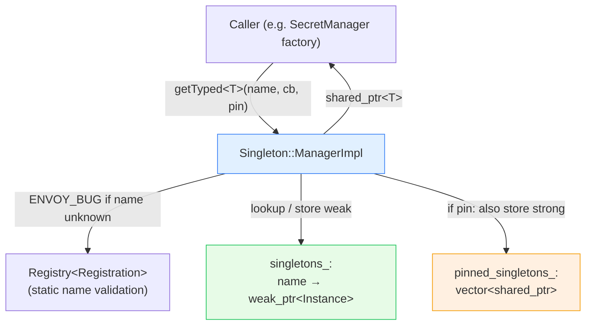

# `source/common/singleton/` — the Singleton Manager & singleton helpers

This folder provides Envoy's **managed singleton** facility: a name-keyed registry, owned by the server, that
hands out one shared instance of a thing on demand. It's how cross-cutting services that should exist **once per
server** — the secret manager, the tracer manager, various providers — are created lazily and shared, without
resorting to global variables.

It also contains a handful of **header-only singleton templates** (`ConstSingleton`, `ThreadSafeSingleton`,
`InjectableSingleton`, …) for the cases where the managed registry is overkill.

> **TL;DR** — this folder owns:
> - `ManagerImpl` — the server's name→instance registry (`Singleton::Manager`), main-thread-only, weak by
>   default with optional pinning,
> - `ConstSingleton<T>` — lazy immutable global (the safe, encouraged one),
> - `ThreadSafeSingleton<T>` / `InjectableSingleton<T>` / `ThreadLocalInjectableSingleton<T>` — mutable globals
>   for narrow cases (discouraged; mainly OS-syscall shims and test injection).

---

## The one paragraph mental model

Code that needs a server-wide singleton calls `manager.getTyped<T>(name, factory_cb)`. The manager looks `name`
up in its map: if a live instance already exists it returns that; otherwise it runs `factory_cb` to create one,
stores a **weak** pointer, and returns the new shared pointer. Because the stored pointer is weak, the singleton
is destroyed when the **last caller** drops its `shared_ptr` — unless it was created with `pin = true`, in which
case the manager also keeps a strong reference for the server's lifetime. Names must be pre-registered statically
via the `SINGLETON_MANAGER_REGISTRATION` macro, which the manager verifies.

---

## Folder map

```
source/common/singleton/
├── BUILD
├── manager_impl.{h,cc}       # ManagerImpl — the managed registry (Singleton::Manager)
├── const_singleton.h         # ConstSingleton<T> — lazy immutable global
└── threadsafe_singleton.h    # ThreadSafeSingleton / InjectableSingleton / ThreadLocalInjectableSingleton
                              #   + ScopedInjectableLoader / StackedScopedInjectableLoaderForTest
```

The **interfaces** live under `envoy/singleton/`:

```
envoy/singleton/
├── instance.h   # Singleton::Instance (base type all managed singletons derive from)
└── manager.h    # Singleton::Manager + Registration + SINGLETON_MANAGER_REGISTRATION macro
```

---

## Per-topic table

| Topic | Document | Source |
|---|---|---|
| The managed manager + the helper templates, when to use which | [`OVERVIEW.md`](OVERVIEW.md) | everything in the folder |
| Class hierarchy (UML) | [`CLASS_HIERARCHY.md`](CLASS_HIERARCHY.md) | interfaces + impls + templates |

---

## Big picture



---

## The five singleton flavors at a glance

| Type | Mutable? | Lifetime | Keyed by | Typical use |
|---|---|---|---|---|
| `Singleton::Manager` (managed) | yes (the instance) | weak (or pinned) | runtime name string | server-wide services (secret mgr, tracer mgr) |
| `ConstSingleton<T>` | **no** (const) | forever (leaked) | the type `T` | immutable lookup tables (well-known names, header strings) |
| `ThreadSafeSingleton<T>` | yes | forever | the type `T` | OS syscall shim (`OsSysCallsImpl`) — discouraged otherwise |
| `InjectableSingleton<T>` | yes | until `clear()` | the type `T` | swappable global, must `initialize()` first |
| `ThreadLocalInjectableSingleton<T>` | yes | per-thread | the type `T` | per-thread injected global |

The folder is small but conceptually load-bearing — many other documented subsystems
([`../secret/`](../secret/README.md), [`../tracing/`](../tracing/README.md)) register themselves here.

---

## Reading order

1. This `README.md` — vocabulary and the five flavors.
2. [`OVERVIEW.md`](OVERVIEW.md) — the manager's weak/pin model, registration, and when to use each helper.
3. [`CLASS_HIERARCHY.md`](CLASS_HIERARCHY.md) — UML map.
