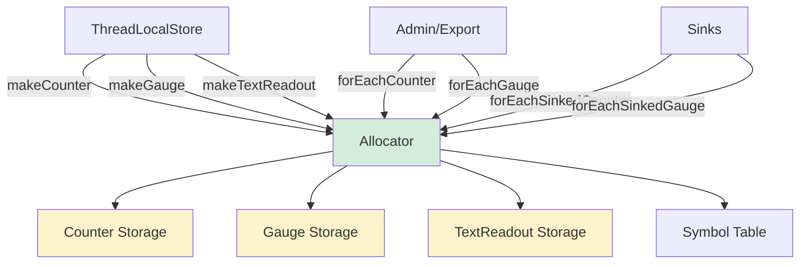
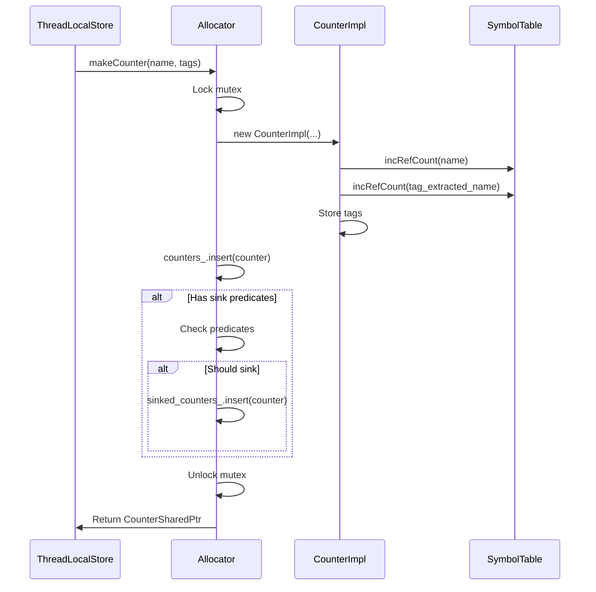
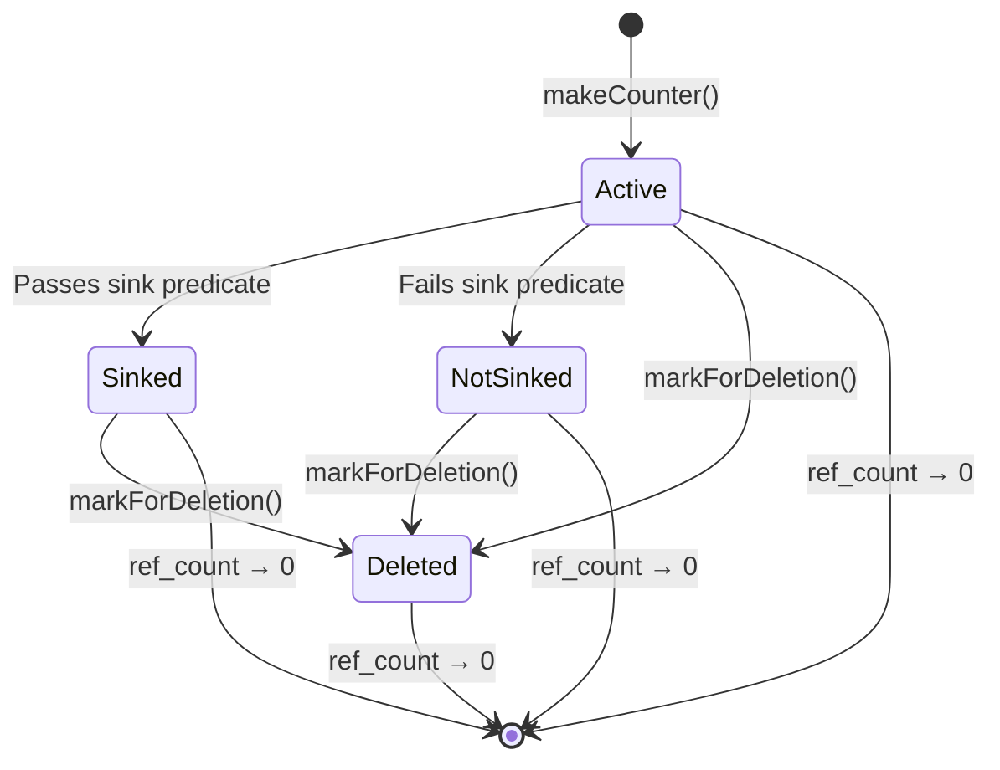

# Allocator: Memory Management for Stats

## Overview

The Allocator class is the **central memory manager** for Envoy's statistics system. It creates, stores, and manages the lifecycle of Counter, Gauge, and TextReadout objects, providing thread-safe allocation with efficient iteration and filtering capabilities.

**Key Files:**
- `allocator.h` (155 lines) - Interface and core functionality
- `allocator.cc` (implementation details)

**Relationship:** The Allocator is used by ThreadLocalStoreImpl to manage the central cache of stat objects.

## Purpose and Responsibilities

The Allocator serves multiple critical functions:

1. **Stat Creation:** Factory for Counter, Gauge, and TextReadout objects
2. **Centralized Storage:** Maintains authoritative set of all stats
3. **Memory Management:** Controls allocation and deallocation
4. **Iteration Support:** Enables traversal of all stats
5. **Sink Filtering:** Manages which stats are exported to sinks
6. **Rejection Handling:** Safely manages deleted/rejected stats



## Core Interface

### Allocator Class

```cpp
class Allocator {
public:
  Allocator(SymbolTable& symbol_table);
  virtual ~Allocator();
  
  // Stat creation
  CounterSharedPtr makeCounter(StatName name,
                               StatName tag_extracted_name,
                               const StatNameTagVector& stat_name_tags);
  
  GaugeSharedPtr makeGauge(StatName name,
                          StatName tag_extracted_name,
                          const StatNameTagVector& stat_name_tags,
                          Gauge::ImportMode import_mode);
  
  TextReadoutSharedPtr makeTextReadout(StatName name,
                                       StatName tag_extracted_name,
                                       const StatNameTagVector& stat_name_tags);
  
  // Symbol table access
  SymbolTable& symbolTable();
  const SymbolTable& constSymbolTable() const;
  
  // Iteration
  void forEachCounter(SizeFn f_size, StatFn<Counter> f_stat) const;
  void forEachGauge(SizeFn f_size, StatFn<Gauge> f_stat) const;
  void forEachTextReadout(SizeFn f_size, StatFn<TextReadout> f_stat) const;
  
  // Sink filtering
  void forEachSinkedCounter(SizeFn f_size, StatFn<Counter> f_stat) const;
  void forEachSinkedGauge(SizeFn f_size, StatFn<Gauge> f_stat) const;
  void forEachSinkedTextReadout(SizeFn f_size, StatFn<TextReadout> f_stat) const;
  
  void setSinkPredicates(std::unique_ptr<SinkPredicates>&& sink_predicates);
  
  // Rejection handling
  void markCounterForDeletion(const CounterSharedPtr& counter);
  void markGaugeForDeletion(const GaugeSharedPtr& gauge);
  void markTextReadoutForDeletion(const TextReadoutSharedPtr& text_readout);
};
```

## Internal Storage Structure

The Allocator maintains several internal data structures:

```cpp
class Allocator {
private:
  mutable Thread::MutexBasicLockable mutex_;
  
  // Primary stat storage
  StatSet<Counter> counters_ ABSL_GUARDED_BY(mutex_);
  StatSet<Gauge> gauges_ ABSL_GUARDED_BY(mutex_);
  StatSet<TextReadout> text_readouts_ ABSL_GUARDED_BY(mutex_);
  
  // Stats participating in sink flush
  StatPointerSet<Counter> sinked_counters_ ABSL_GUARDED_BY(mutex_);
  StatPointerSet<Gauge> sinked_gauges_ ABSL_GUARDED_BY(mutex_);
  StatPointerSet<TextReadout> sinked_text_readouts_ ABSL_GUARDED_BY(mutex_);
  
  // Deleted stats (kept alive for safety)
  std::vector<CounterSharedPtr> deleted_counters_ ABSL_GUARDED_BY(mutex_);
  std::vector<GaugeSharedPtr> deleted_gauges_ ABSL_GUARDED_BY(mutex_);
  std::vector<TextReadoutSharedPtr> deleted_text_readouts_ ABSL_GUARDED_BY(mutex_);
  
  // Sink filtering
  std::unique_ptr<SinkPredicates> sink_predicates_;
  
  // Symbol table reference
  SymbolTable& symbol_table_;
  
  // Test synchronization
  Thread::ThreadSynchronizer sync_;
};
```

### StatSet Template

StatSet is a helper for managing sets of stats:

```cpp
template <class StatType>
class StatSet {
public:
  using Set = absl::flat_hash_set<StatType*>;
  
  void insert(StatType* stat);
  void erase(StatType* stat);
  
  void forEach(StatFn<StatType> fn) const;
  size_t size() const;
  
private:
  Set set_;
};
```

## Stat Creation Process

### Counter Creation



**Implementation:**

```cpp
CounterSharedPtr Allocator::makeCounter(
    StatName name,
    StatName tag_extracted_name,
    const StatNameTagVector& stat_name_tags) {
  
  Thread::LockGuard lock(mutex_);
  
  // Create the counter implementation
  Counter* counter = makeCounterInternal(name, tag_extracted_name, stat_name_tags);
  
  // Add to primary storage
  counters_.insert(counter);
  
  // Check if should be sinked
  if (!sink_predicates_ || sink_predicates_->includeCounter(*counter)) {
    sinked_counters_.insert(counter);
  }
  
  // Return as shared pointer
  return CounterSharedPtr(counter);
}
```

### Gauge Creation

Gauges have additional complexity due to import modes:

```cpp
GaugeSharedPtr Allocator::makeGauge(
    StatName name,
    StatName tag_extracted_name,
    const StatNameTagVector& stat_name_tags,
    Gauge::ImportMode import_mode) {
  
  Thread::LockGuard lock(mutex_);
  
  // Create gauge with import mode
  auto gauge = std::make_shared<GaugeImpl>(
      name, tag_extracted_name, stat_name_tags,
      *this, import_mode);
  
  gauges_.insert(gauge.get());
  
  if (!sink_predicates_ || sink_predicates_->includeGauge(*gauge)) {
    sinked_gauges_.insert(gauge.get());
  }
  
  return gauge;
}
```

**Import Modes:**

```cpp
enum class ImportMode {
  Uninitialized,      // Default: not yet set
  Accumulate,         // Add parent process value (hot restart)
  NeverImport,        // Ignore parent process value
  HiddenAccumulate    // Accumulate but don't export to sinks
};
```

## Memory Management and Lifecycle

### Reference Counting

Stats use shared_ptr for automatic memory management:

```cpp
// When created
CounterSharedPtr counter = allocator.makeCounter(...);
// ref_count = 1

// Stored in central cache
central_cache[name] = counter;
// ref_count = 2

// Cached in TLS (as reference)
tls_cache[name] = std::ref(*counter);
// ref_count = 2 (references don't increment)

// Central cache cleared
central_cache.erase(name);
// ref_count = 1

// Original pointer destroyed
counter.reset();
// ref_count = 0 → Counter destroyed
```

### Stat Destruction

When a stat's ref-count reaches zero, it's automatically destroyed:

```cpp
CounterImpl::~CounterImpl() {
  // Free StatName memory
  free(alloc_.symbolTable());
  
  // Decrement symbol ref-counts
  symbol_table_.free(name_);
  symbol_table_.free(tag_extracted_name_);
  
  // Clear tags (decrements tag symbol ref-counts)
  clearTags(symbol_table_);
}
```

### Deletion vs. Rejection

When a stat is rejected (e.g., by StatsMatcher), it's moved to deleted storage:

```cpp
void Allocator::markCounterForDeletion(const CounterSharedPtr& counter) {
  Thread::LockGuard lock(mutex_);
  
  // Remove from active sets
  counters_.erase(counter.get());
  sinked_counters_.erase(counter.get());
  
  // Move to deleted storage (keeps alive)
  deleted_counters_.push_back(counter);
}
```

**Why Keep Deleted Stats Alive?**

Some code may hold references (Counter&) to stats. If we immediately destroy rejected stats, those references become dangling. By moving to deleted storage, we keep the objects alive for safety.



## Iteration and Export

### Basic Iteration

```cpp
void Allocator::forEachCounter(SizeFn f_size, StatFn<Counter> f_stat) const {
  Thread::LockGuard lock(mutex_);
  
  if (f_size) {
    f_size(counters_.size());
  }
  
  counters_.forEach([&f_stat](Counter& counter) {
    f_stat(counter);
  });
}
```

**Usage:**

```cpp
allocator.forEachCounter(
  [](size_t num_counters) {
    std::cout << "Processing " << num_counters << " counters\n";
  },
  [](Counter& counter) {
    std::cout << counter.name() << ": " << counter.value() << "\n";
  }
);
```

### Sink-Filtered Iteration

Only iterate stats that should be exported to sinks:

```cpp
void Allocator::forEachSinkedCounter(SizeFn f_size, StatFn<Counter> f_stat) const {
  Thread::LockGuard lock(mutex_);
  
  if (f_size) {
    f_size(sinked_counters_.size());
  }
  
  for (Counter* counter : sinked_counters_) {
    f_stat(*counter);
  }
}
```

### Sink Predicates

Configure which stats are exported:

```cpp
struct SinkPredicates {
  virtual bool includeCounter(const Counter& counter) const = 0;
  virtual bool includeGauge(const Gauge& gauge) const = 0;
  virtual bool includeHistogram(const ParentHistogram& histogram) const = 0;
  virtual bool includeTextReadout(const TextReadout& text_readout) const = 0;
};

// Set predicates
allocator.setSinkPredicates(std::make_unique<MySinkPredicates>());

// Now forEachSinkedCounter only includes matching stats
allocator.forEachSinkedCounter(nullptr, [](Counter& c) {
  exportToPrometheus(c);
});
```

## Thread Safety

### Mutex Protection

All stat creation and iteration requires holding the mutex:

```cpp
mutable Thread::MutexBasicLockable mutex_;
```

**Operations Requiring Lock:**
- `makeCounter()`, `makeGauge()`, `makeTextReadout()`
- `forEachCounter()`, `forEachGauge()`, etc.
- `markCounterForDeletion()`
- `setSinkPredicates()`

**Lock-Free Operations:**
- Stat updates (Counter::inc(), Gauge::set())
- Stat reads (Counter::value(), Gauge::value())
- StatName access

### Deadlock Prevention

**Rule:** Never call back into Allocator or SymbolTable from iteration callbacks.

```cpp
// BAD: Creates potential deadlock
allocator.forEachCounter(nullptr, [&allocator](Counter& c) {
  // This tries to acquire mutex again!
  auto new_counter = allocator.makeCounter(...);  // DEADLOCK!
});

// GOOD: Collect first, then process
std::vector<CounterSharedPtr> counters;
allocator.forEachCounter(nullptr, [&counters](Counter& c) {
  counters.push_back(c.shared_from_this());
});

// Now safe to create new stats
for (auto& counter : counters) {
  process(counter);
}
```

## Stat Implementation Cooperation

### CounterImpl Example

```cpp
class CounterImpl : public Counter {
public:
  CounterImpl(StatName name, StatName tag_extracted_name,
              const StatNameTagVector& tags, Allocator& alloc)
      : name_(name), alloc_(alloc) {
    // Increment ref-counts on all StatNames
    alloc_.symbolTable().incRefCount(name);
    alloc_.symbolTable().incRefCount(tag_extracted_name);
    // ... store tags
  }
  
  ~CounterImpl() override {
    // Notify allocator we're being destroyed
    Thread::LockGuard lock(alloc_.mutex_);
    alloc_.counters_.erase(this);
    alloc_.sinked_counters_.erase(this);
    
    // Free StatName resources
    alloc_.symbolTable().free(name_);
    // ... free other names
  }
  
  // Atomic stat updates (no lock needed)
  void inc() override {
    value_.fetch_add(1, std::memory_order_relaxed);
  }
  
  void add(uint64_t amount) override {
    value_.fetch_add(amount, std::memory_order_relaxed);
  }
  
  uint64_t value() const override {
    return value_.load(std::memory_order_relaxed);
  }
  
private:
  std::atomic<uint64_t> value_{0};
  StatName name_;
  Allocator& alloc_;
};
```

## Performance Characteristics

### Allocation Cost

Creating a new stat involves:
1. Mutex acquisition: ~50ns
2. Memory allocation: ~200ns
3. Symbol ref-count increments: ~100ns
4. Hash map insertion: ~100ns
5. Sink predicate check: ~50ns

**Total: ~500ns** (cold path, acceptable for initialization)

### Iteration Cost

Iterating 10,000 stats:
- Lock acquisition: ~50ns
- Hash map traversal: ~10µs
- Callback overhead: ~5µs per callback

**Total: ~50ms** for 10,000 stats with simple callbacks

### Memory Overhead

Per stat object in allocator:
- Hash map entry: ~16 bytes (pointer + hash)
- Sinked set entry: ~8 bytes (if sinked)
- Stat object: ~100-150 bytes

**Total per stat: ~120-170 bytes**

With 100,000 stats: ~12-17 MB

## Integration Points

### With ThreadLocalStore

```cpp
class ThreadLocalStoreImpl {
  Allocator& alloc_;
  
  CounterSharedPtr makeStat(...) {
    // Delegate to allocator
    return alloc_.makeCounter(name, tag_extracted_name, tags);
  }
};
```

### With SymbolTable

```cpp
class Allocator {
  SymbolTable& symbol_table_;
  
  CounterSharedPtr makeCounter(...) {
    // Use symbol table for name encoding
    // StatNames automatically ref-counted
  }
};
```

### With Sinks

```cpp
class PrometheusSink {
  void flush(Allocator& allocator) {
    allocator.forEachSinkedCounter(nullptr, [this](Counter& c) {
      exportCounter(c);
    });
  }
};
```

## Testing Support

### Thread Synchronization

For reproducing race conditions in tests:

```cpp
Thread::ThreadSynchronizer& Allocator::sync() {
  return sync_;
}

// In test
allocator.sync().enable();
allocator.sync().syncPoint("counter_created");
```

### Mutex Lock Checking

```cpp
bool Allocator::isMutexLockedForTest() {
  return mutex_.tryLock() == false;
}
```

## Best Practices

### DO:
- Create stats through Allocator, not directly
- Use forEachSinked* for export operations
- Set sink predicates before creating stats
- Keep iteration callbacks simple and fast
- Use markForDeletion for rejected stats

### DON'T:
- Call makeCounter from iteration callbacks (deadlock)
- Hold references to deleted stats longer than necessary
- Assume iteration order is stable
- Create stats without proper tag extraction
- Bypass Allocator for stat creation

## Code Examples

### Basic Stat Creation

```cpp
SymbolTable symbol_table;
Allocator allocator(symbol_table);

StatNameManagedStorage name("http.requests", symbol_table);
StatNameTagVector tags;

CounterSharedPtr counter = allocator.makeCounter(
    name.statName(),
    name.statName(),  // No tag extraction for simplicity
    tags
);

counter->inc();
```

### Iteration for Export

```cpp
void exportStats(Allocator& allocator) {
  allocator.forEachSinkedCounter(
    [](size_t size) {
      std::cout << "Exporting " << size << " counters\n";
    },
    [](Counter& counter) {
      std::cout << counter.name() << ": " 
                << counter.value() << "\n";
    }
  );
}
```

### Custom Sink Predicates

```cpp
class MyPredicates : public SinkPredicates {
  bool includeCounter(const Counter& counter) const override {
    // Only export counters with "http" prefix
    return counter.name().find("http") != std::string::npos;
  }
  
  bool includeGauge(const Gauge& gauge) const override {
    // Only export non-hidden gauges
    return !gauge.hidden();
  }
  
  // ... other methods
};

allocator.setSinkPredicates(std::make_unique<MyPredicates>());
```

### Safe Deletion Handling

```cpp
void rejectStat(Allocator& allocator, CounterSharedPtr counter) {
  // Mark for deletion (keeps alive for safety)
  allocator.markCounterForDeletion(counter);
  
  // Stat removed from active sets but object still valid
  // References won't dangle
}
```

## Related Documentation

- **THREAD_LOCAL_STORE.md** - Uses Allocator for central cache
- **SYMBOL_TABLE.md** - StatName encoding and ref-counting
- **ISOLATED_STORE.md** - Alternative allocator for testing
- **STAT_MATCHER.md** - Determines which stats to create

## Summary

The Allocator is the central memory manager for Envoy's stats, responsible for:

1. **Creating** all Counter, Gauge, and TextReadout objects
2. **Storing** them in thread-safe data structures
3. **Iterating** over them for export and admin access
4. **Filtering** which stats go to sinks
5. **Managing** lifetime through reference counting

**Key Design Points:**
- Single mutex protects all operations
- Separate storage for active vs. deleted stats
- Sink predicates enable flexible filtering
- Thread-safe stat updates without locks
- Integrates tightly with SymbolTable for memory efficiency

**Performance Profile:**
- Allocation: ~500ns (acceptable for initialization)
- Iteration: ~5µs per 1000 stats
- Updates: Lock-free atomics (~5ns)
- Memory: ~120-170 bytes per stat

The Allocator strikes a balance between simplicity (single mutex) and performance (lock-free updates), making it suitable for Envoy's needs where stats are created during initialization but updated frequently during request processing.
