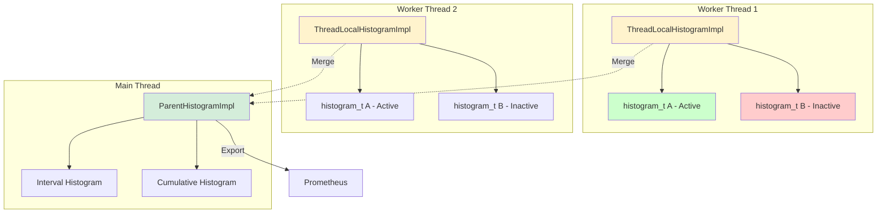
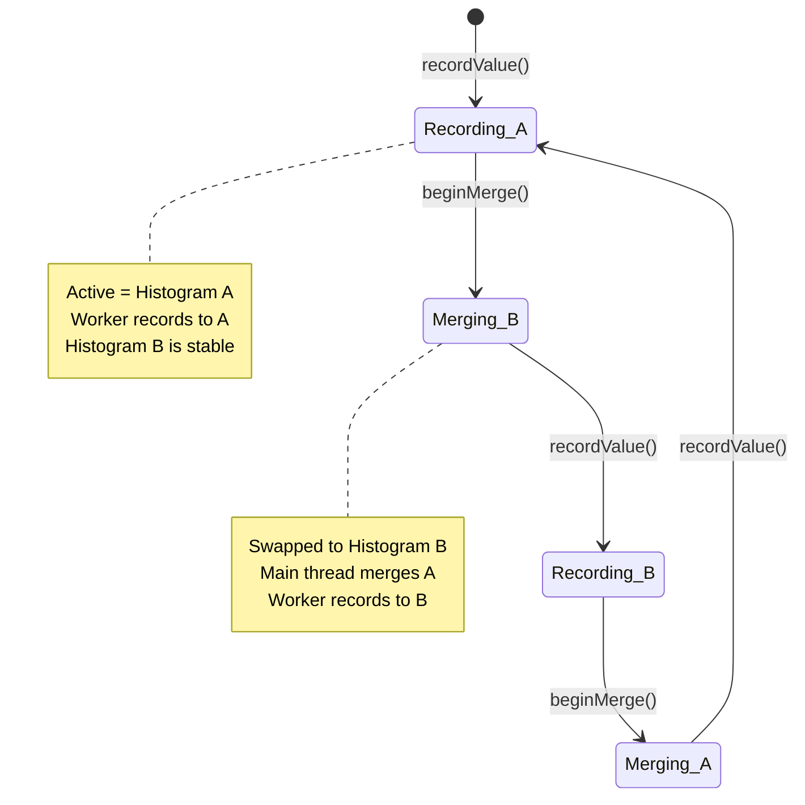
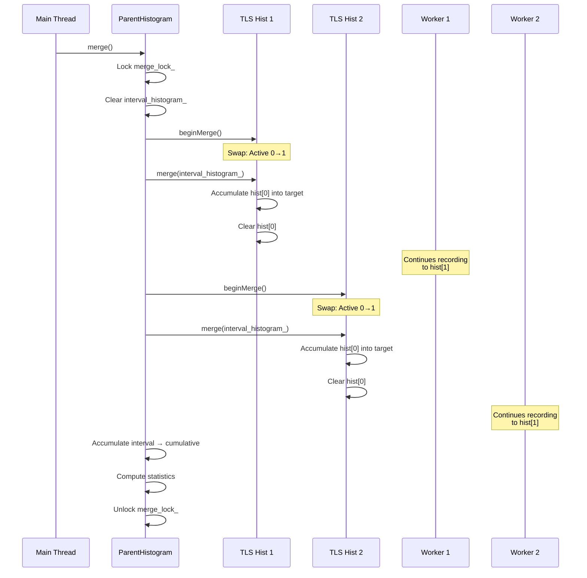

# Histogram Implementation: Recording and Aggregating Distributions

## Overview

Histograms in Envoy record **distributions of values** (latencies, sizes, durations) rather than simple counts. The implementation uses **circllhist** (circular histograms) for efficient, lock-free recording on worker threads, with sophisticated merging logic to aggregate across threads while maintaining statistical accuracy.

**Key Files:**
- `histogram_impl.h` (154 lines) - Histogram interfaces
- `histogram_impl.cc` - Implementation details
- `thread_local_store.h/cc` - ThreadLocalHistogramImpl and ParentHistogramImpl

**Library:** Uses `circllhist` (Circonus log-linear histograms) for storage

## Why Histograms?

Counters and gauges can't capture distributions:

```cpp
// Counter only tells us total requests
Counter& requests = scope.counterFromString("requests");
requests.inc();  // Now what was the latency?

// Histogram captures the distribution
Histogram& latency = scope.histogramFromString("latency", Histogram::Unit::Milliseconds);
latency.recordValue(150);  // This request took 150ms
latency.recordValue(200);  // This one took 200ms
latency.recordValue(50);   // This one took 50ms

// Later, compute statistics:
// - p50 (median): 150ms
// - p99: 200ms
// - Mean: 133ms
```

**Use Cases:**
- Request latencies
- Response sizes
- Queue depths
- Processing times

## Histogram Architecture

### Three-Layer Design



## Core Classes

### Histogram (Interface)

```cpp
class Histogram : public Metric {
public:
  enum class Unit {
    Unspecified,
    Bytes,
    Microseconds,
    Milliseconds,
    Null
  };
  
  virtual void recordValue(uint64_t value) = 0;
  virtual Unit unit() const = 0;
};
```

### ParentHistogram (Interface)

```cpp
class ParentHistogram : public Histogram {
public:
  virtual void merge() = 0;
  
  virtual const HistogramStatistics& intervalStatistics() const = 0;
  virtual const HistogramStatistics& cumulativeStatistics() const = 0;
  
  virtual std::string quantileSummary() const = 0;
  virtual std::string bucketSummary() const = 0;
};
```

### ThreadLocalHistogramImpl

Per-thread histogram for lock-free recording:

```cpp
class ThreadLocalHistogramImpl : public HistogramImplHelper {
public:
  ThreadLocalHistogramImpl(StatName name, Histogram::Unit unit,
                          StatName tag_extracted_name,
                          const StatNameTagVector& stat_name_tags,
                          SymbolTable& symbol_table,
                          absl::optional<uint32_t> bins);
  
  // Record value (lock-free!)
  void recordValue(uint64_t value) override {
    hist_log(histograms_[current_active_], value);
    used_ = true;
  }
  
  // Swap histograms for merge
  void beginMerge() {
    current_active_ = otherHistogramIndex();
  }
  
  void merge(histogram_t* target);
  
private:
  uint64_t current_active_{0};
  histogram_t* histograms_[2];  // Double buffer
  std::atomic<bool> used_;
  const std::thread::id created_thread_id_;
};
```

**Key Design:** Double buffering allows recording to continue while merging.

### ParentHistogramImpl

Central histogram in main thread, aggregates TLS histograms:

```cpp
class ParentHistogramImpl : public MetricImpl<ParentHistogram> {
public:
  ParentHistogramImpl(StatName name, Histogram::Unit unit,
                     ThreadLocalStoreImpl& parent,
                     StatName tag_extracted_name,
                     const StatNameTagVector& stat_name_tags,
                     ConstSupportedBuckets& supported_buckets,
                     absl::optional<uint32_t> bins,
                     uint64_t id);
  
  // Main thread records go to TLS histogram
  void recordValue(uint64_t value) override {
    // Delegate to TLS histogram
    thread_local_store_.tlsHistogram(*this, id_).recordValue(value);
  }
  
  // Aggregate all TLS histograms
  void merge() override;
  
  // Add TLS child
  void addTlsHistogram(const TlsHistogramSharedPtr& hist_ptr);
  
private:
  ThreadLocalStoreImpl& thread_local_store_;
  histogram_t* interval_histogram_;    // Reset each flush
  histogram_t* cumulative_histogram_;  // Never reset
  std::list<TlsHistogramSharedPtr> tls_histograms_;
  mutable Thread::MutexBasicLockable merge_lock_;
  const uint64_t id_;  // Unique identifier
};
```

## Double Buffering Strategy

Each TLS histogram maintains **two internal histograms**:



**Why?** Allows lock-free recording during merge:

```cpp
// Worker Thread (continuous)
void recordValue(uint64_t value) {
  hist_log(histograms_[current_active_], value);  // No lock!
}

// Main Thread (periodic merge)
void beginMerge() {
  // Atomic swap
  current_active_ = 1 - current_active_;
}

void merge(histogram_t* target) {
  // Merge the inactive histogram
  uint64_t inactive = 1 - current_active_;
  hist_accumulate(target, histograms_[inactive], ...);
  hist_clear(histograms_[inactive]);  // Reset for next interval
}
```

## Merge Process

### Merge Flow



### Implementation

```cpp
void ParentHistogramImpl::merge() {
  Thread::LockGuard lock(merge_lock_);
  
  // Clear interval histogram for this flush period
  hist_clear(interval_histogram_);
  
  // Merge all TLS histograms into interval
  for (const TlsHistogramSharedPtr& tls_hist : tls_histograms_) {
    tls_hist->beginMerge();  // Swap active/inactive
    tls_hist->merge(interval_histogram_);
  }
  
  // Accumulate interval into cumulative (never reset)
  hist_accumulate(cumulative_histogram_, interval_histogram_, nullptr);
  
  // Compute statistics
  interval_statistics_.refresh(interval_histogram_);
  cumulative_statistics_.refresh(cumulative_histogram_);
  
  merged_ = true;
}
```

## Histogram Statistics

### HistogramStatistics Interface

```cpp
class HistogramStatistics {
public:
  virtual std::string quantileSummary() const = 0;
  virtual std::string bucketSummary() const = 0;
  
  virtual const std::vector<double>& supportedQuantiles() const = 0;
  virtual const std::vector<double>& computedQuantiles() const = 0;
  
  virtual ConstSupportedBuckets& supportedBuckets() const = 0;
  virtual const std::vector<uint64_t>& computedBuckets() const = 0;
  
  virtual uint64_t sampleCount() const = 0;
  virtual double sampleSum() const = 0;
  virtual uint64_t outOfBoundCount() const = 0;
};
```

### HistogramStatisticsImpl

Computes statistics from circllhist:

```cpp
class HistogramStatisticsImpl : public HistogramStatistics {
public:
  HistogramStatisticsImpl(const histogram_t* histogram_ptr,
                         Histogram::Unit unit,
                         ConstSupportedBuckets& supported_buckets);
  
  void refresh(const histogram_t* new_histogram_ptr);
  
  std::string quantileSummary() const override {
    // "P0: 10, P25: 50, P50: 100, P75: 150, P99: 200, P100: 250"
  }
  
  std::string bucketSummary() const override {
    // "B0.5: 5, B1: 10, B5: 25, B10: 50, ..."
  }
  
private:
  ConstSupportedBuckets& supported_buckets_;
  std::vector<double> computed_quantiles_;
  std::vector<uint64_t> computed_buckets_;
  uint64_t sample_count_{0};
  double sample_sum_{0};
};
```

### Quantile Computation

Default quantiles (percentiles):

```cpp
const std::vector<double>& supportedQuantiles() const {
  static const std::vector<double> quantiles = {
    0.0,    // P0 (min)
    0.25,   // P25
    0.5,    // P50 (median)
    0.75,   // P75
    0.90,   // P90
    0.95,   // P95
    0.99,   // P99
    0.999,  // P99.9
    1.0     // P100 (max)
  };
  return quantiles;
}
```

Computed via circllhist:

```cpp
void refresh(const histogram_t* histogram) {
  computed_quantiles_.clear();
  for (double quantile : supportedQuantiles()) {
    double value = hist_approx_quantile(histogram, quantile);
    computed_quantiles_.push_back(value);
  }
  
  sample_count_ = hist_sample_count(histogram);
  sample_sum_ = hist_approx_sum(histogram);
}
```

### Bucket Computation

For Prometheus histogram export:

```cpp
std::vector<uint64_t> computedBuckets() const {
  std::vector<uint64_t> buckets;
  for (double bucket_bound : supported_buckets_) {
    uint64_t count = hist_approx_count_below(histogram, bucket_bound);
    buckets.push_back(count);
  }
  return buckets;
}
```

## Histogram Settings

### HistogramSettings Interface

```cpp
class HistogramSettings {
public:
  virtual const ConstSupportedBuckets& buckets(absl::string_view stat_name) const = 0;
  virtual absl::optional<uint32_t> bins(absl::string_view stat_name) const = 0;
};
```

### HistogramSettingsImpl

Configures buckets and bins per histogram:

```cpp
class HistogramSettingsImpl : public HistogramSettings {
public:
  HistogramSettingsImpl(const envoy::config::metrics::v3::StatsConfig& config,
                       Server::Configuration::CommonFactoryContext& context);
  
  const ConstSupportedBuckets& buckets(absl::string_view stat_name) const override;
  absl::optional<uint32_t> bins(absl::string_view stat_name) const override;
  
  static ConstSupportedBuckets& defaultBuckets() {
    // Default Prometheus-compatible buckets
    static ConstSupportedBuckets buckets = {
      0.5, 1, 5, 10, 25, 50, 100, 250, 500, 1000, 2500, 5000, 10000, 30000, 60000, 300000, 600000, 1800000, 3600000
    };
    return buckets;
  }
  
private:
  struct Config {
    Matchers::StringMatcherImpl matcher_;
    absl::optional<ConstSupportedBuckets> buckets_;
    absl::optional<uint32_t> bins_;
  };
  std::vector<Config> configs_;
};
```

**Configuration Example:**

```yaml
stats_config:
  histogram_settings:
    - match:
        prefix: "http.request.duration"
      buckets:
        - 10
        - 50
        - 100
        - 500
        - 1000
      bins: 100
    - match:
        prefix: "http.response.size"
      buckets:
        - 1024
        - 10240
        - 102400
        - 1048576
```

## circllhist Integration

### circllhist Overview

**circllhist** is a log-linear histogram implementation:
- Compact representation (~1-2KB per histogram)
- Accurate quantile estimates
- Efficient merge operations
- Lock-free recording

**Key Operations:**

```cpp
// Create histogram
histogram_t* hist = hist_alloc();

// Record values
hist_log(hist, value);

// Compute quantiles
double p50 = hist_approx_quantile(hist, 0.5);
double p99 = hist_approx_quantile(hist, 0.99);

// Merge histograms
hist_accumulate(target, source, nullptr);

// Clear for reuse
hist_clear(hist);

// Free memory
hist_free(hist);
```

### Log-Linear Buckets

Values are stored in log-linear buckets:

```
Bucket 0: [0, 1)
Bucket 1: [1, 2)
Bucket 2: [2, 4)
Bucket 3: [4, 8)
Bucket 4: [8, 16)
...
```

Provides good accuracy across wide range of values with fixed memory.

## Performance Characteristics

### Recording Performance

```cpp
void recordValue(uint64_t value) {
  hist_log(histograms_[current_active_], value);  // ~50ns
}
```

**Lock-free:** No mutex, no contention, just direct write to TLS histogram.

### Merge Performance

For N worker threads:
- beginMerge: O(1) per thread (~100ns)
- merge: O(buckets) per thread (~10µs)
- Total: ~10µs × N threads

For 8 threads: ~80µs total merge time.

### Memory Usage

Per ThreadLocalHistogramImpl:
- 2 histogram_t: ~4KB total
- Metadata: ~100 bytes

Per ParentHistogramImpl:
- 2 histogram_t: ~4KB (interval + cumulative)
- TLS list overhead: ~16 bytes per worker
- Metadata: ~150 bytes

**Total per histogram:** ~8KB + (N_workers × 4KB)

With 100 histograms and 8 workers: ~4MB

## Integration with ThreadLocalStore

### Creation Flow

```cpp
Histogram& ScopeImpl::histogramFromStatNameWithTags(
    const StatName& name,
    StatNameTagVectorOptConstRef tags,
    Histogram::Unit unit) {
  
  // Join scope prefix with name
  StatName full_name = joinPrefix(prefix_, name);
  
  // Check TLS cache
  auto iter = tls_cache_.parent_histograms_.find(full_name);
  if (iter != tls_cache_.parent_histograms_.end()) {
    return parent_.tlsHistogram(*iter->second, iter->second->id());
  }
  
  // Cold path: create parent histogram
  auto parent_hist = makeParentHistogram(full_name, tags, unit);
  tls_cache_.parent_histograms_[full_name] = parent_hist;
  
  // Get or create TLS histogram
  return parent_.tlsHistogram(*parent_hist, parent_hist->id());
}
```

### TLS Histogram Cache

```cpp
Histogram& ThreadLocalStoreImpl::tlsHistogram(
    ParentHistogramImpl& parent,
    uint64_t id) {
  
  // Check TLS cache by unique ID
  auto iter = tls_cache_.tls_histogram_cache_.find(id);
  if (iter != tls_cache_.tls_histogram_cache_.end()) {
    return *iter->second;
  }
  
  // Create TLS histogram
  auto tls_hist = std::make_shared<ThreadLocalHistogramImpl>(
      parent.statName(), parent.unit(),
      parent.tagExtractedStatName(), parent.tags(),
      symbolTable(), parent.bins());
  
  // Register with parent
  parent.addTlsHistogram(tls_hist);
  
  // Cache by ID
  tls_cache_.tls_histogram_cache_[id] = tls_hist;
  
  return *tls_hist;
}
```

**Key:** ID-based caching allows histogram reuse across scope recreation (common with xDS updates).

## Export Formats

### Prometheus Format

```cpp
void exportToPrometheus(const ParentHistogram& histogram) {
  const HistogramStatistics& stats = histogram.intervalStatistics();
  
  // Histogram buckets
  for (size_t i = 0; i < stats.supportedBuckets().size(); ++i) {
    double bound = stats.supportedBuckets()[i];
    uint64_t count = stats.computedBuckets()[i];
    
    std::cout << histogram.tagExtractedName() 
              << "_bucket{le=\"" << bound << "\"} "
              << count << "\n";
  }
  
  // +Inf bucket
  std::cout << histogram.tagExtractedName()
            << "_bucket{le=\"+Inf\"} "
            << stats.sampleCount() << "\n";
  
  // Sum
  std::cout << histogram.tagExtractedName() << "_sum "
            << stats.sampleSum() << "\n";
  
  // Count
  std::cout << histogram.tagExtractedName() << "_count "
            << stats.sampleCount() << "\n";
}
```

**Example Output:**

```
http_request_duration_bucket{le="10"} 50
http_request_duration_bucket{le="50"} 150
http_request_duration_bucket{le="100"} 300
http_request_duration_bucket{le="500"} 450
http_request_duration_bucket{le="+Inf"} 500
http_request_duration_sum 45000
http_request_duration_count 500
```

### Summary Format

```cpp
std::string ParentHistogramImpl::quantileSummary() const {
  return interval_statistics_.quantileSummary();
  // "P0: 10, P25: 50, P50: 100, P75: 150, P99: 200, P100: 250"
}

std::string ParentHistogramImpl::bucketSummary() const {
  return interval_statistics_.bucketSummary();
  // "B0.5: 5, B1: 10, B5: 25, ..."
}
```

## Best Practices

### DO:
- Use appropriate units (Milliseconds, Bytes, etc.)
- Configure buckets based on expected value range
- Merge histograms before each export cycle
- Monitor merge performance
- Use histogram.recordValue() in hot path

### DON'T:
- Record non-numeric values
- Create histograms in request path
- Call merge() too frequently (expensive)
- Assume buckets are linear (they're log-linear)
- Mix different unit types

## Code Examples

### Basic Usage

```cpp
// Create histogram
Histogram& latency = scope.histogramFromString(
    "request_duration",
    Histogram::Unit::Milliseconds
);

// Record values (hot path)
latency.recordValue(150);  // 150ms
latency.recordValue(200);
latency.recordValue(50);

// Merge (periodic, main thread)
store.mergeHistograms([](ParentHistogramSharedPtr hist) {
  std::cout << hist->name() << ":\n";
  std::cout << "  " << hist->quantileSummary() << "\n";
});
```

### Custom Buckets

```cpp
HistogramSettingsImplPtr settings = std::make_unique<HistogramSettingsImpl>();
settings->configureForName(
    "http.request.size",
    {1024, 10240, 102400, 1048576, 10485760},  // Buckets
    100  // Bins
);

store.setHistogramSettings(std::move(settings));
```

### Detailed Statistics

```cpp
const ParentHistogram& histogram = ...;
const HistogramStatistics& stats = histogram.intervalStatistics();

std::cout << "Samples: " << stats.sampleCount() << "\n";
std::cout << "Sum: " << stats.sampleSum() << "\n";
std::cout << "Mean: " << (stats.sampleSum() / stats.sampleCount()) << "\n";

const auto& quantiles = stats.computedQuantiles();
std::cout << "P50: " << quantiles[3] << "\n";  // Median
std::cout << "P99: " << quantiles[6] << "\n";
```

## Related Documentation

- **THREAD_LOCAL_STORE.md** - TLS histogram creation and caching
- **SYMBOL_TABLE.md** - StatName encoding for histogram names
- **ALLOCATOR.md** - (Histograms managed separately in ThreadLocalStore)

## Summary

Envoy's histogram implementation provides **efficient distribution recording** through:

**Key Features:**
- Lock-free recording via double buffering
- Efficient merge across worker threads
- Accurate quantile computation via circllhist
- Prometheus-compatible bucket export
- Configurable buckets per histogram

**Performance:**
- Recording: ~50ns (lock-free)
- Merge: ~10µs per worker thread
- Memory: ~4KB per TLS histogram

**Design Highlights:**
- Double buffering eliminates merge blocking
- TLS caching reduces creation overhead
- ID-based caching survives scope recreation
- Separate interval/cumulative histograms

Histograms are essential for understanding latency distributions and are critical for production observability in Envoy.
