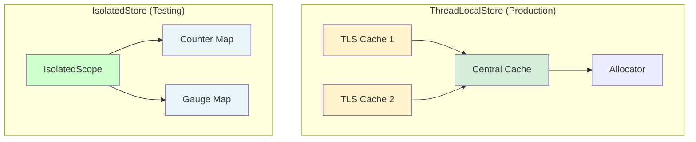
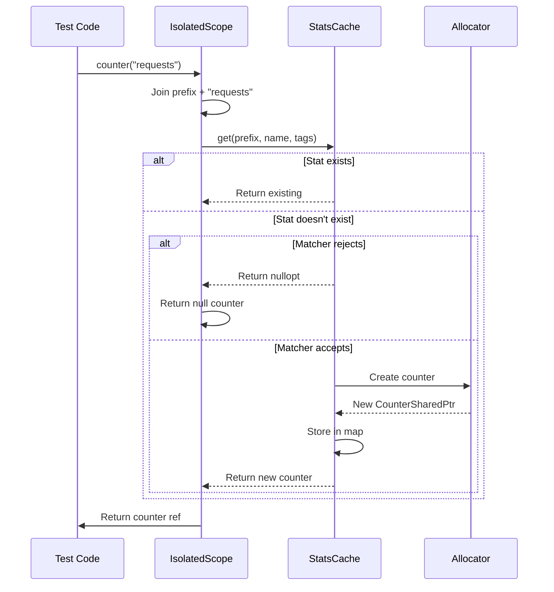

# Isolated Store: Simplified Stats for Testing

## Overview

IsolatedStoreImpl is a **simplified, self-contained** stats store designed primarily for **testing**, **standalone tools**, and **simple deployments**. Unlike ThreadLocalStoreImpl, it has no thread-local caching, no complex merging, and minimal dependencies—making it perfect for unit tests and scenarios where performance isn't critical.

**Key Files:**
- `isolated_store_impl.h` (447 lines) - Complete implementation
- `isolated_store_impl.cc` - Implementation details

**When to Use:** Tests, command-line tools, benchmarks, examples

**When NOT to Use:** Production Envoy with multiple worker threads

## Differences from ThreadLocalStore

| Feature | ThreadLocalStoreImpl | IsolatedStoreImpl |
|---------|---------------------|-------------------|
| Thread-local caching | Yes | No |
| Lock-free stat access | Yes | No (but simpler) |
| Histogram merging | Complex (double-buffer) | N/A (no histograms) |
| Memory overhead | Higher (TLS caches) | Lower (single storage) |
| Setup complexity | Requires TLS initialization | Zero setup |
| Use case | Production Envoy | Tests, tools |
| Performance | Optimized for throughput | Optimized for simplicity |



## Core Architecture

### IsolatedStoreImpl

The main store class:

```cpp
class IsolatedStoreImpl : public Store {
public:
  IsolatedStoreImpl();
  explicit IsolatedStoreImpl(SymbolTable& symbol_table);
  ~IsolatedStoreImpl() override;
  
  // Stats::Store interface
  ScopeSharedPtr rootScope() override;
  SymbolTable& symbolTable() override;
  
  std::vector<CounterSharedPtr> counters() const override;
  std::vector<GaugeSharedPtr> gauges() const override;
  std::vector<ParentHistogramSharedPtr> histograms() const override;
  std::vector<TextReadoutSharedPtr> textReadouts() const override;
  
  void forEachCounter(SizeFn f_size, StatFn<Counter> f_stat) const override;
  void forEachGauge(SizeFn f_size, StatFn<Gauge> f_stat) const override;
  // ... other iteration methods
  
  // No-op for isolated store
  void deliverHistogramToSinks(const Histogram&, uint64_t) override {}
  void evictUnused() override {}
  
protected:
  virtual ScopeSharedPtr makeScope(StatName name,
                                   StatsMatcherSharedPtr matcher = nullptr);
};
```

**Key Design:** All stats stored in simple hash maps, no complex caching.

### IsolatedScopeImpl

Per-scope stat management:

```cpp
class IsolatedScopeImpl : public Scope {
public:
  IsolatedScopeImpl(const std::string& prefix,
                   IsolatedStoreImpl& store,
                   StatsMatcherSharedPtr matcher = nullptr);
  
  // Stat creation
  Counter& counterFromStatNameWithTags(const StatName& name,
                                      StatNameTagVectorOptConstRef tags) override;
  Gauge& gaugeFromStatNameWithTags(const StatName& name,
                                   StatNameTagVectorOptConstRef tags,
                                   Gauge::ImportMode import_mode) override;
  Histogram& histogramFromStatNameWithTags(const StatName& name,
                                          StatNameTagVectorOptConstRef tags,
                                          Histogram::Unit unit) override;
  TextReadout& textReadoutFromStatNameWithTags(const StatName& name,
                                              StatNameTagVectorOptConstRef tags) override;
  
  // Child scope creation
  ScopeSharedPtr createScope(const std::string& name) override;
  
private:
  StatNameStorage prefix_;
  IsolatedStoreImpl& store_;
  StatsMatcherSharedPtr scope_matcher_;
};
```

## Internal Storage

### IsolatedStatsCache Template

Generic cache for counters, gauges, histograms, text readouts:

```cpp
template <class Base>
class IsolatedStatsCache {
public:
  using CounterAllocator = std::function<RefcountPtr<Base>(
      const TagUtility::TagStatNameJoiner& joiner,
      StatNameTagVectorOptConstRef tags)>;
  
  // Allocator-based construction
  IsolatedStatsCache(CounterAllocator alloc);
  
  // Get or create stat
  OptRef<Base> get(StatName prefix, StatName basename,
                  StatNameTagVectorOptConstRef tags,
                  SymbolTable& symbol_table,
                  OptRef<const StatsMatcher> matcher = {});
  
  // Iteration
  std::vector<RefcountPtr<Base>> toVector() const;
  bool iterate(const IterateFn<Base>& fn) const;
  
  // Lookup
  BaseOptConstRef find(StatName name) const;
  
private:
  StatNameHashMap<RefcountPtr<Base>> stats_;
  CounterAllocator counter_alloc_;
  // ... other allocators
};
```

**Storage:** Simple hash map from StatName to shared_ptr.

### Store Data Members

```cpp
class IsolatedStoreImpl {
private:
  SymbolTablePtr symbol_table_storage_;  // Owned symbol table (optional)
  Allocator alloc_;                      // Stats allocator
  
  // Stat caches
  IsolatedStatsCache<Counter> counters_;
  IsolatedStatsCache<Gauge> gauges_;
  IsolatedStatsCache<Histogram> histograms_;
  IsolatedStatsCache<TextReadout> text_readouts_;
  
  // Null stats
  NullCounterImpl null_counter_;
  NullGaugeImpl null_gauge_;
  NullHistogramImpl null_histogram_;
  NullTextReadoutImpl null_text_readout_;
  
  // Lazily-created default scope
  mutable ScopeSharedPtr lazy_default_scope_;
  
  // Child scopes
  std::vector<ScopeSharedPtr> scopes_;
};
```

## Stat Creation Flow

Much simpler than ThreadLocalStore:



**No TLS cache, no central cache—just one map lookup!**

## Symbol Table Management

### Owned vs. External Symbol Table

```cpp
// Constructor 1: Create owned symbol table
IsolatedStoreImpl::IsolatedStoreImpl()
    : IsolatedStoreImpl(std::make_unique<SymbolTable>()) {}

// Constructor 2: Use external symbol table
IsolatedStoreImpl::IsolatedStoreImpl(SymbolTable& symbol_table)
    : symbol_table_storage_(nullptr),
      alloc_(symbol_table),
      counters_([this](...) { return alloc_.makeCounter(...); }),
      gauges_([this](...) { return alloc_.makeGauge(...); }),
      // ...
{}

// Internal constructor for owned table
IsolatedStoreImpl::IsolatedStoreImpl(std::unique_ptr<SymbolTable>&& symbol_table)
    : symbol_table_storage_(std::move(symbol_table)),
      alloc_(*symbol_table_storage_),
      // ...
{}
```

**Why Two Modes?**

1. **Owned:** Simple for tests, symbol table destroyed with store
2. **External:** Share symbol table across multiple stores

## Stat Matching

IsolatedStore supports StatsMatcher:

```cpp
OptRef<Base> IsolatedStatsCache::get(
    StatName prefix, StatName basename,
    StatNameTagVectorOptConstRef tags,
    SymbolTable& symbol_table,
    OptRef<const StatsMatcher> matcher) {
  
  TagUtility::TagStatNameJoiner joiner(prefix, basename, tags, symbol_table);
  StatName name = joiner.nameWithTags();
  
  // Check matcher
  if (matcher.has_value() && matcher->rejects(name)) {
    return {};  // Return empty OptRef
  }
  
  // Lookup or create
  auto stat = stats_.find(name);
  if (stat != stats_.end()) {
    return *stat->second;
  }
  
  RefcountPtr<Base> new_stat = counter_alloc_(joiner, tags);
  stats_.emplace(new_stat->statName(), new_stat);
  return *new_stat;
}
```

**Null Stat Handling:**

```cpp
Counter& IsolatedScopeImpl::counterFromStatNameWithTags(...) {
  const OptRef<const StatsMatcher> matcher = makeOptRefFromPtr(scope_matcher_.get());
  auto counter = store_.counters_.get(prefix(), name, tags, symbolTable(), matcher);
  
  if (!counter.has_value()) {
    return store_.null_counter_;  // Matcher rejected
  }
  
  return *counter;
}
```

## Iteration and Export

### Simple Iteration

```cpp
void IsolatedStoreImpl::forEachCounter(SizeFn f_size, StatFn<Counter> f_stat) const {
  counters_.forEachStat(f_size, f_stat);
}

template <class Base>
void IsolatedStatsCache<Base>::forEachStat(SizeFn f_size, StatFn<Base> f_stat) const {
  if (f_size != nullptr) {
    f_size(stats_.size());
  }
  for (auto const& stat : stats_) {
    f_stat(*stat.second);
  }
}
```

**No Locking:** IsolatedStore is not thread-safe by design.

### Getting All Stats

```cpp
std::vector<CounterSharedPtr> IsolatedStoreImpl::counters() const {
  return counters_.toVector();
}

template <class Base>
std::vector<RefcountPtr<Base>> IsolatedStatsCache<Base>::toVector() const {
  std::vector<RefcountPtr<Base>> vec;
  vec.reserve(stats_.size());
  for (auto& stat : stats_) {
    vec.push_back(stat.second);
  }
  return vec;
}
```

## Scope Hierarchy

### Creating Child Scopes

```cpp
ScopeSharedPtr IsolatedScopeImpl::createScope(const std::string& name) {
  StatNameManagedStorage stat_name_storage(name, symbolTable());
  return scopeFromStatName(stat_name_storage.statName());
}

ScopeSharedPtr IsolatedScopeImpl::scopeFromStatName(StatName name) {
  // Join current prefix with new name
  SymbolTable::StoragePtr joined = symbolTable().join({prefix(), name});
  StatName full_prefix(joined.get());
  
  // Create child scope
  ScopeSharedPtr scope = store_.makeScope(full_prefix, scope_matcher_);
  addScopeToStore(scope);
  return scope;
}

void IsolatedScopeImpl::addScopeToStore(const ScopeSharedPtr& scope) {
  store_.scopes_.push_back(scope);
}
```

### Scope Prefix Filtering

When iterating, scopes filter by name prefix:

```cpp
template <class StatType>
IterateFn<StatType> IsolatedScopeImpl::iterFilter(const IterateFn<StatType>& fn) const {
  // Note: This is imperfect—relies on name matching, not actual membership
  std::string prefix_str = constSymbolTable().toString(prefix_.statName());
  if (!prefix_str.empty() && !absl::EndsWith(prefix_str, ".")) {
    prefix_str += ".";
  }
  
  return [fn, prefix_str](const RefcountPtr<StatType>& stat) -> bool {
    // Skip stats not in this scope's prefix
    if (!absl::StartsWith(stat->name(), prefix_str)) {
      return true;  // Continue iteration
    }
    return fn(stat);
  };
}
```

**Limitation:** This is a heuristic—doesn't track true membership like ThreadLocalStore.

## Histograms (Special Case)

IsolatedStore **does NOT support histograms**:

```cpp
std::vector<ParentHistogramSharedPtr> IsolatedStoreImpl::histograms() const override {
  return std::vector<ParentHistogramSharedPtr>{};  // Empty!
}

void IsolatedStoreImpl::forEachHistogram(SizeFn, StatFn<ParentHistogram>) const override {
  // No-op
}

Histogram& IsolatedScopeImpl::histogramFromStatNameWithTags(...) override {
  return store_.null_histogram_;  // Always returns null
}
```

**Why?** Histograms require complex merge logic that's unnecessary for testing.

**Workaround:** Use `HistogramImpl` directly if you need histogram testing:

```cpp
HistogramImpl histogram(name, unit, store, tag_extracted_name, tags);
histogram.recordValue(100);
// Note: No statistics computed, just records to sink
```

## Thread Safety

IsolatedStore is **NOT thread-safe** by default:

```cpp
// BAD: Multiple threads
std::thread t1([&store]() { store.counter("foo").inc(); });
std::thread t2([&store]() { store.counter("foo").inc(); });  // RACE!
```

**For Thread-Safe Testing:**

Use a wrapper with locking:

```cpp
class TestIsolatedStoreImpl : public IsolatedStoreImpl {
public:
  ScopeSharedPtr rootScope() override {
    absl::MutexLock lock(&mutex_);
    return IsolatedStoreImpl::rootScope();
  }
  
  // ... wrap other methods with mutex
  
private:
  absl::Mutex mutex_;
};
```

Or use ThreadLocalStoreImpl for real thread-local behavior.

## Use Cases

### 1. Unit Tests

Most common use case:

```cpp
TEST(MyFilterTest, IncrementCounter) {
  IsolatedStoreImpl stats;
  ScopeSharedPtr scope = stats.rootScope();
  
  Counter& counter = scope->counterFromString("requests");
  counter.inc();
  
  EXPECT_EQ(1, counter.value());
}
```

**Benefits:**
- Zero setup
- Deterministic
- No TLS initialization needed
- Fast test execution

### 2. Benchmarks

Isolate stat overhead:

```cpp
void BM_CounterIncrement(benchmark::State& state) {
  IsolatedStoreImpl stats;
  Counter& counter = stats.rootScope()->counterFromString("test");
  
  for (auto _ : state) {
    counter.inc();
  }
}
BENCHMARK(BM_CounterIncrement);
```

### 3. Command-Line Tools

Simple tools that don't need full Envoy:

```cpp
int main() {
  IsolatedStoreImpl stats;
  ScopeSharedPtr scope = stats.rootScope();
  
  Counter& counter = scope->counterFromString("processed");
  
  processData([&counter]() {
    counter.inc();
  });
  
  std::cout << "Processed: " << counter.value() << "\n";
}
```

### 4. Integration Tests (Single-Threaded)

Testing full Envoy without worker threads:

```cpp
TEST(IntegrationTest, SingleThreaded) {
  IsolatedStoreImpl stats;
  // Use stats in single-threaded integration test
}
```

## Comparison with Real Store

| Feature | IsolatedStore | ThreadLocalStore |
|---------|--------------|------------------|
| **Initialization** | Just construct | Need TLS, dispatcher, threading |
| **Stat Creation** | 1 hash lookup | 1 TLS lookup + possible central lookup |
| **Stat Update** | Direct atomic | Direct atomic (after cache warm) |
| **Histograms** | Not supported | Full support with merging |
| **Memory** | ~150 bytes/stat | ~200 bytes/stat + TLS overhead |
| **Performance** | Good (simple) | Excellent (optimized) |
| **Thread Safety** | Manual | Built-in (lock-free hot path) |
| **Scope Iteration** | Prefix heuristic | Accurate membership tracking |

## Extending IsolatedStore

### Custom Scope Implementation

```cpp
class MyCustomScope : public IsolatedScopeImpl {
public:
  using IsolatedScopeImpl::IsolatedScopeImpl;
  
  Counter& counterFromStatNameWithTags(...) override {
    // Custom logic before/after
    Counter& counter = IsolatedScopeImpl::counterFromStatNameWithTags(...);
    // Track creation
    return counter;
  }
};

class MyCustomStore : public IsolatedStoreImpl {
protected:
  ScopeSharedPtr makeScope(StatName name,
                          StatsMatcherSharedPtr matcher) override {
    return std::make_shared<MyCustomScope>(name, *this, matcher);
  }
};
```

**Use Case:** Custom instrumentation for testing.

## Best Practices

### DO:
- Use IsolatedStore for unit tests
- Use for simple command-line tools
- Verify single-threaded usage
- Share symbol table across multiple stores (memory savings)
- Use scope matchers for filtering

### DON'T:
- Use in production Envoy
- Use with multiple worker threads (unless wrapped)
- Expect histogram support
- Assume scope iteration is precise
- Compare performance with ThreadLocalStore

## Code Examples

### Basic Test

```cpp
TEST(StatsTest, BasicCounter) {
  IsolatedStoreImpl stats;
  Counter& counter = stats.rootScope()->counterFromString("test.counter");
  
  counter.inc();
  counter.add(5);
  
  EXPECT_EQ(6, counter.value());
}
```

### With Scopes

```cpp
TEST(StatsTest, ScopedStats) {
  IsolatedStoreImpl stats;
  ScopeSharedPtr root = stats.rootScope();
  
  ScopeSharedPtr cluster_scope = root->createScope("cluster.backend");
  Counter& requests = cluster_scope->counterFromString("requests");
  
  requests.inc();
  
  // Full name: "cluster.backend.requests"
  EXPECT_EQ("cluster.backend.requests", requests.name());
  EXPECT_EQ(1, requests.value());
}
```

### With Matcher

```cpp
TEST(StatsTest, WithMatcher) {
  IsolatedStoreImpl stats;
  
  // Create matcher that rejects "admin.*"
  auto matcher = std::make_shared<StatsMatcherImpl>(config);
  
  ScopeSharedPtr scope = stats.rootScope()->createScope("", false, {}, matcher);
  
  Counter& allowed = scope->counterFromString("http.requests");
  Counter& rejected = scope->counterFromString("admin.requests");
  
  EXPECT_NE(&allowed, &stats.nullCounter());
  EXPECT_EQ(&rejected, &stats.nullCounter());  // Rejected!
}
```

### Shared Symbol Table

```cpp
TEST(StatsTest, SharedSymbolTable) {
  SymbolTable symbol_table;
  
  IsolatedStoreImpl store1(symbol_table);
  IsolatedStoreImpl store2(symbol_table);
  
  // Both share the same symbol table
  // Memory savings for common token strings
}
```

## Related Documentation

- **THREAD_LOCAL_STORE.md** - Production-ready store with TLS caching
- **ALLOCATOR.md** - Used by both stores for stat allocation
- **SYMBOL_TABLE.md** - Shared between both implementations

## Summary

IsolatedStoreImpl provides a **simplified stats store** optimized for testing and simple tools:

**Key Characteristics:**
- Zero setup required
- No thread-local caching
- No histogram support
- Single hash map storage
- Not thread-safe by default

**Perfect For:**
- Unit tests
- Benchmarks
- Command-line tools
- Integration tests (single-threaded)

**Not For:**
- Production Envoy
- Multi-threaded request processing
- Histogram analysis
- Performance-critical paths

**Design Trade-offs:**
- Simplicity over performance
- Easy testing over production features
- Determinism over optimization

IsolatedStore demonstrates that different use cases deserve different implementations—tests don't need the complexity of production code, and Envoy wisely provides both options.
