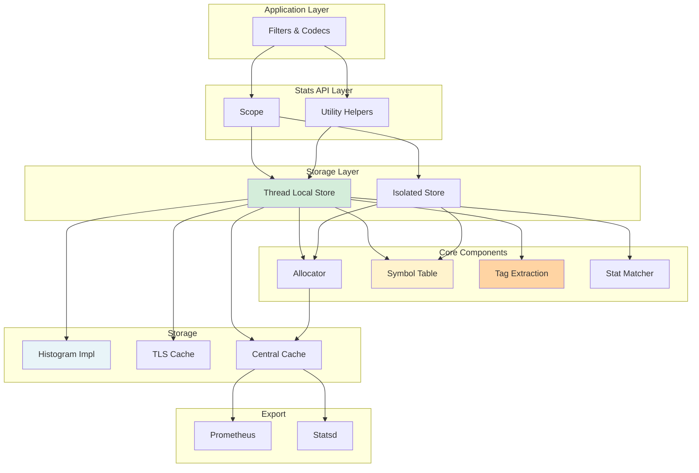
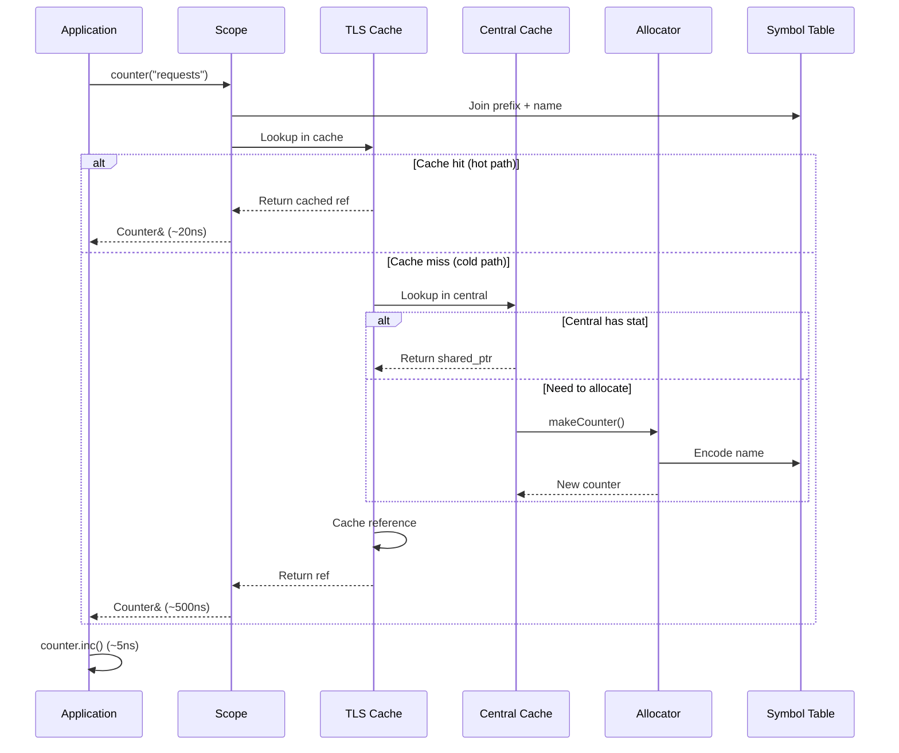
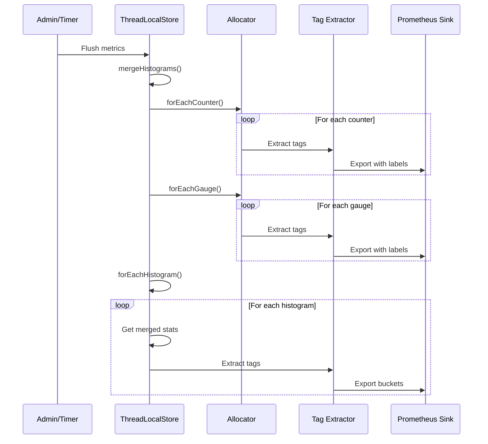

# Envoy Stats Subsystem Documentation

## Overview

This directory contains comprehensive documentation for Envoy's statistics subsystem, which provides **high-performance observability** for tracking millions of metrics across worker threads with minimal overhead.

The stats system is one of Envoy's most sophisticated components, demonstrating advanced systems programming techniques including lock-free data structures, symbol interning, thread-local caching, and memory optimization.

## Quick Navigation

### Core Components (Start Here)

1. **[SYMBOL_TABLE.md](SYMBOL_TABLE.md)** - Memory-efficient stat name encoding
   - Symbol interning and variable-length encoding
   - 60-80% memory reduction
   - Lock-free operations
   - **Start here to understand the foundation**

2. **[THREAD_LOCAL_STORE.md](THREAD_LOCAL_STORE.md)** - Production stats store
   - Lock-free stat access on worker threads
   - Two-tier caching architecture
   - Histogram merge process
   - **The main stats implementation**

3. **[ALLOCATOR.md](ALLOCATOR.md)** - Central memory management
   - Stat creation and lifecycle
   - Thread-safe iteration
   - Sink filtering
   - **Memory management for all stats**

### Feature Documentation

4. **[TAG_EXTRACTION.md](TAG_EXTRACTION.md)** - Prometheus labels
   - Converting flat names to dimensional metrics
   - Regex and token-based extraction
   - Cardinality management
   - **Critical for Prometheus integration**

5. **[HISTOGRAM_IMPL.md](HISTOGRAM_IMPL.md)** - Distribution recording
   - Lock-free histogram recording
   - Double-buffering for merge
   - Quantile computation
   - **For latency and size distributions**

6. **[STAT_MATCHER.md](STAT_MATCHER.md)** - Pattern-based filtering
   - Reduce memory usage
   - Control metric cardinality
   - Fast prefix matching
   - **Essential for production deployments**

### Alternative Implementations

7. **[ISOLATED_STORE.md](ISOLATED_STORE.md)** - Testing implementation
   - Simplified stat store
   - No thread-local caching
   - Perfect for unit tests
   - **Use this for tests, not production**

### Utilities

8. **[UTILITY.md](UTILITY.md)** - Helper functions
   - Element-based stat creation
   - Dynamic name handling
   - Cached lookups
   - **Convenience APIs**

## Architecture Overview



## System Design Principles

### 1. Memory Efficiency

**Problem:** 100,000 stats with 50-byte names = 5MB just for names

**Solutions:**
- **Symbol Interning:** Share common tokens across stats
- **Variable-Length Encoding:** Store small numbers in 1 byte
- **StatName References:** 8-byte pointers instead of string copies

**Result:** 60-80% memory reduction (5MB → 1MB)

### 2. Performance

**Problem:** Millions of stat updates per second across worker threads

**Solutions:**
- **Lock-Free Updates:** Atomic operations for counter/gauge increments
- **TLS Caching:** Per-thread cache eliminates lock contention
- **Lock-Free Joins:** Combine StatNames without symbol table access

**Result:** ~5ns per stat update in hot path

### 3. Observability

**Problem:** Flat stat names don't work well with modern metric systems

**Solutions:**
- **Tag Extraction:** Convert to dimensional metrics
- **Prometheus Integration:** Native label support
- **Histogram Support:** Record distributions, not just counts

**Result:** Rich, queryable metrics compatible with all major backends

### 4. Safety

**Problem:** Memory leaks, dangling references, symbol table corruption

**Solutions:**
- **RAII Everywhere:** StatNameStorage, pools, managed references
- **Explicit Memory Management:** free() calls prevent leaks
- **Extensive Assertions:** Catch bugs early in development

**Result:** Robust, production-grade reliability

## Data Flow

### Stat Creation Flow



### Export Flow



## Key Concepts

### StatName

A lightweight (8 bytes) reference to encoded stat name storage:

```cpp
StatName name = ...;
uint64_t hash = name.hash();          // Fast hashing
bool equal = (name == other);         // Fast comparison
bool starts = name.startsWith(prefix); // Prefix matching
```

**Memory:** Raw stat name bytes without ownership

### SymbolTable

Central manager for symbol encoding/decoding:

```cpp
SymbolTable table;
auto storage = table.encode("cluster.backend.requests");
StatName name(storage.get());
std::string decoded = table.toString(name);  // "cluster.backend.requests"
```

**Memory:** Shared symbols across all stats

### Scope

Hierarchical organization of stats:

```cpp
ScopeSharedPtr root = store.rootScope();
ScopeSharedPtr cluster = root->createScope("cluster.backend");
Counter& requests = cluster->counterFromString("requests");
// Full name: "cluster.backend.requests"
```

**Memory:** Prefix stored as StatName

### TLS Cache

Per-thread cache for lock-free access:

```cpp
// First access: Lock + allocate
Counter& c1 = scope.counter("requests");  // ~500ns

// Subsequent access: Cache hit
Counter& c2 = scope.counter("requests");  // ~20ns
```

**Memory:** Reference wrappers, not copies

## Performance Characteristics

### Operation Costs

| Operation | Cold Path | Hot Path | Notes |
|-----------|-----------|----------|-------|
| counter.inc() | N/A | ~5ns | Atomic increment |
| Get counter (cached) | ~500ns | ~20ns | After TLS warm-up |
| Get counter (new) | ~5µs | N/A | Alloc + encode |
| histogram.record() | ~5µs | ~50ns | Create vs. record |
| Histogram merge | ~100µs | N/A | Per histogram |
| Symbol encode | ~500ns | N/A | With lock |
| StatName join | ~100ns | ~100ns | Lock-free |

### Memory Usage

| Component | Per-Instance | Notes |
|-----------|-------------|-------|
| Counter/Gauge | ~100 bytes | Object + metadata |
| Histogram (TLS) | ~4 KB | Two circllhist |
| Histogram (Parent) | ~4 KB | Interval + cumulative |
| StatName storage | ~10 bytes | Avg encoded name |
| TLS cache entry | ~16 bytes | Reference wrapper |
| Central cache entry | ~80 bytes | shared_ptr + overhead |

**Example:** 100,000 stats with 8 workers
- Central storage: ~10 MB
- TLS caches: ~13 MB (8 × 1.6 MB)
- Symbol table: ~1 MB
- **Total: ~24 MB**

## Configuration

### Basic Setup

```cpp
// 1. Create symbol table
SymbolTable symbol_table;

// 2. Create allocator
Allocator allocator(symbol_table);

// 3. Create store
ThreadLocalStoreImpl store(allocator);

// 4. Initialize threading
store.initializeThreading(main_dispatcher, tls);

// 5. Get root scope
ScopeSharedPtr root = store.rootScope();

// 6. Create stats
Counter& counter = root->counterFromString("requests");
```

### With Tag Extraction

```cpp
// Create tag producer
TagProducerImpl producer;
producer.addExtractor(createClusterExtractor());
producer.addExtractor(createResponseCodeExtractor());

store.setTagProducer(std::make_unique<TagProducerImpl>(producer));

// Now stats are automatically tagged
Counter& counter = root->counterFromString("cluster.backend.upstream_rq_200");
// Exported as: envoy_cluster_upstream_rq{cluster="backend", response_code="200"}
```

### With Stat Matcher

```cpp
// Create matcher to reduce memory
StatsMatcherImpl matcher(config, symbol_table, context);
store.setStatsMatcher(std::make_unique<StatsMatcherImpl>(matcher));

// Only matching stats are created
Counter& allowed = root->counterFromString("cluster.backend.requests");
Counter& rejected = root->counterFromString("admin.debug");  // Returns null
```

## Common Patterns

### Creating Stats

```cpp
// Simple counter
Counter& requests = scope.counterFromString("requests");
requests.inc();

// With dynamic component
std::string method = "GET";
Counter& method_counter = Utility::counterFromElements(
    scope,
    {StatName("http"), DynamicName(method), StatName("requests")}
);
method_counter.inc();

// Gauge with import mode
Gauge& active = scope.gaugeFromString("active", Gauge::ImportMode::Accumulate);
active.inc();
active.dec();

// Histogram with unit
Histogram& latency = scope.histogramFromString("latency", Histogram::Unit::Milliseconds);
latency.recordValue(150);
```

### Scope Management

```cpp
// Create hierarchy
ScopeSharedPtr root = store.rootScope();
ScopeSharedPtr cluster_scope = root->createScope("cluster.backend");
ScopeSharedPtr subset_scope = cluster_scope->createScope("version_v1");

// Stats inherit prefix
Counter& requests = subset_scope->counterFromString("requests");
// Full name: "cluster.backend.version_v1.requests"
```

### Iteration

```cpp
// Iterate counters
store.forEachCounter(
    [](size_t count) { std::cout << "Counters: " << count << "\n"; },
    [](const Counter& counter) {
        std::cout << counter.name() << ": " << counter.value() << "\n";
    }
);

// Iterate within scope
scope.iterate([](const CounterSharedPtr& counter) {
    if (counter->used()) {
        std::cout << counter->name() << "\n";
    }
    return true;  // Continue
});
```

## Testing

### Unit Tests

```cpp
TEST(MyTest, CounterIncrements) {
  IsolatedStoreImpl stats;  // Simple test store
  Counter& counter = stats.rootScope()->counterFromString("test");
  
  counter.inc();
  counter.add(5);
  
  EXPECT_EQ(6, counter.value());
}
```

### Integration Tests

```cpp
TEST(IntegrationTest, WithThreadLocalStore) {
  SymbolTable symbol_table;
  Allocator allocator(symbol_table);
  ThreadLocalStoreImpl store(allocator);
  
  // Initialize for multi-threaded test
  store.initializeThreading(dispatcher, tls);
  
  // Test with real TLS caching
  Counter& counter = store.rootScope()->counterFromString("test");
  // ...
}
```

## Troubleshooting

### High Memory Usage

**Symptoms:** Envoy using GB of memory for stats

**Solutions:**
1. Enable StatsMatcher to reject unused stats
2. Check for stat explosion (per-connection, per-request stats)
3. Review tag cardinality (avoid high-cardinality tags)
4. Use `evictUnused()` to clean up stale stats

### Lock Contention

**Symptoms:** High CPU in symbol table, slow stat creation

**Solutions:**
1. Create stats during initialization, not request path
2. Use DynamicName for request-path stats
3. Pre-populate StatNameSet with common strings
4. Batch stat creation

### Missing Stats

**Symptoms:** Expected stats don't appear in output

**Solutions:**
1. Check StatsMatcher configuration
2. Verify stat is actually being created (not null)
3. Confirm scope is still alive
4. Check sink predicates

### Memory Leaks

**Symptoms:** Gradual memory growth over time

**Solutions:**
1. Ensure StatNameStorage::free() called
2. Check for scope lifetime issues
3. Verify histogram cleanup on shutdown
4. Look for rejected stat accumulation

## Best Practices

### DO:
- Use ThreadLocalStore for production
- Create stats during initialization when possible
- Use symbolic StatNames for known values
- Configure StatsMatcher in production
- Monitor stat count and memory usage
- Use appropriate histogram buckets
- Tag-extract for Prometheus compatibility

### DON'T:
- Create stats in hot request path (use dynamic)
- Use high-cardinality tags (user IDs, etc.)
- Forget to call free() on StatNameStorage
- Hold scope references longer than needed
- Assume stat creation is free (it's not)
- Create histograms for simple counts
- Bypass allocator for stat creation

## Further Reading

### Envoy Docs
- [Main stats documentation](https://github.com/envoyproxy/envoy/blob/main/source/docs/stats.md)
- [Stats configuration reference](https://www.envoyproxy.io/docs/envoy/latest/api-v3/config/metrics/v3/stats.proto)

### External Resources
- [Prometheus metric types](https://prometheus.io/docs/concepts/metric_types/)
- [circllhist library](https://github.com/circonus-labs/libcircllhist)
- [Variable-length encoding (Wikipedia)](https://en.wikipedia.org/wiki/Variable-length_code)

## Contributing

When adding new stats functionality:

1. **Read existing docs** to understand patterns
2. **Follow naming conventions** (`cluster.*`, `listener.*`, etc.)
3. **Add tests** for both IsolatedStore and ThreadLocalStore
4. **Document new stats** in this directory
5. **Consider memory impact** of changes
6. **Benchmark** hot-path changes

## Summary

The Envoy stats subsystem is a sophisticated, high-performance observability system designed for production use at scale:

**Key Achievements:**
- **Memory:** 60-80% reduction via symbol interning
- **Performance:** Sub-microsecond stat access in hot path
- **Scalability:** Millions of updates/second across worker threads
- **Observability:** Rich dimensional metrics for Prometheus

**Core Components:**
- **SymbolTable:** Memory-efficient name encoding
- **ThreadLocalStore:** Lock-free multi-threaded access
- **Allocator:** Central memory management
- **Tag Extraction:** Prometheus-compatible labels
- **Histograms:** Distribution recording

**Design Principles:**
- Lock-free hot paths
- Memory efficiency through sharing
- RAII for safety
- Separation of concerns

This documentation provides a comprehensive guide to understanding, using, and extending Envoy's stats subsystem. Start with SYMBOL_TABLE.md and THREAD_LOCAL_STORE.md to understand the core, then explore other components as needed.

---

**Document Version:** 1.0  
**Last Updated:** 2026-04-26  
**Envoy Version:** Latest (main branch)
