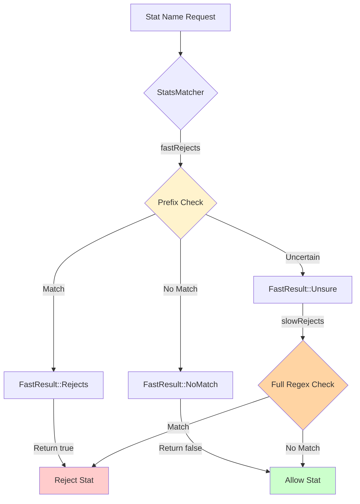

# Stat Matcher: Filtering Stats by Pattern

## Overview

StatsMatcher provides **pattern-based filtering** to control which statistics are created and exported. This is critical for:
- **Reducing memory usage** by rejecting unused stats
- **Limiting cardinality** in metric backends
- **Focusing observability** on relevant metrics
- **Complying with backend limits** (e.g., Prometheus series limits)

**Key Files:**
- `stats_matcher_impl.h` (64 lines) - Implementation
- `stats_matcher_impl.cc` - Matching logic

**Performance:** Two-tier matching (fast prefix check, slow full match) minimizes overhead.

## The Problem: Stat Explosion

Envoy can generate **thousands or millions** of stats:

```
cluster.backend.upstream_rq_200
cluster.backend.upstream_rq_201
cluster.backend.upstream_rq_202
...
cluster.backend.upstream_rq_599  # 400+ variations!

listener.0.0.0.0_80.downstream_cx_1
listener.0.0.0.0_80.downstream_cx_2
...
listener.0.0.0.0_80.downstream_cx_100000  # Per-connection stats!
```

**Problems:**
- Memory exhaustion
- Prometheus cardinality explosions
- Slow queries
- High backend costs

**Solution:** StatsMatcher rejects unwanted stats before creation.

## Architecture



## Core Interface

### StatsMatcher

```cpp
class StatsMatcher {
public:
  enum class FastResult {
    NoMatch,    // Definitely doesn't match
    Rejects,    // Definitely matches (reject)
    Unsure      // Need full regex check
  };
  
  // Two-phase matching
  virtual bool rejects(StatName name) const = 0;
  virtual FastResult fastRejects(StatName name) const = 0;
  virtual bool slowRejects(FastResult fast_result, StatName name) const = 0;
  
  // Query matcher type
  virtual bool acceptsAll() const = 0;
  virtual bool rejectsAll() const = 0;
};
```

### StatsMatcherImpl

```cpp
class StatsMatcherImpl : public StatsMatcher {
public:
  // From full config
  StatsMatcherImpl(const envoy::config::metrics::v3::StatsConfig& config,
                  SymbolTable& symbol_table,
                  Server::Configuration::CommonFactoryContext& context);
  
  // From just matcher config
  StatsMatcherImpl(const envoy::config::metrics::v3::StatsMatcher& stats_matcher,
                  SymbolTable& symbol_table,
                  Server::Configuration::CommonFactoryContext& context);
  
  // Default: accept all
  StatsMatcherImpl() = default;
  
  bool rejects(StatName name) const override {
    FastResult fast_result = fastRejects(name);
    return fast_result == FastResult::Rejects || 
           slowRejects(fast_result, name);
  }
  
  FastResult fastRejects(StatName name) const override;
  bool slowRejects(FastResult, StatName name) const override;
  
  bool acceptsAll() const override {
    return is_inclusive_ && matchers_.empty() && prefixes_.empty();
  }
  
  bool rejectsAll() const override {
    return !is_inclusive_ && matchers_.empty() && prefixes_.empty();
  }
  
private:
  void optimizeLastMatcher();
  bool fastRejectMatch(StatName name) const;
  bool slowRejectMatch(StatName name) const;
  
  bool is_inclusive_{true};  // Inclusion vs. exclusion list
  OptRef<SymbolTable> symbol_table_;
  std::unique_ptr<StatNamePool> stat_name_pool_;
  std::vector<Matchers::StringMatcherImpl> matchers_;
  std::vector<StatName> prefixes_;  // Fast prefix check
};
```

## Matching Logic

### Inclusion vs. Exclusion Mode

Two fundamental modes:

**Inclusion List (default):**
```
is_inclusive_ = true
matchers = ["cluster.backend.*", "http.*"]

Logic: Accept if matches ANY pattern, reject otherwise
```

**Exclusion List:**
```
is_inclusive_ = false
matchers = ["admin.*", "debug.*"]

Logic: Reject if matches ANY pattern, accept otherwise
```

### Two-Phase Matching

#### Phase 1: Fast Prefix Check

```cpp
FastResult StatsMatcherImpl::fastRejects(StatName name) const {
  if (acceptsAll()) {
    return FastResult::NoMatch;  // Accept everything
  }
  if (rejectsAll()) {
    return FastResult::Rejects;  // Reject everything
  }
  
  // Check prefixes for fast path
  return fastRejectMatch(name) ? FastResult::Rejects : FastResult::Unsure;
}

bool StatsMatcherImpl::fastRejectMatch(StatName name) const {
  for (StatName prefix : prefixes_) {
    if (name.startsWith(prefix)) {
      // Found prefix match
      return is_inclusive_;  // Reject if NOT in inclusion list
    }
  }
  
  // No prefix match
  return !is_inclusive_;  // Reject if IS in inclusion list, no match
}
```

**Fast Path Example:**

```cpp
// Config: include ["cluster.backend.*"]
// Optimized prefixes: ["cluster.backend"]

fastRejects("cluster.backend.requests")
  → name.startsWith("cluster.backend") = true
  → is_inclusive_ = true
  → return Rejects = false
  → FastResult::NoMatch (accept, no slow check needed)

fastRejects("cluster.frontend.requests")
  → name.startsWith("cluster.backend") = false
  → is_inclusive_ = true
  → return Rejects = true
  → FastResult::Rejects (reject without slow check!)
```

#### Phase 2: Slow Regex Check

```cpp
bool StatsMatcherImpl::slowRejects(FastResult fast_result, StatName name) const {
  if (fast_result != FastResult::Unsure) {
    return false;  // Already decided by fast path
  }
  
  return slowRejectMatch(name);
}

bool StatsMatcherImpl::slowRejectMatch(StatName name) const {
  ASSERT(symbol_table_.has_value());
  std::string name_str = symbol_table_->toString(name);
  
  for (const Matchers::StringMatcherImpl& matcher : matchers_) {
    if (matcher.match(name_str)) {
      // Found match
      return !is_inclusive_;  // Reject if exclusion list, accept if inclusion
    }
  }
  
  // No match
  return is_inclusive_;  // Reject if inclusion list, accept if exclusion
}
```

### Prefix Optimization

Extract common prefixes from regex patterns for fast checking:

```cpp
void StatsMatcherImpl::optimizeLastMatcher() {
  // Get last matcher's pattern
  const std::string& pattern = matchers_.back().pattern();
  
  // Extract prefix (e.g., "^cluster\\.backend\\." → "cluster.backend")
  std::string prefix_str = extractPrefixFromRegex(pattern);
  
  if (!prefix_str.empty()) {
    // Add to fast prefix list
    StatName prefix = stat_name_pool_->add(prefix_str);
    prefixes_.push_back(prefix);
  }
}
```

## Configuration

### Protobuf Configuration

```yaml
stats_config:
  stats_matcher:
    # Inclusion list (default)
    inclusion_list:
      patterns:
        - prefix: "cluster.backend"
        - prefix: "cluster.frontend"
        - prefix: "http"
        - safe_regex:
            regex: "^listener\\..*\\.downstream_cx_total$"
```

```yaml
stats_config:
  stats_matcher:
    # Exclusion list
    exclusion_list:
      patterns:
        - prefix: "admin"
        - prefix: "debug"
        - safe_regex:
            regex: ".*connection_\\d+.*"  # Exclude per-connection stats
```

### Programmatic Configuration

```cpp
// Create matcher
envoy::config::metrics::v3::StatsMatcher config;
auto* inclusion = config.mutable_inclusion_list();

// Add prefix patterns
auto* pattern1 = inclusion->add_patterns();
pattern1->set_prefix("cluster.backend");

auto* pattern2 = inclusion->add_patterns();
pattern2->set_prefix("http");

// Create matcher
StatsMatcherImpl matcher(config, symbol_table, context);

// Use in store
store.setStatsMatcher(std::make_unique<StatsMatcherImpl>(matcher));
```

## Integration Points

### With ThreadLocalStore

```cpp
template <class StatType>
RefcountPtr<StatType> ScopeImpl::makeStat(...) {
  // Check TLS rejection cache first
  if (tls_cache_.rejected_stats_.contains(full_stat_name)) {
    return nullptr;
  }
  
  // Check matcher
  if (parent_.statsMatcher() && 
      parent_.statsMatcher()->rejects(full_stat_name)) {
    tls_cache_.rejected_stats_.insert(full_stat_name);
    return nullptr;
  }
  
  // Create stat...
}
```

### With IsolatedStore

```cpp
OptRef<Base> IsolatedStatsCache::get(..., OptRef<const StatsMatcher> matcher) {
  StatName name = joiner.nameWithTags();
  
  if (matcher.has_value() && matcher->rejects(name)) {
    return {};  // Rejected, return empty
  }
  
  // Create stat...
}
```

### Rejection Caching

Avoid repeated matcher evaluation:

```cpp
// First check (slow)
if (stats_matcher_->rejects(name)) {  // May require regex
  tls_cache_.rejected_stats_.insert(name);
  return nullptr;
}

// Subsequent checks (fast)
if (tls_cache_.rejected_stats_.contains(name)) {  // Hash lookup only
  return nullptr;
}
```

## Performance Characteristics

### Fast Path (Prefix Match)

```cpp
// O(num_prefixes) × O(prefix_length)
// Typically < 100ns for ~10 prefixes

FastResult result = matcher.fastRejects(name);
```

**Optimization:** Short-circuit on first matching prefix.

### Slow Path (Regex Match)

```cpp
// O(num_matchers) × O(regex_complexity)
// Can be 1-10µs depending on regex

bool rejected = matcher.slowRejects(FastResult::Unsure, name);
```

**Mitigation:** Rejection caching in TLS eliminates repeated slow checks.

### Memory Overhead

```cpp
Per Matcher:
- Prefix: ~16 bytes (StatName)
- Regex: ~100-500 bytes (compiled regex)
- StringMatcher: ~150 bytes

10 matchers ≈ 1-5 KB total
```

## Common Patterns

### Include Essential Metrics Only

```yaml
stats_matcher:
  inclusion_list:
    patterns:
      - prefix: "cluster"         # All cluster stats
      - prefix: "listener"        # All listener stats
      - prefix: "http"            # All HTTP stats
      - prefix: "server"          # Server-level stats
      # Excludes: admin, debug, internal stats
```

### Exclude High-Cardinality Stats

```yaml
stats_matcher:
  exclusion_list:
    patterns:
      - safe_regex:
          regex: ".*connection_\\d+.*"  # Per-connection
      - safe_regex:
          regex: ".*request_\\d+.*"      # Per-request
      - prefix: "admin"                  # Admin stats
```

### Include Specific Clusters Only

```yaml
stats_matcher:
  inclusion_list:
    patterns:
      - prefix: "cluster.backend"
      - prefix: "cluster.frontend"
      # Excludes: cluster.internal, cluster.admin, etc.
```

### Hybrid (Inclusion + Exclusion)

Not directly supported, but can layer:

```cpp
// Primary matcher: include specific prefixes
auto primary_matcher = std::make_unique<StatsMatcherImpl>(inclusion_config, ...);

// Secondary matcher: exclude patterns within those prefixes
auto secondary_matcher = std::make_unique<StatsMatcherImpl>(exclusion_config, ...);

// Combine logically:
bool rejected = primary_matcher->rejects(name) || secondary_matcher->rejects(name);
```

## Debugging

### Check Matcher Behavior

```cpp
void debugMatcher(const StatsMatcher& matcher, const std::string& name) {
  StatNameManagedStorage stat_name(name, symbol_table);
  
  StatsMatcher::FastResult fast = matcher.fastRejects(stat_name.statName());
  bool slow = matcher.slowRejects(fast, stat_name.statName());
  bool final = matcher.rejects(stat_name.statName());
  
  std::cout << "Stat: " << name << "\n"
            << "  Fast: " << (int)fast << "\n"
            << "  Slow: " << slow << "\n"
            << "  Final: " << (final ? "REJECT" : "ACCEPT") << "\n";
}
```

### Logging Rejected Stats

```cpp
Counter& ScopeImpl::counterFromStatNameWithTags(...) {
  if (matcher && matcher->rejects(full_stat_name)) {
    ENVOY_LOG(debug, "Rejected stat: {}", symbolTable().toString(full_stat_name));
    return parent_.nullCounter();
  }
  // ...
}
```

### Admin Endpoint

Query rejected stats via admin endpoint:

```
GET /stats?filter=rejected
```

## Best Practices

### DO:
- Use inclusion lists for strict control
- Extract common prefixes for optimization
- Cache rejections in TLS
- Test matcher config with representative stat names
- Monitor rejection rate
- Use safe_regex over regex (validated at config load)

### DON'T:
- Use overly complex regex (performance)
- Forget to test with real stat names
- Assume all stats follow expected patterns
- Reject essential stats (server.*, cluster.*)
- Over-optimize with too many prefixes

## Code Examples

### Basic Usage

```cpp
// Create matcher
envoy::config::metrics::v3::StatsMatcher config;
auto* inclusion = config.mutable_inclusion_list();
inclusion->add_patterns()->set_prefix("cluster.backend");

StatsMatcherImpl matcher(config, symbol_table, context);

// Check stat
StatNameManagedStorage name("cluster.backend.requests", symbol_table);
bool rejected = matcher.rejects(name.statName());

std::cout << "Rejected: " << rejected << "\n";  // false (included)
```

### Integration with Store

```cpp
// Set matcher in store
store.setStatsMatcher(std::make_unique<StatsMatcherImpl>(config, ...));

// Stats are now filtered
Counter& allowed = scope.counterFromString("cluster.backend.requests");
Counter& rejected = scope.counterFromString("admin.requests");

EXPECT_NE(&allowed, &store.nullCounter());
EXPECT_EQ(&rejected, &store.nullCounter());  // Null stat returned
```

### Performance Test

```cpp
TEST(StatsMatcherTest, Performance) {
  StatsMatcherImpl matcher(config, symbol_table, context);
  
  // Test fast path
  auto start = std::chrono::high_resolution_clock::now();
  for (int i = 0; i < 10000; ++i) {
    StatNameManagedStorage name("cluster.backend.requests", symbol_table);
    volatile bool result = matcher.rejects(name.statName());
  }
  auto end = std::chrono::high_resolution_clock::now();
  auto ns = std::chrono::duration_cast<std::chrono::nanoseconds>(end - start).count();
  
  std::cout << "Average per check: " << (ns / 10000) << "ns\n";
}
```

## Advanced Topics

### Custom Matcher Implementation

```cpp
class CustomMatcher : public StatsMatcher {
public:
  bool rejects(StatName name) const override {
    // Custom logic
    std::string name_str = symbol_table_.toString(name);
    return myCustomFilter(name_str);
  }
  
  FastResult fastRejects(StatName name) const override {
    // Custom fast path
    if (name.startsWith(known_good_prefix_)) {
      return FastResult::NoMatch;
    }
    return FastResult::Unsure;
  }
  
  bool slowRejects(FastResult fast_result, StatName name) const override {
    if (fast_result != FastResult::Unsure) {
      return false;
    }
    return rejects(name);  // Delegate to full check
  }
};
```

### Dynamic Matcher Updates

Matchers are typically static, but can be updated:

```cpp
void updateMatcher(StoreRoot& store, const StatsMatcherConfig& new_config) {
  auto new_matcher = std::make_unique<StatsMatcherImpl>(new_config, ...);
  store.setStatsMatcher(std::move(new_matcher));
  
  // Note: Existing stats aren't affected, only new creation
}
```

## Related Documentation

- **THREAD_LOCAL_STORE.md** - Uses matcher for stat creation
- **ISOLATED_STORE.md** - Also supports matcher
- **TAG_EXTRACTION.md** - Applied before matcher check

## Summary

StatsMatcher provides essential **filtering capabilities** to control Envoy's stat creation:

**Key Features:**
- Two-phase matching (fast prefix, slow regex)
- Inclusion and exclusion modes
- TLS rejection caching
- Prefix optimization for performance

**Performance:**
- Fast path: ~100ns (prefix check)
- Slow path: ~1-10µs (regex)
- Cached: ~10ns (hash lookup)

**Integration:**
- Applied during stat creation
- Returns null stats for rejected names
- Works with both ThreadLocalStore and IsolatedStore

**Best Practices:**
- Use inclusion lists for strict control
- Optimize with common prefixes
- Cache rejections per-thread
- Test with representative stat names

StatsMatcher is critical for production Envoy deployments, preventing memory exhaustion and cardinality explosions while maintaining essential observability.
