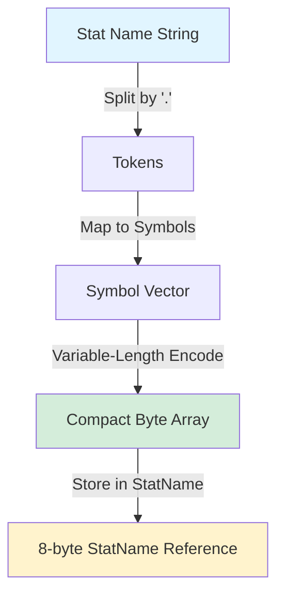
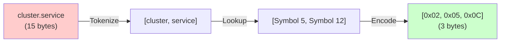
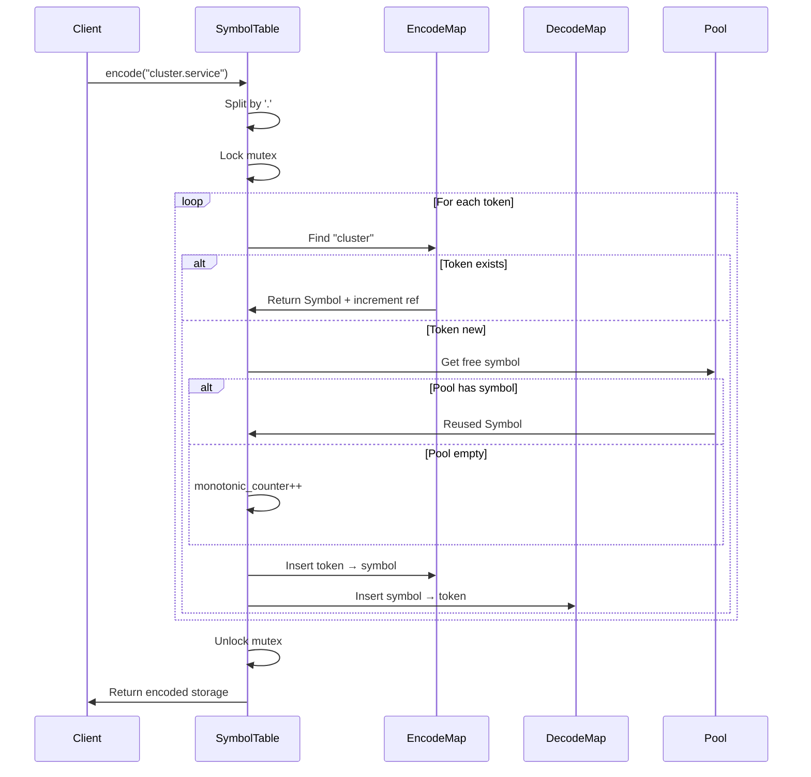
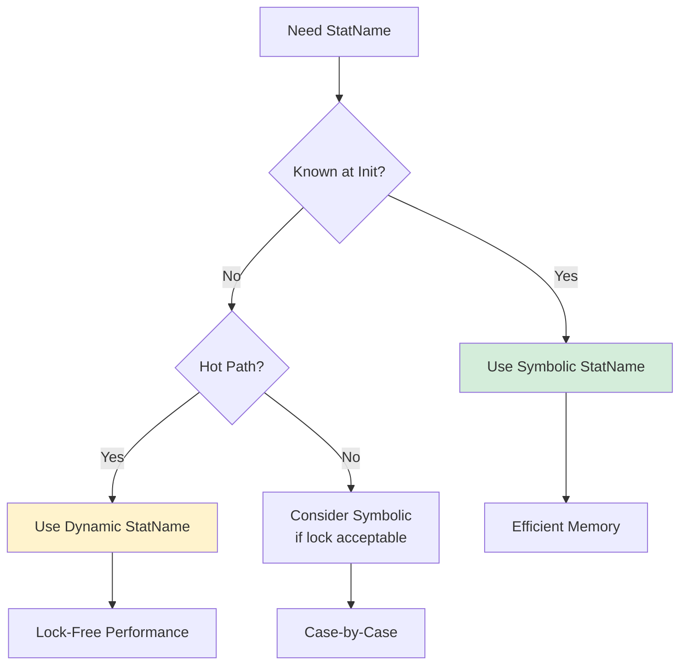

# Symbol Table: Memory-Optimized Stat Name Encoding

## Overview

The Symbol Table is the foundational component of Envoy's stats subsystem, providing a memory-efficient encoding mechanism for stat names. It converts dot-delimited stat names into compact byte arrays using symbol interning and variable-length encoding, achieving significant memory savings in production deployments.

**Key Files:**
- `symbol_table.h` (1079 lines) - Core interfaces and data structures
- `symbol_table.cc` (implementation)

**Memory Impact:** In a typical Envoy deployment with thousands of stats, the Symbol Table can reduce memory usage by 60-80% compared to storing raw strings.

## The Problem: Stat Name Memory Overhead

Envoy generates thousands of statistics with names like:
```
cluster.backend_service.upstream_rq_200
cluster.backend_service.upstream_rq_500
cluster.frontend_service.upstream_rq_200
cluster.frontend_service.upstream_rq_500
```

These names share common tokens ("cluster", "upstream_rq", etc.), but storing each as a complete string wastes memory. With 10,000 stats averaging 50 bytes each, that's ~500KB just for names.

## The Solution: Symbol Interning and Encoding

The Symbol Table solves this through two mechanisms:

### 1. Symbol Interning
Each unique token is assigned a Symbol (uint32_t). Tokens are reference-counted and reused:
- "cluster" → Symbol 1
- "backend_service" → Symbol 2
- "upstream_rq_200" → Symbol 3

### 2. Variable-Length Encoding
Symbols are encoded into compact byte arrays using UTF-8-like encoding. Small symbols (< 128) use 1 byte; larger symbols use multiple bytes with continuation bits.



## Core Components

### SymbolTable Class

The central manager for symbol encoding and decoding.

```cpp
class SymbolTable {
public:
  // Encode a string into compact storage
  StoragePtr encode(absl::string_view name);
  
  // Decode a StatName back to string
  std::string toString(const StatName& stat_name) const;
  
  // Join multiple StatNames without decoding
  StoragePtr join(const StatNameVec& stat_names) const;
  
  // Reference counting
  void incRefCount(const StatName& stat_name);
  void free(const StatName& stat_name);
  
  uint64_t numSymbols() const;
  bool lessThan(const StatName& a, const StatName& b) const;
};
```

**Key Properties:**
- Thread-safe: Protected by `lock_` mutex
- Symbol reuse: Free pool (`pool_`) for reclaimed symbols
- Monotonic counter: Ensures unique symbols when pool exhausted
- Recent lookups: Tracks frequently accessed symbols

### StatName: Lightweight Reference

A StatName is a non-owning reference to encoded storage. It's extremely lightweight (8 bytes on 64-bit systems).

```cpp
class StatName {
public:
  StatName(const Storage size_and_data);
  
  size_t dataSize() const;
  size_t size() const;
  uint64_t hash() const;
  bool operator==(const StatName& rhs) const;
  bool startsWith(StatName prefix) const;
  bool empty() const;
  
private:
  const uint8_t* size_and_data_{nullptr};  // Just a pointer!
};
```

**Design Philosophy:**
- No ownership: Caller manages backing storage
- No ref-counting overhead per StatName
- Enables efficient copying and passing by value
- Suitable for embedding in larger structures

### StatNameStorage: RAII Ownership

Owns backing storage for a StatName. Must explicitly call `free()` before destruction.

```cpp
class StatNameStorage : public StatNameStorageBase {
public:
  // Create from string, incrementing symbol ref-counts
  StatNameStorage(absl::string_view name, SymbolTable& table);
  
  // Copy from existing StatName
  StatNameStorage(StatName src, SymbolTable& table);
  
  ~StatNameStorage();
  
  // Must be called before destruction
  void free(SymbolTable& table);
  
  StatName statName() const;
};
```

**Why Explicit free()?**
Saves 8 bytes per stat by not storing a SymbolTable reference. With 100,000 stats, that's ~800KB saved.

### StatNameManagedStorage: Convenience RAII

Automatic cleanup version of StatNameStorage. Costs 8 extra bytes per instance.

```cpp
class StatNameManagedStorage : public StatNameStorage {
public:
  StatNameManagedStorage(absl::string_view name, SymbolTable& table);
  ~StatNameManagedStorage() { free(symbol_table_); }
  
private:
  SymbolTable& symbol_table_;  // 8 bytes overhead
};
```

**Use Cases:**
- Temporary stat names in functions
- Test code where memory efficiency is less critical
- Outside the hot path

## Encoding Details

### Variable-Length Number Encoding

Similar to UTF-8, using 7 bits for data and 1 bit for continuation:

```
Number Range    Encoding
0-127          0xxxxxxx                           (1 byte)
128-16383      1xxxxxxx 0xxxxxxx                  (2 bytes)
16384-2097151  1xxxxxxx 1xxxxxxx 0xxxxxxx         (3 bytes)
...
```

**Implementation:**
```cpp
void SymbolTable::Encoding::appendEncoding(uint64_t number, 
                                           MemBlockBuilder<uint8_t>& mem_block) {
  do {
    if (number < (1 << 7)) {
      mem_block.appendOne(number);
    } else {
      mem_block.appendOne((number & Low7Bits) | SpilloverMask);
    }
    number >>= 7;
  } while (number != 0);
}
```

### StatName Storage Format

A StatName's backing storage contains:
1. Encoded size (variable-length)
2. Encoded symbol data (variable-length per symbol)

```
[size_byte(s)] [symbol1_byte(s)] [symbol2_byte(s)] ...
```

**Example:**
Name: "cluster.service"
- Tokens: ["cluster", "service"]
- Symbols: [5, 12] (after lookup/creation)
- Encoding: [0x02] [0x05] [0x0C]
  - 0x02 = size of 2 bytes for data
  - 0x05 = symbol 5 (1 byte)
  - 0x0C = symbol 12 (1 byte)
- Total: 3 bytes vs 15 bytes for raw string!



### Symbol Encoding Flow



## Memory Management

### Reference Counting

Each symbol has a reference count. When a StatName is created, refs are incremented. When freed, refs are decremented.

```cpp
void SymbolTable::incRefCount(const StatName& stat_name) {
  const SymbolVec symbols = Encoding::decodeSymbols(stat_name);
  Thread::LockGuard lock(lock_);
  
  for (Symbol symbol : symbols) {
    auto encode_search = encode_map_.find(decode_map_[symbol]->toStringView());
    ++encode_search->second.ref_count_;
  }
}

void SymbolTable::free(const StatName& stat_name) {
  const SymbolVec symbols = Encoding::decodeSymbols(stat_name);
  Thread::LockGuard lock(lock_);
  
  for (Symbol symbol : symbols) {
    auto encode_search = encode_map_.find(decode_map_[symbol]->toStringView());
    if (--encode_search->second.ref_count_ == 0) {
      decode_map_.erase(symbol);
      encode_map_.erase(encode_search);
      pool_.push(symbol);  // Return to free pool
    }
  }
}
```

### Symbol Reuse Pool

When all references to a symbol are freed, it's returned to the pool for reuse:

```
Initial State:
  monotonic_counter_ = 10
  pool_ = [empty]

After creating "cluster.service" and freeing:
  monotonic_counter_ = 12  (used 11, 12 for two tokens)
  pool_ = [12, 11]  (returned in reverse order)

Next allocation reuses from pool:
  "new.token" uses Symbol 11 from pool
  monotonic_counter_ = 12 (unchanged)
```

**Benefit:** Prevents unbounded growth of symbol IDs, which keeps encoding sizes small.

### Memory Savings Analysis

Consider 10,000 stats with average 5 tokens each, 10 chars per token:

**Without Symbol Table:**
- 10,000 stats × 50 bytes = 500 KB

**With Symbol Table:**
- Assume 100 unique tokens
- Encode map: 100 tokens × 15 bytes = 1.5 KB
- Decode map: 100 symbols × 20 bytes = 2.0 KB
- StatName storage: 10,000 stats × 6 bytes = 60 KB
- **Total: ~64 KB (87% reduction!)**

## Dynamic vs. Symbolic StatNames

### Symbolic StatNames

Use the symbol table, require locking during creation:
```cpp
StatNameManagedStorage name("cluster.service", symbol_table);
```

**Pros:**
- Shared token storage
- Memory efficient
- Can be joined lock-free

**Cons:**
- Requires lock on creation
- All tokens must exist during lifetime

### Dynamic StatNames

Store tokens as literal strings, no locking required:

```cpp
StatNameDynamicStorage name("cluster.service", symbol_table);
```

**Encoding:** Uses special marker (0x00) followed by length and raw string bytes.

**Format:**
```
[size] [0x00] [length] [c][l][u][s][t][e][r] [0x00] [length] [s][e][r][v][i][c][e]
```

**Pros:**
- Lock-free creation
- Safe for request-path usage

**Cons:**
- More memory per stat
- Can't efficiently join or compare

**When to Use:**
Use dynamic names for stats discovered during request processing (e.g., HTTP response codes, dynamic routes).



## Advanced Features

### Joining StatNames

Combine multiple StatNames without decoding to strings:

```cpp
StoragePtr SymbolTable::join(const StatNameVec& stat_names) const {
  size_t total_size = 0;
  for (StatName name : stat_names) {
    total_size += name.dataSize();
  }
  
  MemBlockBuilder<uint8_t> mem_block;
  mem_block.setCapacity(Encoding::totalSizeBytes(total_size));
  Encoding::appendEncoding(total_size, mem_block);
  
  for (StatName name : stat_names) {
    name.appendDataToMemBlock(mem_block);
  }
  
  return mem_block.release();
}
```

**Use Case:** Scope prefixing in thread-local caches. Join scope prefix with stat name without locking.

**Example:**
```cpp
// Scope prefix: "cluster.backend"
// Stat name: "upstream_rq_200"
// Joined: "cluster.backend.upstream_rq_200"

StatName prefix = scope->prefix();
StatName name("upstream_rq_200", symbol_table);
SymbolTable::StoragePtr joined = symbol_table.join({prefix, name});
```

### StatName Prefix Matching

Check if a StatName starts with a prefix:

```cpp
bool StatName::startsWith(StatName prefix) const {
  TokenIter prefix_iter(prefix);
  TokenIter this_iter(*this);
  
  while (true) {
    TokenType prefix_type = prefix_iter.next();
    if (prefix_type == TokenType::End) return true;
    
    TokenType this_type = this_iter.next();
    if (this_type == TokenType::End) return false;
    
    if (prefix_type != TokenType::Symbol || 
        this_type != TokenType::Symbol ||
        this_iter.symbol() != prefix_iter.symbol()) {
      return false;
    }
  }
}
```

**Note:** Only works with symbolic prefixes, not dynamic components.

### Lexical Comparison

Compare StatNames lexically for sorting:

```cpp
bool SymbolTable::lessThan(const StatName& a, const StatName& b) const {
  Thread::LockGuard lock(lock_);
  return lessThanLockHeld(a, b);
}

template <class Obj, class Iter, class GetStatName>
void SymbolTable::sortByStatNames(Iter begin, Iter end, 
                                  GetStatName get_stat_name) const {
  Thread::LockGuard lock(lock_);
  StatNameCompare<GetStatName, Obj> compare(*this, get_stat_name);
  std::sort(begin, end, compare);
}
```

**Optimization:** Lock once for entire sort operation, not per comparison.

## Container Classes

### StatNamePool

RAII container for multiple StatNames:

```cpp
class StatNamePool {
public:
  explicit StatNamePool(SymbolTable& symbol_table);
  ~StatNamePool() { clear(); }
  
  StatName add(absl::string_view name);
  StatName add(StatName name);
  const uint8_t* addReturningStorage(absl::string_view name);
  void clear();
};
```

**Usage:**
```cpp
StatNamePool pool(symbol_table);
StatName name1 = pool.add("cluster.backend");
StatName name2 = pool.add("cluster.frontend");
// Automatically freed when pool destroyed
```

### StatNameList

Packed array of StatNames in contiguous memory:

```cpp
class StatNameList {
public:
  void iterate(const std::function<bool(StatName)>& f) const;
  void clear(SymbolTable& symbol_table);
  bool populated() const;
};
```

**Format:**
```
[count] [size1] [data1...] [size2] [data2...] [size3] [data3...]
```

**Use Case:** Storing tag names compactly in MetricImpl.

### StatNameSet

Set-like interface for StatNames:

```cpp
class StatNameSet {
public:
  // Builtin names (no locking on access)
  void rememberBuiltin(absl::string_view str);
  StatName getBuiltin(absl::string_view token, StatName fallback) const;
  
  // Mutex-protected pool access
  StatName add(absl::string_view str);
};
```

**Pattern:** Pre-populate with known strings during initialization, then access lock-free:

```cpp
StatNameSetPtr tags = symbol_table.makeSet("well_known_tags");
tags->rememberBuiltins({"cluster", "listener", "http_conn_manager"});

// Later, lock-free lookup:
StatName cluster_tag = tags->getBuiltin("cluster", fallback);
```

## Performance Considerations

### Hot Path Optimizations

1. **Lock-Free Joins:** Combine StatNames without symbol table access
2. **Inline Comparisons:** Hash and equality without decoding
3. **TLS Caching:** Cache joined scope+name in thread-local storage
4. **Dynamic Names:** Avoid locks for request-scoped stats

### Lock Contention Mitigation

The SymbolTable uses a single mutex, which can be a bottleneck. Mitigations:

1. **Batch Initialization:** Create all known stats at startup
2. **StatNameSet Builtins:** Pre-intern common strings
3. **Dynamic Storage:** Use for hot-path stat creation
4. **Recent Lookups:** Track lock contentio sources

### Recent Lookups Tracking

Monitor which symbols are accessed most frequently:

```cpp
void SymbolTable::setRecentLookupCapacity(uint64_t capacity);
uint64_t getRecentLookups(const RecentLookupsFn& iter) const;
void clearRecentLookups();
```

**Use Case:** Identify candidates for StatNameSet builtins or dynamic storage.

## Thread Safety

### Locking Strategy

```cpp
class SymbolTable {
private:
  mutable Thread::MutexBasicLockable lock_;
  EncodeMap encode_map_ ABSL_GUARDED_BY(lock_);
  DecodeMap decode_map_ ABSL_GUARDED_BY(lock_);
  std::stack<Symbol> pool_ ABSL_GUARDED_BY(lock_);
};
```

**Protected Operations:**
- `encode()` - Creating new symbols
- `free()` - Decrementing ref-counts, returning to pool
- `incRefCount()` - Incrementing ref-counts
- `toString()` - Decoding symbols to strings
- `lessThan()` - Lexical comparison

**Lock-Free Operations:**
- `join()` - Combining StatNames
- `StatName::hash()` - Hashing encoded bytes
- `StatName::operator==()` - Comparing encoded bytes

### Data Structure Details

```cpp
struct SharedSymbol {
  Symbol symbol_;
  uint32_t ref_count_{1};
};

// Maps string → symbol + ref_count
using EncodeMap = absl::flat_hash_map<absl::string_view, SharedSymbol>;

// Maps symbol → string (owns string storage)
using DecodeMap = absl::flat_hash_map<Symbol, InlineStringPtr>;
```

**Key Insight:** DecodeMap owns string storage; EncodeMap uses string_view into DecodeMap. This allows single copy of each string.

## Code Examples

### Basic Usage

```cpp
// Create symbol table
SymbolTable symbol_table;

// Create and use a stat name
StatNameManagedStorage name("cluster.backend.requests", symbol_table);
std::string decoded = symbol_table.toString(name.statName());
// decoded == "cluster.backend.requests"

// StatName automatically freed when name goes out of scope
```

### Manual Memory Management

```cpp
SymbolTable symbol_table;

{
  StatNameStorage name("cluster.backend.requests", symbol_table);
  // Use name.statName()...
  
  name.free(symbol_table);  // Must call before destruction
}
```

### Joining StatNames

```cpp
SymbolTable symbol_table;
StatNameManagedStorage prefix("cluster.backend", symbol_table);
StatNameManagedStorage suffix("requests.total", symbol_table);

SymbolTable::StoragePtr joined = symbol_table.join({
  prefix.statName(), 
  suffix.statName()
});

StatName joined_name(joined.get());
// Represents "cluster.backend.requests.total"
```

### Using StatNamePool

```cpp
SymbolTable symbol_table;
StatNamePool pool(symbol_table);

StatName counter1 = pool.add("requests");
StatName counter2 = pool.add("responses");
StatName counter3 = pool.add("errors");

// All automatically freed when pool destroyed
```

### Dynamic StatNames

```cpp
SymbolTable symbol_table;

// For request-path stats with dynamic components
StatNameDynamicStorage response_code(
  absl::StrCat("response_", code), 
  symbol_table
);

// No lock taken during creation!
```

### StatNameSet with Builtins

```cpp
SymbolTable symbol_table;
StatNameSetPtr well_known = symbol_table.makeSet("well_known_names");

// During initialization (can modify)
well_known->rememberBuiltins({
  "cluster", "listener", "http", "tcp", "upstream", "downstream"
});

// During request processing (read-only, lock-free)
StatName cluster = well_known->getBuiltin("cluster", fallback);
```

## Debugging and Diagnostics

### Symbol Table State

```cpp
uint64_t num_symbols = symbol_table.numSymbols();
Symbol monotonic = symbol_table.monotonicCounter();
```

### Debug Printing

```cpp
#ifndef ENVOY_CONFIG_COVERAGE
void SymbolTable::debugPrint() const;
void StatName::debugPrint();
#endif
```

### Assertions

The Symbol Table includes extensive assertions to catch bugs:

```cpp
ASSERT(decode_search != decode_map_.end(),
       "Please see "
       "https://github.com/envoyproxy/envoy/blob/main/source/docs/stats.md#"
       "debugging-symbol-table-assertions");
```

**Common Issues:**
- Freeing a StatName twice
- Using a StatName after its backing storage is freed
- SymbolTable destroyed before all StatNames freed

## Best Practices

### DO:
- Use `StatNameManagedStorage` for temps and tests
- Pre-populate `StatNameSet` with known strings
- Use dynamic storage for request-path stats
- Batch stat creation at initialization
- Call `free()` before destroying `StatNameStorage`

### DON'T:
- Create symbolic StatNames in hot request path
- Hold SymbolTable lock longer than necessary
- Copy raw StatName bytes (use StatNameStorage)
- Assume symbol IDs are stable across restarts
- Mix dynamic and symbolic StatNames in joins

## Integration Points

### With ThreadLocalStore
- Scope prefixes stored as StatNames
- Cache keys are joined StatNames
- Lock-free lookup after cache warm-up

### With Allocator
- Creates StatNames for counter/gauge/histogram names
- Manages lifetime with proper free() calls
- Extracts tags before encoding

### With MetricImpl
- Stores name, tag-extracted name, and tags as StatNames
- Uses StatNameList for compact tag storage
- Enables efficient name comparisons

## Future Optimizations

### Potential Improvements:
1. **Per-Thread Pools:** Reduce lock contention with thread-local symbol caches
2. **Prefix Compression:** Common prefixes stored once
3. **Symbol Packing:** Pack multiple small symbols per byte
4. **Inline Short Names:** Embed short names (< 8 bytes) directly in StatName pointer
5. **Hot Symbol Cache:** Keep most-used symbols in lockless cache

## Related Documentation

- **THREAD_LOCAL_STORE.md** - How StatNames are cached per-thread
- **ALLOCATOR.md** - Memory management for stat storage
- **TAG_EXTRACTION.md** - Tag extraction before encoding
- **UTILITY.md** - Helper functions for StatName manipulation

## Summary

The Symbol Table is Envoy's most critical memory optimization, enabling efficient storage of tens of thousands of stat names. By combining symbol interning, variable-length encoding, and reference counting, it achieves 60-80% memory reduction while maintaining excellent performance through lock-free operations on hot paths.

**Key Takeaways:**
- StatName is just an 8-byte pointer to encoded data
- Symbols are reused via reference counting and free pool
- Dynamic StatNames avoid locking at cost of memory
- Joining is lock-free and efficient for scope prefixing
- Explicit memory management (`free()`) saves 8 bytes per stat

The Symbol Table demonstrates that with careful design, significant memory savings can be achieved without sacrificing performance, making it possible for Envoy to handle massive deployments with hundreds of thousands of statistics.
