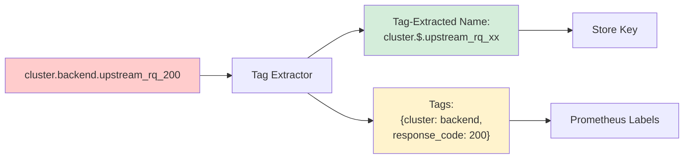
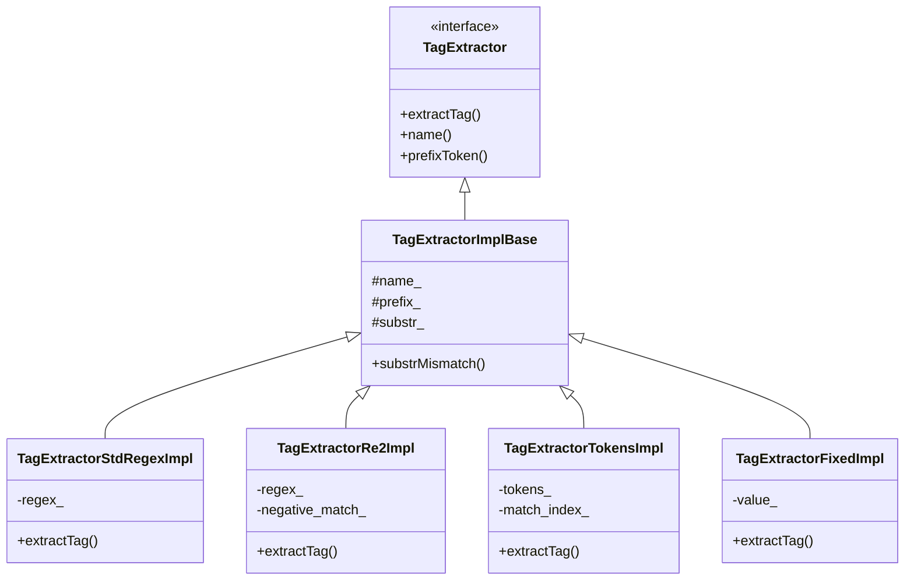
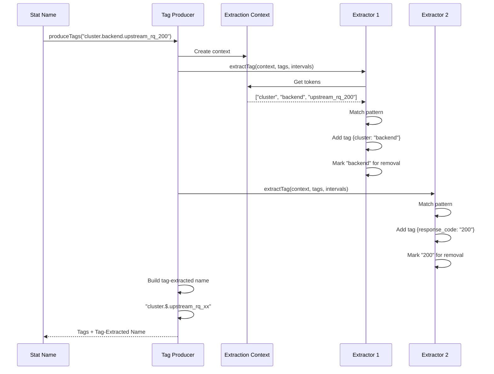

# Tag Extraction: Converting Stat Names to Prometheus Labels

## Overview

Tag Extraction is Envoy's mechanism for converting **flat stat names** into **tag-extracted names with labels**, enabling **Prometheus-compatible metric export**. This transforms stats like `http.response.200` into `http.response.xx{response_code="200"}`, allowing powerful querying and aggregation in Prometheus.

**Key Files:**
- `tag_extractor_impl.h` (190 lines) - Tag extractor implementations
- `tag_extractor_impl.cc` - Extraction logic
- `tag_producer_impl.h/cc` - Tag producer orchestration
- `tag_utility.h/cc` - Helper utilities

**Critical for:** Prometheus integration, metric aggregation, dimensional analysis

## The Problem: Flat vs. Dimensional Metrics

### Traditional Flat Stats (Envoy)

```
cluster.backend.upstream_rq_200  value=150
cluster.backend.upstream_rq_404  value=5
cluster.backend.upstream_rq_500  value=2
cluster.frontend.upstream_rq_200 value=300
cluster.frontend.upstream_rq_404 value=10
cluster.frontend.upstream_rq_500 value=1
```

**Problems:**
- Can't aggregate across dimensions (all 200s)
- Can't filter by specific attributes
- Explosion of unique metric names
- Poor Prometheus integration

### Dimensional Metrics (Prometheus)

```
envoy_cluster_upstream_rq{cluster="backend", response_code="200"}  150
envoy_cluster_upstream_rq{cluster="backend", response_code="404"}  5
envoy_cluster_upstream_rq{cluster="backend", response_code="500"}  2
envoy_cluster_upstream_rq{cluster="frontend", response_code="200"} 300
envoy_cluster_upstream_rq{cluster="frontend", response_code="404"} 10
envoy_cluster_upstream_rq{cluster="frontend", response_code="500"} 1
```

**Benefits:**
- Query all 200s: `sum(envoy_cluster_upstream_rq{response_code="200"})`
- Filter by cluster: `envoy_cluster_upstream_rq{cluster="backend"}`
- Powerful aggregations and grouping
- Native Prometheus support



## Architecture

### Tag Producer

Orchestrates multiple tag extractors:

```cpp
class TagProducer {
public:
  virtual void produceTags(StatName stat_name,
                          StatNamePool& pool,
                          StatNameTagVector& tags) const = 0;
  
  virtual const TagVector& fixedTags() const = 0;
};
```

**TagProducerImpl** applies extractors in sequence:

```cpp
class TagProducerImpl : public TagProducer {
public:
  void produceTags(StatName stat_name, StatNamePool& pool,
                  StatNameTagVector& tags) const override {
    TagExtractionContext context(stat_name_str);
    IntervalSet<size_t> remove_characters;
    
    for (const TagExtractorPtr& extractor : extractors_) {
      extractor->extractTag(context, tags, remove_characters);
    }
    
    // Build tag-extracted name by removing matched characters
  }
  
private:
  std::vector<TagExtractorPtr> extractors_;
  TagVector fixed_tags_;  // Always appended
};
```

### Tag Extractor Hierarchy



## Extractor Implementations

### 1. TagExtractorStdRegexImpl

Uses C++ std::regex for pattern matching:

```cpp
class TagExtractorStdRegexImpl : public TagExtractorImplBase {
public:
  TagExtractorStdRegexImpl(absl::string_view name,
                          absl::string_view regex,
                          absl:string_view substr = "");
  
  bool extractTag(TagExtractionContext& context,
                 std::vector<Tag>& tags,
                 IntervalSet<size_t>& remove_characters) const override;
  
private:
  const std::regex regex_;
};
```

**Example:**

```cpp
// Extract response code from "upstream_rq_200"
TagExtractorStdRegexImpl extractor(
    "response_code",                    // Tag name
    R"(^upstream_rq_(\d{3})$)",        // Regex pattern
    "upstream_rq_"                      // Substr optimization
);

// Input: "cluster.backend.upstream_rq_200"
// Output:
//   Tag: {name: "response_code", value: "200"}
//   Remove: positions of "200"
//   Result: "cluster.backend.upstream_rq_xx"
```

### 2. TagExtractorRe2Impl

Uses RE2 for safer, faster regex:

```cpp
class TagExtractorRe2Impl : public TagExtractorImplBase {
public:
  TagExtractorRe2Impl(absl::string_view name,
                     absl::string_view regex,
                     absl::string_view substr = "",
                     absl::string_view negative_match = "");
  
  bool extractTag(TagExtractionContext& context,
                 std::vector<Tag>& tags,
                 IntervalSet<size_t>& remove_characters) const override;
  
private:
  const re2::RE2 regex_;
  const std::string negative_match_;  // Exclude pattern
};
```

**Features:**
- Linear time complexity (no backtracking)
- Memory safe
- Optional negative matching

**Example with Negative Match:**

```cpp
// Extract cluster name but exclude "admin"
TagExtractorRe2Impl extractor(
    "cluster",
    R"(^cluster\.([^.]+)\.)",
    "cluster.",
    "admin"  // Skip if cluster is "admin"
);
```

### 3. TagExtractorTokensImpl

Token-based pattern matching (no regex overhead):

```cpp
class TagExtractorTokensImpl : public TagExtractorImplBase {
public:
  TagExtractorTokensImpl(absl::string_view name,
                        absl::string_view tokens);
  
  bool extractTag(TagExtractionContext& context,
                 std::vector<Tag>& tags,
                 IntervalSet<size_t>& remove_characters) const override;
  
private:
  const std::vector<std::string> tokens_;
  const uint32_t match_index_;  // Position of '$' in pattern
};
```

**Token Patterns:**
- `*` - Matches any single token
- `**` - Matches 0 or more tokens
- `$` - Captures this token as tag value (exactly one per pattern)

**Examples:**

```cpp
// Extract cluster name from "cluster.<name>.*"
TagExtractorTokensImpl("cluster", "cluster.$.*");

// Input: "cluster.backend.requests"
// Matches: tokens = ["cluster", "backend", "requests"]
//          pattern = ["cluster", "$", "*"]
//          $ matches "backend"
// Output: {cluster: "backend"}

// Extract listener address
TagExtractorTokensImpl("address", "listener.$.**");

// Input: "listener.0.0.0.0_8080.downstream_cx_total"
// Output: {address: "0.0.0.0_8080"}
```

**Performance Advantage:**
- No regex compilation
- Simple string comparison
- ~10x faster than regex for simple patterns

### 4. TagExtractorFixedImpl

Always adds the same tag value:

```cpp
class TagExtractorFixedImpl : public TagExtractorImplBase {
public:
  TagExtractorFixedImpl(absl::string_view name,
                       absl::string_view value);
  
  bool extractTag(TagExtractionContext& context,
                 std::vector<Tag>& tags,
                 IntervalSet<size_t>& remove_characters) const override;
  
private:
  const std::string value_;
};
```

**Use Case:** Add fixed labels like `envoy_cluster_name` or `region`:

```cpp
TagExtractorFixedImpl("envoy_instance", "prod-1");

// Every stat gets: {envoy_instance: "prod-1"}
```

## Tag Extraction Process

### Extraction Context

Provides tokenized access to stat name:

```cpp
class TagExtractionContext {
public:
  explicit TagExtractionContext(absl::string_view name);
  
  absl::string_view name() { return name_; }
  const std::vector<absl::string_view>& tokens();  // Lazy tokenization
  
private:
  absl::string_view name_;
  std::vector<absl::string_view> tokens_;  // Cached
};
```

### Character Removal Tracking

Tracks which characters to remove for tag-extracted name:

```cpp
IntervalSet<size_t> remove_characters;

// Extractor 1 removes positions [10, 13] (response code)
remove_characters.insert(10, 13);

// Extractor 2 removes positions [20, 25] (cluster name)
remove_characters.insert(20, 25);

// Build tag-extracted name excluding these positions
```

### Complete Extraction Flow



## Performance Optimizations

### 1. Substring Pre-Filter

Avoid regex evaluation if substring not present:

```cpp
bool TagExtractorImplBase::substrMismatch(absl::string_view stat_name) const {
  if (substr_.empty()) {
    return false;  // No filter
  }
  return stat_name.find(substr_) == absl::string_view::npos;
}

bool TagExtractorStdRegexImpl::extractTag(...) const {
  if (substrMismatch(context.name())) {
    PERF_TAG_INC(skipped_);
    return false;  // Early exit
  }
  
  // Expensive regex evaluation
  std::smatch match;
  if (std::regex_search(name, match, regex_)) {
    PERF_TAG_INC(matched_);
    // Extract tag
  }
}
```

**Impact:** Can skip 80-90% of regex evaluations.

### 2. Prefix Token Extraction

Extract common prefix from regex for fast filtering:

```cpp
std::string TagExtractorImplBase::extractRegexPrefix(
    absl::string_view regex) {
  // Look for pattern: ^alphanumerics_with_underscores\.
  // Example: "^cluster\.([^.]+)\." → "cluster"
  
  if (regex.size() < 2 || regex[0] != '^') {
    return "";
  }
  
  size_t i = 1;
  while (i < regex.size() && (isalnum(regex[i]) || regex[i] == '_')) {
    ++i;
  }
  
  if (i < regex.size() && regex[i] == '\\' && 
      i + 1 < regex.size() && regex[i+1] == '.') {
    return std::string(regex.substr(1, i - 1));
  }
  
  return "";
}
```

**Usage:**

```cpp
TagExtractorStdRegexImpl extractor(
    "cluster",
    R"(^cluster\.([^.]+)\.)",
    ""  // No substr provided
);

// Automatically extracts prefix: "cluster"
// Can skip stats not starting with "cluster."
```

### 3. Performance Annotation

Track extractor effectiveness:

```cpp
#ifdef ENVOY_PERF_ANNOTATION
struct Counters {
  uint32_t skipped_{};   // Skipped via substr mismatch
  uint32_t matched_{};   // Successfully matched
  uint32_t missed_{};    // Evaluated but didn't match
};
#endif

// At program end, prints:
// TagStats for response_code extractor: 
//   skipped 95000, matched 4500, missing 500
```

**Use:** Identify poorly-configured extractors and optimization opportunities.

## Configuration

### Static Configuration

```cpp
// Create extractors
auto cluster_extractor = TagExtractorImplBase::createTagExtractor(
    "cluster",
    R"(^cluster\.([^.]+)\.)",
    "cluster.",  // Substring optimization
    "",          // No negative match
    Regex::Type::Re2
);

auto response_code_extractor = TagExtractorImplBase::createTagExtractor(
    "response_code",
    R"(upstream_rq_(\d{3})$)",
    "upstream_rq_",
    "",
    Regex::Type::StdRegex
);

// Build producer
TagProducerImpl producer;
producer.addExtractor(std::move(cluster_extractor.value()));
producer.addExtractor(std::move(response_code_extractor.value()));

// Set in store
store.setTagProducer(std::make_unique<TagProducerImpl>(producer));
```

### Dynamic Configuration (Protobuf)

From `envoy::config::metrics::v3::StatsConfig`:

```yaml
stats_config:
  stats_tags:
    - tag_name: cluster_name
      regex: "^cluster\\.([^.]+)\\."
    - tag_name: response_code
      regex: "upstream_rq_(\\d{3})$"
    - tag_name: region
      fixed_value: "us-west-2"
  use_all_default_tags: true
```

## Integration with Stats Storage

### Storage with Tags

```cpp
class MetricImpl {
  StatName name_;                  // Full name with tag values
  StatName tag_extracted_name_;   // Name with tags removed
  StatNameTagVector tags_;        // Extracted tags
};
```

**Example:**

```
name_:                "cluster.backend.upstream_rq_200"
tag_extracted_name_: "cluster.$.upstream_rq_xx"
tags_:                [{cluster, backend}, {response_code, 200}]
```

### Tag-Extracted Name as Storage Key

Central cache uses tag-extracted name:

```cpp
struct CentralCacheEntry {
  // Key is tag-extracted name
  StatNameHashMap<CounterSharedPtr> counters_;
};

// All response codes share same storage key
"cluster.backend.upstream_rq_200" → "cluster.$.upstream_rq_xx"
"cluster.backend.upstream_rq_404" → "cluster.$.upstream_rq_xx"
"cluster.backend.upstream_rq_500" → "cluster.$.upstream_rq_xx"

// But different full names distinguish them
```

### Prometheus Export

```cpp
void exportToPrometheus(const Counter& counter) {
  // Get tag-extracted name
  std::string metric_name = sanitize(counter.tagExtractedName());
  
  // Build label string from tags
  std::string labels = "{";
  for (const Tag& tag : counter.tags()) {
    labels += tag.name() + "=\"" + tag.value() + "\",";
  }
  labels += "}";
  
  // Output: envoy_cluster_upstream_rq{cluster="backend",response_code="200"} 150
  std::cout << metric_name << labels << " " << counter.value() << "\n";
}
```

## Common Patterns

### HTTP Response Codes

```cpp
// Extract XX from http_response_XXX
TagExtractorTokensImpl("response_code", "http.response.$");

// Or with regex
TagExtractorRe2Impl("response_code",
                    R"(http\.response\.(\d{3})$)",
                    "http.response.");
```

### Cluster Names

```cpp
// Extract cluster name from "cluster.<name>.*"
TagExtractorTokensImpl("cluster", "cluster.$.**");
```

### Listener Addresses

```cpp
// Extract address from "listener.<address>.*"
TagExtractorTokensImpl("listener_address", "listener.$.**");
```

### Connection IDs (Exclude)

```cpp
// Skip extracting connection IDs (too high cardinality)
TagExtractorRe2Impl("connection_id",
                    R"(connection_(\d+))",
                    "connection_",
                    ".*");  // Negative match = always skip
```

## Cardinality Management

High cardinality tags can explode metric count:

### Problem

```cpp
// BAD: User ID as tag
TagExtractorTokensImpl("user_id", "api.$.requests");

// With 1M users:
// api.user1.requests
// api.user2.requests
// ...
// api.user1000000.requests
// = 1M unique metrics!
```

### Solutions

**1. Aggregate at Source:**

```cpp
// GOOD: Don't break down by user ID
// Just: api.requests (single metric)
```

**2. Use Allowlists:**

```cpp
// Only extract known clusters
TagExtractorRe2Impl("cluster",
                    R"(^cluster\.(backend|frontend|cache)\.)",
                    "cluster.");
```

**3. Sampling:**

```cpp
// Only tag a subset
if (shouldSampleUser(user_id)) {
  // Create per-user stat
} else {
  // Use aggregated stat
}
```

## Debugging and Testing

### Extractor Effectiveness

```cpp
#ifdef ENVOY_PERF_ANNOTATION
// Run with: bazel test --define=perf_annotation=enabled

~TagExtractorImplBase() {
  std::cout << fmt::format(
      "TagStats for {} extractor: skipped {}, matched {}, missing {}",
      name_, counters_->skipped_, counters_->matched_, counters_->missed_)
            << std::endl;
}
#endif
```

### Test Utilities

```cpp
// Test tag extraction
TEST(TagExtractorTest, ResponseCode) {
  auto extractor = TagExtractorImplBase::createTagExtractor(
      "response_code",
      R"(upstream_rq_(\d{3})$)",
      "upstream_rq_");
  
  TagExtractionContext context("cluster.backend.upstream_rq_200");
  std::vector<Tag> tags;
  IntervalSet<size_t> remove;
  
  EXPECT_TRUE(extractor->extractTag(context, tags, remove));
  EXPECT_EQ(tags.size(), 1);
  EXPECT_EQ(tags[0].name_, "response_code");
  EXPECT_EQ(tags[0].value_, "200");
}
```

## Best Practices

### DO:
- Use token-based extractors for simple patterns (faster)
- Provide substring hints for regex extractors
- Extract low-cardinality tags (cluster, response code)
- Use RE2 over std::regex (safer, faster)
- Test extractors with representative stat names
- Monitor extractor performance in production

### DON'T:
- Extract high-cardinality tags (user IDs, timestamps)
- Use complex regex with backtracking
- Forget substring optimizations
- Extract personally identifiable information
- Create tags that change frequently
- Use tags for unbounded dimensions

## Code Examples

### Creating Custom Extractors

```cpp
// Token-based (fastest)
auto cluster_extractor = std::make_unique<TagExtractorTokensImpl>(
    "cluster_name",
    "cluster.$.**"
);

// Regex-based (flexible)
auto response_extractor = TagExtractorImplBase::createTagExtractor(
    "response_code",
    R"(upstream_rq_(\d{3})$)",
    "upstream_rq_",
    "",
    Regex::Type::Re2
);

// Fixed tag
auto region_extractor = std::make_unique<TagExtractorFixedImpl>(
    "region",
    "us-west-2"
);
```

### Building a Tag Producer

```cpp
TagProducerImpl producer;
producer.addExtractor(std::move(cluster_extractor));
producer.addExtractor(std::move(response_extractor));
producer.addExtractor(std::move(region_extractor));

store.setTagProducer(std::make_unique<TagProducerImpl>(producer));
```

### Manual Tag Extraction

```cpp
StatNamePool pool(symbol_table);
StatNameTagVector tags;

store.extractAndAppendTags(
    stat_name,
    pool,
    tags
);

// tags now contains extracted tags
for (const auto& tag : tags) {
  std::cout << tag.first << " = " << tag.second << "\n";
}
```

## Related Documentation

- **THREAD_LOCAL_STORE.md** - How tags are stored with stats
- **SYMBOL_TABLE.md** - Tag names encoded as StatNames
- **tag_producer_impl.h** - Tag producer implementation
- **tag_utility.h** - Helper utilities for tag manipulation

## Summary

Tag Extraction transforms Envoy's flat stat names into dimensional metrics compatible with Prometheus:

**Key Components:**
- **TagExtractor:** Pattern-based extraction (regex, tokens, fixed)
- **TagProducer:** Orchestrates multiple extractors
- **TagExtractionContext:** Provides tokenized access to stat names
- **IntervalSet:** Tracks characters to remove for tag-extracted names

**Performance Optimizations:**
- Substring pre-filtering (80-90% skip rate)
- Prefix token extraction (fast early rejection)
- Token-based patterns (10x faster than regex)
- RE2 instead of std::regex (safer, faster)

**Integration:**
- Tag-extracted names used as storage keys
- Full names distinguish similar stats
- Tags exported as Prometheus labels
- Enables powerful dimensional queries

**Best Practices:**
- Keep cardinality low (< 100 values per tag)
- Use token extractors when possible
- Provide substring hints for regex
- Monitor extractor effectiveness
- Test with representative data

Tag Extraction is critical for making Envoy's stats useful in modern observability platforms, enabling the powerful dimensional queries that make Prometheus and similar systems so effective for understanding system behavior.
