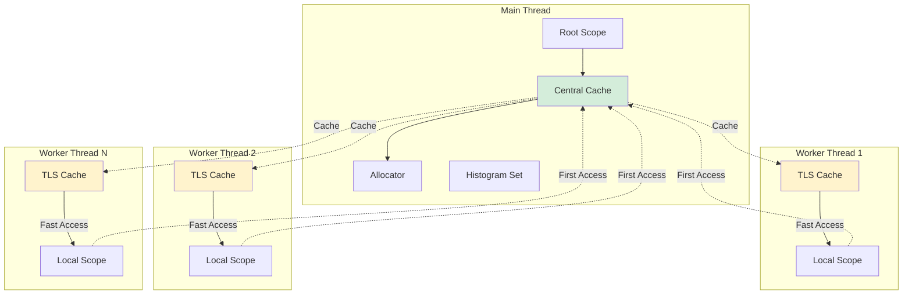
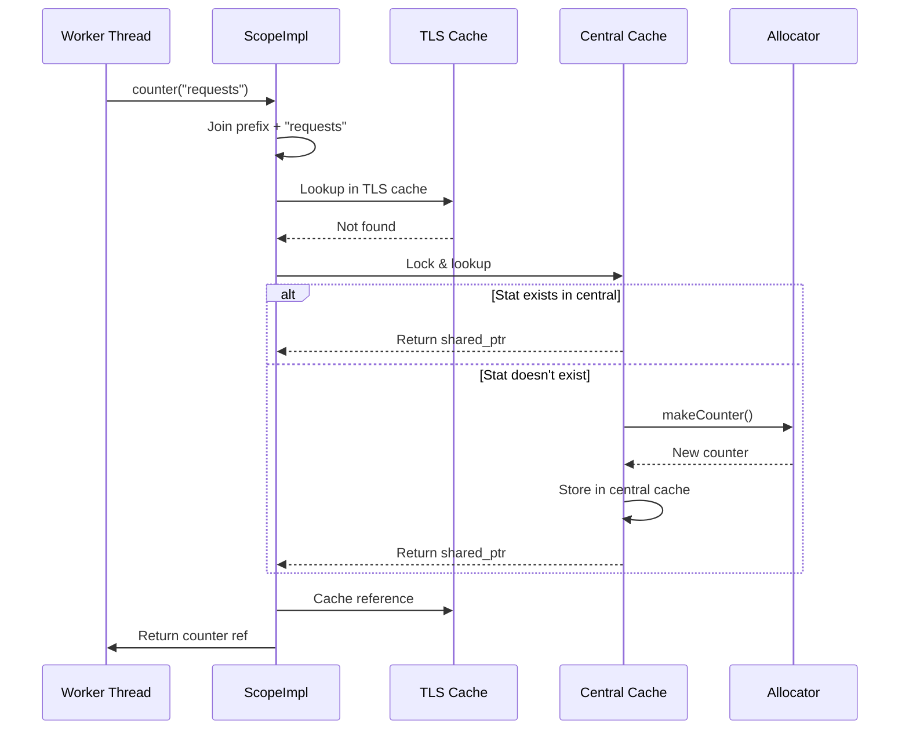
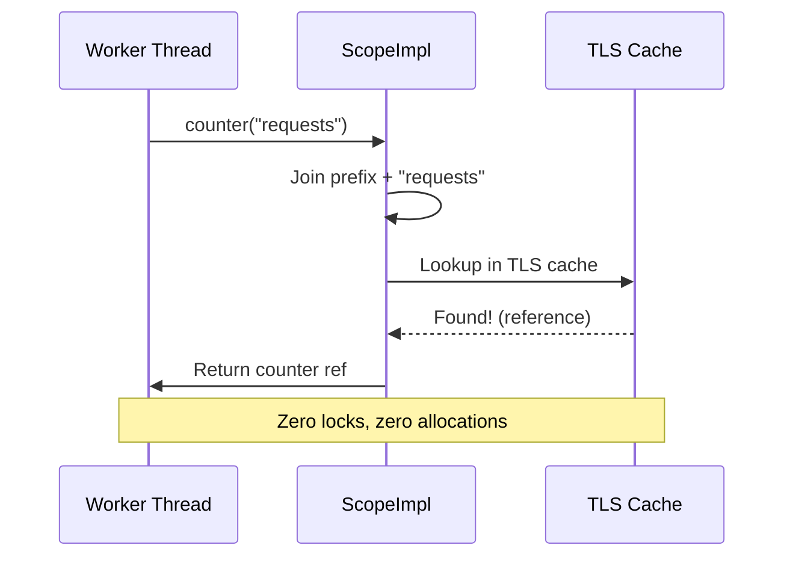
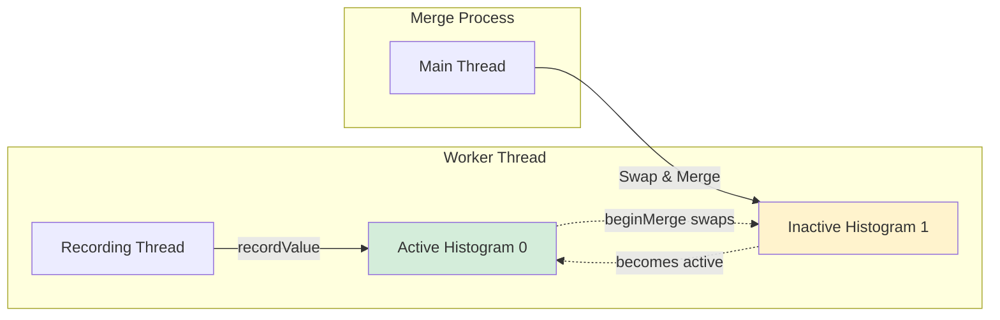
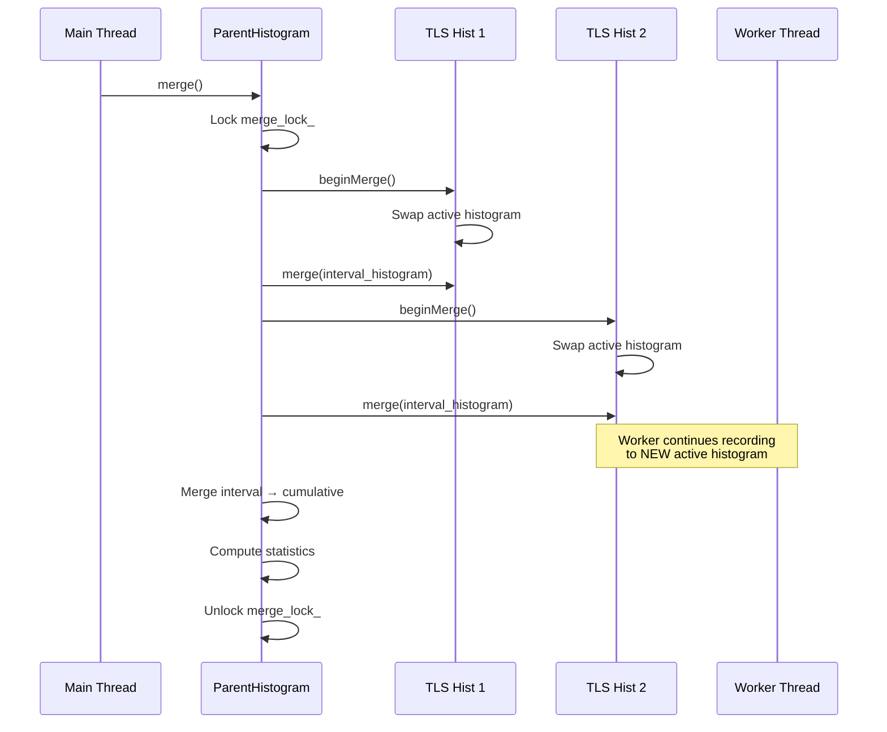
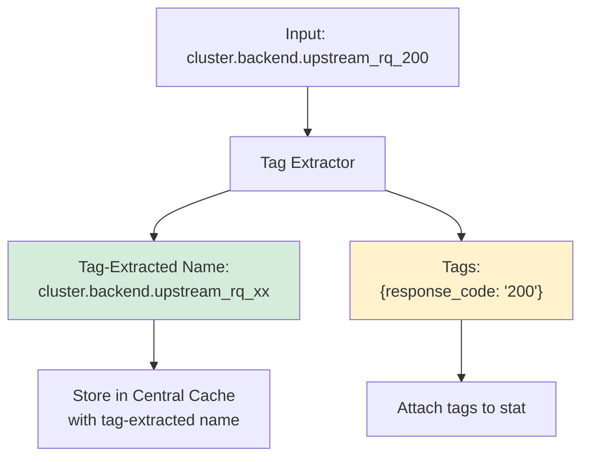
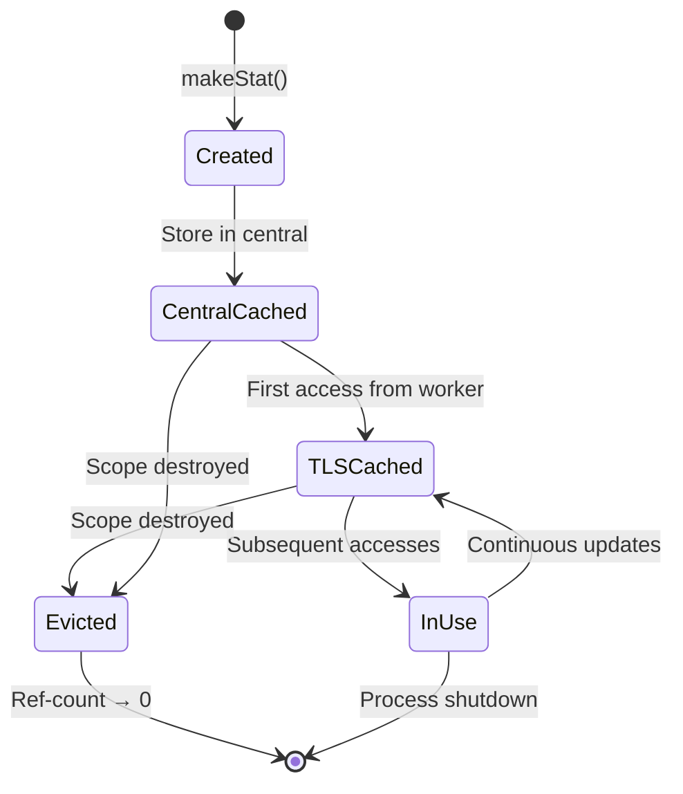
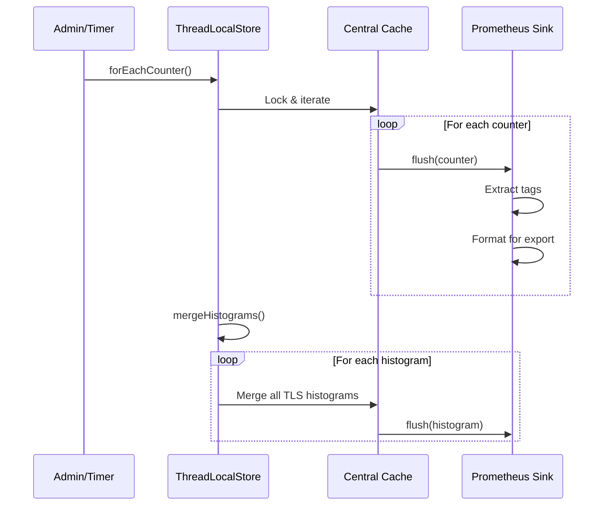

# Thread Local Store: Distributed Stats Architecture

## Overview

The Thread Local Store (TLS) is Envoy's primary stats implementation, providing **lock-free stat access on worker threads** while maintaining **central storage** for aggregation and export. It's the largest and most complex component in the stats subsystem, implementing a sophisticated two-tier caching architecture.

**Key Files:**
- `thread_local_store.h` (400+ lines) - Interfaces and core structures
- `thread_local_store.cc` (1500+ lines) - **Largest implementation file**

**Performance Impact:** Enables millions of stat updates per second per worker thread with zero lock contention.

## The Threading Challenge

Envoy uses a threading model with:
- **Main Thread:** Admin, xDS, initialization
- **Worker Threads:** Request processing (N threads)

Stats must be:
1. **Fast to update** on worker threads (hot path)
2. **Aggregated** across all threads for export
3. **Consistent** when read from admin endpoint
4. **Memory-efficient** with thousands of stats per thread

**Naive Approach Problems:**
- Shared mutex → contention on every stat update
- Per-thread storage only → can't aggregate for Prometheus
- Lock-free atomics → cache line bouncing across cores

## Architecture: Two-Tier Storage

The ThreadLocalStoreImpl uses a hybrid approach:



### Central Cache (Main Thread)

**Purpose:** Single source of truth for all stats
- Authoritative stat objects created here
- Allocator manages memory
- Ref-counted shared pointers

```cpp
struct CentralCacheEntry : public RefcountHelper {
  StatNameHashMap<CounterSharedPtr> counters_;
  StatNameHashMap<GaugeSharedPtr> gauges_;
  StatNameHashMap<ParentHistogramImplSharedPtr> histograms_;
  StatNameHashMap<TextReadoutSharedPtr> text_readouts_;
  StatNameStorageSet rejected_stats_;
  SymbolTable& symbol_table_;
};
```

### TLS Cache (Worker Threads)

**Purpose:** Lock-free access to stat references
- Stores references, not copies
- Populated on-demand (lazy)
- No locks during stat updates

```cpp
struct TlsCacheEntry {
  StatRefMap<Counter> counters_;          // Reference wrappers
  StatRefMap<Gauge> gauges_;
  StatRefMap<TextReadout> text_readouts_;
  StatNameHashMap<ParentHistogramSharedPtr> parent_histograms_;
  StatNameHashSet rejected_stats_;        // TLS rejection cache
};
```

## Key Classes

### ThreadLocalStoreImpl

The root store implementation:

```cpp
class ThreadLocalStoreImpl : public StoreRoot {
public:
  ThreadLocalStoreImpl(Allocator& alloc);
  
  // Initialize threading support
  void initializeThreading(Event::Dispatcher& main_thread_dispatcher,
                          ThreadLocal::Instance& tls) override;
  
  // Root scope provides default stat creation
  ScopeSharedPtr rootScope() override;
  
  // Histogram management
  void mergeHistograms(PostMergeCb merge_cb) override;
  
  // Tag extraction
  void extractAndAppendTags(StatName name, StatNamePool& pool,
                           StatNameTagVector& tags) override;
};
```

### ScopeImpl

Per-scope stat creation and caching:

```cpp
struct ScopeImpl : public Scope {
  ScopeImpl(ThreadLocalStoreImpl& parent, StatName prefix);
  
  // Stat creation with caching
  Counter& counterFromStatNameWithTags(const StatName& name,
                                      StatNameTagVectorOptConstRef tags) override;
  Gauge& gaugeFromStatNameWithTags(const StatName& name,
                                   StatNameTagVectorOptConstRef tags,
                                   Gauge::ImportMode import_mode) override;
  Histogram& histogramFromStatNameWithTags(const StatName& name,
                                          StatNameTagVectorOptConstRef tags,
                                          Histogram::Unit unit) override;
  
  // Child scope creation
  ScopeSharedPtr createScope(const std::string& name) override;
};
```

## Stat Creation Flow

### First Access (Cold Path)



**Steps:**
1. Construct full name (scope prefix + stat name)
2. Check TLS cache (lock-free)
3. Miss → acquire central cache lock
4. Check central cache
5. Miss → allocate new stat
6. Store in central cache
7. Cache reference in TLS
8. Return reference to caller

### Subsequent Access (Hot Path)



**Performance:**
- No locking
- No allocations
- Hash lookup only
- Returns in nanoseconds

## Histogram Architecture

Histograms have special handling due to their complexity:

### ParentHistogramImpl

Lives in central storage, coordinates thread-local histograms:

```cpp
class ParentHistogramImpl : public MetricImpl<ParentHistogram> {
public:
  // Called during flush to aggregate all TLS histograms
  void merge() override;
  
  // Add a TLS histogram child
  void addTlsHistogram(const TlsHistogramSharedPtr& hist_ptr);
  
  // Statistics access
  const HistogramStatistics& intervalStatistics() const override;
  const HistogramStatistics& cumulativeStatistics() const override;
  
private:
  ThreadLocalStoreImpl& thread_local_store_;
  histogram_t* interval_histogram_;
  histogram_t* cumulative_histogram_;
  std::list<TlsHistogramSharedPtr> tls_histograms_;
  mutable Thread::MutexBasicLockable merge_lock_;
};
```

### ThreadLocalHistogramImpl

Per-thread histogram for fast recording:

```cpp
class ThreadLocalHistogramImpl : public HistogramImplHelper {
public:
  void recordValue(uint64_t value) override;
  
  // Swap active histogram during merge
  void beginMerge() {
    current_active_ = otherHistogramIndex();
  }
  
  void merge(histogram_t* target);
  
private:
  uint64_t current_active_{0};
  histogram_t* histograms_[2];  // Double buffering!
};
```

### Double Buffering Strategy

Each TLS histogram has **two internal histograms**:



**Benefit:** Recording continues on worker thread while main thread merges the other histogram.

### Histogram Merge Flow



## Scope Management

### Scope Hierarchy

Scopes form a tree for organizing stats:

```
root scope ("")
├─ cluster scope ("cluster.backend")
│  ├─ upstream_rq_200
│  ├─ upstream_rq_500
│  └─ subset scope ("cluster.backend.version_v1")
│     ├─ upstream_rq_200
│     └─ upstream_rq_500
└─ listener scope ("listener.0.0.0.0_8080")
   ├─ downstream_cx_total
   └─ downstream_cx_active
```

### Scope Prefix Joining

Each scope has a StatName prefix. Creating stats joins prefix + name:

```cpp
Counter& ScopeImpl::counterFromStatNameWithTags(
    const StatName& name,
    StatNameTagVectorOptConstRef tags) {
  
  // Join scope prefix with stat name
  StatName full_name = joinPrefix(prefix_, name);
  
  // Lookup in TLS cache with full name
  return makeStat<Counter>(full_name, tags, ...);
}
```

**Example:**
```cpp
ScopeSharedPtr cluster_scope = root_scope->createScope("cluster.backend");
Counter& counter = cluster_scope->counterFromString("requests");
// Full name: "cluster.backend.requests"
```

### Scope Lifecycle

```cpp
ScopeImpl::ScopeImpl(ThreadLocalStoreImpl& parent, StatName prefix)
    : parent_(parent), prefix_(prefix, parent.symbolTable()) {
  // Increment ref-count on prefix symbols
}

ScopeImpl::~ScopeImpl() {
  // Decrement ref-count on prefix symbols
  prefix_.free(parent_.symbolTable());
}
```

**Important:** Scopes must outlive all stats created within them.

## Tag Extraction Integration

Stats are stored with **tag-extracted names** for Prometheus compatibility:

### Tag Extraction Process



### Implementation

```cpp
void ThreadLocalStoreImpl::extractAndAppendTags(
    StatName name,
    StatNamePool& pool,
    StatNameTagVector& tags) {
  
  tag_producer_->produceTags(name, pool, tags);
}

// In ScopeImpl::makeStat:
StatNamePool pool(symbol_table_);
StatNameTagVector tags;
parent_.extractAndAppendTags(full_stat_name, pool, tags);

StatName tag_extracted_name = extractTagName(full_stat_name, tags);
Counter& counter = allocator.makeCounter(
    full_stat_name,
    tag_extracted_name,  // Used for aggregation
    tags
);
```

## Stat Matching and Rejection

### StatsMatcher Integration

Stats can be rejected before creation based on patterns:

```cpp
template <class StatType>
RefcountPtr<StatType> makeStat(
    StatName full_stat_name,
    ...) {
  
  // Check rejection cache (TLS, no lock)
  if (tls_cache.rejected_stats_.contains(full_stat_name)) {
    return nullptr;  // Return null stat
  }
  
  // Check matcher (if configured)
  if (stats_matcher_ && stats_matcher_->rejects(full_stat_name)) {
    tls_cache.rejected_stats_.insert(full_stat_name);
    return nullptr;
  }
  
  // Create stat...
}
```

### Null Stats

When a stat is rejected, a **null stat** is returned:

```cpp
Counter& ScopeImpl::counterFromStatNameWithTags(...) {
  auto counter = makeStat<Counter>(...);
  if (counter == nullptr) {
    return parent_.nullCounter();  // Returns NullCounterImpl
  }
  return *counter;
}
```

**Null Stats:**
- No-op on all operations
- Zero memory overhead after first access
- Ensures code doesn't need to check for nulls

## Memory Management

### Reference Counting

Stats use shared pointers with ref-counting:

```cpp
// Central cache owns shared_ptrs
StatNameHashMap<CounterSharedPtr> counters_;

// TLS cache holds references
StatRefMap<Counter> tls_counters_;  // reference_wrapper

// When scope destroyed:
~ScopeImpl() {
  // Shared pointers decremented
  // If ref-count → 0, stat destroyed
  // Allocator frees memory
}
```

### Stat Lifecycle



### Eviction

```cpp
void ThreadLocalStoreImpl::evictUnused() {
  // Iterate all scopes
  // For each stat with use_count() == 1 (only central cache holds it)
  //   Remove from central cache
  //   StatNameStorage freed
  //   Symbols decremented in symbol table
}
```

**When to Evict:**
- Periodic cleanup (admin endpoint)
- After xDS update removing clusters
- Memory pressure response

## Performance Optimizations

### Lock-Free Stat Updates

Worker threads update stats without locks:

```cpp
void CounterImpl::add(uint64_t amount) {
  value_.fetch_add(amount, std::memory_order_relaxed);
  flags_ |= Flags::Used;
}
```

**No Lock Required Because:**
- Atomics for thread-safe updates
- Each thread has its own TLS cache
- Stat object is ref-counted and stable

### TLS Cache Warm-up

After first access, subsequent lookups are hash-table only:

```cpp
Counter& ScopeImpl::counterFromStatNameWithTags(...) {
  // Join prefix + name (lock-free via SymbolTable::join)
  StatName joined = joinPrefixAndName(...);
  
  // TLS lookup (lock-free)
  auto iter = tls_cache.counters_.find(joined);
  if (iter != tls_cache.counters_.end()) {
    return iter->second;  // Found! Return in ~10ns
  }
  
  // Cold path: acquire lock, create/lookup, cache, return
  return makeStatInternal(...);
}
```

### Rejection Caching

Rejected stat names cached per-thread to avoid matcher evaluation:

```cpp
// First rejection (slow)
if (stats_matcher_->rejects(name)) {  // Regex evaluation
  tls_cache.rejected_stats_.insert(name);
  return nullCounter();
}

// Subsequent rejections (fast)
if (tls_cache.rejected_stats_.contains(name)) {  // Hash lookup only
  return nullCounter();
}
```

### Histogram Cache

Parent histograms are stored separately in a global cache keyed by unique ID:

```cpp
Histogram& ThreadLocalStoreImpl::tlsHistogram(
    ParentHistogramImpl& parent, 
    uint64_t id) {
  
  // Check TLS histogram cache
  auto iter = tls_cache.tls_histogram_cache_.find(id);
  if (iter != tls_cache.tls_histogram_cache_.end()) {
    return *iter->second;
  }
  
  // Create TLS histogram
  auto tls_hist = std::make_shared<ThreadLocalHistogramImpl>(...);
  parent.addTlsHistogram(tls_hist);
  tls_cache.tls_histogram_cache_[id] = tls_hist;
  return *tls_hist;
}
```

**Benefit:** Same-named histograms across different scopes reuse TLS histogram after scope recreation (common with xDS updates).

## Integration with Sinks

### Flush Process



### Sink Predicates

Filter which stats are sent to sinks:

```cpp
void ThreadLocalStoreImpl::setSinkPredicates(
    std::unique_ptr<SinkPredicates>&& sink_predicates) {
  sink_predicates_ = std::move(sink_predicates);
  alloc_.setSinkPredicates(std::move(sink_predicates));
}

void forEachSinkedCounter(SizeFn f_size, StatFn<Counter> f_stat) const {
  // Only iterate stats matching sink predicates
  alloc_.forEachSinkedCounter(f_size, f_stat);
}
```

**Use Case:** Different sinks may want different stat subsets (e.g., only histograms for detailed analysis).

## Initialization and Shutdown

### Initialization

```cpp
void ThreadLocalStoreImpl::initializeThreading(
    Event::Dispatcher& main_thread_dispatcher,
    ThreadLocal::Instance& tls) {
  
  // Allocate TLS slot
  tls_slot_ = tls.allocateSlot();
  
  // Initialize TLS cache on each worker thread
  tls_slot_->set([](Event::Dispatcher&) -> ThreadLocal::ThreadLocalObjectSharedPtr {
    return std::make_shared<TlsCache>();
  });
}
```

### Shutdown

```cpp
void ThreadLocalStoreImpl::shutdownThreading() {
  // Mark all parent histograms as shutting down
  for (auto& hist : histogram_set_) {
    hist->setShuttingDown(true);
  }
  
  // Free TLS slot (destroys all TLS caches)
  tls_slot_.reset();
}

ThreadLocalStoreImpl::~ThreadLocalStoreImpl() {
  shutdownThreading();
  // Central cache destroyed
  // All stats ref-counts decremented
}
```

## Advanced Features

### Hot Restart Support

Gauges have import modes for hot restart:

```cpp
enum class ImportMode {
  Uninitialized,          // Not received from parent
  Accumulate,             // Add parent's value
  NeverImport,            // Ignore parent's value
  HiddenAccumulate        // Accumulate but don't export
};

Gauge& gaugeFromStatNameWithTags(..., Gauge::ImportMode import_mode) {
  // Create gauge with import mode
  // If parent process provides value, handle per mode
}
```

### Scope Limits

Scopes can have limits on number of stats:

```cpp
struct ScopeStatsLimitSettings {
  uint64_t max_counters{0};
  uint64_t max_gauges{0};
  uint64_t max_histograms{0};
  uint64_t max_text_readouts{0};
};

ScopeSharedPtr createScope(
    const std::string& name,
    bool evictable,
    const ScopeStatsLimitSettings& limits,
    StatsMatcherSharedPtr matcher) {
  // Scope tracks stat count
  // Reject new stats if limit exceeded
}
```

**Use Case:** Prevent runaway stat creation from misbehaving plugins.

### Thread Synchronization (Testing)

```cpp
Thread::ThreadSynchronizer& sync() { return sync_; }
```

Test hook for reproducing race conditions in tests.

## Common Patterns

### Creating a Stat

```cpp
// In hot path (request processing)
Counter& counter = scope.counterFromString("requests");
counter.inc();

// With tags
StatNameTagVector tags = {{tag_name, tag_value}};
Counter& counter = scope.counterFromStatNameWithTags(name, tags);
counter.inc();
```

### Creating a Scope

```cpp
// Create cluster scope
ScopeSharedPtr cluster_scope = 
    root_scope->createScope("cluster.backend");

// Create stats within scope
Counter& requests = cluster_scope->counterFromString("requests");
Gauge& active = cluster_scope->gaugeFromString("active", Gauge::ImportMode::Accumulate);
```

### Finding Existing Stats

```cpp
// Find without creating
CounterOptConstRef counter = scope.findCounter(name);
if (counter.has_value()) {
  uint64_t value = counter->value();
}
```

### Iterating Stats

```cpp
// Iterate all counters in a scope
scope.iterate([](const CounterSharedPtr& counter) {
  std::cout << counter->name() << ": " << counter->value() << "\n";
  return true;  // Continue iteration
});

// Iterate all stats in store
store.forEachCounter([](const Counter& counter) {
  // Process counter
});
```

## Debugging

### Inspecting State

```cpp
// Get all counters
std::vector<CounterSharedPtr> counters = store.counters();

// Get all histograms
std::vector<ParentHistogramSharedPtr> histograms = store.histograms();

// Iterate scopes
store.forEachScope([](const Scope& scope) {
  // Inspect scope
});
```

### Common Issues

**Issue:** Stats not appearing in output
- **Check:** StatsMatcher not rejecting them
- **Check:** Scope still alive
- **Check:** Stat actually being created (not null)

**Issue:** High memory usage
- **Check:** Too many stats being created
- **Check:** Eviction not running
- **Check:** Scopes not being destroyed

**Issue:** Lock contention
- **Check:** Creating stats in hot path (use dynamic names)
- **Check:** Too many scopes being created/destroyed
- **Check:** StatNameSet builtins not populated

## Performance Characteristics

### Operation Costs

| Operation | Hot Path | Cold Path | Notes |
|-----------|----------|-----------|-------|
| counter.inc() | ~5ns | N/A | Atomic add |
| Get counter (cached) | ~20ns | ~500ns | Hash lookup vs lock+alloc |
| Get counter (new) | N/A | ~5µs | Allocation + insertion |
| Histogram record | ~50ns | ~5µs | TLS hist vs creation |
| Histogram merge | N/A | ~100µs | Per-parent histogram |
| Scope creation | N/A | ~10µs | Symbol table encode |

### Memory Footprint

Per stat (approximate):
- Central cache entry: 80 bytes (shared_ptr + hash map overhead)
- TLS cache entry: 16 bytes (reference_wrapper + hash map overhead)
- Stat object itself: ~100 bytes (varies by type)

**Total per stat:** ~200 bytes + symbol table overhead

With 10,000 stats across 8 worker threads:
- Central: ~1.8 MB
- TLS: ~1.3 MB (8 threads × 16 bytes × 10,000 stats)
- **Total: ~3.1 MB**

## Best Practices

### DO:
- Create scopes at initialization, not per-request
- Use TLS cache warming for frequently-accessed stats
- Pre-populate StatNameSet with common tokens
- Use gauges with appropriate ImportMode for hot restart
- Call evictUnused() periodically if creating dynamic scopes

### DON'T:
- Create stats in hot path with symbolic names (use dynamic)
- Hold scope references longer than necessary
- Create scopes with dynamic names without limits
- Forget to check StatsMatcher when creating stats manually
- Assume stats are sorted (use sortByStatNames if needed)

## Code Examples

### Basic Counter Usage

```cpp
// Initialize store
Allocator allocator(symbol_table);
ThreadLocalStoreImpl store(allocator);
store.initializeThreading(dispatcher, tls);

ScopeSharedPtr root = store.rootScope();
Counter& counter = root->counterFromString("requests");

// In hot path
counter.inc();
counter.add(100);

// Read value
uint64_t value = counter.value();
```

### Histogram with Units

```cpp
Histogram& latency = scope.histogramFromString(
    "request_duration", 
    Histogram::Unit::Milliseconds
);

latency.recordValue(150);  // 150ms
```

### Scope Hierarchy

```cpp
ScopeSharedPtr cluster_scope = root->createScope("cluster.backend");
ScopeSharedPtr subset_scope = cluster_scope->createScope("version_v1");

Counter& requests = subset_scope->counterFromString("requests");
// Full name: "cluster.backend.version_v1.requests"
```

### Custom Tag Extractor

```cpp
store.setTagProducer(std::make_unique<MyTagProducer>());

// Now all stats automatically extract custom tags
Counter& counter = scope.counterFromString("http.response.200");
// Extracted as: "http.response.xx" with tag {code: "200"}
```

## Related Documentation

- **SYMBOL_TABLE.md** - StatName encoding and memory optimization
- **ALLOCATOR.md** - Central stat memory management
- **HISTOGRAM_IMPL.md** - Histogram internals and merge process
- **TAG_EXTRACTION.md** - Tag producer and extractor implementation
- **STAT_MATCHER.md** - Filtering stats by pattern

## Summary

The ThreadLocalStoreImpl is Envoy's high-performance stats implementation, achieving lock-free updates on worker threads through a two-tier caching architecture:

1. **Central Cache:** Authoritative stat storage on main thread
2. **TLS Cache:** Lock-free references on each worker thread

**Key Design Decisions:**
- TLS cache stores references, not copies (avoids contention on destruction)
- Histograms use double-buffering for lock-free recording during merge
- Rejection caching prevents repeated matcher evaluation
- Scope prefixes encoded as StatNames for efficient joining
- Null stats returned for rejected stats (no null checks needed)

**Performance Results:**
- Millions of stat updates per second per worker thread
- Sub-microsecond stat access after cache warm-up
- Zero lock contention on hot path
- Efficient histogram merge without blocking workers

The ThreadLocalStore demonstrates that with careful architecture, it's possible to have both **fast local access** and **global aggregation** without compromising either. This is critical for Envoy's ability to maintain detailed observability at scale.
