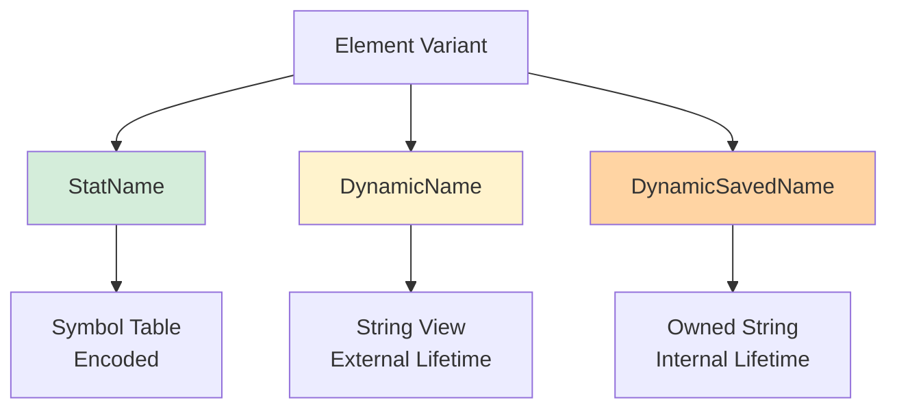

# Utility: Helper Functions for Stats

## Overview

The Utility namespace provides **convenience functions** for creating stats with dynamic and symbolic names, managing stat names, and performing common stat operations. These helpers simplify stat creation, especially when dealing with **dynamic components** discovered during request processing.

**Key Files:**
- `utility.h` (289 lines) - Helper interfaces
- `utility.cc` - Implementation details

**Purpose:** Simplify common stat operations and provide ergonomic APIs.

## Core Components

### Element: Composable Stat Name Parts

```cpp
class DynamicName : public absl::string_view {
public:
  explicit DynamicName(absl::string_view str);
};

class DynamicSavedName : public std::string {
public:
  explicit DynamicSavedName(absl::string_view str);
};

// Element can hold StatName or dynamic strings
using Element = absl::variant<StatName, DynamicName, DynamicSavedName>;
using ElementVec = absl::InlinedVector<Element, 8>;
```

**Why Three Types?**

1. **StatName:** Symbolic, memory-efficient, from SymbolTable
2. **DynamicName:** String view, for temporaries (caller ensures lifetime)
3. **DynamicSavedName:** Owned string, for values that may change



## Stat Creation Helpers

### Counter Creation

```cpp
namespace Utility {

// From Elements (supports dynamic names)
Counter& counterFromElements(Scope& scope,
                            const ElementVec& elements,
                            StatNameTagVectorOptConstRef tags = absl::nullopt);

// From StatNames only (slightly faster)
Counter& counterFromStatNames(Scope& scope,
                             const StatNameVec& names,
                             StatNameTagVectorOptConstRef tags = absl::nullopt);

} // namespace Utility
```

**Example:**

```cpp
// Using symbolic StatNames
StatNameManagedStorage prefix("http", symbol_table);
StatNameManagedStorage suffix("requests", symbol_table);

Counter& counter = Utility::counterFromStatNames(
    scope,
    {prefix.statName(), suffix.statName()}
);
// Result: "http.requests"

// Using dynamic name (e.g., from HTTP header)
std::string method = request.method();  // "GET"
Counter& counter = Utility::counterFromElements(
    scope,
    {prefix.statName(), DynamicName(method), suffix.statName()}
);
// Result: "http.GET.requests" (dynamic component)
```

### Gauge Creation

```cpp
namespace Utility {

Gauge& gaugeFromElements(Scope& scope,
                        const ElementVec& elements,
                        Gauge::ImportMode import_mode,
                        StatNameTagVectorOptConstRef tags = absl::nullopt);

Gauge& gaugeFromStatNames(Scope& scope,
                         const StatNameVec& names,
                         Gauge::ImportMode import_mode,
                         StatNameTagVectorOptConstRef tags = absl::nullopt);

} // namespace Utility
```

**Example:**

```cpp
StatNameManagedStorage cluster("cluster", symbol_table);
StatNameManagedStorage active("active", symbol_table);

Gauge& gauge = Utility::gaugeFromStatNames(
    scope,
    {cluster.statName(), active.statName()},
    Gauge::ImportMode::Accumulate
);
// Result: "cluster.active"
```

### Histogram Creation

```cpp
namespace Utility {

Histogram& histogramFromElements(Scope& scope,
                                const ElementVec& elements,
                                Histogram::Unit unit,
                                StatNameTagVectorOptConstRef tags = absl::nullopt);

Histogram& histogramFromStatNames(Scope& scope,
                                 const StatNameVec& names,
                                 Histogram::Unit unit,
                                 StatNameTagVectorOptConstRef tags = absl::nullopt);

} // namespace Utility
```

**Example:**

```cpp
StatNameManagedStorage prefix("http", symbol_table);
StatNameManagedStorage latency("latency", symbol_table);

Histogram& hist = Utility::histogramFromStatNames(
    scope,
    {prefix.statName(), latency.statName()},
    Histogram::Unit::Milliseconds
);
// Result: "http.latency"
```

### TextReadout Creation

```cpp
namespace Utility {

TextReadout& textReadoutFromElements(Scope& scope,
                                    const ElementVec& elements,
                                    StatNameTagVectorOptConstRef tags = absl::nullopt);

TextReadout& textReadoutFromStatNames(Scope& scope,
                                     const StatNameVec& names,
                                     StatNameTagVectorOptConstRef tags = absl::nullopt);

} // namespace Utility
```

## Scope Creation

### scopeFromElements

```cpp
namespace Utility {

ScopeSharedPtr scopeFromStatNames(Scope& scope, const StatNameVec& names);

} // namespace Utility
```

**Example:**

```cpp
StatNameManagedStorage cluster("cluster", symbol_table);
StatNameManagedStorage backend("backend", symbol_table);

ScopeSharedPtr child_scope = Utility::scopeFromStatNames(
    root_scope,
    {cluster.statName(), backend.statName()}
);
// Child scope prefix: "cluster.backend"

Counter& requests = child_scope->counterFromString("requests");
// Full name: "cluster.backend.requests"
```

## Implementation Details

### Elements to StatName Conversion

```cpp
StatName elementsToStatName(const ElementVec& elements,
                           SymbolTable& symbol_table,
                           StatNamePool& pool,
                           StatNameDynamicPool& dynamic_pool) {
  if (elements.empty()) {
    return StatName();
  }
  
  if (elements.size() == 1 && absl::holds_alternative<StatName>(elements[0])) {
    // Single StatName: return directly
    return absl::get<StatName>(elements[0]);
  }
  
  // Multiple elements: join them
  StatNameVec stat_names;
  stat_names.reserve(elements.size());
  
  for (const Element& element : elements) {
    if (absl::holds_alternative<StatName>(element)) {
      stat_names.push_back(absl::get<StatName>(element));
    } else if (absl::holds_alternative<DynamicName>(element)) {
      absl::string_view name = absl::get<DynamicName>(element);
      stat_names.push_back(dynamic_pool.add(name));
    } else {
      const std::string& name = absl::get<DynamicSavedName>(element);
      stat_names.push_back(dynamic_pool.add(name));
    }
  }
  
  // Join all StatNames
  SymbolTable::StoragePtr joined = symbol_table.join(stat_names);
  return pool.addReturningStorage(joined.get());
}
```

### counterFromElements Implementation

```cpp
Counter& counterFromElements(Scope& scope,
                            const ElementVec& elements,
                            StatNameTagVectorOptConstRef tags) {
  SymbolTable& symbol_table = scope.symbolTable();
  StatNamePool pool(symbol_table);
  StatNameDynamicPool dynamic_pool(symbol_table);
  
  StatName name = elementsToStatName(elements, symbol_table, pool, dynamic_pool);
  return scope.counterFromStatNameWithTags(name, tags);
}
```

**Key Design:** Manages memory for joined names internally using pools.

## Tag Utilities

### findTag

Find a tag by name in a metric:

```cpp
namespace Utility {

absl::optional<StatName> findTag(const Metric& metric, StatName find_tag_name);

} // namespace Utility
```

**Example:**

```cpp
Counter& counter = ...; // Has tags: {cluster: "backend", code: "200"}
StatNameManagedStorage cluster_tag("cluster", symbol_table);

auto value = Utility::findTag(counter, cluster_tag.statName());
if (value.has_value()) {
  std::cout << "Cluster: " << symbol_table.toString(*value) << "\n";
  // Output: "Cluster: backend"
}
```

## Name Sanitization

### sanitizeStatsName

```cpp
namespace Utility {

std::string sanitizeStatsName(absl::string_view name);

} // namespace Utility
```

**Purpose:** Replace characters that are invalid for backends like statsd.

```cpp
// statsd doesn't allow ':' in names
std::string sanitized = Utility::sanitizeStatsName("http://example.com");
// Result: "http__example.com" (replace ':' with '_')
```

## CachedReference: Lazy Stat Lookup

Provides **fast cached lookup** for stats that may not exist yet:

```cpp
template <class StatType>
class CachedReference {
public:
  CachedReference(Scope& scope, absl::string_view name);
  
  // Lazy lookup with caching
  absl::optional<std::reference_wrapper<StatType>> get();
};
```

**Design:**
- First call: Slow lookup (iterates scope)
- Subsequent calls: Fast cached pointer
- Thread-safe atomic caching

**Usage:**

```cpp
// Create cached reference
CachedReference<Counter> request_counter(scope, "http.requests");

// In hot path
auto counter = request_counter.get();
if (counter.has_value()) {
  counter->inc();
}
```

**Implementation:**

```cpp
template <class StatType>
absl::optional<std::reference_wrapper<StatType>> CachedReference<StatType>::get() {
  StatType* stat = stat_.get([this]() -> StatType* {
    // Slow path: iterate to find stat
    StatType* result = nullptr;
    scope_.iterate([this, &result](const RefcountPtr<StatType>& shared_stat) {
      if (shared_stat->name() == name_) {
        result = shared_stat.get();
        return false;  // Stop iteration
      }
      return true;
    });
    return result;
  });
  
  if (stat == nullptr) {
    return absl::nullopt;
  }
  return *stat;
}
```

**Performance:**
- First lookup: O(num_stats) iteration
- Cached lookup: O(1) atomic read

## Use Cases

### Dynamic Stat Creation

Creating stats with values from requests:

```cpp
void recordResponse(Scope& scope, absl::string_view method, uint64_t code) {
  StatNameManagedStorage http("http", scope.symbolTable());
  StatNameManagedStorage response("response", scope.symbolTable());
  
  // Dynamic: method from request
  Counter& counter = Utility::counterFromElements(
      scope,
      {http.statName(), DynamicName(method), response.statName(),
       DynamicName(absl::StrCat(code))}
  );
  
  counter.inc();
  // Result: "http.GET.response.200" (or POST, PUT, etc.)
}
```

### Building Complex Names

```cpp
void recordClusterMetric(Scope& scope,
                        absl::string_view cluster_name,
                        absl::string_view endpoint,
                        absl::string_view metric_suffix) {
  StatNameManagedStorage cluster("cluster", scope.symbolTable());
  
  Counter& counter = Utility::counterFromElements(
      scope,
      {cluster.statName(), DynamicName(cluster_name),
       DynamicName(endpoint), DynamicName(metric_suffix)}
  );
  
  counter.inc();
}

// Usage
recordClusterMetric(scope, "backend", "health", "success");
// Result: "cluster.backend.health.success"
```

### Cached Frequent Lookups

```cpp
class MyFilter {
public:
  MyFilter(Scope& scope)
      : request_counter_(scope, "http.requests"),
        response_2xx_(scope, "http.response.2xx"),
        response_5xx_(scope, "http.response.5xx") {}
  
  void onRequest() {
    if (auto counter = request_counter_.get()) {
      counter->inc();
    }
  }
  
  void onResponse(uint64_t code) {
    if (code >= 200 && code < 300) {
      if (auto counter = response_2xx_.get()) {
        counter->inc();
      }
    } else if (code >= 500) {
      if (auto counter = response_5xx_.get()) {
        counter->inc();
      }
    }
  }
  
private:
  CachedReference<Counter> request_counter_;
  CachedReference<Counter> response_2xx_;
  CachedReference<Counter> response_5xx_;
};
```

## Performance Comparison

### StatName vs. Elements

| Method | Overhead | Use Case |
|--------|----------|----------|
| counterFromStatNames | Minimal (~100ns) | Known static names |
| counterFromElements | Moderate (~500ns) | Mix of static & dynamic |
| counterFromString | High (~1µs) | Simple but allocates |

**Recommendation:** Use counterFromStatNames when possible for best performance.

### CachedReference

| Access | Time | Notes |
|--------|------|-------|
| First (uncached) | ~10µs | Iterates all stats |
| Subsequent (cached) | ~5ns | Atomic load |

**Benefit:** 2000x faster after first access!

## Best Practices

### DO:
- Use `counterFromStatNames` for static names (fastest)
- Use `counterFromElements` for dynamic components
- Use `CachedReference` for frequently-accessed stats
- Manage element lifetime carefully (DynamicName)
- Prefer StatName over DynamicName when possible

### DON'T:
- Use `counterFromString` in hot paths (allocates)
- Create many dynamic stats (memory bloat)
- Hold DynamicName beyond source lifetime
- Forget to check CachedReference::get() result
- Mix dynamic and static unnecessarily

## Code Examples

### Basic Stat Creation

```cpp
// Simple case: static names
StatNameManagedStorage http("http", symbol_table);
StatNameManagedStorage requests("requests", symbol_table);

Counter& counter = Utility::counterFromStatNames(
    scope,
    {http.statName(), requests.statName()}
);
```

### Dynamic Components

```cpp
// Dynamic: response code from HTTP response
void recordResponse(Scope& scope, uint64_t code) {
  StatNameManagedStorage http("http", scope.symbolTable());
  StatNameManagedStorage response("response", scope.symbolTable());
  
  std::string code_str = absl::StrCat(code);
  Counter& counter = Utility::counterFromElements(
      scope,
      {http.statName(), response.statName(), DynamicName(code_str)}
  );
  
  counter.inc();
}
```

### Cached Lookup

```cpp
class RequestHandler {
public:
  RequestHandler(Scope& scope)
      : active_requests_(scope, "http.active_requests") {}
  
  void onRequestStart() {
    if (auto gauge = active_requests_.get()) {
      gauge->inc();
    }
  }
  
  void onRequestEnd() {
    if (auto gauge = active_requests_.get()) {
      gauge->dec();
    }
  }
  
private:
  CachedReference<Gauge> active_requests_;
};
```

### Scope Creation

```cpp
// Create nested scope
StatNameManagedStorage cluster("cluster", symbol_table);
StatNameManagedStorage backend("backend", symbol_table);
StatNameManagedStorage v1("v1", symbol_table);

ScopeSharedPtr scope = Utility::scopeFromStatNames(
    root_scope,
    {cluster.statName(), backend.statName(), v1.statName()}
);
// Scope prefix: "cluster.backend.v1"

Counter& requests = scope->counterFromString("requests");
// Full name: "cluster.backend.v1.requests"
```

### Tag Lookup

```cpp
void printClusterTag(const Counter& counter) {
  StatNameManagedStorage cluster_tag("cluster", counter.symbolTable());
  
  auto cluster_value = Utility::findTag(counter, cluster_tag.statName());
  if (cluster_value.has_value()) {
    std::cout << "Cluster: " 
              << counter.symbolTable().toString(*cluster_value) << "\n";
  } else {
    std::cout << "No cluster tag\n";
  }
}
```

## Memory Management

### Element Lifetime

```cpp
// BAD: DynamicName with temporary
Counter& createBad() {
  std::string temp = "value";
  return Utility::counterFromElements(
      scope,
      {StatName(), DynamicName(temp)}  // temp destroyed!
  );
  // Dangling reference!
}

// GOOD: DynamicSavedName owns string
Counter& createGood() {
  std::string temp = "value";
  return Utility::counterFromElements(
      scope,
      {StatName(), DynamicSavedName(temp)}  // temp copied
  );
}

// BEST: Use StatName when possible
Counter& createBest(StatName value) {
  return Utility::counterFromElements(
      scope,
      {StatName(), value}
  );
}
```

### Pool Management

Pools are created internally and destroyed when function returns:

```cpp
Counter& counterFromElements(Scope& scope, const ElementVec& elements, ...) {
  StatNamePool pool(symbol_table);  // RAII: freed on return
  StatNameDynamicPool dynamic_pool(symbol_table);  // RAII
  
  StatName name = elementsToStatName(elements, symbol_table, pool, dynamic_pool);
  return scope.counterFromStatNameWithTags(name, tags);
  
  // Pools destroyed here, but name is cached in scope
}
```

## Related Documentation

- **SYMBOL_TABLE.md** - StatName encoding and joining
- **THREAD_LOCAL_STORE.md** - Scope and stat creation
- **TAG_EXTRACTION.md** - Tag handling

## Summary

The Utility namespace provides essential **helper functions** for ergonomic stat creation:

**Key Features:**
- **Element-based composition:** Mix static and dynamic names
- **Memory-safe helpers:** Manage pools internally
- **CachedReference:** Fast repeated lookups
- **Tag utilities:** Find tags by name

**Performance:**
- StatNames: ~100ns (fastest)
- Elements: ~500ns (flexible)
- Strings: ~1µs (simplest but slowest)
- CachedReference: 5ns after first lookup

**Use Cases:**
- Dynamic stat creation from request data
- Building complex hierarchical names
- Caching frequently-accessed stats
- Simplifying stat creation code

**Best Practices:**
- Prefer StatName over dynamic when possible
- Use CachedReference for hot paths
- Manage DynamicName lifetime carefully
- Choose appropriate helper for your needs

These utilities make Envoy's stats system more accessible while maintaining performance and safety guarantees.
