# `stream_info/` — Class hierarchy (UML)

Interfaces from `envoy/stream_info/` are shown in italic. Concrete classes in this folder are bold.

```mermaid
classDiagram
    direction LR

    class StreamInfo {
        <<interface>>
        +startTime() SystemTime
        +responseCode() optional~uint32~
        +responseCodeDetails() optional~string~
        +responseFlags() flat_hash_set
        +setResponseFlag(ResponseFlag)
        +protocol() optional~Protocol~
        +downstreamAddressProvider() ConnectionInfoProvider
        +upstreamInfo() UpstreamInfoSharedPtr
        +setUpstreamInfo(UpstreamInfoSharedPtr)
        +dynamicMetadata() Metadata
        +setDynamicMetadata(ns, value)
        +filterState() FilterStateSharedPtr
        +route() Router::RouteConstSharedPtr
        +setRoute(RouteConstSharedPtr)
        +streamIdProvider() optional~ref~
        +setRequestIDProvider(provider)
        +downstreamTiming() DownstreamTiming
        +traceReason() Tracing::Reason
        +setTraceReason(Reason)
        +bytesSent() uint64
        +bytesReceived() uint64
    }
    class StreamInfoImpl {
        <<concrete>>
        -start_time_
        -final_time_ optional
        -protocol_ optional~Protocol~
        -response_code_ optional~uint32~
        -response_code_details_ optional~string~
        -connection_termination_details_ optional~string~
        -response_flags_ flat_hash_set
        -upstream_info_ shared_ptr~UpstreamInfo~
        -metadata_ envoy::config::core::v3::Metadata
        -filter_state_ shared_ptr~FilterStateImpl~
        -downstream_connection_info_provider_ shared_ptr
        -downstream_timing_ DownstreamTiming
        -route_ Router::RouteConstSharedPtr
        -attempt_count_ optional~uint32~
        -bytes_meters_ for up + down
        -stream_id_provider_ shared_ptr
        -trace_reason_ Tracing::Reason
        +onRequestComplete()
        +setFromForRecreateStream(other)
        +dumpState(ostream, indent)
    }
    StreamInfo <|.. StreamInfoImpl

    class UpstreamInfo {
        <<interface>>
        +upstreamHost() HostDescriptionConstSharedPtr
        +upstreamLocalAddress() InstanceConstSharedPtr
        +upstreamRemoteAddress() InstanceConstSharedPtr
        +upstreamConnectionId() optional~uint64~
        +upstreamSslConnection() Ssl::ConnectionInfoConstSharedPtr
        +upstreamTiming() UpstreamTiming&
        +upstreamFilterState() FilterStateSharedPtr
        +upstreamTransportFailureReason() string
    }
    class UpstreamInfoImpl {
        -upstream_host_ HostDescriptionConstSharedPtr
        -upstream_local_address_ InstanceConstSharedPtr
        -upstream_remote_address_ InstanceConstSharedPtr
        -upstream_connection_id_ optional~uint64~
        -upstream_ssl_info_ Ssl::ConnectionInfoConstSharedPtr
        -upstream_timing_ UpstreamTiming
        -upstream_filter_state_ shared_ptr~FilterStateImpl~
        -upstream_transport_failure_reason_ string
        -upstream_num_streams_ uint64
        -upstream_protocol_ optional~Http::Protocol~
        +dumpState(ostream, indent)
    }
    UpstreamInfo <|.. UpstreamInfoImpl
    StreamInfoImpl o--> UpstreamInfoImpl : upstream_info_ (current attempt)

    class FilterState {
        <<interface>>
        +setData(name, obj, StateType, LifeSpan, sharing)
        +getDataReadOnly(name) const Object*
        +getDataMutable(name) Object*
        +hasData(name) bool
        +hasDataAtOrAboveLifeSpan(span) bool
        +objectsSharedWithUpstreamConnection()
        +parent() FilterStateSharedPtr
        +lifeSpan() LifeSpan
    }
    class FilterStateImpl {
        -data_storage_ flat_hash_map~string, FilterObject~
        -parent_ FilterStateSharedPtr
        -life_span_ LifeSpan
        -lazy_create_parents_ closure
        +setData(name, obj, st, ls, sharing) Status
        +hasData(name) bool
        +getDataReadOnly(name) const Object*
        +getDataMutable(name) Object*
        +objectsSharedWithUpstreamConnection() vector~FilterObject~
        -maybeCreateParent()
    }
    FilterState <|.. FilterStateImpl
    StreamInfoImpl o--> FilterStateImpl : filter_state_
    UpstreamInfoImpl o--> FilterStateImpl : upstream_filter_state_
    FilterStateImpl o--> FilterStateImpl : parent_

    class FilterStateObject {
        <<interface>>
        +serializeAsProto() MessagePtr
        +serializeAsString() optional~string~
    }
    class BoolAccessor {
        <<interface>>
        +value() bool
    }
    class Uint32Accessor {
        <<interface>>
        +value() uint32_t
        +increment()
    }
    class Uint64Accessor {
        <<interface>>
        +value() uint64_t
    }
    class InstanceAccessor {
        <<interface>>
    }

    class BoolAccessorImpl {
        -value_ bool
        +value() bool
        +serializeAsProto() BoolValue
        +serializeAsString() string
    }
    class Uint32AccessorImpl {
        -value_ uint32_t
        +value() uint32_t
        +increment()
        +serializeAsProto() UInt32Value
    }
    class Uint64AccessorImpl {
        -value_ uint64_t
        +value() uint64_t
        +serializeAsProto() UInt64Value
    }
    class UpstreamAddress {
        +key() string
    }

    FilterStateObject <|-- BoolAccessor
    FilterStateObject <|-- Uint32Accessor
    FilterStateObject <|-- Uint64Accessor
    FilterStateObject <|-- InstanceAccessor
    BoolAccessor <|.. BoolAccessorImpl
    Uint32Accessor <|.. Uint32AccessorImpl
    Uint64Accessor <|.. Uint64AccessorImpl
    InstanceAccessor <|-- UpstreamAddress

    class StreamIdProvider {
        <<interface>>
        +toStringView() optional~string_view~
        +toInteger() optional~uint64~
    }
    class StreamIdProviderImpl {
        -id_ string
        +toStringView() optional~string_view~
        +toInteger() optional~uint64~
    }
    StreamIdProvider <|.. StreamIdProviderImpl
    StreamInfoImpl o--> StreamIdProviderImpl : stream_id_provider_

    class BytesMeter {
        +addHeaderBytesReceived(n)
        +addWireBytesReceived(n)
        +addHeaderBytesSent(n)
        +addWireBytesSent(n)
        +headerBytesReceived() uint64
        +wireBytesReceived() uint64
    }
    StreamInfoImpl o--> BytesMeter : up + down

    class DownstreamTiming {
        +onLastDownstreamRxByteReceived(monotime)
        +onFirstUpstreamTxByteSent(monotime)
        +addBytesReceived(n)
    }
    class UpstreamTiming {
        +onUpstreamConnectStart(monotime)
        +onUpstreamConnectComplete(monotime)
        +onUpstreamHandshakeComplete(monotime)
        +onFirstUpstreamRxByteReceived(monotime)
    }
    StreamInfoImpl o--> DownstreamTiming : downstream_timing_
    UpstreamInfoImpl o--> UpstreamTiming : upstream_timing_

    class ResponseFlagUtils {
        <<utility>>
        +toShortString(stream_info) string
        +CustomFlag(name, id) static reg
        +setResponseFlag(stream_info, flag)
    }
    class TimingUtility {
        <<utility>>
        +firstUpstreamTxByteSent(SI) optional~chrono::nanoseconds~
        +firstUpstreamRxByteReceived(SI) optional
        +lastUpstreamRxByteReceived(SI) optional
        +lastDownstreamTxByteSent(SI) optional
    }
    class ProxyStatusUtils {
        <<utility>>
        +makeProxyStatusHeader(stream_info, cfg, status) string
        +fromStreamInfo(SI) ProxyStatusError
    }
    ResponseFlagUtils ..> StreamInfo : reads
    TimingUtility ..> StreamInfo : reads
    ProxyStatusUtils ..> StreamInfo : reads
```

The whole file folder is essentially the **`StreamInfoImpl` aggregate** plus the **`FilterStateImpl` aggregate**;
everything else is a small leaf class wired through composition.
