# `source/common/stream_info/` — Per-stream / per-connection metadata

This folder is Envoy's **request bookkeeping plane**. Every L4 connection and every L7 stream carries one
`StreamInfo` object that filters, codecs, the router, the access logger, and the tracer all write to and read from.

It is the canonical place to ask:

- *Who terminated this connection?* → `responseFlags()` + `responseCodeDetails()`
- *How long did each phase take?* → `downstreamTiming()` / `upstreamTiming()`
- *What route was selected?* → `route()` / `routeName()`
- *What metadata did filter X attach?* → `filterState().getDataReadOnly<T>("ns.key")`
- *Which cluster / host / connection?* → `upstreamInfo()`
- *What bytes were exchanged?* → `bytesReceived()` / `bytesSent()` / `getDownstreamBytesMeter()`

> **TL;DR** — this folder owns:
> - **`StreamInfoImpl`** — the giant bag of stream metadata that lives on every request.
> - **`UpstreamInfoImpl`** — the per-upstream-attempt sub-bag attached to `StreamInfoImpl`.
> - **`FilterStateImpl`** — the keyed, typed, lifespan-scoped store filters use to pass data between themselves.
> - **`StreamIdProviderImpl`** — a tiny wrapper to make the stream ID lookupable as either a string view or an integer.
> - **Single-value accessors** (`BoolAccessorImpl`, `Uint32AccessorImpl`, `Uint64AccessorImpl`, `UpstreamAddress`)
>   — concrete `FilterState::Object` subclasses for the most common one-field-of-state cases.
> - **`utility.h`** — `ResponseFlagUtils` (flag registration, `%RESPONSE_FLAGS%` formatter source), `TimingUtility`
>   (canonical timing accessors), `ProxyStatusUtils` (RFC 9209 `Proxy-Status` header serializer).

---

## Folder map

```
source/common/stream_info/
├── BUILD
├── stream_info_impl.h           # StreamInfoImpl + UpstreamInfoImpl (~600 lines, header-only)
├── filter_state_impl.{h,cc}     # FilterStateImpl — keyed/lifespan store
├── stream_id_provider_impl.{h,cc}# StreamIdProviderImpl
├── bool_accessor_impl.h         # BoolAccessorImpl    (FilterState::Object holding a bool)
├── uint32_accessor_impl.h       # Uint32AccessorImpl  (FilterState::Object holding a uint32)
├── uint64_accessor_impl.h       # Uint64AccessorImpl  (FilterState::Object holding a uint64)
├── upstream_address.h           # UpstreamAddress (FilterState::Object holding an Address)
└── utility.{h,cc}               # ResponseFlagUtils, TimingUtility, ProxyStatusUtils
```

The **interfaces** (`StreamInfo`, `UpstreamInfo`, `FilterState`, `StreamIdProvider`, `BytesMeter`, …) all live under
`envoy/stream_info/`; this folder is the only first-party implementation of those interfaces.

---

## Per-topic table

| Topic                                 | Document                                                  | Source                                                  |
|---------------------------------------|-----------------------------------------------------------|---------------------------------------------------------|
| Architecture & layering               | [`OVERVIEW.md`](OVERVIEW.md)                              | how StreamInfo / UpstreamInfo / FilterState compose     |
| Class hierarchy (UML)                 | [`CLASS_HIERARCHY.md`](CLASS_HIERARCHY.md)                | every class in this folder, one canvas                  |
| `StreamInfoImpl` + `UpstreamInfoImpl` | [`stream_info_impl.md`](stream_info_impl.md)              | `stream_info_impl.h`                                    |
| `FilterStateImpl` & accessors         | [`filter_state.md`](filter_state.md)                      | `filter_state_impl.{h,cc}` + accessor headers           |
| Response flags & timing utilities     | [`utility.md`](utility.md)                                | `utility.{h,cc}`                                        |

---

## Big picture

```mermaid
flowchart LR
    Conn[ConnectionManager / TcpProxy / etc.] -->|creates one per L4 conn| SI0[StreamInfoImpl<br/>life_span=Connection]
    Hcm[HCM] -->|per HTTP request| SI[StreamInfoImpl<br/>life_span=FilterChain]
    SI0 -.parent_.-> Pool[(FilterStateImpl<br/>life_span=Connection)]
    SI --> FS[FilterStateImpl<br/>life_span=FilterChain]
    FS -.parent_.-> Pool
    SI --> Up[UpstreamInfoImpl<br/>set per attempt]
    Up --> Host[Upstream::HostDescription]
    Up --> Ssl[Ssl::ConnectionInfo]
    Up --> Time[UpstreamTiming]
    SI --> DT[DownstreamTiming]
    SI --> Flags[ResponseFlags + customFlags]
    SI --> RouteR[Router::Route + VirtualHost + ClusterInfo]
    SI --> Hdr[RequestHeaderMap*]
    SI --> StreamId[StreamIdProviderImpl]
    SI --> Bytes[Up/DownstreamBytesMeter]
    SI --> Trace[trace_reason_]
    SI --> Meta[dynamicMetadata / typedFilterMetadata]

    AL[Access logger / Formatter] -->|reads everything| SI
    Tracer -->|reads SI + tags| SI
    Filter -->|setData/getData| FS
```



Two parallel object trees:

- **`StreamInfo` tree** — one per request/connection, holds all the typed metadata.
- **`FilterState` tree** — chained `parent_`/child relationships keyed by **lifespan** (Filter < FilterChain <
  DownstreamRequest < DownstreamConnection < TopSpan). A child can write at its own lifespan or at any ancestor's;
  ancestors are created on demand.

---

## A typical L7 request

```mermaid
sequenceDiagram
    autonumber
    participant L as Listener<br/>(network filter chain)
    participant SI as StreamInfoImpl<br/>(per HTTP stream)
    participant FS as FilterStateImpl (FilterChain)
    participant FSC as parent FilterState<br/>(Connection)
    participant F1 as decoder filter A
    participant Route as Router
    participant Up as Upstream (HTTP pool)
    participant UI as UpstreamInfoImpl
    participant F2 as encoder filter B
    participant AL as access logger

    L->>FSC: (existing for the connection)
    L->>SI: new StreamInfoImpl(protocol, ts, conn_info, FilterChain, parent_filter_state=FSC)
    SI->>FS: ctor creates FilterStateImpl(life_span=FilterChain, parent_=lazy)
    F1->>FS: setData("ns.req_id", BoolAccessorImpl, FilterChain)
    F1->>FS: setData("ns.config", obj, DownstreamConnection)
    Note over FS: maybeCreateParent → bubbles up to FSC
    F1->>Route: route lookup; SI.setRoute(route)
    Route->>Up: pick host
    Up->>UI: UpstreamInfoImpl::setUpstreamHost(host)
    Up->>SI: SI.setUpstreamInfo(make_shared<UpstreamInfoImpl>())
    Up->>UI: setUpstreamConnectionId / setUpstreamLocalAddress / etc.
    Up->>UI: upstreamTiming().onFirstUpstreamTxByteSent(monotime)
    Note over SI: ... bytes flow, durations recorded, retries may swap UI ...
    SI->>SI: onRequestComplete() → final_time_ = now
    F2->>SI: setResponseCode(200); setResponseCodeDetails("via_upstream")
    AL->>SI: read everything for log line
    AL->>FS: read filter state via formatter
```

The `StreamInfo` outlives every individual filter (it's owned by the codec stream / network filter manager) so the
final access-log read sees the union of everything.

---

## Relationships with the rest of Envoy

| Depends on                          | Why                                                                |
|-------------------------------------|---------------------------------------------------------------------|
| `envoy/stream_info/*`               | every class here implements one of those PURE interfaces            |
| `envoy/network/socket.h`            | `ConnectionInfoProvider` / `ConnectionInfoSetterImpl`              |
| `envoy/http/*`                      | `Protocol`, `RequestHeaderMap`, `RequestIDExtension`               |
| `envoy/router/router.h`             | `Route` / `VirtualHost` / `ClusterInfo` shared pointers             |
| `envoy/ssl/connection.h`            | `Ssl::ConnectionInfoConstSharedPtr`                                 |
| `envoy/tracing/trace_reason.h`     | `Tracing::Reason`                                                   |
| `source/common/runtime/`           | `runtimeFeatureEnabled` for some feature-flagged behaviours         |
| `source/common/common/*`           | `DUMP_*` macros, string utilities                                   |

| Used by                                                       | What it pulls                                                   |
|---------------------------------------------------------------|-----------------------------------------------------------------|
| `source/common/access_log/`                                   | reads everything to build a log line                            |
| `source/common/formatter/`                                    | `%REQ%`, `%RESP%`, `%RESPONSE_CODE_DETAILS%`, `%RESPONSE_FLAGS%`, `%FILTER_STATE%` |
| `source/common/router/`                                       | populates `upstream_info_`, `responseFlags()`, retry counters   |
| `source/common/http/conn_manager_impl`                        | constructs `StreamInfoImpl` per stream; calls `onRequestComplete` |
| `source/common/tcp_proxy/`, `source/common/udp/*`             | constructs `StreamInfoImpl` per connection                      |
| `source/common/tracing/`                                      | reads `route`, `responseCode`, `responseFlags`, `traceReason`   |

---

## Quick reading order

1. **[`OVERVIEW.md`](OVERVIEW.md)** — concepts: StreamInfo as a "bag", FilterState lifespan chain, recreate-stream.
2. **[`stream_info_impl.md`](stream_info_impl.md)** — the giant header. Section-by-section walkthrough of fields.
3. **[`filter_state.md`](filter_state.md)** — keyed/typed/lifespan store and the four accessor classes.
4. **[`utility.md`](utility.md)** — ResponseFlagUtils, TimingUtility, ProxyStatusUtils.
5. **[`CLASS_HIERARCHY.md`](CLASS_HIERARCHY.md)** — visual checkpoint.
