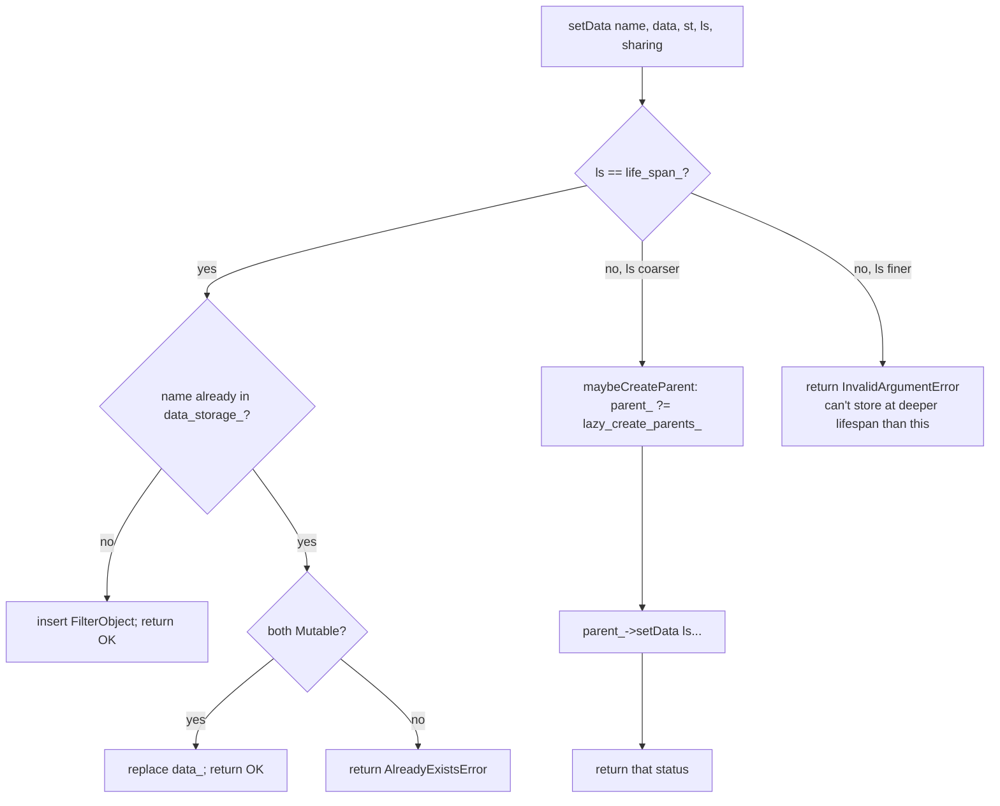

# `filter_state_impl.{h,cc}` and the four single-value accessors

`FilterStateImpl` is Envoy's **typed, keyed, lifespan-scoped store** for inter-filter and inter-component
metadata. The four single-value accessors (`BoolAccessorImpl`, `Uint32AccessorImpl`, `Uint64AccessorImpl`,
`UpstreamAddress`) are tiny `FilterState::Object` subclasses that cover the most common "store one scalar" cases.

---

## Data model

```cpp
struct FilterObject {
  std::shared_ptr<FilterState::Object> data_;
  FilterState::StateType state_type_;     // ReadOnly | Mutable
  FilterState::StreamSharingMayImpactPooling
       stream_sharing_;                    // None | SharedWithUpstreamConnection
                                           // | SharedWithUpstreamConnectionOnce
};

class FilterStateImpl : public FilterState {
  absl::flat_hash_map<absl::string_view, FilterObject> data_storage_;
  FilterStateSharedPtr parent_;
  LifeSpan life_span_;
  std::function<FilterStateSharedPtr()> lazy_create_parents_;
  // …
};
```

`data_storage_` is keyed by `absl::string_view` to make lookups by static literals zero-allocation. The actual
string is owned by the caller (typically a `CONSTRUCT_ON_FIRST_USE(std::string, ...)` in the accessor's static
`key()` method — see `UpstreamAddress` for the canonical pattern).

### LifeSpans

Listed coarsest first:

```
TopSpan                ← longest (root)
DownstreamConnection
DownstreamRequest
Request
FilterChain            ← per-HTTP-stream default
Filter                 ← per-filter scratch (never propagated)
```

A `FilterStateImpl` at `life_span_ = FilterChain` will, when asked to write at `Lifespan::Request` (coarser),
delegate to `parent_` — and if `parent_` is `nullptr`, it will call `lazy_create_parents_()` to materialize the
parent on demand. Multiple children at the *same* lifespan share the same parent instance.

### StateType

- `ReadOnly` — once written, locked. Re-write returns
  `absl::AlreadyExistsError`.
- `Mutable` — re-write allowed only if also `Mutable`. (You can't downgrade a mutable to read-only, and you
  can't upgrade a read-only to mutable.)

### StreamSharingMayImpactPooling

A hint to the connection pools:

- `None` — leave alone.
- `SharedWithUpstreamConnection` — when picking / creating an upstream connection, propagate this object into
  the upstream filter state so upstream filters see it. **Impacts pool affinity** because two requests that have
  different shared objects can't share the same upstream connection.
- `SharedWithUpstreamConnectionOnce` — like `SharedWithUpstreamConnection` but only forwarded once per stream,
  not on retries.

---

## Public surface

```cpp
absl::Status setData(absl::string_view name,
                     std::shared_ptr<Object> data,
                     StateType state_type,
                     LifeSpan life_span = LifeSpan::FilterChain,
                     StreamSharing stream_sharing = StreamSharing::None);

bool hasData(absl::string_view name) const;
bool hasDataWithName(absl::string_view name) const;          // typed alias
bool hasDataAtOrAboveLifeSpan(LifeSpan life_span) const;

const Object* getDataReadOnly(absl::string_view name) const;
Object* getDataMutable(absl::string_view name);

// Iteration / serialization
std::vector<std::pair<absl::string_view, FilterObject>>
    objectsSharedWithUpstreamConnection() const;
const std::shared_ptr<Object>& getDataSharedMutableGeneric(absl::string_view name);
```

### `setData` algorithm



### Reads

`getDataReadOnly` and `getDataMutable` look in the current store first, then walk `parent_`. Returns `nullptr` if
not found at any level. The `*Generic` variants return `shared_ptr<Object>` so the caller can keep a long-lived
reference (used by formatters and by `SharedWithUpstreamConnection`).

### `objectsSharedWithUpstreamConnection`

Walks the parent chain and returns **every** entry whose `stream_sharing_` is `SharedWithUpstreamConnection*`.
Used by the cluster manager / pool when constructing the upstream filter chain: it iterates the returned vector
and `setData`s each entry into the upstream `FilterStateImpl` so upstream filters see them.

---

## The four single-value accessors

These cover ~90% of "I just need to store one boolean / counter / address" cases without anyone needing to
define a new `FilterState::Object` subclass:

### `BoolAccessorImpl`

```cpp
class BoolAccessorImpl : public BoolAccessor {
 public:
  BoolAccessorImpl(bool value) : value_(value) {}
  ProtobufTypes::MessagePtr serializeAsProto() const override; // → google.protobuf.BoolValue
  absl::optional<std::string> serializeAsString() const override;  // → "true"/"false"
  bool value() const override { return value_; }
 private:
  bool value_;
};
```

Use case: "Did the early-data filter accept this request?" → set under
`"envoy.filters.http.early_data.accepted"` so the access log formatter `%FILTER_STATE(envoy.filters.http.early_data.accepted)%`
can pick it up.

### `Uint32AccessorImpl` / `Uint64AccessorImpl`

Same shape, but holds a `uint32_t` / `uint64_t`. `Uint32AccessorImpl` adds `increment()` for counter use cases
(e.g., per-request retry attempts visible to access logs).

### `UpstreamAddress`

```cpp
class UpstreamAddress : public Network::Address::InstanceAccessor {
 public:
  UpstreamAddress(Network::Address::InstanceConstSharedPtr ip);
  static const std::string& key() {
    CONSTRUCT_ON_FIRST_USE(std::string, "envoy.stream.upstream_address");
  }
};
```

Wraps a `Network::Address::InstanceConstSharedPtr` so a filter (e.g., `set_filter_state`) can plant a "preferred
upstream address" and have the original-dst cluster pick it up. Note the **static `key()`** pattern — every
non-trivial `FilterState::Object` should expose a canonical key so callers don't hard-code strings.

---

## Serialization

Both `serializeAsProto()` and `serializeAsString()` are optional (interface allows returning `nullptr` /
`absl::nullopt`). Implementing them enables:

- **`/config_dump`** — `FilterStateImpl` doesn't expose a public dump, but formatters reach in via
  `serializeAsString`.
- **`%FILTER_STATE(key)%` formatter** — if `serializeAsString` returns a value it goes in the access log;
  otherwise the formatter falls back to `serializeAsProto` → JSON.
- **Wire export to tap / metadata** — same mechanism, used by the tap filter to record state into the proto
  output.

---

## Common gotchas

1. **Lifespan must be coarser-or-equal** to the store's own lifespan. Storing at `Lifespan::Filter` from a
   `FilterChain` store works (it's finer, kept in this store). Storing at `Lifespan::FilterChain` from a `Filter`
   store fails with `InvalidArgumentError` — `Filter` is finer than `FilterChain`. **Wait**: the implementation
   only walks **up** the parent chain, so writing at a coarser lifespan is what triggers the parent walk.
   Writing at a finer lifespan stores locally regardless.
2. **Re-writing a `ReadOnly` entry returns an error**. Many call sites ignore the status — check yours.
3. **Don't reach in with `getDataMutable` and mutate** unless you owned the write at `Mutable`. The store has no
   way to detect concurrent mutations and access-log readers don't expect surprises.
4. **`StreamSharingMayImpactPooling` is a hint that affects connection re-use** — toggling it pessimistically
   for a hot key will cripple your pool hit rate. Default to `None` unless you know upstream filters need it.
5. **Keys are `string_view`** — the underlying string lifetime must outlive the store. Always go through a
   `static const std::string& key()` accessor, never pass a temporary `std::string`.
