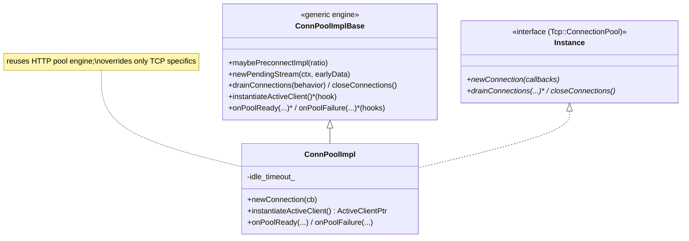
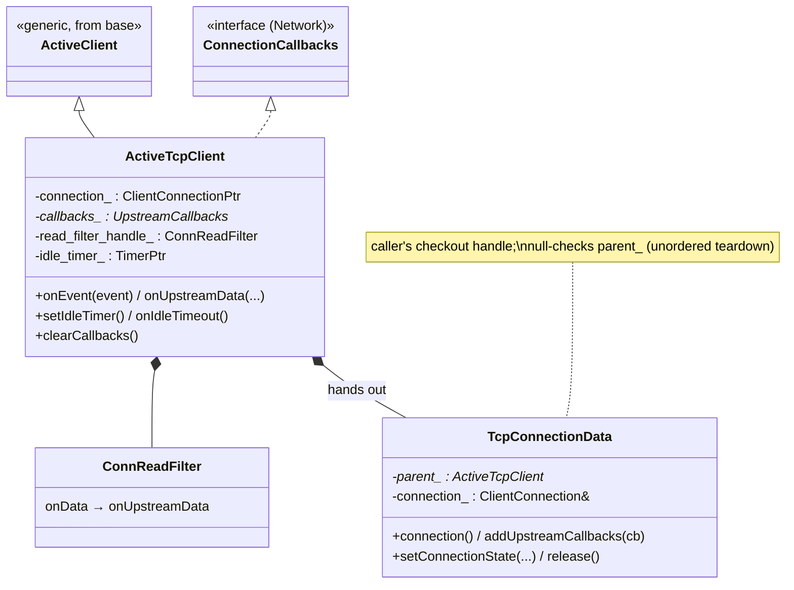
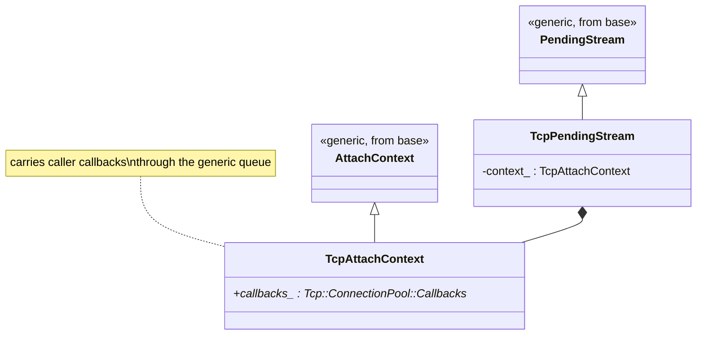
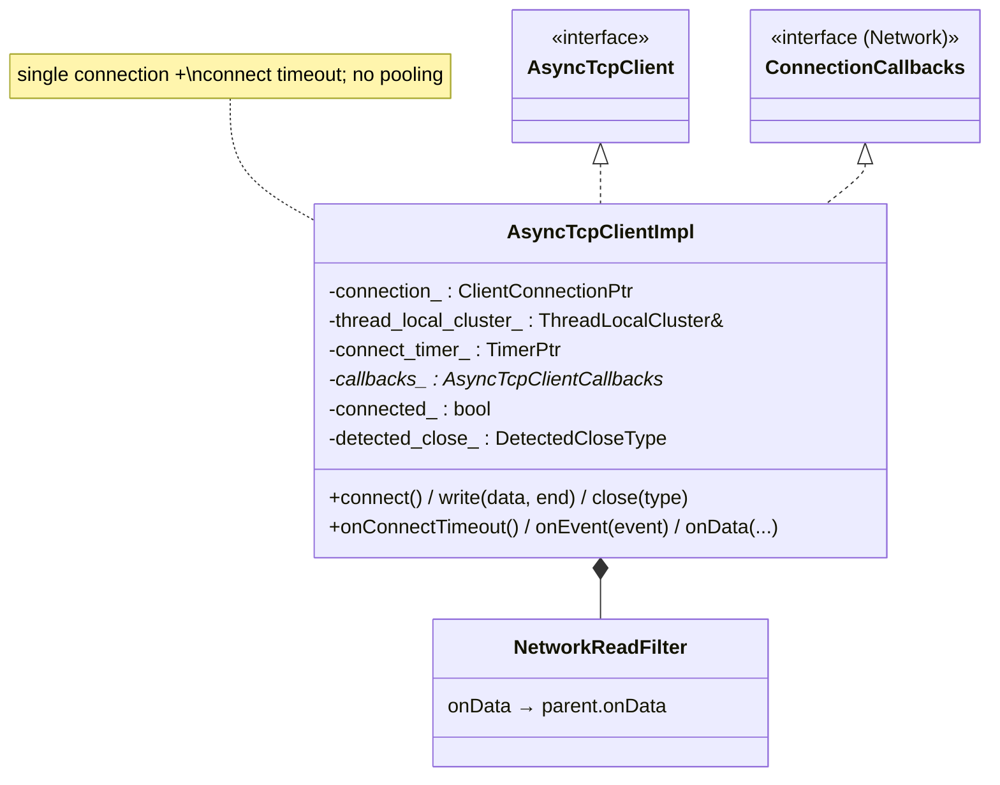

# TCP — class hierarchy (UML)

UML-style Mermaid for the TCP pool and async client. See [`OVERVIEW.md`](OVERVIEW.md) for behavior.

---

## The connection pool

---

## Pending stream & attach context

---

## The async client

---

## Relationship summary

| Relationship | Type | Meaning |
|---|---|---|
| `ConnPoolImpl` → `ConnPoolImplBase` | inheritance | Reuses the shared pool engine. |
| `ConnPoolImpl` → `Tcp::ConnectionPool::Instance` | implements | The public pool interface. |
| `ActiveTcpClient` → `ActiveClient` + `ConnectionCallbacks` | inheritance | A pooled connection that hears its events. |
| `ActiveTcpClient` → `TcpConnectionData` | hands out | The caller's checkout handle. |
| `TcpPendingStream`/`TcpAttachContext` → base types | inheritance | Carry TCP callbacks through the queue. |
| `AsyncTcpClientImpl` → `AsyncTcpClient` | implements | Standalone single-connection client. |
| both → `NetworkReadFilter`/`ConnReadFilter` | composition | Forward upstream `onData` to callbacks. |
| both → `ThreadLocalCluster` | uses | Host selection via the cluster LB. |
