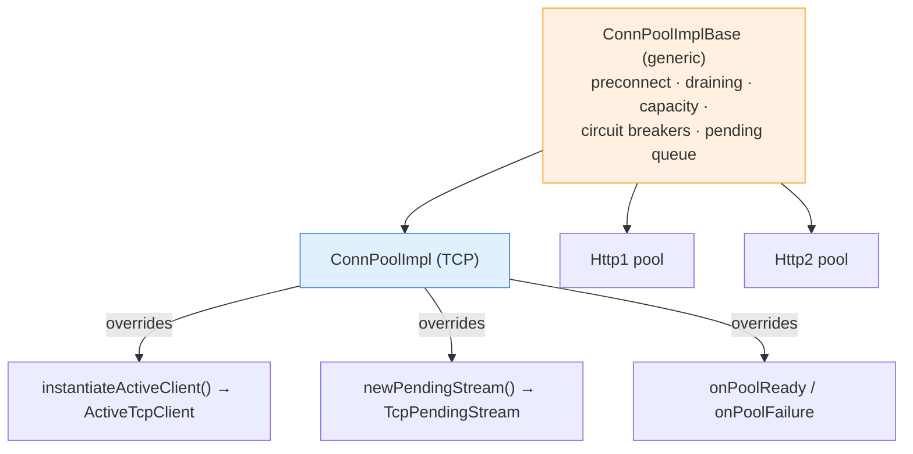
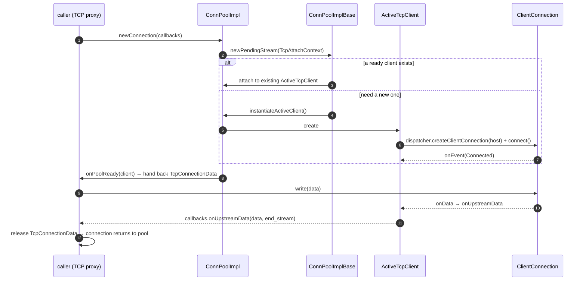
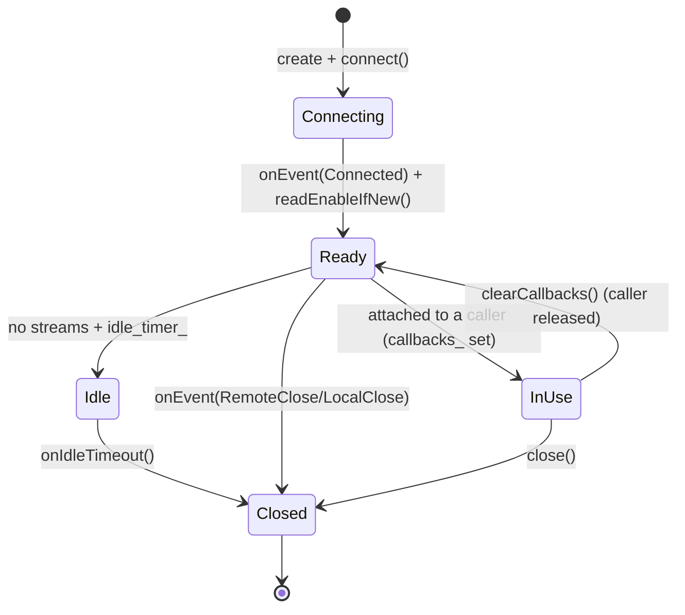
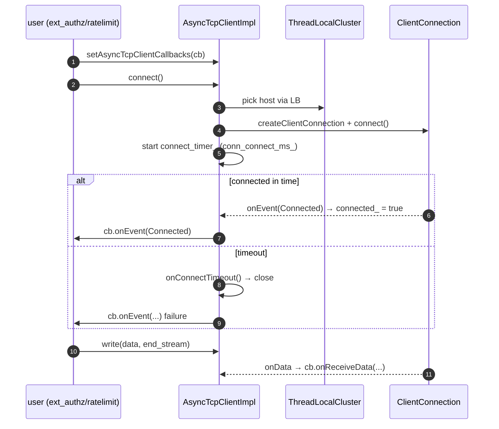

# TCP — architecture & design

How the pool reuses the shared connection-pool engine, the connection-checkout flow, the timers, and the
standalone async client. Read [`README.md`](README.md) first.

---

## Part 1 — the pool stands on a shared engine

The single most important design fact: **`ConnPoolImpl` does not reimplement pooling.** It extends
`Envoy::ConnectionPool::ConnPoolImplBase` — the same generic engine used by the HTTP/1 and HTTP/2 connection pools
— and overrides only the parts that differ for raw TCP.

What TCP inherits unchanged:

| Capability | Provided by base |
|---|---|
| **Preconnect** | `maybePreconnectImpl` — warm connections before they're needed. |
| **Draining** | `drainConnections` — graceful connection cycling on cluster updates. |
| **Idle detection** | `isIdleImpl` + idle callbacks. |
| **Circuit breakers / capacity** | `ClusterConnectivityState` resource tracking. |
| **Pending queue** | requests wait as `PendingStream`s until a connection frees up. |

What TCP customizes: what "a client" is (`ActiveTcpClient`), what "a stream" is (one TCP connection ≈ one stream,
`numActiveStreams() == callbacks_ ? 1 : 0`), and how ready/failure are surfaced.

> This reuse is why a bug fix or feature (e.g. happy-eyeballs, preconnect tuning) in the shared base benefits all
> three pools at once — a deliberate consolidation.

---

## Part 2 — the checkout flow

### `TcpConnectionData` — the checkout handle

When a connection is handed to a caller, it's wrapped in a `TcpConnectionData` (a
`Tcp::ConnectionPool::ConnectionData`). This is the bridge object:

- `connection()` exposes the real `Network::ClientConnection`,
- `addUpstreamCallbacks()` wires the caller's `UpstreamCallbacks` so it receives `onUpstreamData` / watermark
  events,
- destroying it returns/cleans up the connection.

There's a careful lifetime note in the destructor: `TcpConnectionData` is *usually* destroyed before its
`ActiveTcpClient`, but because **deferred-delete ordering isn't guaranteed** on disconnect (see
[`../event/lifecycle_and_threading.md`](../event/lifecycle_and_threading.md)), it null-checks `parent_` before
cleaning up. This is exactly the kind of self-referential teardown the event folder's deferred-delete exists for.

---

## Part 3 — the `ActiveTcpClient` lifecycle & timers

`ActiveTcpClient` is one upstream connection. It implements both `ConnectionPool::ActiveClient` (for the base) and
`Network::ConnectionCallbacks` (to hear about its connection's events):

Notable behaviors:

- **Read-disable until attached.** On `Connected` it read-disables, then `readEnableIfNew()` re-enables once a
  caller is attached — so upstream bytes aren't read before anyone is listening for them.
- **Idle timeout.** If configured (`idle_timeout_`), `setIdleTimer()`/`disableIdleTimer()` manage an
  `Event::TimerPtr`; on fire `onIdleTimeout()` closes the idle connection to free resources.
- **`onUpstreamData` with no callbacks ⇒ close.** If data arrives while no caller is attached, the client closes —
  unsolicited upstream data on an unowned connection is treated as a protocol error.

---

## Part 4 — the standalone async client

`AsyncTcpClientImpl` is the simpler, poolless option. It owns at most one `Network::ClientConnection` and a
**connect timer**:

It exposes a minimal surface: `connect()`, `write()`, `close()`, `readDisable()`, `connected()`, plus
`getStreamInfo()` and watermark passthroughs. It tracks connect duration (`conn_connect_ms_`) and total connection
length (`conn_length_ms_`) as stats timespans. The `NetworkReadFilter` inner class plugs into the connection's
filter chain and forwards `onData` to the client, which forwards to the user's callbacks — the same read-filter
pattern as the pool's `ConnReadFilter`.

The `detected_close_` field records *how* the connection closed (`Normal` vs detected types), surfaced via
`detectedCloseType()` so callers can distinguish a clean close from, say, an RST.

---

## Design themes

| Theme | How `tcp/` expresses it |
|---|---|
| **Don't reinvent pooling** | `ConnPoolImpl` extends the shared `ConnPoolImplBase`. |
| **Two tiers of complexity** | full pool vs single-connection async client. |
| **Safe self-referential teardown** | deferred-delete + null-checks for unordered destruction. |
| **Backpressure-aware** | watermark callbacks passed through both pool and async client. |
| **Built on the platform** | dispatcher for connections/timers, upstream LB for host selection. |

---

## Cross-references

- [`CLASS_HIERARCHY.md`](CLASS_HIERARCHY.md) — UML.
- [`../event/lifecycle_and_threading.md`](../event/lifecycle_and_threading.md) — the deferred-delete ordering the
  pool guards against.
- [`../event/README.md`](../event/README.md) — connection & timer creation.
