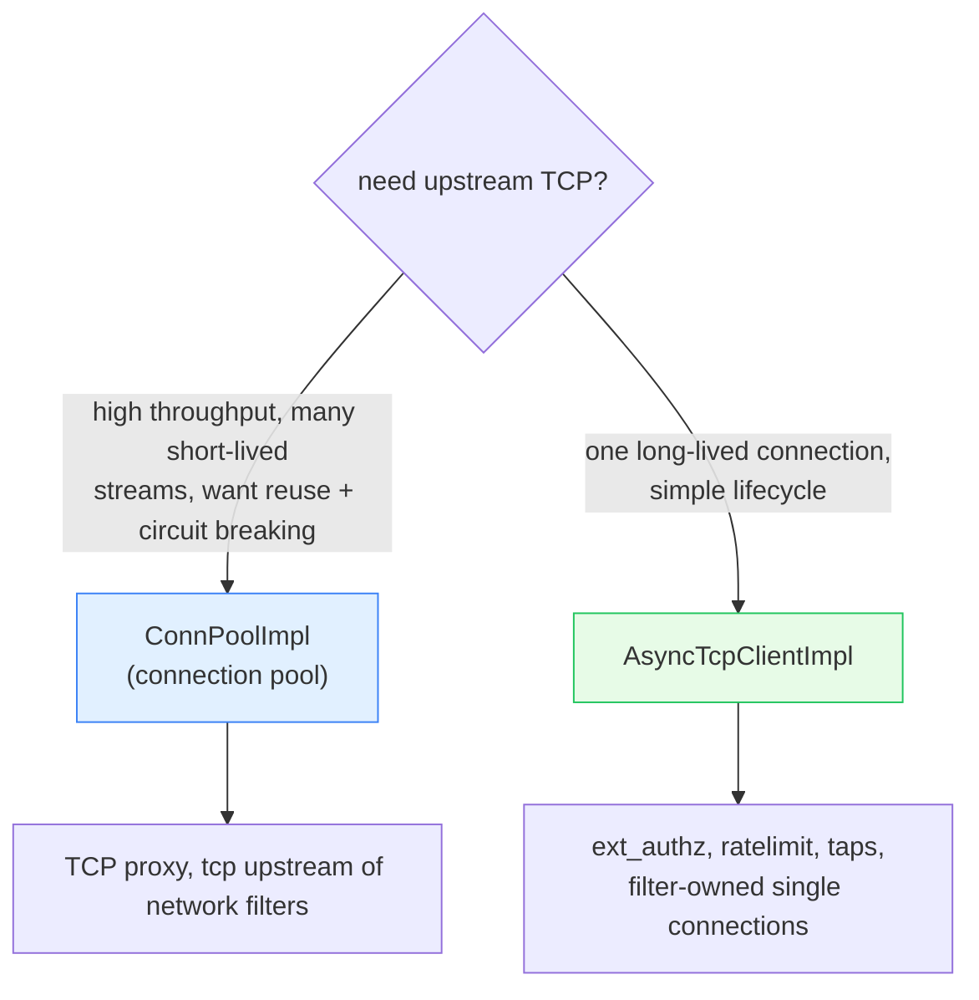
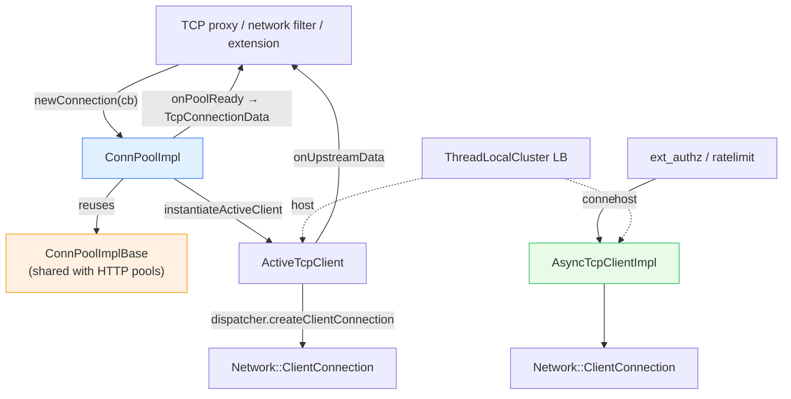

# `source/common/tcp/` — upstream TCP connection pool & async TCP client

This folder provides two ways for Envoy to talk **upstream over raw TCP** (as opposed to HTTP):

1. **`ConnPoolImpl`** — a **connection pool** of TCP connections to an upstream cluster, with all the pooling
   machinery (reuse, preconnect, draining, idle timeouts, circuit breakers) shared with the HTTP pools.
2. **`AsyncTcpClientImpl`** — a simpler **single-connection** async TCP client for components that just want one
   managed TCP connection (e.g. ext_authz, rate-limit, Redis-style filters, tap sinks).

These back the TCP proxy filter, the upstream side of network filters, and any extension that needs to forward raw
bytes to a host picked by a cluster's load balancer.

> **TL;DR** — this folder owns:
> - `ConnPoolImpl` — Tcp pool built on the shared `ConnectionPool::ConnPoolImplBase`,
> - `ActiveTcpClient` — one pooled upstream connection + its read filter + idle timer,
> - `TcpConnectionData` — the handle a caller holds onto a checked-out connection,
> - `AsyncTcpClientImpl` — a standalone managed TCP client with connect timeout & callbacks.

---

## Pool vs async client — which to use



---

## The one-paragraph mental model

Both build on the [`../event/`](../event/README.md) dispatcher (to create connections and run timers) and on
[`../upstream/`](../upstream/) (to pick a host from a `ThreadLocalCluster`'s load balancer). The **pool**
(`ConnPoolImpl`) reuses Envoy's generic `ConnPoolImplBase` — the same engine behind the HTTP/1 and HTTP/2 pools —
so it inherits preconnect, draining, capacity tracking, and circuit breakers "for free," and only customizes what
"a client" and "a stream" mean for raw TCP. A caller requests a connection via `newConnection(callbacks)`; when one
is ready it gets a `TcpConnectionData` handle wrapping an `ActiveTcpClient`'s real `Network::ClientConnection`, and
can `write()` and receive `onUpstreamData()`. The **async client** (`AsyncTcpClientImpl`) skips pooling: it picks a
host, opens one connection with a connect timeout, and surfaces connect/data/close through
`AsyncTcpClientCallbacks`.

---

## Folder map

```
source/common/tcp/
├── BUILD
├── conn_pool.{h,cc}              # ConnPoolImpl + ActiveTcpClient + TcpConnectionData (the pool)
└── async_tcp_client_impl.{h,cc}  # AsyncTcpClientImpl (the standalone client)
```

Interfaces: `envoy/tcp/conn_pool.h` (`Tcp::ConnectionPool::Instance`, `Callbacks`, `ConnectionData`,
`UpstreamCallbacks`) and `envoy/tcp/async_tcp_client.h`. Shared engine:
`source/common/conn_pool/conn_pool_base.*` / `source/common/http/conn_pool_base.h`.

---

## Key types

| Type | Role |
|---|---|
| `ConnPoolImpl` | the Tcp pool instance (one per cluster/priority per worker). |
| `ActiveTcpClient` | one upstream connection managed by the pool (a `ConnectionPool::ActiveClient`). |
| `TcpConnectionData` | the caller's handle to a checked-out connection; releasing it returns the conn. |
| `TcpAttachContext` | carries the caller's `Callbacks` through the generic pool machinery. |
| `TcpPendingStream` | a queued request waiting for a connection. |
| `AsyncTcpClientImpl` | standalone single-connection client with connect timeout. |

---

## Per-topic table

| Topic | Document | Source |
|---|---|---|
| The pool (reuse of `ConnPoolImplBase`), the async client, lifecycle & timers | [`OVERVIEW.md`](OVERVIEW.md) | both impls |
| Class hierarchy (UML) | [`CLASS_HIERARCHY.md`](CLASS_HIERARCHY.md) | interfaces + impls |

---

## Big picture



---

## Reading order

1. This `README.md` — pool vs async client.
2. [`OVERVIEW.md`](OVERVIEW.md) — how the pool reuses the shared base, the checkout flow, timers, the async client.
3. [`CLASS_HIERARCHY.md`](CLASS_HIERARCHY.md) — UML map.
