# Envoy TCP Proxy Architecture

## Executive Summary

The `source/common/tcp_proxy/` folder implements Envoy's **TCP Proxy filter** - a network filter that proxies TCP connections (Layer 3/4) between downstream clients and upstream clusters. Unlike HTTP proxies that understand application protocols, TCP proxy operates at the transport layer, blindly forwarding bytes bidirectionally.

**Key Files:**
- **tcp_proxy.h/cc** (~2000 lines): Core filter implementation, configuration, routing
- **upstream.h/cc** (~1000 lines): Upstream connection types (TcpUpstream, HttpUpstream, CombinedUpstream)

**Three Upstream Modes:**
1. **TcpUpstream**: Direct TCP connection to upstream (standard mode)
2. **HttpUpstream**: HTTP CONNECT tunneling through HTTP upstream
3. **CombinedUpstream**: HTTP upstream with full router filter support

**Why This Matters:**
TCP proxy is the workhorse for non-HTTP traffic: databases (MySQL, PostgreSQL), message queues (Kafka), caches (Redis), custom protocols. It enables Envoy to be a universal L3/L4 proxy, not just HTTP.

---

## 1. Core Architecture

### 1.1 Filter Class - The Main Orchestrator

```cpp
class Filter : public Network::ReadFilter, 
               public Upstream::LoadBalancerContextBase, 
               public GenericConnectionPoolCallbacks {
public:
  Filter(ConfigSharedPtr config, Upstream::ClusterManager& cluster_manager);
  
  // Network::ReadFilter - downstream connection callbacks
  Network::FilterStatus onData(Buffer::Instance& data, bool end_stream) override;
  Network::FilterStatus onNewConnection() override;
  void initializeReadFilterCallbacks(Network::ReadFilterCallbacks& callbacks) override;
  
  // GenericConnectionPoolCallbacks - upstream connection pool callbacks
  void onGenericPoolReady(StreamInfo::StreamInfo* info,
                          std::unique_ptr<GenericUpstream>&& upstream,
                          Upstream::HostDescriptionConstSharedPtr& host,
                          const Network::ConnectionInfoProvider& address_provider,
                          Ssl::ConnectionInfoConstSharedPtr ssl_info) override;
  void onGenericPoolFailure(ConnectionPool::PoolFailureReason reason,
                            absl::string_view failure_reason,
                            Upstream::HostDescriptionConstSharedPtr host) override;

private:
  // Connection establishment
  void establishUpstreamConnection();
  void onConnectTimeout();
  
  // Data forwarding
  void onUpstreamData(Buffer::Instance& data, bool end_stream);
  void onDownstreamEvent(Network::ConnectionEvent event);
  void onUpstreamEvent(Network::ConnectionEvent event);
  
  // Connection management
  void resetIdleTimer();
  void onIdleTimeout();
  void onDownstreamConnectionDurationTimeout();
  void closeDownstream(bool close_upstream);
  
  ConfigSharedPtr config_;                  // Configuration
  Upstream::ClusterManager& cluster_manager_;  // Access to clusters
  Network::ReadFilterCallbacks* read_callbacks_{};  // Downstream connection
  
  GenericConnPoolPtr conn_pool_;            // Upstream connection pool
  std::unique_ptr<GenericUpstream> upstream_;  // Upstream connection wrapper
  
  Event::TimerPtr upstream_connect_timer_;  // Connect timeout
  Event::TimerPtr idle_timer_;              // Idle timeout
  Event::TimerPtr max_duration_timer_;      // Max connection duration
  
  RouteConstSharedPtr route_;               // Selected route
  uint32_t connect_attempts_{};             // Retry counter
  bool connecting_{};                       // Connection in progress
};
```

**Filter Lifecycle:**

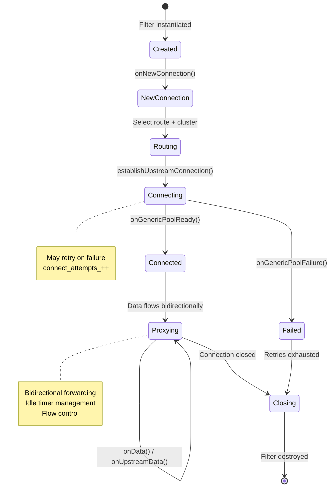

---

## 2. Configuration and Routing

### 2.1 Config Class

```cpp
class Config {
public:
  Config(const envoy::extensions::filters::network::tcp_proxy::v3::TcpProxy& config,
         Server::Configuration::FactoryContext& context);
  
  // Route selection
  RouteConstSharedPtr getRouteFromEntries(Network::Connection& connection);
  RouteConstSharedPtr getRegularRouteFromEntries(Network::Connection& connection);
  
  // Configuration accessors
  const TcpProxyStats& stats();
  uint32_t maxConnectAttempts() const { return max_connect_attempts_; }
  const absl::optional<std::chrono::milliseconds>& idleTimeout();
  const absl::optional<std::chrono::milliseconds>& maxDownstreamConnectionDuration();
  TunnelingConfigHelperOptConstRef tunnelingConfigHelper();
  UpstreamDrainManager& drainManager();
  const Router::MetadataMatchCriteria* metadataMatchCriteria() const;
  const Network::HashPolicy* hashPolicy();
  
  // On-demand cluster discovery
  OptRef<Upstream::OdCdsApiHandle> onDemandCds() const;
  std::chrono::milliseconds odcdsTimeout() const;

private:
  // Shared configuration (thread-safe, reference-counted)
  class SharedConfig {
    TcpProxyStats stats_;
    absl::optional<std::chrono::milliseconds> idle_timeout_;
    absl::optional<std::chrono::milliseconds> max_downstream_connection_duration_;
    absl::optional<std::chrono::milliseconds> access_log_flush_interval_;
    std::unique_ptr<TunnelingConfigHelper> tunneling_config_helper_;
    std::unique_ptr<OnDemandConfig> on_demand_config_;
    BackOffStrategyPtr backoff_strategy_;
    Network::ProxyProtocolTLVVector proxy_protocol_tlvs_;
  };
  
  SharedConfigSharedPtr shared_config_;
  RouteConstSharedPtr default_route_;
  std::vector<WeightedClusterEntryConstSharedPtr> weighted_clusters_;
  AccessLog::InstanceSharedPtrVector access_logs_;
  const uint32_t max_connect_attempts_;
  ThreadLocal::SlotPtr upstream_drain_manager_slot_;
  std::unique_ptr<const Router::MetadataMatchCriteria> cluster_metadata_match_criteria_;
  std::unique_ptr<const Network::HashPolicyImpl> hash_policy_;
};
```

### 2.2 Route Selection

TCP proxy supports three routing modes:

**1. Simple Route** (most common):
```cpp
// Configuration
tcp_proxy:
  cluster: my_upstream_cluster

// Implementation
class SimpleRouteImpl : public Route {
  bool matches(Network::Connection&) const override { 
    return true;  // Always matches
  }
  const std::string& clusterName() const override { 
    return cluster_name_; 
  }
};
```

**2. Weighted Clusters** (traffic splitting):
```cpp
// Configuration
tcp_proxy:
  weighted_clusters:
    clusters:
    - name: cluster_a
      weight: 70
    - name: cluster_b
      weight: 30

// Implementation
class WeightedClusterEntry : public Route {
  uint64_t clusterWeight() const { return cluster_weight_; }
  const std::string& clusterName() const override { return cluster_name_; }
};

// Selection (random weighted choice)
RouteConstSharedPtr Config::getRouteFromEntries(Network::Connection& connection) {
  if (weighted_clusters_.empty()) {
    return default_route_;
  }
  
  uint64_t random_value = random_generator_.random() % total_cluster_weight_;
  uint64_t cumulative_weight = 0;
  
  for (const auto& cluster : weighted_clusters_) {
    cumulative_weight += cluster->clusterWeight();
    if (random_value < cumulative_weight) {
      return cluster;
    }
  }
  
  return weighted_clusters_.back();
}
```

**3. Per-Connection Cluster** (dynamic routing):
```cpp
// Set by another filter in the chain
class PerConnectionCluster : public StreamInfo::FilterState::Object {
  PerConnectionCluster(absl::string_view cluster) : cluster_(cluster) {}
  const std::string& value() const { return cluster_; }
  static const std::string& key();  // Returns key name
};

// Usage
connection.streamInfo().filterState().setData(
  PerConnectionCluster::key(),
  std::make_shared<PerConnectionCluster>("dynamic_cluster"),
  StreamInfo::FilterState::StateType::Mutable);
```

**Route Selection Flow:**

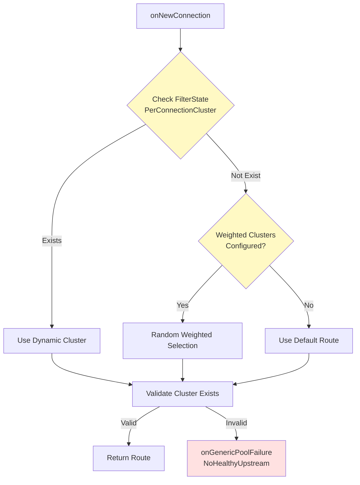

---

## 3. Upstream Connection Types

Envoy TCP proxy supports three types of upstream connections, each with different use cases.

### 3.1 TcpUpstream - Direct TCP Connection

Standard mode: direct TCP connection to upstream host.

```cpp
class TcpUpstream : public GenericUpstream {
public:
  TcpUpstream(Tcp::ConnectionPool::ConnectionDataPtr&& data,
              Tcp::ConnectionPool::UpstreamCallbacks& callbacks);
  
  // GenericUpstream interface
  bool readDisable(bool disable) override;
  void encodeData(Buffer::Instance& data, bool end_stream) override;
  void addBytesSentCallback(Network::Connection::BytesSentCb cb) override;
  Tcp::ConnectionPool::ConnectionData* onDownstreamEvent(
    Network::ConnectionEvent event, absl::string_view details) override;
  bool startUpstreamSecureTransport() override;
  Ssl::ConnectionInfoConstSharedPtr getUpstreamConnectionSslInfo() override;

private:
  Tcp::ConnectionPool::ConnectionDataPtr upstream_conn_data_;
};

// Connection establishment
class TcpConnPool : public GenericConnPool, 
                    public Tcp::ConnectionPool::Callbacks {
public:
  TcpConnPool(Upstream::HostConstSharedPtr host,
              Upstream::ThreadLocalCluster& thread_local_cluster,
              Upstream::LoadBalancerContext* context,
              Tcp::ConnectionPool::UpstreamCallbacks& upstream_callbacks,
              StreamInfo::StreamInfo& downstream_info);
  
  void newStream(GenericConnectionPoolCallbacks& callbacks) override;
  
  // Tcp::ConnectionPool::Callbacks
  void onPoolReady(Tcp::ConnectionPool::ConnectionDataPtr&& conn_data,
                   Upstream::HostDescriptionConstSharedPtr host) override;
  void onPoolFailure(ConnectionPool::PoolFailureReason reason,
                     absl::string_view transport_failure_reason,
                     Upstream::HostDescriptionConstSharedPtr host) override;

private:
  absl::optional<Upstream::TcpPoolData> conn_pool_data_{};
  Tcp::ConnectionPool::Cancellable* upstream_handle_{};
  GenericConnectionPoolCallbacks* callbacks_{};
  Tcp::ConnectionPool::UpstreamCallbacks& upstream_callbacks_;
};
```

**TcpUpstream Flow:**

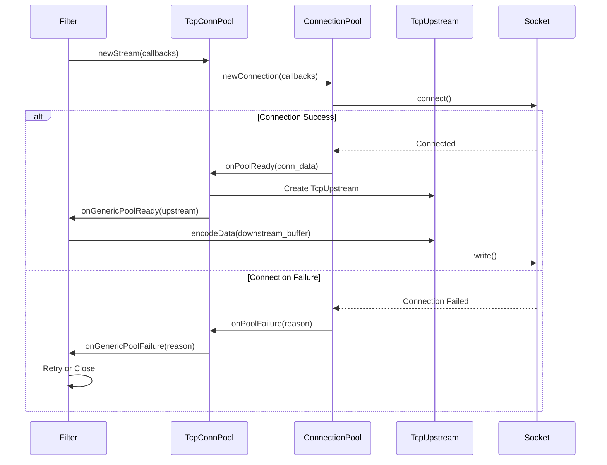

**Use Case**: Standard TCP proxying (Redis, MySQL, MongoDB, custom protocols).

### 3.2 HttpUpstream - HTTP CONNECT Tunneling

Uses HTTP CONNECT to tunnel TCP through an HTTP upstream (e.g., through a corporate proxy).

```cpp
class HttpUpstream : public GenericUpstream, 
                     protected Http::StreamCallbacks {
public:
  HttpUpstream(Tcp::ConnectionPool::UpstreamCallbacks& callbacks,
               const TunnelingConfigHelper& config,
               StreamInfo::StreamInfo& downstream_info,
               Http::CodecType type);
  
  bool isValidResponse(const Http::ResponseHeaderMap&);
  void doneReading();
  void doneWriting();
  Http::ResponseDecoder& responseDecoder() { return response_decoder_; }
  
  // GenericUpstream
  bool readDisable(bool disable) override;
  void encodeData(Buffer::Instance& data, bool end_stream) override;
  Tcp::ConnectionPool::ConnectionData* onDownstreamEvent(
    Network::ConnectionEvent event, absl::string_view details) override;
  
  // HTTP upstream must not support converting to secure mode mid-stream
  bool startUpstreamSecureTransport() override { return false; }
  
  // Http::StreamCallbacks
  void onResetStream(Http::StreamResetReason reason,
                     absl::string_view transport_failure_reason) override;
  void onAboveWriteBufferHighWatermark() override;
  void onBelowWriteBufferLowWatermark() override;
  
  void setRequestEncoder(Http::RequestEncoder& request_encoder, bool is_ssl);

private:
  // Response decoder for CONNECT response
  class DecoderShim : public Http::ResponseDecoderImplBase {
    void decodeHeaders(Http::ResponseHeaderMapPtr&& headers, bool end_stream) override {
      bool is_valid_response = parent_.isValidResponse(*headers);
      parent_.config_.propagateResponseHeaders(
        std::move(headers), parent_.downstream_info_.filterState());
      
      if (!is_valid_response || end_stream) {
        parent_.resetEncoder(Network::ConnectionEvent::LocalClose);
      } else if (parent_.conn_pool_callbacks_ != nullptr) {
        parent_.conn_pool_callbacks_->onSuccess(parent_.request_encoder_);
        parent_.conn_pool_callbacks_.reset();
      }
    }
    
    void decodeData(Buffer::Instance& data, bool end_stream) override {
      parent_.upstream_callbacks_.onUpstreamData(data, end_stream);
      if (end_stream) {
        parent_.doneReading();
      }
    }
  };
  
  DecoderShim response_decoder_;
  Http::RequestEncoder* request_encoder_{};
  const TunnelingConfigHelper& config_;
  StreamInfo::StreamInfo& downstream_info_;
  Tcp::ConnectionPool::UpstreamCallbacks& upstream_callbacks_;
  bool read_half_closed_{};
  bool write_half_closed_{};
};
```

**HTTP CONNECT Flow:**

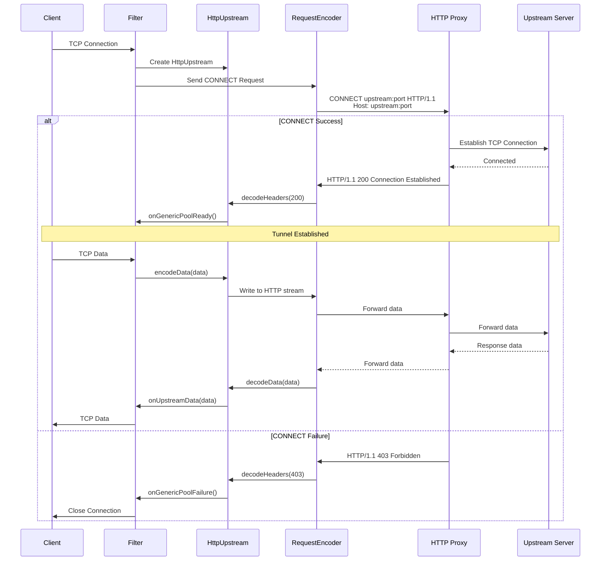

**Configuration:**

```yaml
tcp_proxy:
  cluster: http_proxy_cluster
  tunneling_config:
    hostname: "%UPSTREAM_METADATA(namespace:key)%"
    use_post: false  # Use CONNECT (default) vs POST
    headers_to_add:
    - header:
        key: "Proxy-Authorization"
        value: "Basic dXNlcjpwYXNz"
```

**Use Case**: Tunneling TCP through HTTP proxies, accessing services behind HTTP-only infrastructure.

### 3.3 CombinedUpstream - Full Router Support

Combines HTTP upstream with full router filter capabilities (retries, timeouts, hedging).

```cpp
class CombinedUpstream : public GenericUpstream, 
                         public Envoy::Router::RouterFilterInterface {
public:
  CombinedUpstream(HttpConnPool& http_conn_pool,
                   Tcp::ConnectionPool::UpstreamCallbacks& callbacks,
                   Http::StreamDecoderFilterCallbacks& decoder_callbacks,
                   const TunnelingConfigHelper& config,
                   StreamInfo::StreamInfo& downstream_info);
  
  void setRouterUpstreamRequest(UpstreamRequestPtr);
  void newStream(GenericConnectionPoolCallbacks& callbacks);
  
  // GenericUpstream
  bool readDisable(bool disable) override;
  void encodeData(Buffer::Instance& data, bool end_stream) override;
  Tcp::ConnectionPool::ConnectionData* onDownstreamEvent(
    Network::ConnectionEvent event, absl::string_view details) override;
  
  // RouterFilterInterface - enables full router features
  void onUpstream1xxHeaders(Http::ResponseHeaderMapPtr&& headers,
                            UpstreamRequest& upstream_request) override;
  void onUpstreamHeaders(uint64_t response_code,
                         Http::ResponseHeaderMapPtr&& headers,
                         UpstreamRequest& upstream_request,
                         bool end_stream) override;
  void onUpstreamData(Buffer::Instance& data,
                      UpstreamRequest& upstream_request,
                      bool end_stream) override;
  void onUpstreamTrailers(Http::ResponseTrailerMapPtr&& trailers,
                          UpstreamRequest& upstream_request) override;
  void onUpstreamComplete(UpstreamRequest& upstream_request) override;
  void onUpstreamReset(Http::StreamResetReason reset_reason,
                       absl::string_view transport_failure_reason,
                       UpstreamRequest& upstream_request) override;

private:
  HttpConnPool& http_conn_pool_;
  Tcp::ConnectionPool::UpstreamCallbacks& upstream_callbacks_;
  Http::StreamDecoderFilterCallbacks& decoder_callbacks_;
  const TunnelingConfigHelper& config_;
  StreamInfo::StreamInfo& downstream_info_;
  std::unique_ptr<Router::UpstreamRequest> upstream_request_;
  GenericConnectionPoolCallbacks* conn_pool_callbacks_{};
};

// Custom UpstreamRequest that enables TCP tunneling mode
class RouterUpstreamRequest : public Router::UpstreamRequest {
  void onPoolReady(std::unique_ptr<Router::GenericUpstream>&& upstream,
                   Upstream::HostDescriptionConstSharedPtr host,
                   const Network::ConnectionInfoProvider& address_provider,
                   StreamInfo::StreamInfo& info,
                   absl::optional<Http::Protocol> protocol) override {
    // Enable TCP tunneling mode for HTTP/1.1 codec
    upstream->enableTcpTunneling();
    Router::UpstreamRequest::onPoolReady(std::move(upstream), host, 
                                          address_provider, info, protocol);
  }
};
```

**CombinedUpstream Benefits:**
- ✅ Automatic retries on failure
- ✅ Per-try timeouts
- ✅ Request hedging
- ✅ Circuit breaking
- ✅ Outlier detection integration
- ✅ Full HTTP router stats

**Use Case**: When you need advanced HTTP features (retries, timeouts) for tunneled TCP connections.

---

## 4. Connection Lifecycle

### 4.1 Establishment Flow

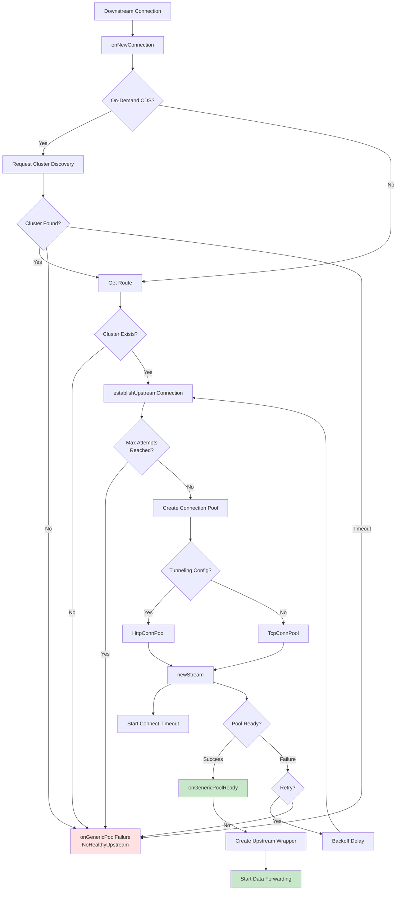

### 4.2 Data Forwarding

Once connection is established, data flows bidirectionally:

```cpp
// Downstream → Upstream
Network::FilterStatus Filter::onData(Buffer::Instance& data, bool end_stream) {
  ASSERT(!upstream_->connection().has_value() || 
         read_callbacks_->connection().state() == Network::Connection::State::Open);
  
  resetIdleTimer();  // Reset idle timeout
  
  // Forward data to upstream
  upstream_->encodeData(data, end_stream);
  
  ASSERT(0 == data.length());  // All data should be consumed
  return Network::FilterStatus::StopIteration;
}

// Upstream → Downstream
void Filter::onUpstreamData(Buffer::Instance& data, bool end_stream) {
  resetIdleTimer();  // Reset idle timeout
  
  // Forward data to downstream
  read_callbacks_->connection().write(data, end_stream);
  
  ASSERT(0 == data.length());  // All data should be consumed
}
```

**Bidirectional Flow Diagram:**

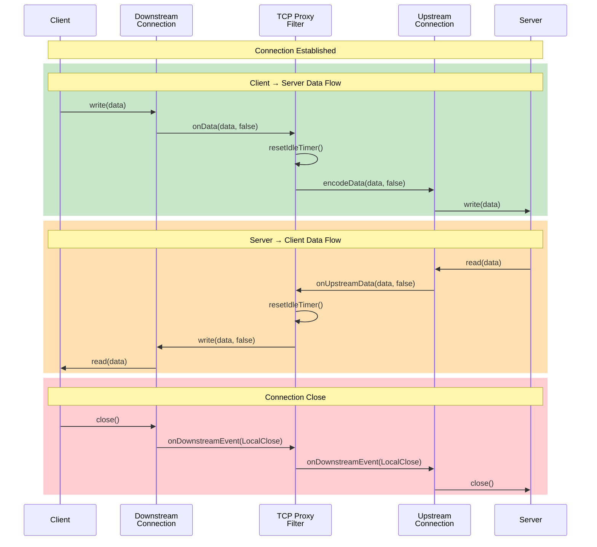

### 4.3 Timeout Management

TCP proxy manages three types of timeouts:

**1. Connect Timeout** (during connection establishment):
```cpp
void Filter::establishUpstreamConnection() {
  // ... create connection pool ...
  
  // Start connect timeout
  upstream_connect_timer_ = read_callbacks_->connection().dispatcher().createTimer(
    [this]() { onConnectTimeout(); }
  );
  upstream_connect_timer_->enableTimer(connect_timeout_);
}

void Filter::onConnectTimeout() {
  upstream_connect_timer_.reset();
  config_->stats().connect_timeout_.inc();
  
  // Cancel pending connection
  conn_pool_.reset();
  
  // Retry or fail
  if (connect_attempts_ < config_->maxConnectAttempts()) {
    connect_attempts_++;
    establishUpstreamConnection();
  } else {
    closeDownstream(true);
  }
}
```

**2. Idle Timeout** (no data flowing):
```cpp
void Filter::resetIdleTimer() {
  const absl::optional<std::chrono::milliseconds>& timeout = config_->idleTimeout();
  if (timeout.has_value()) {
    if (!idle_timer_) {
      idle_timer_ = read_callbacks_->connection().dispatcher().createTimer(
        [this]() { onIdleTimeout(); }
      );
    }
    idle_timer_->enableTimer(timeout.value());
  }
}

void Filter::onIdleTimeout() {
  config_->stats().idle_timeout_.inc();
  closeDownstream(true);
}
```

**3. Max Connection Duration** (absolute time limit):
```cpp
void Filter::onGenericPoolReady(...) {
  const auto& max_duration = config_->maxDownstreamConnectionDuration();
  if (max_duration.has_value()) {
    auto duration = config_->calculateMaxDownstreamConnectionDurationWithJitter();
    max_duration_timer_ = read_callbacks_->connection().dispatcher().createTimer(
      [this]() { onDownstreamConnectionDurationTimeout(); }
    );
    max_duration_timer_->enableTimer(duration.value());
  }
}

void Filter::onDownstreamConnectionDurationTimeout() {
  config_->stats().max_downstream_connection_duration_.inc();
  closeDownstream(true);
}
```

**Timeout Timeline:**

```mermaid
gantt
    title TCP Proxy Timeout Timeline
    dateFormat X
    axisFormat %Ss
    
    section Connect Phase
    Connect Attempt 1  :0, 5
    Connect Timeout    :5, 10
    Connect Attempt 2  :10, 15
    Connected          :milestone, 15, 0
    
    section Connected Phase
    Idle Timer Resets  :15, 75
    Data Flow          :15, 30
    Idle Period        :30, 45
    Idle Timer Fires   :45, 60
    More Data Flow     :60, 75
    
    section Max Duration
    Max Duration Timer :15, 615
    Force Close        :milestone, 615, 0
```

---

## 5. Advanced Features

### 5.1 On-Demand Cluster Discovery (ODCDS)

Dynamically discover clusters on first connection attempt.

```cpp
class OnDemandConfig {
public:
  OnDemandConfig(
    const envoy::extensions::filters::network::tcp_proxy::v3::TcpProxy_OnDemand& config,
    Server::Configuration::FactoryContext& context,
    Stats::Scope& scope);
  
  Upstream::OdCdsApiHandle& onDemandCds() const { return *odcds_; }
  std::chrono::milliseconds timeout() const { return lookup_timeout_; }
  const OnDemandStats& stats() const { return stats_; }

private:
  Upstream::OdCdsApiHandlePtr odcds_;
  std::chrono::milliseconds lookup_timeout_;
  OnDemandStats stats_;
};
```

**ODCDS Flow:**

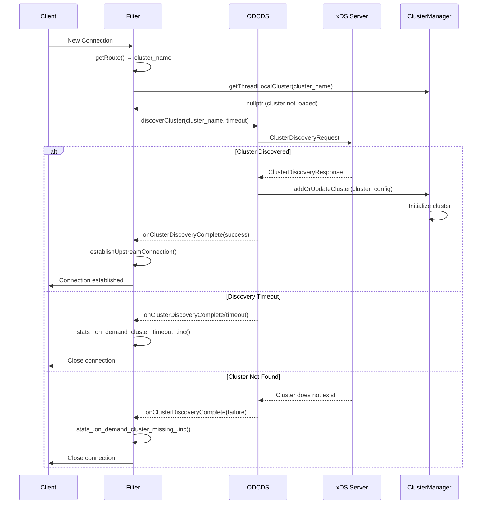

**Configuration:**

```yaml
tcp_proxy:
  cluster: "service_%DOWNSTREAM_LOCAL_PORT%"
  on_demand:
    odcds_config:
      # ODCDS configuration
    timeout: 5s
```

**Stats:**

```cpp
#define ON_DEMAND_TCP_PROXY_STATS(COUNTER)  \
  COUNTER(on_demand_cluster_attempt)        \
  COUNTER(on_demand_cluster_missing)        \
  COUNTER(on_demand_cluster_timeout)        \
  COUNTER(on_demand_cluster_success)
```

### 5.2 HTTP Tunneling Configuration

```cpp
class TunnelingConfigHelperImpl : public TunnelingConfigHelper {
public:
  TunnelingConfigHelperImpl(
    Stats::Scope& scope,
    const envoy::extensions::filters::network::tcp_proxy::v3::TcpProxy& config,
    Server::Configuration::FactoryContext& context);
  
  std::string host(const StreamInfo::StreamInfo& stream_info) const override;
  bool usePost() const override { return !post_path_.empty(); }
  const std::string& postPath() const override { return post_path_; }
  Envoy::Http::HeaderEvaluator& headerEvaluator() const override;
  const Envoy::Http::RequestIDExtensionSharedPtr& requestIDExtension() const override;
  const Envoy::Router::FilterConfig& routerFilterConfig() const override;
  
  void propagateResponseHeaders(
    Http::ResponseHeaderMapPtr&& headers,
    const StreamInfo::FilterStateSharedPtr& filter_state) const override;
  void propagateResponseTrailers(
    Http::ResponseTrailerMapPtr&& trailers,
    const StreamInfo::FilterStateSharedPtr& filter_state) const override;

private:
  std::unique_ptr<Envoy::Router::HeaderParser> header_parser_;
  Formatter::FormatterPtr hostname_fmt_;
  bool propagate_response_headers_;
  bool propagate_response_trailers_;
  std::string post_path_;
  Envoy::Http::RequestIDExtensionSharedPtr request_id_extension_;
};
```

**Example Tunneling Configuration:**

```yaml
tcp_proxy:
  cluster: http_proxy
  tunneling_config:
    # Dynamic hostname from metadata
    hostname: "%UPSTREAM_METADATA([envoy.lb, host])%:%UPSTREAM_METADATA([envoy.lb, port])%"
    
    # Use HTTP POST instead of CONNECT
    use_post: true
    post_path: "/tunnel"
    
    # Add custom headers
    headers_to_add:
    - header:
        key: "X-Custom-Header"
        value: "%DOWNSTREAM_REMOTE_ADDRESS%"
    - header:
        key: "X-Request-ID"
        value: "%REQ(X-REQUEST-ID)%"
    
    # Propagate response headers/trailers to downstream
    propagate_response_headers: true
    propagate_response_trailers: true
```

**Response Header/Trailer Propagation:**

```cpp
// Store response headers in filter state
class TunnelResponseHeaders : public Http::TunnelResponseHeadersOrTrailersImpl {
public:
  TunnelResponseHeaders(Http::ResponseHeaderMapPtr&& response_headers)
    : response_headers_(std::move(response_headers)) {}
  
  const Http::HeaderMap& value() const override { return *response_headers_; }
  static const std::string& key();

private:
  const Http::ResponseHeaderMapPtr response_headers_;
};

// Propagate to filter state
void TunnelingConfigHelperImpl::propagateResponseHeaders(
    Http::ResponseHeaderMapPtr&& headers,
    const StreamInfo::FilterStateSharedPtr& filter_state) const {
  if (propagate_response_headers_) {
    filter_state->setData(
      TunnelResponseHeaders::key(),
      std::make_shared<TunnelResponseHeaders>(std::move(headers)),
      StreamInfo::FilterState::StateType::ReadOnly);
  }
}
```

### 5.3 Weighted Cluster Routing

```cpp
// Configuration
tcp_proxy:
  weighted_clusters:
    clusters:
    - name: cluster_a
      weight: 50
      metadata_match:
        filter_metadata:
          envoy.lb:
            version: "v1"
    - name: cluster_b
      weight: 30
      metadata_match:
        filter_metadata:
          envoy.lb:
            version: "v2"
    - name: cluster_c
      weight: 20

// Implementation
class WeightedClusterEntry : public Route {
  uint64_t clusterWeight() const { return cluster_weight_; }
  
  const Router::MetadataMatchCriteria* metadataMatchCriteria() const override {
    if (metadata_match_criteria_) {
      return metadata_match_criteria_.get();
    }
    // Fall back to parent config's metadata match
    return parent_.metadataMatchCriteria();
  }

private:
  const std::string cluster_name_;
  const uint64_t cluster_weight_;
  Router::MetadataMatchCriteriaConstPtr metadata_match_criteria_;
};
```

### 5.4 Hash-Based Load Balancing

```cpp
// Configuration
tcp_proxy:
  cluster: backend
  hash_policy:
  - source_ip: {}
  - connection_header:
      header_name: "X-Session-ID"

// Implementation
class Filter : public Upstream::LoadBalancerContextBase {
  // Override for hash-based load balancing
  absl::optional<uint64_t> computeHashKey() override {
    if (const Network::HashPolicy* policy = config_->hashPolicy()) {
      return policy->generateHash(
        read_callbacks_->connection().connectionInfoProvider());
    }
    return absl::nullopt;
  }
};
```

### 5.5 Proxy Protocol Support

TCP proxy can add Proxy Protocol TLVs (Type-Length-Value) to upstream connections.

```cpp
// Configuration
tcp_proxy:
  cluster: backend
  proxy_protocol_config:
    version: V2
    tlvs:
    - key: 0x01  # PP2_TYPE_ALPN
      value: "h2"
    - key: 0x02  # PP2_TYPE_AUTHORITY
      value: "%REQUESTED_SERVER_NAME%"
    - key: 0x03  # PP2_TYPE_SSL
      dynamic_metadata:
        key: "custom.dynamic.key"
    merge_policy: ADD_IF_ABSENT

// Evaluate dynamic TLVs
Network::ProxyProtocolTLVVector Config::SharedConfig::evaluateDynamicTLVs(
    const StreamInfo::StreamInfo& stream_info) const {
  Network::ProxyProtocolTLVVector result = proxy_protocol_tlvs_;
  
  for (const auto& tlv_formatter : dynamic_tlv_formatters_) {
    std::string value = tlv_formatter.formatter->format(
      {}, {}, {}, stream_info, absl::string_view(), AccessLog::AccessLogType::NotSet);
    
    result.push_back({tlv_formatter.type, value});
  }
  
  return result;
}
```

---

## 6. Stats and Observability

### 6.1 Core Stats

```cpp
#define ALL_TCP_PROXY_STATS(COUNTER, GAUGE)                   \
  COUNTER(downstream_cx_no_route)                             \
  COUNTER(downstream_cx_rx_bytes_total)                       \
  COUNTER(downstream_cx_total)                                \
  COUNTER(downstream_cx_tx_bytes_total)                       \
  COUNTER(downstream_flow_control_paused_reading_total)       \
  COUNTER(downstream_flow_control_resumed_reading_total)      \
  COUNTER(early_data_received_count_total)                    \
  COUNTER(idle_timeout)                                       \
  COUNTER(max_downstream_connection_duration)                 \
  COUNTER(upstream_flush_total)                               \
  GAUGE(downstream_cx_rx_bytes_buffered, Accumulate)          \
  GAUGE(downstream_cx_tx_bytes_buffered, Accumulate)          \
  GAUGE(upstream_flush_active, Accumulate)
```

**Stat Meanings:**

| Stat | Type | Meaning |
|------|------|---------|
| `downstream_cx_total` | Counter | Total downstream connections |
| `downstream_cx_no_route` | Counter | Connections with no matching route |
| `downstream_cx_rx_bytes_total` | Counter | Total bytes received from downstream |
| `downstream_cx_tx_bytes_total` | Counter | Total bytes sent to downstream |
| `downstream_cx_rx_bytes_buffered` | Gauge | Currently buffered downstream RX bytes |
| `downstream_cx_tx_bytes_buffered` | Gauge | Currently buffered downstream TX bytes |
| `idle_timeout` | Counter | Connections closed due to idle timeout |
| `max_downstream_connection_duration` | Counter | Connections closed due to max duration |
| `upstream_flush_total` | Counter | Upstream flush operations |
| `upstream_flush_active` | Gauge | Active upstream flush operations |

### 6.2 Access Logging

```cpp
// Configuration
tcp_proxy:
  cluster: backend
  access_log:
  - name: envoy.access_loggers.file
    typed_config:
      "@type": type.googleapis.com/envoy.extensions.access_loggers.file.v3.FileAccessLog
      path: /var/log/envoy/tcp_access.log
      format: "[%START_TIME%] %DOWNSTREAM_REMOTE_ADDRESS% -> %UPSTREAM_HOST% %BYTES_RECEIVED% %BYTES_SENT% %DURATION%\n"
  # Flush log on connection establishment
  access_log_flush_interval: 1s
  flush_access_log_on_connected: true

// Access log flush points
void Filter::onGenericPoolReady(...) {
  if (config_->flushAccessLogOnConnected()) {
    for (const auto& access_log : config_->accessLogs()) {
      access_log->log(/* headers */ {}, /* response_headers */ {}, 
                      /* response_trailers */ {}, read_callbacks_->connection().streamInfo());
    }
  }
}
```

---

## 7. Key Diagrams

### 7.1 Complete Request Flow

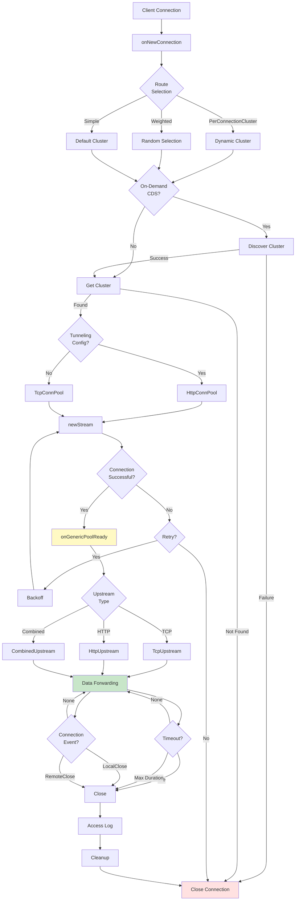

### 7.2 Upstream Type Comparison

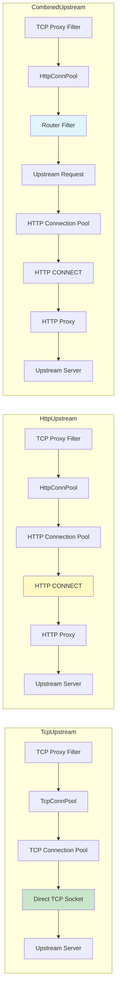

### 7.3 Timeout Management

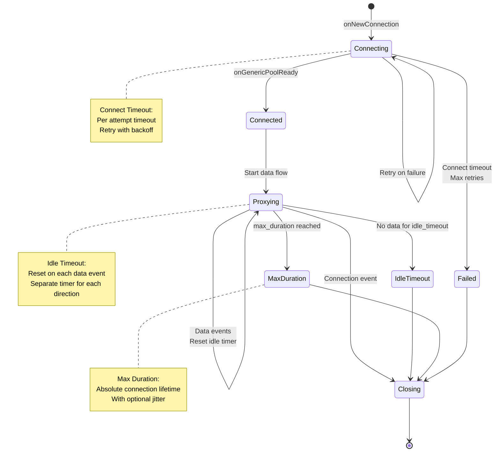

---

## 8. Performance Considerations

### 8.1 Zero-Copy Data Forwarding

```cpp
// Downstream → Upstream: data is moved, not copied
Network::FilterStatus Filter::onData(Buffer::Instance& data, bool end_stream) {
  upstream_->encodeData(data, end_stream);
  ASSERT(0 == data.length());  // Buffer was drained (moved, not copied)
  return Network::FilterStatus::StopIteration;
}

// Upstream → Downstream: same zero-copy approach
void Filter::onUpstreamData(Buffer::Instance& data, bool end_stream) {
  read_callbacks_->connection().write(data, end_stream);
  ASSERT(0 == data.length());  // Buffer was drained
}
```

### 8.2 Connection Pooling

TCP proxy uses connection pools to reuse upstream connections (for HTTP tunneling):

```cpp
class TcpConnPool {
  // Get connection from pool or create new one
  void newStream(GenericConnectionPoolCallbacks& callbacks) override {
    upstream_handle_ = conn_pool_data_->newConnection(*this);
    callbacks_ = &callbacks;
  }
};
```

### 8.3 Flow Control

```cpp
// Downstream read disable when upstream is over high watermark
void HttpUpstream::onAboveWriteBufferHighWatermark() {
  upstream_callbacks_.onAboveWriteBufferHighWatermark();
}

void HttpUpstream::onBelowWriteBufferLowWatermark() {
  upstream_callbacks_.onBelowWriteBufferLowWatermark();
}

// Filter implements upstream callbacks
void Filter::onAboveWriteBufferHighWatermark() {
  read_callbacks_->connection().readDisable(true);
  config_->stats().downstream_flow_control_paused_reading_total_.inc();
}

void Filter::onBelowWriteBufferLowWatermark() {
  read_callbacks_->connection().readDisable(false);
  config_->stats().downstream_flow_control_resumed_reading_total_.inc();
}
```

---

## 9. Common Patterns

### 9.1 Basic TCP Proxy

```yaml
# Simplest configuration - direct TCP forwarding
tcp_proxy:
  stat_prefix: redis_proxy
  cluster: redis_cluster
```

### 9.2 TCP Proxy with Timeouts

```yaml
tcp_proxy:
  stat_prefix: mysql_proxy
  cluster: mysql_cluster
  idle_timeout: 3600s  # 1 hour
  max_downstream_connection_duration: 7200s  # 2 hours
```

### 9.3 HTTP CONNECT Tunneling

```yaml
tcp_proxy:
  stat_prefix: tunneled_mysql
  cluster: corporate_http_proxy
  tunneling_config:
    hostname: "mysql.internal:3306"
    headers_to_add:
    - header:
        key: "Proxy-Authorization"
        value: "Basic dXNlcjpwYXNz"
```

### 9.4 Weighted Cluster Routing (Canary)

```yaml
tcp_proxy:
  stat_prefix: redis_canary
  weighted_clusters:
    clusters:
    - name: redis_prod
      weight: 95
    - name: redis_canary
      weight: 5
```

### 9.5 On-Demand Cluster Discovery

```yaml
tcp_proxy:
  stat_prefix: dynamic_routing
  cluster: "service_%DOWNSTREAM_LOCAL_PORT%"
  on_demand:
    odcds_config:
      resource_api_version: V3
      api_config_source:
        api_type: GRPC
        grpc_services:
        - envoy_grpc:
            cluster_name: xds_cluster
    timeout: 5s
```

---

## 10. Testing

### 10.1 Unit Test Example

```cpp
TEST_F(TcpProxyTest, BasicFlow) {
  setup(1, accessLogConfig("%RESPONSE_FLAGS%"));
  
  // Establish connection
  raiseEventUpstreamConnected(0);
  
  // Downstream → Upstream
  Buffer::OwnedImpl buffer("hello");
  EXPECT_CALL(*upstream_connections_.at(0), write(BufferEqual(&buffer), false));
  filter_->onData(buffer, false);
  
  // Upstream → Downstream
  Buffer::OwnedImpl response("world");
  EXPECT_CALL(*read_filter_callbacks_.connection_, write(BufferEqual(&response), false));
  upstream_callbacks_->onUpstreamData(response, false);
  
  // Close
  upstream_connections_.at(0)->raiseEvent(Network::ConnectionEvent::RemoteClose);
  filter_callbacks_.connection_.raiseEvent(Network::ConnectionEvent::LocalClose);
}
```

---

## 11. Summary

**Key Takeaways:**

1. **TCP Proxy is a Layer 3/4 network filter** - operates on raw TCP streams, no protocol awareness
2. **Three upstream modes**: Direct TCP, HTTP tunneling, Combined (with router features)
3. **Bidirectional data forwarding** - zero-copy buffer moves for efficiency
4. **Three timeout types**: Connect timeout (establishment), idle timeout (inactivity), max duration (absolute limit)
5. **Advanced routing**: Weighted clusters, per-connection clusters, hash-based load balancing
6. **On-demand CDS**: Dynamically discover clusters on first connection
7. **HTTP CONNECT support**: Tunnel TCP through HTTP proxies
8. **Flow control**: Automatic back-pressure when buffers fill

**When to Use Each Mode:**

| Mode | Use Case | Example |
|------|----------|---------|
| **TcpUpstream** | Direct TCP forwarding | Redis, MySQL, MongoDB, custom protocols |
| **HttpUpstream** | Tunnel through HTTP proxy | Access databases through corporate proxy |
| **CombinedUpstream** | Need HTTP features (retries, timeouts) | Unreliable tunneling connections |

**Common Use Cases:**
- Database proxying (MySQL, PostgreSQL, Redis)
- Message queue proxying (Kafka, RabbitMQ)
- Custom protocol proxying (proprietary TCP protocols)
- TCP tunneling through HTTP infrastructure
- Service mesh for non-HTTP traffic

**Design Philosophy:**
Envoy's TCP proxy prioritizes:
- **Efficiency**: Zero-copy forwarding, connection pooling
- **Flexibility**: Multiple upstream modes, dynamic routing
- **Reliability**: Retries, timeouts, circuit breaking
- **Observability**: Rich stats, access logging, tracing
