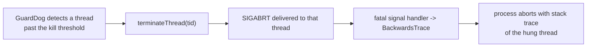

# Thread (terminate_thread) — Overview

> Source: `source/common/thread/terminate_thread.{h,cc}`. Interface: `envoy/thread/thread.h`.

This small utility exists for one purpose: **force-killing the process by aborting a specific
thread**, used by the guard dog when a worker thread is detected as hung. It is the mechanism
behind the watchdog's `KILL` / `MULTIKILL` actions.

## The single function

```cpp
bool terminateThread(const ThreadId& tid);
```

It tries to terminate the process by delivering a fatal signal to the thread identified by
`tid`. Key properties:

- **Platform-dependent.** It currently only works where `SIGABRT` can be targeted at a thread
  (POSIX). On unsupported platforms it returns `false` and does nothing.
- **Returns success of the syscall** — `true` if the platform-specific kill succeeded
  (`kill() == 0`), `false` otherwise.
- **Aimed at the hung thread on purpose.** By aborting the *specific* stuck thread rather than
  calling a generic `abort()`, the resulting crash dump / stack trace points at the thread that
  actually wedged — which is exactly what you want when diagnosing a deadlock or infinite loop.

## Where it fits



See the guard dog system (`source/server/listeners/guarddog.md`) for the watchdog that calls
this, and the crash-trace machinery (`source/server/diagnostics/`) that turns the resulting
signal into a readable backtrace.

## Mental model

A last-resort "kill the stuck thread so we crash loudly and informatively" primitive. It holds
no state and is only invoked on the failure path — when the guard dog has decided a thread is
unrecoverably hung and the safest action is to take the process down with a trace pointing at
the culprit.
