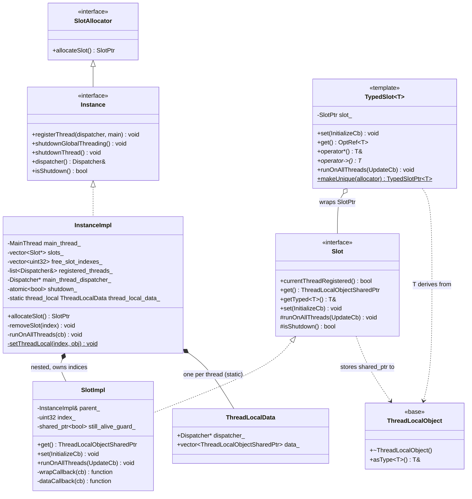
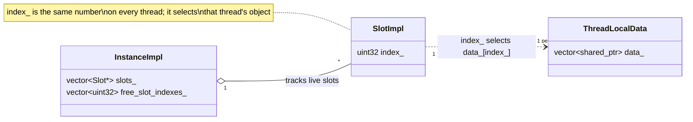

# Thread-local storage — class hierarchy (UML)

UML for `envoy/thread_local/` (interfaces) and `source/common/thread_local/` (implementation).

---

## Interfaces + implementation

---

## Smart-pointer & callback aliases

| Alias | Definition | Meaning |
|---|---|---|
| `ThreadLocalObjectSharedPtr` | `std::shared_ptr<ThreadLocalObject>` | what a slot stores per thread |
| `SlotPtr` | `std::unique_ptr<Slot>` | a raw (untyped) slot |
| `TypedSlotPtr<T>` | `std::unique_ptr<TypedSlot<T>>` | a typed slot |
| `Slot::InitializeCb` | `function<ThreadLocalObjectSharedPtr(Dispatcher&)>` | runs per thread, returns object to store |
| `Slot::UpdateCb` | `function<void(ThreadLocalObjectSharedPtr)>` | mutates the existing per-thread object |
| `TypedSlot<T>::InitializeCb` | `function<shared_ptr<T>(Dispatcher&)>` | typed init |
| `TypedSlot<T>::UpdateCb` | `function<void(OptRef<T>)>` | typed update |

---

## The slot-index relationship

---

## Legend

- `<<interface>>` — pure virtual, under `envoy/thread_local/`.
- `<<template>>` — header-only template (`TypedSlot<T>`).
- `<<base>>` — concrete base class all stored objects derive from.
- `*--` — composition/ownership; `o--` — aggregation; `..>` — uses/references.
