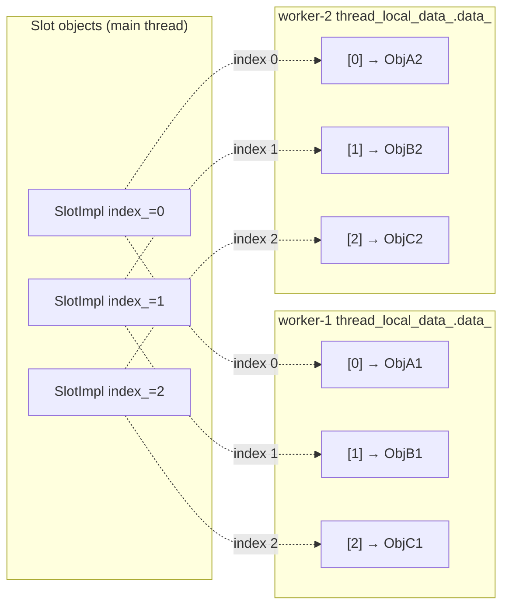
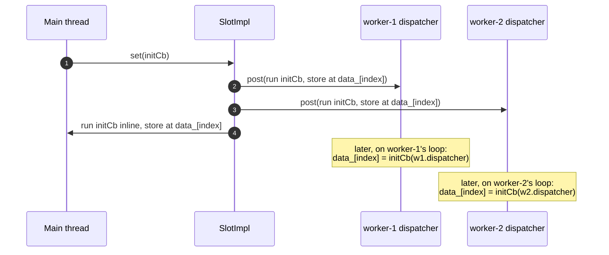
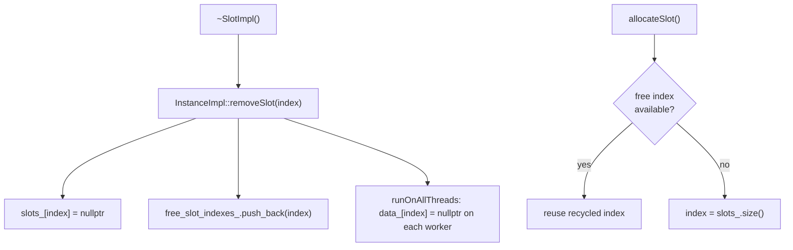

# Thread-local storage — architecture & design

How Envoy publishes data to worker threads without locks, and the subtle lifetime machinery that makes it safe.

Read [`README.md`](README.md) first for vocabulary.

---

## The roles

| Type | Interface | Impl | One-liner |
|---|---|---|---|
| **Instance** | `ThreadLocal::Instance` (extends `SlotAllocator`) | `InstanceImpl` | Process-wide coordinator: allocates slots, registers threads, drives shutdown. |
| **Slot** | `ThreadLocal::Slot` | `InstanceImpl::SlotImpl` | One numbered cell, replicated per thread. |
| **TypedSlot\<T\>** | (template, header-only) | — | Type-safe wrapper over `Slot` — what callers actually use. |
| **ThreadLocalObject** | base class | — | Everything stored in a slot derives from this. |

---

## The data structure

Each thread owns one `thread_local` struct:

```cpp
struct ThreadLocalData {
  Event::Dispatcher* dispatcher_{};
  std::vector<ThreadLocalObjectSharedPtr> data_;   // indexed by slot number
};
static thread_local ThreadLocalData thread_local_data_;   // one per OS thread
```

A **slot** is really just an **index** into every thread's `data_` vector. Slot #3 means "element 3 of whatever
thread I'm currently running on." The `InstanceImpl` hands out these indices and recycles freed ones.



The same slot can hold a **different object on each thread** (because the init callback runs per-thread and
returns a per-thread object), or the **same** object everywhere (if the callback returns a shared pointer to one
immutable instance). Both patterns are used in Envoy.

---

## The post model: how writes reach workers

### `set()` — populate the slot on every thread

```cpp
void InstanceImpl::SlotImpl::set(InitializeCb cb) {
  ASSERT_IS_MAIN_OR_TEST_THREAD();
  for (Event::Dispatcher& dispatcher : parent_.registered_threads_) {
    dispatcher.post(wrapCallback(
        [index = index_, cb, &dispatcher]() { setThreadLocal(index, cb(dispatcher)); }));
  }
  setThreadLocal(index_, cb(*parent_.main_thread_dispatcher_));  // main thread inline
}
```

The init callback `cb` is **run once on each thread** (via that thread's dispatcher), and whatever it returns is
stored in that thread's `data_[index]`. The main thread is handled inline.



### `runOnAllThreads()` — mutate the existing per-thread object

```cpp
void InstanceImpl::SlotImpl::runOnAllThreads(const UpdateCb& cb) {
  parent_.runOnAllThreads(dataCallback(cb));
}
```

Same delivery mechanism, but the callback receives the *existing* object for mutation rather than replacing it.
There's an overload taking a `complete_cb` that fires on the main thread **after all workers have run** — used
when the publisher needs to know the fan-out finished (e.g. to free old data). That completion guarantee is
implemented with a clever shared_ptr-deleter trick (see [`thread_local_impl.md`](thread_local_impl.md#runonallthreads-with-completion)).

### Reads — the whole point

```cpp
T& operator*()  { return slot_->getTyped<T>(); }   // returns THIS thread's object, no lock
OptRef<T> get() { return getOpt(slot_->get()); }
```

A worker reads its own `data_[index]`. No atomics, no mutex — the object is confined to one thread and only
mutated via that thread's own event loop, so there is never a data race.

---

## Thread registration

Before a thread can receive slot data it must register:

```cpp
void InstanceImpl::registerThread(Event::Dispatcher& dispatcher, bool main_thread) {
  ASSERT_IS_MAIN_OR_TEST_THREAD();
  if (main_thread) {
    main_thread_dispatcher_ = &dispatcher;
    thread_local_data_.dispatcher_ = &dispatcher;
  } else {
    registered_threads_.push_back(dispatcher);
    dispatcher.post([&dispatcher] { thread_local_data_.dispatcher_ = &dispatcher; });
  }
}
```

`registered_threads_` is the fan-out list used by every `set`/`runOnAllThreads`. The main thread is special:
callbacks posted from it run inline.

---

## The hard part: lifetime safety

This is where most of the code's complexity lives. Three independent hazards:

### Hazard 1 — slot destroyed while a callback is in flight

A slot may be destroyed on the main thread while a `post()`ed callback referencing its index is still queued on a
worker. Solution: **`still_alive_guard_`**, a `std::shared_ptr<bool>` per slot. Posted callbacks capture a
`weak_ptr` to it and bail if it has expired:

```cpp
return [still_alive_guard = std::weak_ptr<bool>(still_alive_guard_), cb] {
  if (!still_alive_guard.expired()) {
    cb();
  }
};
```

When the `SlotImpl` is destroyed, the `shared_ptr<bool>` dies, the weak_ptr expires, and any still-queued
callbacks become no-ops. This fixes the common "slot destroyed immediately before anything is posted" race.

> The callbacks capture the **index by value**, never `this`. That's why the guard is a separate `bool` object
> rather than just checking the slot pointer.

### Hazard 2 — slot destroyed on a worker thread

Slots are meant to be destroyed on the main thread, but it can happen on a worker. `~SlotImpl()` handles both:

```cpp
InstanceImpl::SlotImpl::~SlotImpl() {
  if (isShutdownImpl()) return;                       // global shutdown handles cleanup
  auto* main_dispatcher = parent_.main_thread_dispatcher_;
  if (main_dispatcher == nullptr || main_dispatcher->isThreadSafe()) {
    parent_.removeSlot(index_);                        // on main thread: remove now
  } else {
    main_dispatcher->post([i = index_, &tls = parent_] { tls.removeSlot(i); });  // defer to main
  }
}
```

### Hazard 3 — index recycling

When a slot is removed, its index goes onto `free_slot_indexes_` and a callback is posted to every worker to null
out `data_[index]`. A new allocation can reuse the index immediately — that's safe because the null-out and any
new writes are all sequenced through `post()`, so they can't interleave incorrectly.



---

## Shutdown ordering

Two-step shutdown, both driven from the main thread / each worker as it exits:

```cpp
void InstanceImpl::shutdownGlobalThreading() {   // main thread, before workers exit
  shutdown_ = true;                              // blocks further slot removal posts
}

void InstanceImpl::shutdownThread() {            // each worker, as it exits
  // Destroy slots in REVERSE order so higher-level objects (built on cluster mgr,
  // stats, runtime) are torn down before the base-layer objects they depend on.
  for (auto it = data_.rbegin(); it != data_.rend(); ++it) {
    it->reset();
  }
  data_.clear();
}
```

The reverse-order teardown matters: persistent objects like the cluster manager are allocated very early (low
slot numbers) and must outlive the higher-level objects (high slot numbers) that depend on them. Tearing down
high→low respects those dependencies. (See the long comment in `shutdownThread()` for the redis-pool example.)

Once `shutdown_` is set, `removeSlot` becomes a no-op — no point posting removals to threads that are exiting
anyway; `shutdownThread()` cleans everything up.

---

## The golden rules expanded

1. **Main-thread-only mutation.** `allocateSlot`, `set`, `runOnAllThreads`, `registerThread`,
   `shutdownGlobalThreading` all `ASSERT_IS_MAIN_OR_TEST_THREAD()`. Workers only *read* and *run posted
   callbacks*.
2. **Derive from `ThreadLocalObject`.** `getTyped<T>()`/`asType<T>()` do a `dynamic_cast` in debug to validate,
   `static_cast` in prod for speed.
3. **Don't capture the slot or owner in callbacks.** The owner can be destroyed on the main thread before the
   callback runs on a worker — capture the data by value. This is repeated in the header comments for both
   `InitializeCb` and `UpdateCb`.
4. **`get()` may be empty.** Before `set()` has run on a thread (or after removal), `get()` returns an empty
   `OptRef`. `operator*`/`operator->` assume a value exists — check `get().has_value()` if unsure.

---

## What this folder does *not* do

- **It is not a general-purpose `thread_local` keyword replacement.** It's specifically for the main→worker
  publish pattern tied to `Event::Dispatcher`s.
- **It does not provide cross-thread locking.** If two threads must mutate truly shared state, that's a different
  problem; TLS deliberately avoids shared mutable state.
- **It does not guarantee synchronous propagation.** `set`/`runOnAllThreads` are asynchronous on workers; use the
  `complete_cb` overload if you need to know when the fan-out finished.

---

## Cross-references

- [`thread_local_impl.md`](thread_local_impl.md) — line-by-line implementation.
- [`CLASS_HIERARCHY.md`](CLASS_HIERARCHY.md) — UML.
- Consumers: [`../runtime/loader_and_snapshot.md`](../runtime/loader_and_snapshot.md),
  [`../secret/secret_provider_impl.md`](../secret/secret_provider_impl.md).
